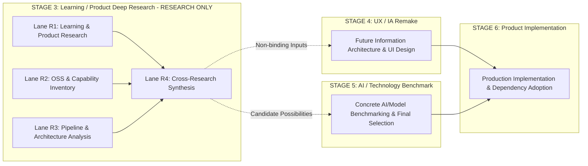

# VocabMaster — Stage 3 Learning / Product Deep Research Strategy

Status: **ACCEPTED / CANONICAL / HISTORICAL**  
Authority: **STAGE 3 PRODUCT AND RESEARCH STRATEGY SPECIFICATION (RATIFIED UNDER ADR-053; CANONICALLY CLOSED UNDER ADR-054)**  
Transaction ID: `STAGE3-RESEARCH-STRATEGY-001`  
Date: **2026-08-17** (Reconciled: **2026-08-20**)  
Canonical Predecessor: `664ab14bb1415fec0995e80e99369164df28575c`  
Authorization Manifest: [`docs/authorizations/STAGE3-RESEARCH-AUTH-001.md`](docs/authorizations/STAGE3-RESEARCH-AUTH-001.md) (**HISTORICAL / CONSUMED / CLOSED**)  

---

## 1. Executive Summary & Canonical Authority

### 1.1 Context & Canonical Baseline
- **Stage 1 (Core Foundation)**: Independently `ACCEPTED` and `COMPLETE`.
- **Stage 1.5 (Adversarial Product Jury)**: Independently `ACCEPTED` and `COMPLETE`.
- **Stage 2 (IELTS Completeness)**: Independently `ACCEPTED` and `COMPLETE / CANONICALLY_CLOSED` under exit gate `IELTS_COMPLETENESS_V1` (18/18 dimensions verified across Listening, Reading, Writing, Speaking, and Full Mock Orchestration).
- **Stage 3 (Learning / Product Deep Research)**: Complete and canonically closed. Research deliverables across Lanes R1, R1 Supplement, R2, R3, and R4 were independently audited, accepted, and integrated into canonical `main` (synthesizing Lane R4 integrated via PR #167 / commit `856b3a307b87fd99044692513c01da3e8f681b9f`). Strategy ratified under ADR-053; Stage 3 closure ratified under ADR-054.
- **Stage 3 Research Execution Authority**: `HISTORICAL / CONSUMED / CLOSED` (All chartered research lanes completed; manifest `STAGE3-RESEARCH-AUTH-001` consumed and closed; zero active research or implementation authority).

### 1.2 Mission Alignment with Master Roadmap
This strategy specifies the broad learning, capability, and architectural research program owned by Stage 3 as defined in `docs/MASTER_ROADMAP.md` §3:
1. **Product and Learning Deep Research**: Pedagogical frameworks, cognitive science, learner modeling, and 5-skill acquisition mechanisms.
2. **OSS Capability Research**: Reusable open-source libraries, client-side algorithms, and hosted/free API alternatives.
3. **Transcript and Learning Pipeline Research**: Auditing the current transcript/learning derivation pipeline and identifying structural gaps.
4. **Architecture Proposals**: Formulating modular architectural options and integration boundaries for subsequent stages.

### 1.3 Strict Non-Authority & Non-Absorption Boundaries
> [!IMPORTANT]
> **Explicit Non-Authority Notice**:
> This document is the **CANONICAL HISTORICAL RESEARCH STRATEGY** for Stage 3.
> - Historical bounded research execution was governed by manifest `STAGE3-RESEARCH-AUTH-001` (now `HISTORICAL / CONSUMED / CLOSED`).
> - It does **NOT** authorize product code implementation (`src/**`).
> - It does **NOT** adopt any third-party library, package, or dependency in `package.json`.
> - It does **NOT** select a final AI model, ASR engine, or hosted cloud provider (reserved for Stage 5).
> - It does **NOT** authorize Stage 4 UX / Information Architecture work.
> - It does **NOT** absorb or execute Stage 5's mission (AI / Technology Deep Research & Benchmark).
> - All research recommendations, architectural proposals, and capability dispositions remain non-binding advice until separately ratified and authorized.



---

## 2. Authority Hierarchy

All Stage 3 activities are strictly governed by the canonical 6-tier repository authority hierarchy (`AGENTS.md` §3 and `docs/MASTER_ROADMAP.md` §1):

| Tier | Canonical Source | Scope & Authority |
|---|---|---|
| **Tier 1** | `docs/MASTER_ROADMAP.md` | Top-level Master Product Roadmap (Stage 1–8 sequencing, stage identities, missions, completion gates). |
| **Tier 2** | `docs/ROADMAP.md` | Technical Package Taxonomy (Phase 0–7 technical dependencies and architecture boundaries). |
| **Tier 3** | `docs/IMPLEMENTATION_PLAN.md` | Implementation specifications, package acceptance criteria, verification contracts. |
| **Tier 4** | `docs/IMPLEMENTATION_STATUS.md` | Execution ledger, canonical commit bindings, verified evidence records. |
| **Tier 5** | `docs/DECISIONS.md` | Architecture Decision Records (ADRs). |
| **Tier 6** | `AGENTS.md` | Router, global invariants, evidence policies, single-writer discipline, safety rules. |

*Task-Specific Authorization*: `docs/authorizations/STAGE3-RESEARCH-AUTH-001.md` provided bounded research authorization during Stage 3 execution (now `HISTORICAL / CONSUMED / CLOSED`), remaining strictly subordinate to the 6-tier hierarchy above.

---

## 3. Stage 3 Research Program Decomposition

To ensure exhaustive domain coverage, modular execution, and clear separation of concerns, Stage 3 is decomposed into four bounded research lanes:

```
STAGE 3 RESEARCH PROGRAM
├── Lane R1: Learning & Product Deep Research (Pedagogy, Learner Modeling & Systems)
├── Lane R2: OSS & Hosted Capability Research (Algorithmic Inventory & Capability Dispositions)
├── Lane R3: Transcript / Learning Pipeline & Architecture Research (Current Substrate & Target Topologies)
└── Lane R4: Cross-Research Reconciliation & Strategic Synthesis (Reconciliation, Gaps & Owner Decisions)
```

---

### 3.1 Lane R1 — Learning & Product Deep Research

**Objective**: Establish the cognitive, pedagogical, and product learning foundations for English language acquisition, learner mastery modeling, and diagnostic feedback loops.

#### Core Research Topics:
1. **Learning Science & Cognitive Psychology**:
   - Spaced repetition & retrieval practice dynamics (spacing effect, lag effect, testing effect).
   - Desirable difficulties & cognitive load management in multimedia environments (Sweller's CLT, Mayer's Multimedia Learning Theory).
   - Generative learning strategies (self-explanation, summarization, elaboration, dual-coding).
   - Contextual vocabulary acquisition and lexical chunking (collocation vs isolated definition learning).
2. **Learner Modeling & Mastery Tracking**:
   - Bayesian Knowledge Tracing (BKT), Deep Knowledge Tracing (DKT), and state-of-the-art memory decay models.
   - FSRS (Free Spaced Repetition Scheduler) parameterization, interval calculations, and retention targeting.
   - Multidimensional skill tracking (phonological, lexical, syntactic, pragmatic, fluency).
   - Error classification, mistake recurrence decay, and targeted review scheduling.
3. **5-Skill Evidence-Based Learning Systems**:
   - **Vocabulary**: Frequency bands (Oxford 3000/5000, Academic Word List), collocations, polysemy, productive retrieval vs passive recognition.
   - **Listening**: Bottom-up acoustic decoding vs top-down comprehension, connected speech parsing (assimilation, elision, linking), shadowing methodologies.
   - **Reading**: Intensive vs extensive reading, speed reading with split-pane comprehension, task-based scanning/skimming mechanics.
   - **Writing**: Sentence combining, paragraph coherence/cohesion, argumentative essay structuring, immediate corrective feedback vs delayed reflective review.
   - **Speaking**: Guided monologue drills, fluency chunking, pronunciation/intonation self-assessment, dialogue roleplay scaffolding.
4. **Diagnostic & Adaptive Learning Loops**:
   - Formative assessment principles, dynamic difficulty adjustment (DDA), Zone of Proximal Development (ZPD) targeting.
   - Cold-start diagnostic testing vs progressive passive profiling.
   - Automated error candidate generation and remedial pathway generation.
5. **Motivation, Habit & Product Engagement Loops**:
   - Micro-learning session design (3–10 minute high-impact sessions).
   - BJ Fogg Behavior Model (Prompt, Ability, Motivation) applied to daily language drills.
   - Progress visualization, streak preservation without dark patterns, competence milestones.
6. **Product Capability Gaps in Current Substrate**:
   - Comprehensive audit of current VocabMaster learning loops against empirical learning science best practices.

---

### 3.2 Lane R2 — OSS & Hosted Capability Research

**Objective**: Survey, benchmark, and evaluate reusable open-source libraries, client-side algorithms, and hosted/free API services across all target capability domains without adopting them.

#### Mandatory Capability Inventory (18 Domains):

| # | Capability Domain | Key Technical Challenges & Research Scope |
|---|---|---|
| 1 | **Transcript Sentence Segmentation** | Sentence boundary disambiguation (SBD) in raw speech text, abbreviation handling, punctuation-free stream parsing. |
| 2 | **Punctuation & Capitalization Restoration** | Restoring commas, periods, question marks, and truecasing on raw unpunctuated ASR streams. |
| 3 | **Timestamp-Preserving Chunking** | Chunking text into syntactically valid subtitle lines or phrase units while preserving microsecond-accurate word/sentence timestamps. |
| 4 | **Semantic & Topic Segmentation** | TextTiling, embedding-based topic boundary detection, hierarchical section heading generation from transcript text. |
| 5 | **Vocabulary & Collocation Extraction** | Statistical n-gram extraction, Pointwise Mutual Information (PMI), POS-guided multi-word expression (MWE) discovery, frequency list mapping. |
| 6 | **CEFR & Readability Analysis** | Rule-based and lexical CEFR level mapping (A1–C2), Flesch-Kincaid, Dale-Chall, Coleman-Liau, Lexile approximations. |
| 7 | **Grammar & Syntax Tooling** | Deterministic rule engines (e.g. Vale, textlint), dependency parsing, POS tagging, error-pattern detection. |
| 8 | **Question & Distractor Generation** | Automatic item generation (AIG), cloze deletion generation, plausible multiple-choice distractor generation algorithms. |
| 9 | **ASR / VAD / Audio Alignment** | Web Audio Voice Activity Detection (VAD), dynamic time warping (DTW), forced-alignment algorithms (phoneme-to-audio sync), lightweight client ASR. |
| 10 | **Multi-Format Ingestion** | Parsers for SubRip (.srt), WebVTT (.vtt), PDF, EPUB, HTML articles, and image OCR pipelines. |
| 11 | **Client Search, Embeddings & Reranking** | Lightweight in-browser indexing (BM25, MiniSearch, FlexSearch), vector search, cosine similarity, hybrid semantic-lexical search. |
| 12 | **Chart & Data Visualization** | Lightweight, high-performance canvas/SVG charting libraries (zero-dependency or minimal bundle size). |
| 13 | **Heatmaps & Activity Grids** | Contribution heatmaps, mistake distribution heatmaps, temporal retention grids. |
| 14 | **Skill Radar & Diagnostic Charts** | Multi-axis spider/radar charts for IELTS 4-skill and CEFR dimension profiling. |
| 15 | **Progress & Retention Visualization** | Forgetting curves, mastery trajectories, cumulative vocabulary growth charts. |
| 16 | **Knowledge Graphs & Lexical Networks** | Interactive concept lattices, synonym/antonym graphs, collocation radial trees (Cytoscape, D3, Vis-network). |
| 17 | **Timelines & Session Scrubbers** | Interactive study history timelines, synchronized audio/video playback scrubbers with annotated event markers. |
| 18 | **Adaptive-Learning Algorithms** | Multi-armed bandit algorithms, item response theory (IRT) estimators, Elo-based difficulty rating for learning items. |

#### Disposition Decision Taxonomy:
For every surveyed capability or library, Lane R2 must produce exactly one recommended disposition:
- `BUILD`: Build internally as lightweight deterministic custom code (recommended when requirements are small, domain-specific, or existing OSS is bloated).
- `ADOPT_OSS`: Candidate for open-source library adoption in Stage 5/6 (evaluated against 11 OSS quality dimensions).
- `ADOPT_HOSTED_API`: Candidate for free/low-cost hosted API integration in Stage 5/6 (evaluated against 14 Owner constraint dimensions).
- `ADOPT_HOSTED_OSS`: Self-deployable open-source engine running on free-tier serverless/container infrastructure.
- `HYBRID`: Client-side deterministic heuristic + optional hosted API enhancement.
- `REJECT`: Unsuitable due to license, heavy resource footprint, poor quality, or high maintenance overhead.
- `UNKNOWN / NEEDS_SPIKE`: Inconclusive findings requiring focused technical prototyping in Stage 5.

---

### 3.3 Lane R3 — Transcript / Learning Pipeline & Architecture Research

**Objective**: Audit the current VocabMaster transcript and learning generation substrate, evaluate performance/privacy/persistence boundaries, and propose target architecture topologies.

#### Core Research Topics:
1. **Current VocabMaster Substrate Audit**:
   - Detailed analysis of Phase 2 Resolver (`P2-00`...`P2-06`), `yt-dlp` integration, rolling caption normalization, stable sentence ID generation.
   - Analysis of Phase 5 progressive local ASR companion (`P5-01`/`P5-02`) and Gemini opt-in fallback (`P5-04`).
   - Learning content derivation pipeline: How raw transcripts currently map to `ActivitySpec`, `Run`, `Attempt`, `Receipt`, `EvidencePolicy`, `WeaknessProfile`, and `TodayRunner`.
2. **Architectural Gaps & Bottlenecks**:
   - Main-thread blocking during large transcript tokenization or regex parsing.
   - Lack of true streaming/progressive pipeline architecture for long audio/video files.
   - Synchronous IndexedDB query overhead during heavy learning sessions.
3. **Integration Boundaries & Decoupling**:
   - Clean separation between ingestion, enrichment (NLP/CEFR), exercise synthesis, runtime execution, and evidence recording.
   - Interface contracts for pluggable providers (ASR, NLP, Translation, Dictionary).
4. **Privacy, Security & Data Sovereignty**:
   - Local-first data retention invariants (zero leakage of personal notes, voice recordings, or learning history).
   - Safe API credential handling (preventing token exposure in client builds).
   - Strict adherence to content copyright and terms of service.
5. **Persistence, Storage & Migration Architecture**:
   - IndexedDB capacity management, binary blob handling (audio recordings, media cache), structured cloning limits.
   - Forward-only additive migration rules, transaction rollback safety, and 100% backup sentinel compliance (`src/backup-registry.js`).
6. **Execution Runtime Boundaries**:
   - Browser Main Thread vs Web Workers vs OffscreenCanvas.
   - Client-side computation vs Optional Serverless Edge Proxy vs Local Companion Process.
7. **Proposed Architecture Alternatives**:
   - Candidate architecture blueprints for Stage 6 implementation (modular pipelines, event-driven state machines, reactive stores).

---

### 3.4 Lane R4 — Cross-Research Reconciliation & Synthesis

**Objective**: Reconcile findings across R1, R2, and R3, resolve contradictions, identify remaining unknowns, produce strategic architecture recommendations, and compile the Owner Decision Ledger.

#### Core Synthesis Tasks:
1. **Pedagogy-to-Capability Mapping**:
   - Validate whether surveyed Lane R2 capabilities and Lane R3 architectures satisfy Lane R1 learning science requirements.
2. **Contradiction Resolution & Classification**:
   - Identify conflicting findings across lanes (e.g. an ideal pedagogical feature in R1 that requires heavy local compute violating R3/Owner constraints).
   - Classify all findings as: `VALIDATED`, `CONTRADICTION`, or `UNKNOWN`.
3. **Owner Decision Ledger**:
   - Compile a structured ledger of strategic architectural and product tradeoffs requiring Owner decision before Stage 4 and Stage 5 execution.
4. **Handoff Preparation**:
   - Package structured requirements for **Stage 4 (UX / IA Remake)**.
   - Package technology candidates and benchmarking parameters for **Stage 5 (AI / Technology Deep Research & Benchmark)**.

---

## 4. Research Evidence Standards & Evaluation Rubrics

### 4.1 Epistemic Claim Classification
Every factual statement, finding, or conclusion across all research reports MUST be explicitly tagged with one of three epistemic confidence markers:

```
[VERIFIED]  ── Factual finding directly proven by primary documentation, empirical source code inspection, or reproducible benchmark.
[INFERENCE] ── Logical deduction or architectural extrapolation derived from verified facts (must state premises).
[UNKNOWN]   ── Unproven claim, missing empirical data, or open question requiring future spike.
```

### 4.2 Primary Source Mandate
- Secondary summaries, AI-generated assertions, GitHub star counts, and promotional marketing claims are strictly **INSUFFICIENT** evidence.
- Claims regarding external libraries, models, or APIs must cite primary sources:
  - Official documentation URLs;
  - Verified source code repositories (e.g. GitHub lines, commit SHAs);
  - Official pricing, quota, and terms-of-service pages;
  - Peer-reviewed academic publications (for learning science and cognitive models);
  - Official standards bodies (W3C, CEFR, ISO).

### 4.3 OSS Candidate 11-Dimension Evaluation Rubric
For every open-source library evaluated in Lane R2, the report MUST evaluate:

| # | Dimension | Evaluation Criteria |
|---|---|---|
| 1 | **License Compatibility** | MIT, Apache-2.0, BSD-3-Clause, ISC (permissive) vs GPL/AGPL (copyleft risks). |
| 2 | **Maintenance Health** | Commit recency, release cadence, issue triage rate, active maintainer count. |
| 3 | **Security Posture** | Known CVEs, vulnerability disclosure history, dependency tree depth, supply-chain safety. |
| 4 | **Architecture & Runtime Fit** | Pure ESM support, zero Node.js polyfill requirements, Web Worker compatibility. |
| 5 | **Browser Compatibility** | Modern Evergreen browser support (Chromium, Firefox, Safari, Edge), Web API requirements. |
| 6 | **Bundle & Runtime Overhead** | Minified + gzipped byte footprint, memory overhead during execution, CPU cycle consumption. |
| 7 | **Privacy & Offline Stance** | 100% offline execution, zero telemetry/tracking beacons, zero remote calls. |
| 8 | **VocabMaster Overlap** | Overlap with existing in-house code (QAR, EvidencePolicy, BackupRegistry, etc.). |
| 9 | **Integration Complexity** | API ergonomics, TypeScript/JSDoc types, state management impedance, error handling. |
| 10 | **Exit & Migration Cost** | Abstraction leakiness, lock-in to proprietary schemas, ease of replacement. |
| 11 | **Empirical Quality Evidence** | Test coverage percentage, benchmark accuracy scores, edge-case robustness. |

### 4.4 Hosted Candidate 14-Dimension Evaluation Rubric
Every hosted API candidate surveyed MUST be evaluated against the 14 mandatory dimensions established in `docs/research/STAGE3_RESEARCH_CONSTRAINTS.md` (§4), including `CARD_REQUIRED`, `BILLING_ACCOUNT_REQUIRED`, `FREE_QUOTA`, `RATE_LIMIT`, `DATA_RETENTION_POLICY`, and `BROWSER_DIRECT_CALL`.

---

## 5. Governance, Single-Writer Discipline & Audit Protocol

### 5.1 Single-Writer Rule for Repository Mutations
- Exactly **ONE** authorized writer session may mutate repository documentation files during any Stage 3 transaction.
- Subagents, peer agents, and auditors remain strictly read-only with respect to repository file content and Git history.

### 5.2 Independent Audit Separation
- Researchers cannot independently audit or accept their own research reports.
- Every research candidate requires an independent audit by a fresh, unpolluted auditor agent who must:
  1. Fresh-verify primary source citations and URLs;
  2. Falsify factual claims against raw evidence;
  3. Verify strict compliance with the write allowlist;
  4. Ensure zero implementation code or dependency modifications occurred;
  5. Post a formal independent verdict (`ACCEPT`, `REJECT`, or `BLOCKED`).

### 5.3 Execution Non-Authority
All conclusions, architectural proposals, and capability dispositions produced by Stage 3 are **ADVISORY RESEARCH FINDINGS ONLY**. They do not authorize dependency installation (`npm install`), source modifications (`src/**`), or test alterations (`tests/**`).

---

## 6. Execution Stop Conditions

Execution halts immediately (`FAIL-CLOSED`) upon encountering any of the following triggers:

1. `CANONICAL_BASE_DRIFT`: Canonical predecessor base diverges from expected commit SHA.
2. `STAGE3_MISSION_CONFLICT`: Research scope is redefined or deviates from Master Roadmap Stage 3 definition.
3. `STAGE5_SCOPE_ENCROACHMENT`: Attempting final concrete AI model/provider selection or technology benchmarking belonging to Stage 5.
4. `STAGE4_SCOPE_ENCROACHMENT`: Attempting final UI layout remake or UX wireframing belonging to Stage 4.
5. `IMPLEMENTATION_ATTEMPT`: Modifying product source code (`src/**`), adding dependencies (`package.json`), or writing runtime modules.
6. `UNAUTHORIZED_WRITE_ATTEMPT`: Mutating files outside the authorized closed docs allowlist.
7. `EVIDENCE_STANDARD_VIOLATION`: Relying on unverified claims, marketing material, or GitHub stars as authoritative evidence.
8. `MISSING_INDEPENDENT_AUDIT`: Attempting self-acceptance or skipping independent review.
9. `MISSING_MERGE_AUTHORITY`: Executing merge without explicit transaction merge authorization.
10. `TRANSACTION_STOP_TRIGGERED`: Any transaction-specific stop condition from the controlling authorization manifest is met.
