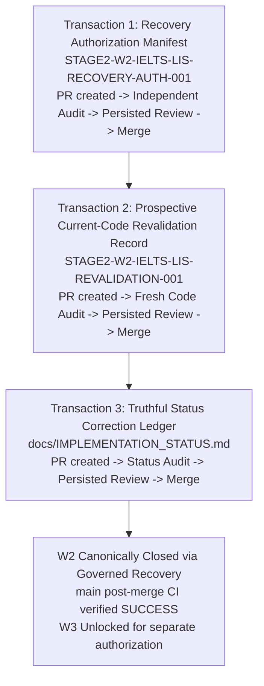

# Wave Governance Recovery Authorization Manifest — Stage 2 Wave W2

Manifest Identity: **STAGE2-W2-IELTS-LIS-RECOVERY-AUTH-001**  
Transaction ID: **W2-GOV-RECOVERY-AUTH-001**  
Wave Identity: **W2-IELTS-LIS-001 (Listening Platform Completeness)**  
Protocol: **BOUNDED_EXECUTION_CAPSULE_PROTOCOL_V1 (ADR-046) & EXECUTION_PROMPT_PROTOCOL_V2 (ADR-051)**  
Date: **2026-08-17**  
Status: **CANDIDATE / RECOVERY_AUTHORIZATION_PENDING_INDEPENDENT_AUDIT**  
Canonical Predecessor (Base): **`4e83d38c4db8fdfda6cfaba6c176231942dabb12`**  
Controlling Authorization: **`STAGE2-W2-IELTS-LIS-AUTH-002.md`**  
Owner Ratification: **STAGE 2 W2 OWNER-RATIFIED GOVERNED RECOVERY DIRECTIVE**  

---

## 1. Executive Summary & Incident Declaration

### 1.1 Confirmed Historical Governance Incident
An independent post-merge governance incident audit confirmed that while the technical implementation of Stage 2 Wave W2 is functionally green and verified under CI, its historical merge and status closure suffered from material governance non-compliances:
1. **PR #125 Topology Non-Compliance:** PR #125 (`exec/stage2-w2-ielts-lis-recovery-002`) contained three substantive commits (`a6a6d8e -> 926a9ef -> 900405f`) rather than the strict two-commit RED/GREEN topology required by `STAGE2-W2-IELTS-LIS-AUTH-002` §6.
2. **Missing Persisted Pre-Merge Reviews:** Neither PR #125 nor PR #126 had an independent audit `ACCEPT` verdict formally persisted to GitHub PR review channels prior to mechanical merge execution, violating `AGENTS.md` §1.4, Protocol V2 §3.8, and AUTH-002 §8.1/§8.2.
3. **Unauthorized Merges:** Because pre-merge persistence preconditions were not satisfied, merge authority was `NOT_EXECUTABLE` at the time of merge.
4. **Premature Status Closure:** PR #126 declared `W2_STATUS: CANONICALLY_CLOSED` prematurely on an invalid merge chain and omitted the 3-commit topology reality.

### 1.2 Recovery Objective & Anti-Evidence-Laundering Invariant
> [!IMPORTANT]
> - **Anti-Laundering Non-Negotiable:** Historical truth is preserved immutably. PR #125 remains recorded as `MERGED_WITH_GOVERNANCE_VIOLATION` and PR #126 as `PREMATURE_STATUS_CLOSURE`.
> - **No Retroactive Validation:** This recovery does NOT attempt to retroactively validate historical PR #125/#126 merges.
> - **Prospective Current-Code Revalidation:** This recovery establishes a fresh, prospective independent revalidation of the CURRENT retained W2 code on canonical `main` (`4e83d38c4db8fdfda6cfaba6c176231942dabb12`) followed by a truthful status correction.

---

## 2. Invariants & Scope Boundaries

### 2.1 Universal Invariants
1. `SOURCE_MUTATION_ALLOWED`: **NO** (Zero source code edits).
2. `TEST_MUTATION_ALLOWED`: **NO** (Zero test code edits).
3. `DEPENDENCY_MUTATION_ALLOWED`: **NO** (`package.json` and lockfiles locked).
4. `HISTORY_REWRITE_FORBIDDEN`: **STRICT** (No rebase, no amend, no force-push, no history deletion).
5. `W3_EXECUTION_AUTHORITY`: **NOT_GRANTED** (`W3` remains `NOT_AUTHORIZED` until W2 recovery is canonically closed).
6. `CURRENT_CODE_RETENTION`: **PROVISIONAL** (Retained on `main` at `4e83d38c4db8fdfda6cfaba6c176231942dabb12` subject to prospective revalidation).

### 2.2 Exact Scope Under Prospective Revalidation
The prospective current-code audit must fresh-inspect and verify:
- `src/ielts-listening-runner.js` (4-part 40-item orchestration, D01 2-min review, D02 reload recovery, QAR rendering, scoring, error candidate emission).
- `src/ielts-media-player.js` (`IeltsAudioController`, 1-play exam enforcement, section cues, YouTube player integration).
- `src/ielts-domain.js` (`convertIeltsListeningRawToBand` 0..40 to 0.0..9.0 deterministic conversion).
- `src/ielts-hub-v2.js` (IELTS Hub v2 tab containment and listening test launcher).
- `tests/ielts-listening-runner.test.mjs` (10 unit/integration tests).
- `tests/ielts-listening-browser.test.mjs` (Browser DOM layout & mounting tests).

---

## 3. Governed Recovery Lifecycle Architecture

The recovery proceeds across three discrete docs-only transactions:

---

## 4. Conditional Merge Authority Declarations

### 4.1 Recovery Authorization Manifest Merge Authority
$$\text{RECOVERY\_AUTH\_MERGE\_AUTHORITY} = \mathbf{CONDITIONALLY\_GRANTED}$$
Granted to the Independent Authorization Auditor **ONLY IF**:
1. Fresh independent audit verdict = `ACCEPT`;
2. Formal `ACCEPT` review is persisted to the PR on GitHub and read back;
3. Candidate head SHA matches the accepted commit;
4. Base commit is `4e83d38c4db8fdfda6cfaba6c176231942dabb12`;
5. Natural exact-head CI concludes `SUCCESS`;
6. Exactly ONE changed file: `docs/authorizations/STAGE2-W2-IELTS-LIS-RECOVERY-AUTH-001.md`;
7. Zero substantive findings.

### 4.2 Revalidation Record Merge Authority
$$\text{REVALIDATION\_RECORD\_MERGE\_AUTHORITY} = \mathbf{CONDITIONALLY\_GRANTED}$$
Granted to the Independent Revalidation Auditor **ONLY IF**:
1. Fresh independent revalidation audit verdict = `ACCEPT` (verifying current code on `main` satisfies AUTH-002 D01/D02/D03 and domain contracts);
2. Formal `ACCEPT` review is persisted to the PR on GitHub and read back;
3. Candidate head SHA matches the accepted commit;
4. Natural exact-head CI concludes `SUCCESS`;
5. Exactly ONE changed file: `docs/authorizations/STAGE2-W2-IELTS-LIS-REVALIDATION-001.md`;
6. Zero substantive findings.

### 4.3 Final Status Correction Merge Authority
$$\text{FINAL\_STATUS\_MERGE\_AUTHORITY} = \mathbf{CONDITIONALLY\_GRANTED}$$
Granted to the Independent Status Auditor **ONLY IF**:
1. Fresh independent status audit verdict = `ACCEPT` (verifying truthful incident history and closure provenance);
2. Formal `ACCEPT` review is persisted to the PR on GitHub and read back;
3. Candidate head SHA matches the accepted commit;
4. Natural exact-head CI concludes `SUCCESS`;
5. Exactly ONE changed file: `docs/IMPLEMENTATION_STATUS.md`;
6. Zero substantive findings.

**Merge Method for All Recovery Transactions:** Normal Merge Commit (`--merge`).
