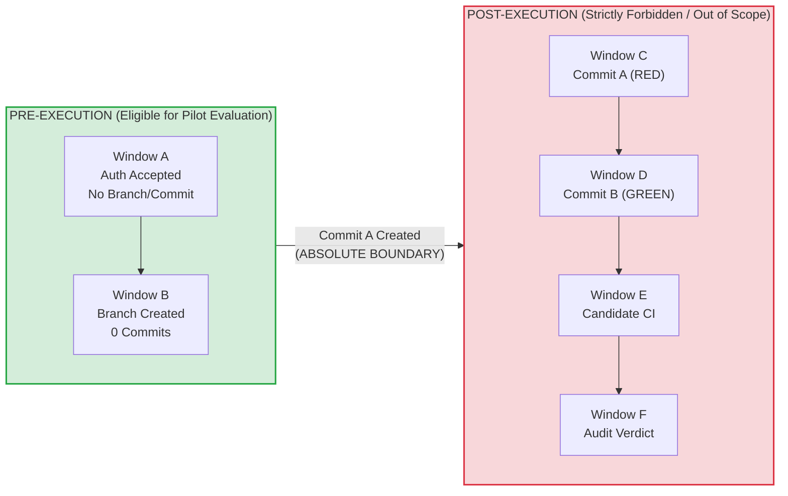
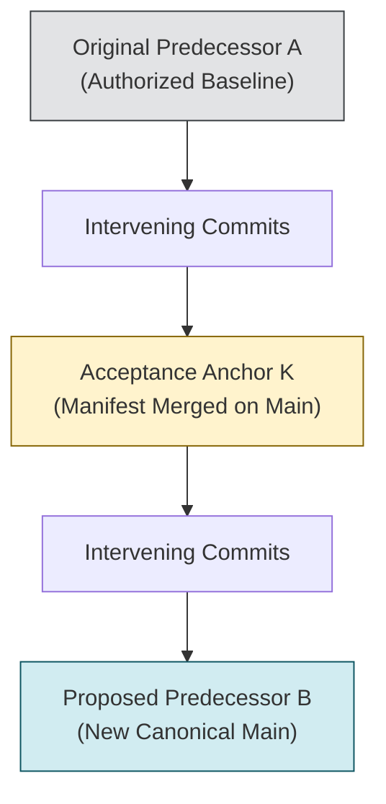
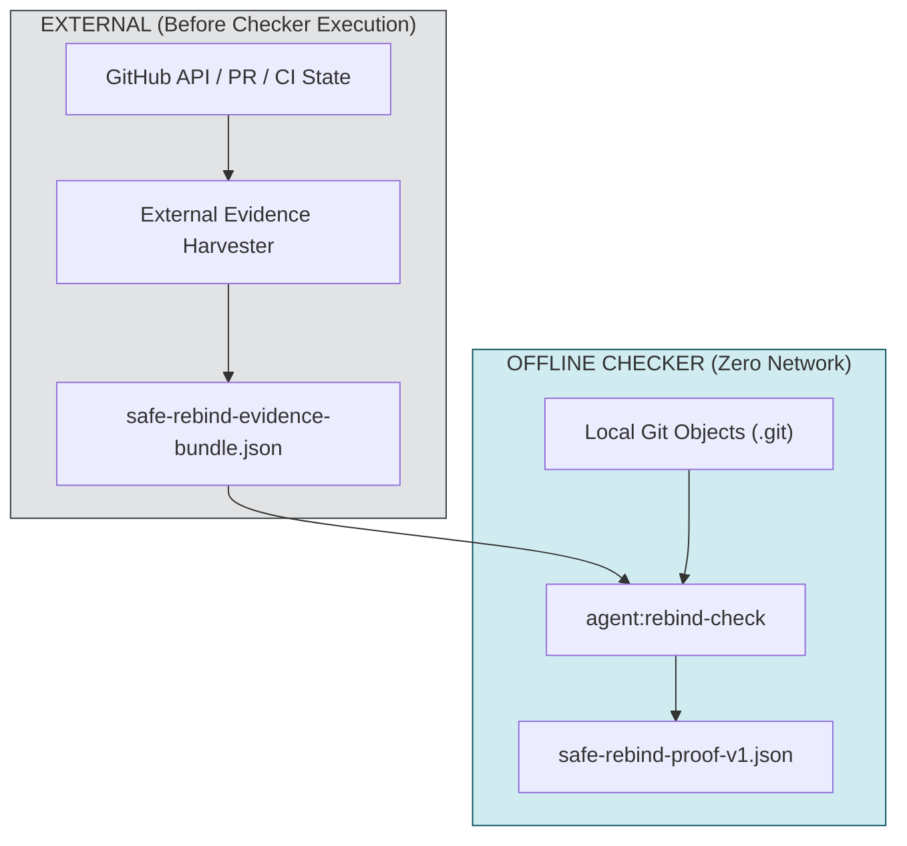
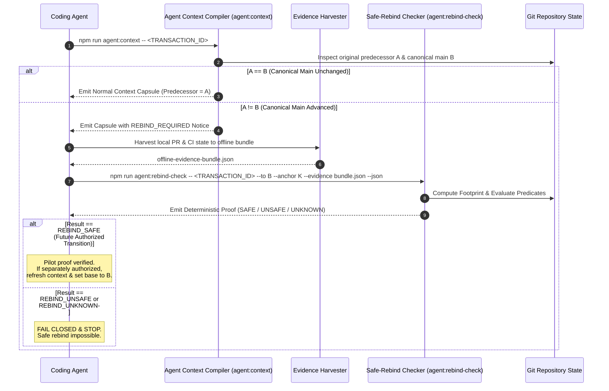
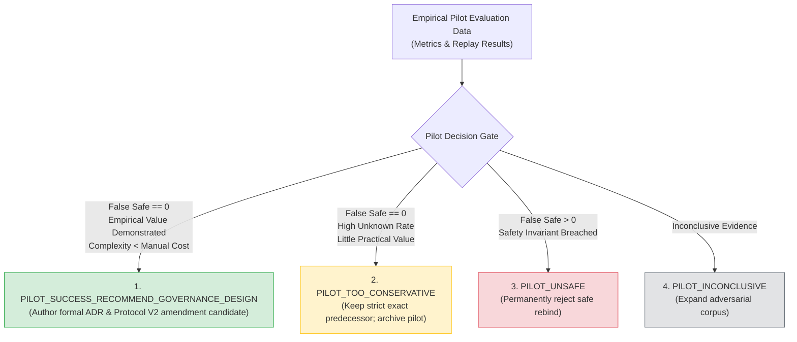

# Read-Only Pre-Execution Safe-Rebind Checker Pilot Specification V1

**Document Class**: `SPECIFICATION`  
**Status**: `PILOT_SPEC_CANDIDATE`  
**Transaction ID**: `AGENT-HARNESS-EXACT-PREDECESSOR-SAFE-REBIND-PILOT-SPEC-003-FINAL-REMEDIATION`  
**Historical Rejected Candidates**: PR #106 (`63d44d030077e0cf4d68fa38558be69bf40cf4c1`), PR #107 (`e0bc77aa55290c9932c74ddc4fc9d1c69de4b519` / Review `PRR_kwDOTmjPCs8AAAABJs8cJA`)  
**Canonical Base Predecessor**: `4659fca9f3c5a9bd406280e451252d39a74f69fc`  
**Authority Effect**: `NONE`  
**Current Production Rebind Policy**: `STRICT_EXACT_PREDECESSOR_UNCHANGED`  
**Implementation Authority**: `NOT_GRANTED`  
**Safe-Rebind Execution Authority**: `NOT_GRANTED`  
**Merge Authority**: `NOT_GRANTED`  
**Stage 2 Wave W1**: `NOT_AUTHORIZED`  

---

> [!WARNING]
> ### NON-AUTHORITY & NON-ACTIVATION NOTICE
> - This document is a **TECHNICAL SPECIFICATION ONLY** for a future read-only pilot checker.
> - It does **NOT** modify repository predecessor policy, amend `AGENTS.md`, or modify `EXECUTION_PROMPT_PROTOCOL_V2.md`.
> - It does **NOT** grant authority to implement the checker, execute safe rebinds, modify Git refs, or implement Wave W1.
> - Current repository production policy remains strictly **`EXACT_PREDECESSOR`**.
> - If any future agent mistakes this document for an effective execution authorization or policy change, it must **FAIL CLOSED AND HALT**.

---

## 1. Executive Summary & Research Lineage

### 1.1 Context and Research Synthesis
Under research transaction `AGENT-HARNESS-EXACT-PREDECESSOR-SAFE-REBIND-RESEARCH-001`, the repository analyzed whether exact predecessor requirements in agent workflows could be safely refreshed to newer canonical `main` commits prior to implementation.

The research established two core conclusions:
1. **Core Verdict**: `ONLY_UNDER_RESTRICTED_CONDITIONS`
2. **Core Recommendation**: `PILOT_PRE_EXECUTION_SAFE_REBIND`

Safe rebind is **strictly impossible** once implementation commits (Commit A / RED) or candidate CI evidence exist. However, in the narrow window **prior to implementation** (Windows A and B), a deterministic, read-only compatibility checker can evaluate whether an accepted authorization's semantic assumptions remain intact on a newer canonical `main` head.

### 1.2 Purpose of This Specification
This specification formalizes the normative behavioral contract, canonical manifest adapter, footprint model, mathematical ancestry rules, candidate state gates, four-state classification semantics, deterministic JSON proof schema, offline evidence input model, CLI interface, adversarial test matrix, and success metrics for a future **Read-Only Pre-Execution Safe-Rebind Checker Pilot** (`PRE_EXECUTION_REBIND_V0`).

### 1.3 Role Boundaries
$$\text{RESEARCH} \neq \text{SPECIFICATION} \neq \text{AUTHORIZATION} \neq \text{IMPLEMENTATION} \neq \text{EVIDENCE} \neq \text{INDEPENDENT ACCEPTANCE} \neq \text{MERGE AUTHORITY}$$

- **Specification Author Role**: Defines bounded, deterministic contracts and proof formats based on accepted research.
- **Explicit Non-Roles**:
  - The Specification Author is **NOT** the checker implementer.
  - The Specification Author is **NOT** a Repository Governor with authority to alter production policy.
  - The Specification Author is **NOT** an Independent Auditor.
  - This document grants **ZERO** execution or merge authority.

### 1.4 Non-Goals
The pilot checker specified herein is a **`READ_ONLY_CLASSIFIER_AND_PROOF_GENERATOR`** only. The checker must **NEVER**:
- `git checkout` another branch or ref;
- `git rebase`, `git cherry-pick`, `git merge`, or `git commit`;
- Move, create, delete, or update any Git ref;
- Write, modify, or delete repository files;
- Open pull requests, post comments, or submit PR reviews;
- Modify authorization manifests or alter canonical status in `docs/IMPLEMENTATION_STATUS.md`;
- Grant execution authority or activate Wave W1;
- Create candidate Commit A or reuse historical RED/GREEN CI.

---

## 2. Rebind Lifecycle Windows & Boundary Rules

### 2.1 Formal Rebind Lifecycle Windows
The candidate lifecycle is partitioned into six mutually exclusive sequential windows:

| Lifecycle Window | Definition | Candidate State | Rebind Status | Rationale |
|---|---|---|---|---|
| **Window A** | Authorization accepted on `main`; no implementation branch or commit created. | `commit_count == 0` | **`CONDITIONALLY_SAFE`** | Pure pre-execution state. No code or evidence exists to invalidate. |
| **Window B** | Implementation branch created from base; zero candidate commits; no Commit A. | `commit_count == 0` | **`CONDITIONALLY_SAFE`** | Pure pre-execution state. Branch ref is identical to base ref. |
| **Window C** | Candidate Commit A (RED test-first) exists. | `commit_count >= 1` | **`FORBIDDEN`** | Natural product-defect RED test was authored against base $A$. Rebinding to $B$ invalidates RED provenance. |
| **Window D** | Candidate Commit B (GREEN implementation) exists. | `commit_count >= 2` | **`FORBIDDEN`** | Implementation code and diffs are bound to base $A$. |
| **Window E** | Candidate exact-head CI execution exists. | CI triggered/passed | **`FORBIDDEN`** | CI runs on exact commit SHA topology $(A \to \text{HEAD})$. Rebinding destroys CI validity. |
| **Window F** | Independent implementation audit verdict exists. | `ACCEPT` / `REJECT` / `BLOCKED` | **`FORBIDDEN`** | Verdict is cryptographically and topologically bound to candidate HEAD. |



### 2.2 Absolute Post-Commit-A Boundary
The instant Commit A is materialized, safe rebind evaluation is **PERMANENTLY OUT OF SCOPE**.

If a rebind check is evaluated in Windows C through F:
- The checker must return machine classification **`REBIND_UNSAFE`** with exact reason code `COMMIT_A_EXISTS`, `CANDIDATE_COMMIT_EXISTS`, `CANDIDATE_CI_EXISTS`, or `INDEPENDENT_VERDICT_EXISTS`.
- Any future recovery on a new canonical base requires **clean rematerialization from scratch** with fresh RED test provenance under a separately authorized transaction.

---

## 3. Terminology: Original vs Proposed Predecessors

To eliminate ambiguity and prevent authority laundering, the following terms are frozen:

### 3.1 Definitions
1. **`original_authorized_predecessor` ($A$)**:
   - The immutable Git commit SHA against which the authorization manifest was authored, audited, and accepted.
   - Remains permanently recorded in the authorization manifest as historical provenance.
2. **`authorization_acceptance_anchor` ($K$)**:
   - The canonical Git commit SHA on `main` where the authorization manifest was merged and ratified.
   - Satisfies $A \preceq K \preceq B$.
3. **`proposed_effective_execution_predecessor` ($B$)**:
   - The newer canonical `origin/main` Git commit SHA being evaluated as a candidate base for pre-execution refresh.
   - Exists only as a checker target during pilot evaluation.

### 3.2 Non-Aliasing Invariant
$$\text{original\_authorized\_predecessor} \neq \text{authorization\_acceptance\_anchor} \neq \text{proposed\_effective\_execution\_predecessor}$$

These fields must **NEVER** be aliased, overwritten, or substituted in repository records.

### 3.3 Semantic Limitation of Pilot Output
Even if the checker yields `REBIND_SAFE`, the output means **ONLY**:
$$\text{"Candidate base } B \text{ satisfies all conservative pilot compatibility predicates with respect to authorization } A\text{"}$$

It does **NOT** mean:
$$\text{"Execution is now authorized against } B\text{"}$$

Execution authority against $B$ requires a separate, explicit governance transition.

---

## 4. Git Topology & Ancestry Contract

### 4.1 Mathematical Topology Predicates
Given original predecessor $A$, authorization acceptance anchor $K$, and proposed predecessor $B$:

$$\text{AncestryPredicate}(A, K, B) = (\text{merge-base}(A, K) == A) \land (\text{merge-base}(K, B) == K) \land (A \in \text{Ancestors}(B))$$



### 4.2 Ancestry Classification Rules
1. **Identity Case ($A == B$)**:
   - Classification: **`REBIND_NOT_REQUIRED`**
   - Reason Code: `REBIND_NOT_REQUIRED`
   - Meaning: Canonical `main` has not advanced. Base is fresh.
2. **Strict Descendant Case ($A \neq B \land \text{merge-base}(A, B) == A$)**:
   - Action: Proceed to Acceptance Anchor, Pilot Assumption Footprint, and Candidate State evaluation.
3. **Non-Descendant / Divergent Case ($\text{merge-base}(A, B) \neq A$)**:
   - Classification: **`REBIND_UNSAFE`**
   - Reason Code: `NON_DESCENDANT_BASE`
   - Rationale: $B$ does not contain $A$ in its direct ancestry line (e.g. force-push, history rewrite, or divergent branch). Compatibility cannot be established.
4. **Git Object Unavailable / Ambiguous Topology**:
   - Classification: **`REBIND_UNKNOWN`**
   - Reason Code: `GIT_OBJECT_UNAVAILABLE`
   - Rationale: Missing repository history fails closed.

---

## 5. Canonical Manifest Adapter (`BOUNDED_EXECUTION_CAPSULE_PROTOCOL_V1`)

Pilot V0 supports manifest format **`BOUNDED_EXECUTION_CAPSULE_PROTOCOL_V1`** and binds to exact canonical structural headings.

### 5.1 Normative Manifest Adapter Anchor Table

| Structural Anchor / Section Heading | Occurrence Requirement | Extraction Purpose | Failure Result |
|---|---|---|---|
| `## 1.2 Controlling Authorities Fresh-Read Ledger` | Exactly 1 | `REQUIRED_READ_FOOTPRINT` (Explicit code/link paths) | `REBIND_UNKNOWN` + `AUTHORITY_AMBIGUOUS` |
| `### 5.1 Source Allowlist (SOURCE_ALLOWLIST)` | Exactly 1 | `WRITE_FOOTPRINT` (Source components) | `REBIND_UNKNOWN` + `FOOTPRINT_INCOMPLETE` |
| `### 5.2 Test Allowlist (TEST_ALLOWLIST)` | Exactly 1 | `WRITE_FOOTPRINT` + `TEST_FOOTPRINT` roots | `REBIND_UNKNOWN` + `FOOTPRINT_INCOMPLETE` |
| `### 5.3 Fixture Allowlist (FIXTURE_ALLOWLIST)` | Exactly 1 | `WRITE_FOOTPRINT` + `TEST_FOOTPRINT` roots | `REBIND_UNKNOWN` + `FOOTPRINT_INCOMPLETE` |
| `### 5.4 Docs and Evidence Allowlist (DOC_EVIDENCE_ALLOWLIST)` | Exactly 1 | `WRITE_FOOTPRINT` (Governance / doc files) | `REBIND_UNKNOWN` + `FOOTPRINT_INCOMPLETE` |
| `## 6. RED / GREEN Execution Topology and Specification` | Exactly 1 | Structural validation of 2-commit topology | `REBIND_UNKNOWN` + `AUTHORITY_AMBIGUOUS` |
| `### 6.1 Commit A — RED Test Contract and Expected Failure Predicates` | Exactly 1 | `RED_PREDICATES` schema table | `REBIND_UNKNOWN` + `AUTHORITY_AMBIGUOUS` |
| `## 4. Persistence Model and Store Manifest` | Exactly 1 (if persistence applies) | `DATA_SCHEMA_FOOTPRINT` store/version rules | `REBIND_UNKNOWN` + `FOOTPRINT_INCOMPLETE` |
| `## 9. Verification Commands and CI Obligations` | Exactly 1 | Local verification suite extraction | `REBIND_UNKNOWN` + `AUTHORITY_AMBIGUOUS` |

### 5.2 Footprint Mathematical Formulation
The **Rebind Assumption Footprint** is the closed set of all repository objects, paths, configurations, and contracts upon which the authorized transaction depends:

$$\begin{aligned}
\text{REBIND\_ASSUMPTION\_FOOTPRINT} = \;
& \text{AUTHORITY\_FOOTPRINT} \\
& \cup \text{WRITE\_FOOTPRINT} \\
& \cup \text{REQUIRED\_READ\_FOOTPRINT} \\
& \cup \text{TEST\_FOOTPRINT} \\
& \cup \text{RUNTIME\_DEPENDENCY\_FOOTPRINT} \\
& \cup \text{BUILD\_CI\_FOOTPRINT} \\
& \cup \text{DATA\_SCHEMA\_FOOTPRINT} \\
& \cup \text{PREDECESSOR\_CONTRACT\_FOOTPRINT} \\
& \cup \text{CONTEXT\_INTERPRETATION\_FOOTPRINT}
\end{aligned}$$

### 5.3 Footprint Categories & Extraction Rules

| Footprint Category | Definition & Scope | Canonical Manifest Extraction Anchor | Identity Requirement | Failure Classification |
|---|---|---|---|---|
| **1. AUTHORITY_FOOTPRINT** | Authorization manifest, accepted blob SHA, acceptance anchor commit, controlling Protocol & ADRs, canonical status facts. | Parsed from manifest header, `docs/authorizations/`, `docs/DECISIONS.md`, and `docs/IMPLEMENTATION_STATUS.md`. | Blob SHA immutable from acceptance anchor $K$ through $B$. | Modified $\to$ `REBIND_UNSAFE` (`AUTHORITY_CHANGED`)<br/>Ambiguous $\to$ `REBIND_UNKNOWN` (`AUTHORITY_AMBIGUOUS`) |
| **2. WRITE_FOOTPRINT** | Complete set of files authorized for modification in candidate transaction. | Formally: $\text{SOURCE\_ALLOWLIST} \cup \text{TEST\_ALLOWLIST} \cup \text{FIXTURE\_ALLOWLIST} \cup \text{DOC\_EVIDENCE\_ALLOWLIST}$. Extracted from `File Path` table cells under §5.1–§5.4. | Zero tree mutations (`A`, `M`, `D`) across $(A \dots B]$. | Modified $\to$ `REBIND_UNSAFE` (`WRITE_FOOTPRINT_CHANGED`)<br/>Extraction Failure $\to$ `REBIND_UNKNOWN` (`FOOTPRINT_INCOMPLETE`) |
| **3. REQUIRED_READ_FOOTPRINT** | Canonical documents, domain models, and specs required to be read by the transaction. | Extracted ONLY from explicit repository-relative path tokens in `## 1.2 Controlling Authorities Fresh-Read Ledger`. (Zero heuristic or LLM expansion). | Exact content blob SHA equality across $(A \dots B]$. | Modified $\to$ `REBIND_UNSAFE` (`REQUIRED_READ_FOOTPRINT_CHANGED`)<br/>Unresolvable $\to$ `REBIND_UNKNOWN` (`FOOTPRINT_INCOMPLETE`) |
| **4. TEST_FOOTPRINT** | Target test suites, unit tests, browser harnesses, test helpers, and test fixtures. | Roots: $\text{TEST\_ALLOWLIST} \cup \text{FIXTURE\_ALLOWLIST}$ + `## 9. Verification Commands` + AST imports from test files. | Zero diff across test files, helpers, fixtures, and harnesses in $(A \dots B]$. | Modified $\to$ `REBIND_UNSAFE` (`TEST_FOOTPRINT_CHANGED`)<br/>Incomplete Graph $\to$ `REBIND_UNKNOWN` (`FOOTPRINT_INCOMPLETE`) |
| **5. RUNTIME_DEPENDENCY_FOOTPRINT** | Transitive runtime modules, shared libraries, and static assets imported by write/test files. | Recursive static AST import traversal (ES module `import` / `export`) rooted at Write & Test Footprint files. | Zero diff across all resolved runtime dependencies in $(A \dots B]$. | Modified $\to$ `REBIND_UNSAFE` (`RUNTIME_DEPENDENCY_CHANGED`)<br/>Dynamic / Unresolved $\to$ `REBIND_UNKNOWN` (`RUNTIME_DEPENDENCY_UNRESOLVED`) |
| **6. BUILD_CI_FOOTPRINT** | Build configs, package manifests, lockfiles, verification scripts, CI workflows. | Fixed normative set: `package.json`, `package-lock.json`, `scripts/**`, `.github/workflows/ci.yml`. | Exact byte equality across build and CI files in $(A \dots B]$. | Modified $\to$ `REBIND_UNSAFE` (`BUILD_CI_CHANGED`) |
| **7. DATA_SCHEMA_FOOTPRINT** | Database version constants, migration files, migration ledger, backup registry, restore schemas. | `## 4. Persistence Model and Store Manifest` (Includes `src/*persistence*.js`, `src/backup-registry.js`; explicitly `EMPTY` for non-persistence tasks). | Exact equality of database versions, migration tables, and backup registry contracts in $(A \dots B]$. | Modified $\to$ `REBIND_UNSAFE` (`DATA_SCHEMA_CHANGED`) |
| **8. PREDECESSOR_CONTRACT_FOOTPRINT** | Public contracts or artifacts from upstream packages/waves upon which this transaction depends. | Declared upstream package dependencies from manifest; `NONE` if root package. | Upstream contracts and status remain identical in $(A \dots B]$. | Modified $\to$ `REBIND_UNSAFE` (`PREDECESSOR_CONTRACT_CHANGED`)<br/>Ambiguous $\to$ `REBIND_UNKNOWN` (`AUTHORITY_AMBIGUOUS`) |
| **9. CONTEXT_INTERPRETATION_FOOTPRINT** | Compiler, parsers, and governance tools used to extract context. | `scripts/agent-context.mjs`, AST parser tools. | Parser and context compiler logic unchanged in $(A \dots B]$. | Modified $\to$ `REBIND_UNSAFE` (`CONTEXT_INTERPRETER_CHANGED`) |

---

## 6. Conservative V0 Decision Rules

### 6.1 Strict Conservatism Principle
Pilot V0 is **NOT a semantic AI equivalence checker**. It does not perform heuristic reasoning to guess whether an intervening change is "harmless".

### 6.2 Non-Sufficiency of Path Disjointness
$$\Delta(A, B) \cap \text{WRITE\_FOOTPRINT} = \emptyset \centernot\implies \text{REBIND\_SAFE}$$

Path disjointness alone is **NOT** a safety proof. An intervening commit modifying a test helper, a shared runtime dependency, a build script, or a schema migration may completely break the authorized transaction even if the transaction's write allowlist files were untouched.

---

## 7. Deep Footprint & Gate Specifications

### 7.1 Authorization Acceptance Anchor Resolution Contract
The caller supplies the exact 40-character SHA for `authorization_acceptance_anchor_sha` ($K$).

The checker validates $K$ deterministically using local Git state:
1. $K$ is a valid Git commit object in local history.
2. $\text{merge-base}(A, K) == A$ ($A$ is ancestor of $K$).
3. $\text{merge-base}(K, B) == K$ ($K$ is ancestor of proposed $B$).
4. The manifest file exists at commit $K$ and has exact hash:
   $$\text{blob}(\text{manifest}, K) == \text{accepted\_authorization\_blob\_sha}$$
5. Authority is immutable from $K$ through $B$:
   $$\text{blob}(\text{manifest}, K) == \text{blob}(\text{manifest}, B)$$
6. If any validation fails:
   - Classification: **`REBIND_UNKNOWN`**
   - Reason Code: `AUTHORITY_AMBIGUOUS` or `GIT_OBJECT_UNAVAILABLE`

### 7.2 Write Footprint Extraction & Normalization
The `WRITE_FOOTPRINT` is mechanically extracted from:
$$\text{WRITE\_FOOTPRINT} = \text{SOURCE\_ALLOWLIST} \cup \text{TEST\_ALLOWLIST} \cup \text{FIXTURE\_ALLOWLIST} \cup \text{DOC\_EVIDENCE\_ALLOWLIST}$$
1. Scan table rows under §5.1, §5.2, §5.3, and §5.4 in the manifest.
2. Extract path strings from the `File Path` column.
3. Normalize all paths to POSIX relative format (lowercase ASCII extensions, no `./`).
4. Deduplicate and sort lexicographically.
5. If any allowlist table is missing, duplicated, or unparseable $\to$ `REBIND_UNKNOWN` (`FOOTPRINT_INCOMPLETE`).

### 7.3 Deterministic Required Read Footprint Extraction
The `REQUIRED_READ_FOOTPRINT` is mechanically extracted from:
`## 1.2 Controlling Authorities Fresh-Read Ledger`
1. Parse repository-relative code/link path tokens matching `*.md` or repository file paths from enumerated ledger entries.
2. Normalize to POSIX relative paths.
3. Deduplicate and sort lexicographically.
4. Verify that each file exists in $\text{TREE}(A)$ and $\text{TREE}(K)$.
5. Zero open-ended heuristic discovery; zero LLM relevance expansion.
6. If any required read path is malformed or unresolvable $\to$ `REBIND_UNKNOWN` (`FOOTPRINT_INCOMPLETE`).
7. If any file in `REQUIRED_READ_FOOTPRINT` is modified in $(A \dots B] \to$ `REBIND_UNSAFE` (`REQUIRED_READ_FOOTPRINT_CHANGED`).

### 7.4 RED Contract Viability Preflight & Fail-Closed Gate
A critical danger of rebasing or refreshing a base is **RED contract pre-satisfaction**: an intervening commit in $(A \dots B]$ may accidentally implement, mask, or satisfy the missing behavior that the transaction was authorized to build.

1. **Predicate ID Formula**:
   For each row in §6.1 RED table:
   $$\text{predicate\_id} = \text{"PRED-" } + \text{Slugify}(\text{TestPath}) + \text{"-" } + \text{RowIndex} + \text{"-" } + \text{Hex8}(\text{SHA256}(\text{AssertionText}))$$
2. **Prose vs Machine Evidence**:
   Markdown prose descriptions in §6.1 establish intent but are not auto-executable. Machine evaluation results enter through `offline_evidence_bundle.red_predicate_evidence`.
3. **RED Evaluation Truth Table**:

| Predicate Evaluation at Base $B$ | Intermediate Status | Contribution to Overall Rebind Result | Primary Reason Code |
|---|---|---|---|
| Missing behavior confirmed absent / test fails as expected | `UNSATISFIED` | Compatible (Allows `REBIND_SAFE` if all other gates pass) | None |
| Missing behavior already present / test passes unexpectedly | `SATISFIED` | **`REBIND_UNSAFE`** | `RED_PREDICATE_PRE_SATISFIED` |
| Evaluation inconclusive / ambiguous runtime behavior | `UNKNOWN` | **`REBIND_UNKNOWN`** | `RED_PREDICATE_UNKNOWN` |
| Predicate un-evaluated / missing machine evidence | `NOT_EVALUATED` | **`REBIND_UNKNOWN`** (Treated as `UNKNOWN` for mandatory predicates) | `RED_PREDICATE_UNKNOWN` |

**Hard Safe Gate Invariant**:
$$\text{REBIND\_SAFE} \implies \forall p \in \text{MANDATORY\_RED\_PREDICATES}, \quad \text{status}(p) == \text{"UNSATISFIED"}$$
No mandatory RED predicate may remain `NOT_EVALUATED` or `UNKNOWN`.

### 7.5 Runtime Dependency Footprint & AST Traversal
1. Recursive static AST analysis extracts all ES Module `import` / `export ... from` statements and static `require` calls.
2. Dynamic path construction, global window properties, or unresolvable edges trigger fail-closed behavior:
   $$\text{HasUnresolvedEdges} = \text{TRUE} \implies \mathbf{REBIND\_UNKNOWN} \; (\texttt{RUNTIME\_DEPENDENCY\_UNRESOLVED})$$

### 7.6 Build / CI Footprint
The Build/CI footprint binds repository integrity infrastructure:
`package.json`, `package-lock.json`, `scripts/**`, `.github/workflows/ci.yml`.
Any modification in $(A \dots B]$ yields `REBIND_UNSAFE` (`BUILD_CI_CHANGED`).

### 7.7 Data / Schema Footprint
For persistence-affecting transactions:
Includes database version constants, schema declarations, migration ledger files, `src/backup-registry.js`, and restore handlers.
Any modification in $(A \dots B]$ yields `REBIND_UNSAFE` (`DATA_SCHEMA_CHANGED`).

---

## 8. Offline Candidate State Gate & Evidence Bundle

### 8.1 Offline Architecture & Evidence Separation
The checker operates with **`ZERO NETWORK CALLS`**. Remote PR/CI/verdict state enters through a structured, pre-acquired **Offline Evidence Bundle** (`--evidence <PATH>`).

$$\text{OFFLINE\_EVIDENCE\_BUNDLE} \neq \text{INDEPENDENT\_ACCEPTANCE\_EVIDENCE}$$

The offline checker proves schema validity, cross-checks against local Git, and computes proof digests. Independent Auditors fresh-verify provenance against raw GitHub.



### 8.2 JSON Schema: Offline Evidence Bundle (`safe-rebind-evidence-bundle-v1.json`)

```json
{
  "$schema": "https://json-schema.org/draft/2020-12/schema",
  "title": "SafeRebindOfflineEvidenceBundleV1",
  "type": "object",
  "required": [
    "evidence_schema_version",
    "repository_full_name",
    "transaction_id",
    "original_authorized_predecessor_sha",
    "authorization_acceptance_anchor_sha",
    "proposed_effective_execution_predecessor_sha",
    "candidate_branch",
    "candidate_head_sha",
    "candidate_commit_shas",
    "pr_evidence",
    "ci_evidence",
    "independent_verdict_evidence",
    "historical_rejected_candidate_evidence",
    "red_predicate_evidence",
    "source_provenance",
    "bundle_digest"
  ],
  "properties": {
    "evidence_schema_version": { "type": "string", "enum": ["1.0.0"] },
    "repository_full_name": { "type": "string" },
    "transaction_id": { "type": "string" },
    "original_authorized_predecessor_sha": { "type": "string", "pattern": "^[0-9a-f]{40}$" },
    "authorization_acceptance_anchor_sha": { "type": "string", "pattern": "^[0-9a-f]{40}$" },
    "proposed_effective_execution_predecessor_sha": { "type": "string", "pattern": "^[0-9a-f]{40}$" },
    "candidate_branch": { "type": "string" },
    "candidate_head_sha": { "type": "string", "pattern": "^[0-9a-f]{40}$" },
    "candidate_commit_shas": {
      "type": "array",
      "items": { "type": "string", "pattern": "^[0-9a-f]{40}$" }
    },
    "pr_evidence": {
      "type": "object",
      "required": ["pr_number", "state", "is_draft", "commits_count"],
      "properties": {
        "pr_number": { "type": "integer" },
        "state": { "type": "string", "enum": ["OPEN", "CLOSED", "MERGED"] },
        "is_draft": { "type": "boolean" },
        "commits_count": { "type": "integer", "minimum": 0 }
      },
      "additionalProperties": false
    },
    "ci_evidence": {
      "type": "object",
      "required": ["workflow_runs_count", "has_candidate_runs", "runs"],
      "properties": {
        "workflow_runs_count": { "type": "integer", "minimum": 0 },
        "has_candidate_runs": { "type": "boolean" },
        "runs": {
          "type": "array",
          "items": {
            "type": "object",
            "required": ["run_id", "head_sha", "conclusion"],
            "properties": {
              "run_id": { "type": "integer" },
              "head_sha": { "type": "string", "pattern": "^[0-9a-f]{40}$" },
              "conclusion": { "type": "string" }
            },
            "additionalProperties": false
          }
        }
      },
      "additionalProperties": false
    },
    "independent_verdict_evidence": {
      "type": "object",
      "required": ["verdicts_count", "has_verdicts", "reviews"],
      "properties": {
        "verdicts_count": { "type": "integer", "minimum": 0 },
        "has_verdicts": { "type": "boolean" },
        "reviews": {
          "type": "array",
          "items": {
            "type": "object",
            "required": ["review_id", "state", "commit_sha"],
            "properties": {
              "review_id": { "type": "string" },
              "state": { "type": "string" },
              "commit_sha": { "type": "string", "pattern": "^[0-9a-f]{40}$" }
            },
            "additionalProperties": false
          }
        }
      },
      "additionalProperties": false
    },
    "historical_rejected_candidate_evidence": {
      "type": "object",
      "required": ["is_reuse_attempted", "rejected_candidate_refs"],
      "properties": {
        "is_reuse_attempted": { "type": "boolean" },
        "rejected_candidate_refs": {
          "type": "array",
          "items": { "type": "string" }
        }
      },
      "additionalProperties": false
    },
    "red_predicate_evidence": {
      "type": "array",
      "items": {
        "type": "object",
        "required": ["predicate_id", "mandatory", "evaluator_id", "evaluator_source_identity", "status", "detail_digest"],
        "properties": {
          "predicate_id": { "type": "string" },
          "mandatory": { "type": "boolean" },
          "evaluator_id": { "type": "string" },
          "evaluator_source_identity": { "type": "string", "pattern": "^[0-9a-f]{40}$" },
          "status": { "type": "string", "enum": ["UNSATISFIED", "SATISFIED", "UNKNOWN", "NOT_EVALUATED"] },
          "detail_digest": { "type": "string", "pattern": "^[0-9a-f]{64}$" }
        },
        "additionalProperties": false
      }
    },
    "source_provenance": {
      "type": "object",
      "required": ["source_kind", "query_scope", "raw_payload_digest"],
      "properties": {
        "source_kind": { "type": "string" },
        "query_scope": { "type": "string" },
        "raw_payload_digest": { "type": "string", "pattern": "^[0-9a-f]{64}$" }
      },
      "additionalProperties": false
    },
    "bundle_digest": { "type": "string", "pattern": "^[0-9a-f]{64}$" }
  },
  "additionalProperties": false
}
```

### 8.3 Candidate State Derivation & Cross-Checking
1. `candidate_commit_count` = `length(candidate_commit_shas)`. Must match local Git branch count.
2. `commit_a_exists` = `candidate_commit_count >= 1`.
3. `green_candidate_exists` = `candidate_commit_count >= 2`.
4. `candidate_ci_exists` = `ci_evidence.has_candidate_runs`.
5. `independent_implementation_verdict_exists` = `independent_verdict_evidence.has_verdicts`.
6. `historical_rejected_candidate_reuse_required` = `historical_rejected_candidate_evidence.is_reuse_attempted`.
7. **Cross-Check Invariant**: If bundle claims `commit_count == 0` but local Git branch contains commits $\to$ `REBIND_UNKNOWN` (`AUTHORITY_AMBIGUOUS`).

---

## 9. Four-State Classification & Exhaustive Reason Aggregation

### 9.1 Semantic State Definitions

| Classification | Strict Formal Definition | Action / Outcome |
|---|---|---|
| **`REBIND_SAFE`** | Every mandatory precondition, footprint completeness check, ancestry check, candidate state check, and RED viability check is **positively proved**. | Bounded pre-execution compatibility established. (Does NOT authorize execution without separate governance transition). |
| **`REBIND_UNSAFE`** | A deterministic incompatibility is **positively proved** (e.g. footprint overlap, schema change, pre-satisfied RED, non-descendant base, Commit A exists). | **STOP Execution**. Transaction cannot be safely rebound. Must rematerialize or re-authorize. |
| **`REBIND_UNKNOWN`** | Footprint completeness, dependency resolution, RED evaluation, or Git state is **incomplete, ambiguous, or unverifiable**. | **STOP Execution**. Fail-closed. Treat with same finality as UNSAFE. |
| **`REBIND_NOT_REQUIRED`** | $A == B$ (Base has not advanced). | Proceed with standard exact-predecessor execution on $A$. |

### 9.2 Exhaustive Reason Aggregation & Strict Precedence Rule
When multiple gates or predicates fail:
1. **Exhaustive Collection**: The checker records **every** reason code triggered across all evaluable gates.
2. **Canonicalization**: Deduplicate and sort ASCII ascending.
3. **Strict Precedence Hierarchy for $A \neq B$**:
   $$\mathbf{UNSAFE} > \mathbf{UNKNOWN} > \mathbf{SAFE}$$
   - If $A == B \implies \text{result} = \mathbf{REBIND\_NOT\_REQUIRED}, \text{reason\_codes} = [\mathbf{"REBIND\_NOT\_REQUIRED"}]$.
   - If $\exists r \in \text{reason\_codes}$ such that $r \in \text{UNSAFE\_REASONS} \implies \text{result} = \mathbf{REBIND\_UNSAFE}$.
   - Else if $\exists r \in \text{reason\_codes}$ such that $r \in \text{UNKNOWN\_REASONS} \implies \text{result} = \mathbf{REBIND\_UNKNOWN}$.
   - Else if all mandatory compatibility predicates are positively proved $\implies \text{result} = \mathbf{REBIND\_SAFE}, \text{reason\_codes} = []$.
   - Else $\implies \text{result} = \mathbf{REBIND\_UNKNOWN}, \text{reason\_codes} = [\mathbf{"FOOTPRINT\_INCOMPLETE"}]$.

---

## 10. Deterministic Versioned Proof Schema

The checker emits a byte-reproducible, deterministic JSON audit proof conforming to this schema.

### 10.1 JSON Schema Specification (`safe-rebind-proof-v1.json`)

```json
{
  "$schema": "https://json-schema.org/draft/2020-12/schema",
  "title": "ExactPredecessorSafeRebindProofV1",
  "type": "object",
  "required": [
    "proof_schema_version",
    "compatibility_predicate_version",
    "checker_source_identity",
    "transaction_id",
    "rebind_id",
    "original_authorized_predecessor_sha",
    "authorization_acceptance_anchor_sha",
    "accepted_authorization_blob_sha",
    "canonical_main_observed_sha",
    "proposed_effective_execution_predecessor_sha",
    "merge_base_sha",
    "is_descendant",
    "intervening_commits",
    "intervening_path_changes",
    "footprint_definition",
    "footprint_digest",
    "footprint_completeness",
    "authority_blobs",
    "write_footprint",
    "required_read_footprint",
    "required_test_footprint",
    "runtime_dependency_footprint",
    "build_ci_footprint",
    "data_schema_footprint",
    "predecessor_contract_footprint",
    "context_interpretation_footprint",
    "runtime_dependency_unresolved_edges",
    "candidate_state",
    "red_predicate_results",
    "compatibility_predicates",
    "reason_codes",
    "offline_evidence_bundle_digest",
    "result",
    "proof_digest"
  ],
  "properties": {
    "proof_schema_version": { "type": "string", "enum": ["1.0.0"] },
    "compatibility_predicate_version": { "type": "string", "enum": ["PRE_EXECUTION_REBIND_V0"] },
    "checker_source_identity": { "type": "string", "pattern": "^[0-9a-f]{40}$" },
    "transaction_id": { "type": "string" },
    "rebind_id": { "type": "string" },
    "original_authorized_predecessor_sha": { "type": "string", "pattern": "^[0-9a-f]{40}$" },
    "authorization_acceptance_anchor_sha": { "type": "string", "pattern": "^[0-9a-f]{40}$" },
    "accepted_authorization_blob_sha": { "type": "string", "pattern": "^[0-9a-f]{40}$" },
    "canonical_main_observed_sha": { "type": "string", "pattern": "^[0-9a-f]{40}$" },
    "proposed_effective_execution_predecessor_sha": { "type": "string", "pattern": "^[0-9a-f]{40}$" },
    "merge_base_sha": { "type": "string", "pattern": "^[0-9a-f]{40}$" },
    "is_descendant": { "type": "boolean" },
    "intervening_commits": {
      "type": "array",
      "items": {
        "type": "object",
        "required": ["sha", "parents", "summary"],
        "properties": {
          "sha": { "type": "string", "pattern": "^[0-9a-f]{40}$" },
          "parents": { "type": "array", "items": { "type": "string", "pattern": "^[0-9a-f]{40}$" } },
          "summary": { "type": "string" }
        },
        "additionalProperties": false
      }
    },
    "intervening_path_changes": {
      "type": "array",
      "items": {
        "type": "object",
        "required": ["path", "status", "old_blob_sha", "new_blob_sha"],
        "properties": {
          "path": { "type": "string" },
          "status": { "type": "string", "enum": ["A", "M", "D"] },
          "old_blob_sha": { "type": "string", "pattern": "^([0-9a-f]{40})?$" },
          "new_blob_sha": { "type": "string", "pattern": "^([0-9a-f]{40})?$" }
        },
        "additionalProperties": false
      }
    },
    "footprint_definition": { "type": "string" },
    "footprint_digest": { "type": "string", "pattern": "^[0-9a-f]{64}$" },
    "footprint_completeness": { "type": "boolean" },
    "authority_blobs": {
      "type": "object",
      "additionalProperties": { "type": "string", "pattern": "^[0-9a-f]{40}$" }
    },
    "write_footprint": {
      "type": "array",
      "items": { "type": "string" }
    },
    "required_read_footprint": {
      "type": "array",
      "items": { "type": "string" }
    },
    "required_test_footprint": {
      "type": "array",
      "items": { "type": "string" }
    },
    "runtime_dependency_footprint": {
      "type": "array",
      "items": { "type": "string" }
    },
    "build_ci_footprint": {
      "type": "array",
      "items": { "type": "string" }
    },
    "data_schema_footprint": {
      "type": "array",
      "items": { "type": "string" }
    },
    "predecessor_contract_footprint": {
      "type": "array",
      "items": { "type": "string" }
    },
    "context_interpretation_footprint": {
      "type": "array",
      "items": { "type": "string" }
    },
    "runtime_dependency_unresolved_edges": {
      "type": "array",
      "items": { "type": "string" }
    },
    "candidate_state": {
      "type": "object",
      "required": [
        "candidate_commit_count",
        "commit_a_exists",
        "green_candidate_exists",
        "candidate_ci_exists",
        "independent_implementation_verdict_exists",
        "historical_rejected_candidate_reuse_required"
      ],
      "properties": {
        "candidate_commit_count": { "type": "integer", "minimum": 0 },
        "commit_a_exists": { "type": "boolean" },
        "green_candidate_exists": { "type": "boolean" },
        "candidate_ci_exists": { "type": "boolean" },
        "independent_implementation_verdict_exists": { "type": "boolean" },
        "historical_rejected_candidate_reuse_required": { "type": "boolean" }
      },
      "additionalProperties": false
    },
    "red_predicate_results": {
      "type": "array",
      "items": {
        "type": "object",
        "required": ["predicate_id", "status", "detail"],
        "properties": {
          "predicate_id": { "type": "string" },
          "status": { "type": "string", "enum": ["UNSATISFIED", "SATISFIED", "UNKNOWN", "NOT_EVALUATED"] },
          "detail": { "type": "string" }
        },
        "additionalProperties": false
      }
    },
    "compatibility_predicates": {
      "type": "object",
      "additionalProperties": { "type": "boolean" }
    },
    "reason_codes": {
      "type": "array",
      "items": {
        "type": "string",
        "enum": [
          "REBIND_NOT_REQUIRED",
          "NON_DESCENDANT_BASE",
          "AUTHORITY_CHANGED",
          "AUTHORITY_AMBIGUOUS",
          "WRITE_FOOTPRINT_CHANGED",
          "REQUIRED_READ_FOOTPRINT_CHANGED",
          "TEST_FOOTPRINT_CHANGED",
          "RUNTIME_DEPENDENCY_CHANGED",
          "RUNTIME_DEPENDENCY_UNRESOLVED",
          "BUILD_CI_CHANGED",
          "DATA_SCHEMA_CHANGED",
          "PREDECESSOR_CONTRACT_CHANGED",
          "CONTEXT_INTERPRETER_CHANGED",
          "RED_PREDICATE_PRE_SATISFIED",
          "RED_PREDICATE_UNKNOWN",
          "CANDIDATE_COMMIT_EXISTS",
          "COMMIT_A_EXISTS",
          "CANDIDATE_CI_EXISTS",
          "INDEPENDENT_VERDICT_EXISTS",
          "HISTORICAL_CANDIDATE_REUSE_REQUIRED",
          "FOOTPRINT_INCOMPLETE",
          "GIT_OBJECT_UNAVAILABLE"
        ]
      }
    },
    "offline_evidence_bundle_digest": { "type": "string", "pattern": "^[0-9a-f]{64}$" },
    "result": {
      "type": "string",
      "enum": [
        "REBIND_SAFE",
        "REBIND_UNSAFE",
        "REBIND_UNKNOWN",
        "REBIND_NOT_REQUIRED"
      ]
    },
    "proof_digest": { "type": "string", "pattern": "^[0-9a-f]{64}$" }
  },
  "additionalProperties": false
}
```

### 10.2 Complete Field Specifications Ledger

Every property in the JSON schema is normatively specified in this ledger ($\text{JSON\_SCHEMA\_PROPERTIES} = \text{FIELD\_LEDGER\_PROPERTIES}$, Count: 34):

| Property Name | Purpose | Type | Req/Opt | Canonicalization Rule | Validation Rule | Failure Behavior |
|---|---|---|---|---|---|---|
| `proof_schema_version` | Schema version tracking | String | Required | Fixed `"1.0.0"` | Exact enum match | Reject proof if unsupported |
| `compatibility_predicate_version` | Predicate version identifier | String | Required | Fixed `"PRE_EXECUTION_REBIND_V0"` | Exact enum match | Reject proof if unsupported |
| `checker_source_identity` | Cryptographic identity of checker | String (40-hex) | Required | Lowercase 40-char commit SHA of checker tool | `^[0-9a-f]{40}$` | Fail closed if missing/empty |
| `transaction_id` | Target transaction identity | String | Required | Trimmed uppercase string | Non-empty string | Fail closed if missing |
| `rebind_id` | Unique evaluation identifier | String | Required | `REBIND-<SHA_A_8>-<SHA_B_8>` | Non-empty string | Fail closed if malformed |
| `original_authorized_predecessor_sha` | Baseline commit of authorization | String (40-hex) | Required | Lowercase 40-char Git SHA | `^[0-9a-f]{40}$` | Fail closed if invalid SHA |
| `authorization_acceptance_anchor_sha` | Commit where manifest merged on main | String (40-hex) | Required | Lowercase 40-char Git SHA | `^[0-9a-f]{40}$` | Fail closed if invalid SHA |
| `accepted_authorization_blob_sha` | Content hash of accepted manifest | String (40-hex) | Required | Lowercase 40-char Git blob SHA | `^[0-9a-f]{40}$` | Fail closed if invalid SHA |
| `canonical_main_observed_sha` | Freshly observed origin/main head | String (40-hex) | Required | Lowercase 40-char Git SHA | `^[0-9a-f]{40}$` | Fail closed if invalid SHA |
| `proposed_effective_execution_predecessor_sha` | Target rebind commit $B$ | String (40-hex) | Required | Lowercase 40-char Git SHA | `^[0-9a-f]{40}$` | Fail closed if invalid SHA |
| `merge_base_sha` | Computed merge base of $A$ and $B$ | String (40-hex) | Required | Lowercase 40-char Git SHA | `^[0-9a-f]{40}$` | Fail closed if uncomputable |
| `is_descendant` | Topological descent confirmation | Boolean | Required | Native boolean (`true`/`false`) | Must equal `merge_base == A` | If false $\to$ `REBIND_UNSAFE` |
| `intervening_commits` | Topological DAG sequence in $(A \dots B]$ | Array of Objects | Required | §11.1 Deterministic DAG sort | Valid objects with `sha`, `parents`, `summary` | Empty if $A == B$; missing $\to$ `REBIND_UNKNOWN` |
| `intervening_path_changes` | Normalized endpoint tree delta $A \to B$ | Array of Objects | Required | Lexicographically sorted by `path` | Status in `["A", "M", "D"]` | Empty if $A == B$; uncomputable $\to$ `REBIND_UNKNOWN` |
| `footprint_definition` | Normalized string formula | String | Required | Fixed formula string | Non-empty string | Fail closed if altered |
| `footprint_digest` | Content digest over all footprint paths | String (64-hex) | Required | SHA-256 over canonical sorted footprint arrays | `^[0-9a-f]{64}$` | Fail closed if digest mismatch |
| `footprint_completeness` | Completeness proof boolean | Boolean | Required | Native boolean | `true` iff all 9 categories complete | If false $\to$ `REBIND_UNKNOWN` |
| `authority_blobs` | Map of authority paths to blob SHAs | Object | Required | Keys sorted ASCII ascending; lowercase 40-hex SHAs | Valid object mapping | If modified $\to$ `REBIND_UNSAFE` |
| `write_footprint` | Resolved write allowlist paths | Array of Strings | Required | POSIX relative paths, sorted ASCII ascending | Non-empty for valid manifests | If modified $\to$ `REBIND_UNSAFE` |
| `required_read_footprint` | Resolved required read paths | Array of Strings | Required | POSIX relative paths, sorted ASCII ascending | Deduplicated paths | If modified $\to$ `REBIND_UNSAFE` |
| `required_test_footprint` | Resolved test files and harnesses | Array of Strings | Required | POSIX relative paths, sorted ASCII ascending | Deduplicated paths | If modified $\to$ `REBIND_UNSAFE` |
| `runtime_dependency_footprint` | Transitive AST dependencies | Array of Strings | Required | POSIX relative paths, sorted ASCII ascending | Deduplicated paths | If modified $\to$ `REBIND_UNSAFE` |
| `build_ci_footprint` | Build configs, package files, CI workflows | Array of Strings | Required | POSIX relative paths, sorted ASCII ascending | Fixed infrastructure paths | If modified $\to$ `REBIND_UNSAFE` |
| `data_schema_footprint` | Persistence versions and schemas | Array of Strings | Required | POSIX relative paths, sorted ASCII ascending | Empty if non-persistence | If modified $\to$ `REBIND_UNSAFE` |
| `predecessor_contract_footprint` | Upstream package dependency paths | Array of Strings | Required | POSIX relative paths, sorted ASCII ascending | Empty/`NONE` if root | If modified $\to$ `REBIND_UNSAFE` |
| `context_interpretation_footprint` | Context compiler and parser files | Array of Strings | Required | POSIX relative paths, sorted ASCII ascending | Fixed compiler paths | If modified $\to$ `REBIND_UNSAFE` |
| `runtime_dependency_unresolved_edges` | List of unresolvable AST edges | Array of Strings | Required | Lexicographically sorted strings | Empty for clean graphs | Non-empty $\to$ `REBIND_UNKNOWN` |
| `candidate_state` | State verification boolean ledger | Object | Required | Native booleans and integer counts | Valid 6-field candidate state | Violation $\to$ `REBIND_UNSAFE` |
| `red_predicate_results` | Preflight evaluations of RED contracts | Array of Objects | Required | Sorted by `predicate_id` | Valid evaluation objects | SATISFIED $\to$ UNSAFE; UNKNOWN $\to$ UNKNOWN |
| `compatibility_predicates` | Map of individual predicate booleans | Object | Required | Keys sorted ASCII ascending; boolean values | Valid boolean map | Any false $\to$ no `REBIND_SAFE` |
| `reason_codes` | Exhaustive sorted list of triggered reasons | Array of Enums | Required | Deduplicated, sorted ASCII ascending | Enum values from §12 | Empty for `REBIND_SAFE` |
| `offline_evidence_bundle_digest` | SHA-256 digest of input evidence bundle | String (64-hex) | Required | Lowercase 64-hex SHA-256 | `^[0-9a-f]{64}$` | Fail closed if missing |
| `result` | Final 4-state classification | Enum | Required | Exact enum: `REBIND_SAFE`, `REBIND_UNSAFE`, `REBIND_UNKNOWN`, `REBIND_NOT_REQUIRED` | Valid enum match | Mismatch with predicates $\to$ invalid proof |
| `proof_digest` | SHA-256 canonical self-digest | String (64-hex) | Required | Computed over payload excluding `proof_digest` | `^[0-9a-f]{64}$` | Mismatch $\to$ invalid proof |

---

## 11. Deterministic Serialization & Canonical Digest Calculation

### 11.1 Deterministic Merge-DAG Ordering Contract
Let:
$$S = \text{Ancestors}(B) \setminus \text{Ancestors}(A), \quad \text{subject to } \text{merge-base}(A, B) == A$$

`intervening_commits` contains every commit in $S$ serialized via **Deterministic Topological Sorting**:
1. **Parent-Before-Child Invariant**: A parent commit in $S$ MUST appear before any of its child commits in $S$.
2. **Deterministic Tie-Break Rule**: Among multiple currently eligible commits having zero unsatisfied parent dependencies in $S$, select the commit with the lexicographically smallest lowercase 40-character SHA string.
3. **Loop**: Repeat step 2 until all commits in $S$ are ordered.
4. **Failure Behavior**: If local history is truncated or $S$ cannot be fully resolved $\to$ `REBIND_UNKNOWN` (`GIT_OBJECT_UNAVAILABLE`).

### 11.2 Normalized Endpoint Tree Path-Delta Semantics (A / M / D Model)
`intervening_path_changes` records the normalized endpoint tree delta from $\text{TREE}(A)$ to $\text{TREE}(B)$:
1. **Status Enum**: Strictly `["A", "M", "D"]`.
   - `A`: Path absent in $\text{TREE}(A)$, present in $\text{TREE}(B)$.
   - `M`: Path present in both $\text{TREE}(A)$ and $\text{TREE}(B)$ but content blob SHA differs.
   - `D`: Path present in $\text{TREE}(A)$, absent in $\text{TREE}(B)$.
2. **Zero Rename Ambiguity**: File moves serialize as $D(\text{old\_path}) + A(\text{new\_path})$. File copies serialize as $A(\text{new\_path})$. Zero heuristic similarity detection.
3. **Sorting**: Entries are deduplicated and sorted lexicographically by `path`.

### 11.3 Canonical JSON Rules & Digest Computation
1. **Key Ordering**: All JSON object keys are serialized in strictly ascending lexicographical ASCII order at every nesting level.
2. **Array Ordering**: Arrays representing sets (paths, reason codes, dependencies) are deduplicated and sorted in lexicographical ASCII order.
3. **Path Normalization**: All file paths are repository-relative POSIX format (`/`), without leading `./` or trailing `/`.
4. **Encoding**: Character encoding is strictly UTF-8 without BOM; line endings are LF (`\n`).
5. **No Timestamps**: Evaluation timestamps and runtime duration do NOT participate in the digest.
6. **Proof Digest Computation**:
   $$\text{CanonicalJSON} = \text{SerializeCanonical}(\text{ProofPayload} \setminus \{ \text{"proof\_digest"} \})$$
   $$\text{proof\_digest} = \text{SHA256}(\text{CanonicalJSON})$$

---

## 12. Standardized Reason Code Taxonomy

The normative reason code taxonomy and the JSON Schema enum are strictly identical (Count: 22):

| Reason Code | Classification Category | Trigger Condition / Description |
|---|---|---|
| **`REBIND_NOT_REQUIRED`** | NON-REBIND | $A == B$. Canonical base has not advanced. |
| **`NON_DESCENDANT_BASE`** | UNSAFE | $\text{merge-base}(A, B) \neq A$. $B$ is not a direct descendant of $A$. |
| **`AUTHORITY_CHANGED`** | UNSAFE | Authorization manifest blob SHA changed between acceptance anchor $K$ and $B$. |
| **`AUTHORITY_AMBIGUOUS`** | UNKNOWN | Authorization manifest missing, unreadable, anchor $K$ unresolvable, or malformed schema. |
| **`WRITE_FOOTPRINT_CHANGED`** | UNSAFE | One or more files in Write Footprint were modified, added, or deleted in $(A \dots B]$. |
| **`REQUIRED_READ_FOOTPRINT_CHANGED`** | UNSAFE | One or more files in Required Read Footprint were modified or deleted in $(A \dots B]$. |
| **`TEST_FOOTPRINT_CHANGED`** | UNSAFE | Target tests, test helpers, fixtures, or browser smoke harnesses were modified in $(A \dots B]$. |
| **`RUNTIME_DEPENDENCY_CHANGED`** | UNSAFE | Static imports/dependencies of write/test files were modified in $(A \dots B]$. |
| **`RUNTIME_DEPENDENCY_UNRESOLVED`** | UNKNOWN | Dynamic import, non-analyzable path, or external module dependency encountered. |
| **`BUILD_CI_CHANGED`** | UNSAFE | `package.json`, lockfile, build scripts, or `.github/workflows/ci.yml` modified in $(A \dots B]$. |
| **`DATA_SCHEMA_CHANGED`** | UNSAFE | Database version constants, migration ledgers, or backup schemas modified in $(A \dots B]$. |
| **`PREDECESSOR_CONTRACT_CHANGED`** | UNSAFE | Upstream package contract or accepted output modified in $(A \dots B]$. |
| **`CONTEXT_INTERPRETER_CHANGED`** | UNSAFE | Context compiler (`scripts/agent-context.mjs`) logic modified in $(A \dots B]$. |
| **`RED_PREDICATE_PRE_SATISFIED`** | UNSAFE | An authorized missing-behavior predicate already evaluates to SATISFIED at base $B$. |
| **`RED_PREDICATE_UNKNOWN`** | UNKNOWN | RED predicate cannot be evaluated deterministically or remains NOT_EVALUATED. |
| **`CANDIDATE_COMMIT_EXISTS`** | UNSAFE | Candidate branch contains 1 or more commits ($>\text{Window B}$). |
| **`COMMIT_A_EXISTS`** | UNSAFE | Commit A (RED) already materialized. Pre-execution rebind permanently out of scope. |
| **`CANDIDATE_CI_EXISTS`** | UNSAFE | CI workflow has already executed on candidate branch commits. |
| **`INDEPENDENT_VERDICT_EXISTS`** | UNSAFE | Formal audit verdict already rendered on candidate branch. |
| **`HISTORICAL_CANDIDATE_REUSE_REQUIRED`** | UNSAFE | Transaction attempts to reuse, rebase, or cherry-pick historical rejected candidate commits. |
| **`FOOTPRINT_INCOMPLETE`** | UNKNOWN | Dependency graph, manifest parsing, or schema analysis could not be proven 100% complete. |
| **`GIT_OBJECT_UNAVAILABLE`** | UNKNOWN | Git object, tree, or commit history missing from local repository. |

---

## 13. Proposed Future CLI Contract (Interface Specification Only)

> [!IMPORTANT]
> **INTERFACE SPECIFICATION ONLY**: This section defines the expected future CLI interface for design clarity. It does **NOT** authorize adding scripts to `package.json` or creating implementation code during this transaction.

### 13.1 Proposed Command Signatures
```bash
# Human-readable diagnostic output
npm run agent:rebind-check -- <TRANSACTION_ID> --to <PROPOSED_CANONICAL_SHA> --anchor <ACCEPTANCE_ANCHOR_SHA> --evidence <OFFLINE_EVIDENCE_BUNDLE_PATH>

# Machine-readable deterministic JSON proof output
npm run agent:rebind-check -- <TRANSACTION_ID> --to <PROPOSED_CANONICAL_SHA> --anchor <ACCEPTANCE_ANCHOR_SHA> --evidence <OFFLINE_EVIDENCE_BUNDLE_PATH> --json
```

### 13.2 Exit Semantics
- **Exit Code `0`**: The checker successfully completed evaluation and emitted a deterministic, schema-valid proof.
- **Exit Code Non-Zero (`1`, `2`, ...)`**: The checker crashed, encountered an unhandled exception, failed argument parsing, or was unable to generate a valid proof object.
- **Rule**: Shell exit code 0 does **NOT** mean SAFE. The JSON `result` field is the sole authoritative classification.

---

## 14. Proposed Agent Context Compiler Interaction



---

## 15. Historical Replay Benchmark: Wave W0 Lineage

### 15.1 Reconstructed Historical Lineage
The pilot benchmarks against the exact historical predecessor reconciliation of Stage 2 Wave W0:
- **Original Authorization Predecessor ($A$)**: `a755ae4949746a71ac86299b34766ad8fe3b6fb6` (PR #87 merge).
- **Authorization Acceptance Anchor ($K$)**: `ee7d1b72c46a5e3e8e1411256ac4bd62360bbc54` (PR #88 merge of manifest candidate `0315e20`).
- **Canonical Intervening Commits on `main`**:
  - `2812f639a5967e0389b77fdb71be1a0f97b928d4` (PR #91 / `fix/ielts-hub-render-race-002`)
  - `f13804d9a38f780824b61d624b7a13c9e6d017a4` (PR #92 / `governance/execution-prompt-protocol-v2-002`)
  - `4130ef940b515224357548e029d0c34a857c82e5` (PR #93 / `auth/stage2-w0-ielts-arch-base-recon-001`)
- **Proposed / Effective Execution Predecessor ($B$)**: `4130ef940b515224357548e029d0c34a857c82e5` (Established by predecessor reconciliation PR #93).
- **Historical Non-Canonical Candidates**: PR #89 (Protocol V2-001) and PR #90 (Incident triage) are recognized as non-canonical historical candidates that were never merged into `main`.

### 15.2 Deterministic Replay Classification & Exhaustive Reason Codes
- **Expected Pilot Result**: **`REBIND_UNSAFE`**
- **Expected Reason Codes**: `["AUTHORITY_CHANGED", "REQUIRED_READ_FOOTPRINT_CHANGED", "WRITE_FOOTPRINT_CHANGED"]`
- **Derivation & Benchmarking Value**:
  1. `WRITE_FOOTPRINT_CHANGED`: PR #91 modified `src/ielts-hub-v2.js`, a member of `SOURCE_ALLOWLIST`.
  2. `AUTHORITY_CHANGED`: `AGENTS.md`, `docs/DECISIONS.md`, and `docs/IMPLEMENTATION_STATUS.md` changed in $(A \dots B]$.
  3. `REQUIRED_READ_FOOTPRINT_CHANGED`: Controlling authorities in §1.2 (`docs/MASTER_ROADMAP.md`, `AGENTS.md`, `docs/DECISIONS.md`, `docs/governance/EXECUTION_PROMPT_PROTOCOL_V2.md`) were updated in $(A \dots B]$.
  Under the exhaustive reason aggregation rule, all triggered reasons are emitted in sorted order, proving that the checker detects multiple simultaneous incompatibilities without masking.

---

## 16. Test Corpus & Fixture Specifications

### 16.1 Synthetic / Controlled SAFE Fixture
To verify that the checker is not a trivial rejector, the test suite contains at least one positive SAFE fixture:
- **Scenario**: Predecessor $A \to B$ where intervening commit $C$ modifies only an unrelated markdown documentation file (e.g. `docs/UNRELATED_NOTE.md`).
- **Preconditions**: All 9 footprint categories fully resolved; zero overlap; RED predicates unsatisfied; candidate state clean.
- **Expected Result**: **`REBIND_SAFE`**
- **Expected Reason Codes**: `[]` (Empty)

### 16.2 Required UNSAFE Fixture Cases

| Fixture ID | Injected Mutation in $(A \dots B]$ | Target File / State | Expected Result | Expected Primary Reason Code |
|---|---|---|---|---|
| **FIX-UNSAFE-01** | Direct edit to allowed source path | `src/ielts-domain.js` | `REBIND_UNSAFE` | `WRITE_FOOTPRINT_CHANGED` |
| **FIX-UNSAFE-02** | Direct edit to allowed test path | `tests/ielts-domain.test.mjs` | `REBIND_UNSAFE` | `WRITE_FOOTPRINT_CHANGED` |
| **FIX-UNSAFE-03** | Direct edit to allowed fixture path | `tests/fixtures/synthetic.json` | `REBIND_UNSAFE` | `WRITE_FOOTPRINT_CHANGED` |
| **FIX-UNSAFE-04** | Edit to controlling authority in §1.2 | `docs/MASTER_ROADMAP.md` | `REBIND_UNSAFE` | `REQUIRED_READ_FOOTPRINT_CHANGED` |
| **FIX-UNSAFE-05** | Edit to transitive runtime dependency | `src/shared-util.js` | `REBIND_UNSAFE` | `RUNTIME_DEPENDENCY_CHANGED` |
| **FIX-UNSAFE-06** | Package manifest dependency modified | `package.json` | `REBIND_UNSAFE` | `BUILD_CI_CHANGED` |
| **FIX-UNSAFE-07** | CI workflow configuration modified | `.github/workflows/ci.yml` | `REBIND_UNSAFE` | `BUILD_CI_CHANGED` |
| **FIX-UNSAFE-08** | Database version constant bumped | `IELTS_DB_VERSION` in `src/ielts-persistence.js` | `REBIND_UNSAFE` | `DATA_SCHEMA_CHANGED` |
| **FIX-UNSAFE-09** | Authorization manifest altered on main | `docs/authorizations/MANIFEST.md` | `REBIND_UNSAFE` | `AUTHORITY_CHANGED` |
| **FIX-UNSAFE-10** | Missing behavior pre-satisfied at base B | Feature flag enabled in $B$ | `REBIND_UNSAFE` | `RED_PREDICATE_PRE_SATISFIED` |
| **FIX-UNSAFE-11** | Commit A already exists on branch | Candidate `commit_count == 1` | `REBIND_UNSAFE` | `COMMIT_A_EXISTS` |
| **FIX-UNSAFE-12** | Non-descendant canonical main $B$ | `merge-base(A, B) != A` | `REBIND_UNSAFE` | `NON_DESCENDANT_BASE` |

### 16.3 Required UNKNOWN Fixture Cases

| Fixture ID | Ambiguity / Incompleteness Condition | Root Cause | Expected Result | Expected Primary Reason Code |
|---|---|---|---|---|
| **FIX-UNK-01** | Dynamic module import in write file | `import(\`./plugins/${name}.js\`)` | `REBIND_UNKNOWN` | `RUNTIME_DEPENDENCY_UNRESOLVED` |
| **FIX-UNK-02** | Incomplete dependency graph resolution | Unresolvable external symbol | `REBIND_UNKNOWN` | `FOOTPRINT_INCOMPLETE` |
| **FIX-UNK-03** | Missing Git blob object in local store | Object un-fetched / pruned | `REBIND_UNKNOWN` | `GIT_OBJECT_UNAVAILABLE` |
| **FIX-UNK-04** | Missing offline evidence bundle | `--evidence` path unreadable | `REBIND_UNKNOWN` | `FOOTPRINT_INCOMPLETE` |
| **FIX-UNK-05** | Offline evidence bundle conflicts with Git | Bundle claims 0 commits, Git has 1 | `REBIND_UNKNOWN` | `AUTHORITY_AMBIGUOUS` |
| **FIX-UNK-06** | RED predicate evaluation un-evaluated | Mandatory RED has no machine evidence | `REBIND_UNKNOWN` | `RED_PREDICATE_UNKNOWN` |
| **FIX-UNK-07** | Authorization manifest schema malformed | Unparseable YAML/Markdown table | `REBIND_UNKNOWN` | `AUTHORITY_AMBIGUOUS` |

---

## 17. Comprehensive Adversarial Test Matrix

Mapping research false-safe failure modes into a rigorous adversarial validation matrix:

| Scenario ID | Attack / Failure Scenario | Naive Classifier Failure Mode | Pilot V0 Expected Result | Detection Predicate | Primary Reason Code |
|---|---|---|---|---|---|
| **ADV-01** | Transitive import modified 3 levels deep from write file | Classifies SAFE because top-level write files were not changed | `REBIND_UNSAFE` | Transitive AST dependency graph diff | `RUNTIME_DEPENDENCY_CHANGED` |
| **ADV-02** | Dynamic runtime import with template literal string | Ignores dynamic import, classifies SAFE | `REBIND_UNKNOWN` | AST parser flags unresolvable dynamic edge | `RUNTIME_DEPENDENCY_UNRESOLVED` |
| **ADV-03** | Transitive dependency bumped in `package.json` | Path disjoint from source, classifies SAFE | `REBIND_UNSAFE` | Build/CI footprint byte diff | `BUILD_CI_CHANGED` |
| **ADV-04** | Package script `npm test` flag altered | Path disjoint from source, classifies SAFE | `REBIND_UNSAFE` | Build/CI footprint byte diff | `BUILD_CI_CHANGED` |
| **ADV-05** | CI workflow Node.js version bumped | Code untouched, classifies SAFE | `REBIND_UNSAFE` | Build/CI footprint byte diff | `BUILD_CI_CHANGED` |
| **ADV-06** | Global CSS class altered affecting UI tests | Scans only `.js` files, classifies SAFE | `REBIND_UNSAFE` | Asset footprint includes declared CSS | `RUNTIME_DEPENDENCY_CHANGED` |
| **ADV-07** | IndexedDB store schema index added in $B$ | Checks only manifest allowlist, misses schema drift | `REBIND_UNSAFE` | Data/schema footprint AST inspection | `DATA_SCHEMA_CHANGED` |
| **ADV-08** | Test helper timeout inflated from 1s to 10s | Treats helper as external, classifies SAFE | `REBIND_UNSAFE` | Test footprint AST dependency graph | `TEST_FOOTPRINT_CHANGED` |
| **ADV-09** | Upstream package acceptance status revoked | Checks Git paths only, misses status ledger | `REBIND_UNSAFE` | Predecessor contract status inspection | `PREDECESSOR_CONTRACT_CHANGED` |
| **ADV-10** | Implicit global window variable added in $B$ | Static analysis misses global coupling | `REBIND_UNKNOWN` | AST parser detects global property write | `FOOTPRINT_INCOMPLETE` |
| **ADV-11** | Duplicate identical blobs across multiple added/deleted paths | Confuses rename pairing heuristics | `REBIND_UNSAFE` | Pure A/M/D path-keyed delta | `WRITE_FOOTPRINT_CHANGED` |
| **ADV-12** | Authorization manifest modified on `main` | Assumes original authorization is immutable | `REBIND_UNSAFE` | Manifest blob SHA check vs anchor $K$ | `AUTHORITY_CHANGED` |
| **ADV-13** | Context compiler logic modified in $B$ | Misses interpreter drift | `REBIND_UNSAFE` | Context interpreter footprint diff | `CONTEXT_INTERPRETER_CHANGED` |
| **ADV-14** | Missing behavior partially pre-implemented in $B$ | Misses semantic shift, executes invalid RED | `REBIND_UNSAFE` | RED contract preflight evaluation | `RED_PREDICATE_PRE_SATISFIED` |
| **ADV-15** | Historical rejected candidate commit cherry-picked | Treats matching patch as valid provenance | `REBIND_UNSAFE` | Candidate state & provenance gate | `HISTORICAL_CANDIDATE_REUSE_REQUIRED` |

---

## 18. Pilot Success Metrics & Acceptance Criteria

### 18.1 Empirical Diagnostic Metric Definitions

| Metric Identifier | Mathematical / Empirical Definition | Unit | Purpose / Evaluation Role |
|---|---|---|---|
| `false_safe_count` | Number of cases classified as SAFE that contain semantic incompatibility. | Count | **`EXACTLY 0` (Hard Research Safety Gate)** |
| `false_unsafe_count` | Number of cases classified as UNSAFE/UNKNOWN that are manually provable compatible. | Count | Measured to evaluate conservatism cost |
| `rebind_safe_count` | Number of test cases classified as `REBIND_SAFE`. | Count | Measured against fixture suite |
| `rebind_unsafe_count` | Number of test cases classified as `REBIND_UNSAFE`. | Count | Measured against fixture suite |
| `rebind_unknown_count` | Number of test cases classified as `REBIND_UNKNOWN`. | Count | Measured against fixture suite |
| `unknown_rate` | $\frac{\text{rebind\_unknown\_count}}{\text{total\_evaluations}}$ | Ratio | Tracked for empirical pilot evaluation |
| `checker_runtime_ms` | Execution duration to evaluate and serialize proof. | Milliseconds | Measured for performance profiling |
| `proof_bytes` | Byte size of emitted canonical JSON proof. | Bytes | Measured for compactness |
| `footprint_resolution_failures` | Count of times static dependency analysis failed. | Count | Tracked for AST parser coverage |
| `time_to_first_RED_saved` | Engineering time saved by avoiding manual re-authorization. | Minutes | Measured in pilot trial |

### 18.2 Hard Pilot Safety Criterion
$$\mathbf{observed\_false\_safe\_count} == 0$$

If a single false-safe classification occurs during adversarial corpus validation, the pilot checker fails acceptance immediately.

---

## 19. Pilot Decision Gate & Governance Transitions

Upon completion of future pilot implementation and benchmark evaluation, repository governance will evaluate empirical data against four formal decision outcomes:



### 19.1 Mandatory Governance Gate Rule
- A `PILOT_SUCCESS` outcome does **NOT** automatically activate safe rebind in production.
- Any change to repository predecessor policy requires a formal, separate **Governance Design $\to$ Authorization $\to$ Independent Audit $\to$ Acceptance** transaction.

---

## 20. Complexity Budget & Economic Justification

$$\text{Checker Value} = (\text{Manual Reconciliation Time Saved} \times \text{Safe Rebind Frequency}) - (\text{Checker Maintenance Cost} + \text{Audit Review Cost})$$

- If empirical evaluation shows that the conservative checker yields insufficient practical value compared to manual reconciliation cost, the repository will choose:
  $$\mathbf{KEEP\_STRICT\_EXACT\_PREDECESSOR}$$
- The pilot is **not required to justify its own continuation**. Strict exact predecessor remains the robust, zero-risk default.

---

## 21. Security, Process Safety & Sandbox Requirements

Any future implementation of the checker must adhere to strict sandbox constraints:
1. **Read-Only Git Operations**: All Git interactions must use read-only subcommands (`rev-parse`, `merge-base`, `cat-file`, `diff-tree`, `hash-object`). Zero ref-modifying commands.
2. **Zero Network Calls**: Evaluation executes 100% offline from local Git objects and the offline evidence bundle. No network requests.
3. **No Shell String Interpolation**: Child process invocations must use argument-array APIs (`execFileSync('git', ['...', '...'])`).
4. **Untrusted Markdown Parsing**: Repository markdown files and commit messages must be treated as untrusted text. No `eval`, no command execution extracted from markdown, no dynamic script execution.
5. **Deterministic File Access**: File reads must be bounded within the repository workspace root.

---

## 22. Specification Audit Checklist

This clean remediation specification candidate is **`READY_FOR_AUDIT`** when independently verified against this checklist:

- [x] Document prominently declares `SPECIFICATION_ONLY` / `NOT_AUTHORIZATION` / `AUTHORITY_EFFECT: NONE`.
- [x] Current production predecessor policy is explicitly confirmed as `STRICT_EXACT_PREDECESSOR_UNCHANGED`.
- [x] Rebind Lifecycle Windows (A/B vs C-F) and the absolute post-Commit-A boundary are defined.
- [x] `original_authorized_predecessor`, `authorization_acceptance_anchor`, and `proposed_effective_execution_predecessor` are strictly non-aliased.
- [x] Four-state semantics (`REBIND_SAFE`, `REBIND_UNSAFE`, `REBIND_UNKNOWN`, and `REBIND_NOT_REQUIRED`) are defined without probability/heuristics.
- [x] Invariant `REBIND_UNKNOWN -> STOP` is normatively enforced.
- [x] Canonical manifest adapter (`BOUNDED_EXECUTION_CAPSULE_PROTOCOL_V1`) binds to actual headings (`SOURCE_ALLOWLIST`, `TEST_ALLOWLIST`, `FIXTURE_ALLOWLIST`, `DOC_EVIDENCE_ALLOWLIST`, `## 1.2 Controlling Authorities Fresh-Read Ledger`).
- [x] Nonexistent `GOVERNANCE_ALLOWLIST` and `READ_ONLY_CONTEXT` anchors are completely removed.
- [x] `REQUIRED_READ_FOOTPRINT_CHANGED` is fully integrated into schema enum, taxonomy (Count: 22), ledger, and fixtures.
- [x] Path-delta status enum is strictly `["A", "M", "D"]`, eliminating rename pairing ambiguity.
- [x] Future CLI interface exposes `--anchor <K_SHA>` and `--evidence <PATH>`.
- [x] Offline candidate state evidence bundle schema (`SAFE_REBIND_OFFLINE_EVIDENCE_BUNDLE_V1`) is defined.
- [x] Exhaustive reason code aggregation and strict precedence (`UNSAFE > UNKNOWN > SAFE`) are specified.
- [x] RED contract prose descriptions are segregated from machine evidence; non-executable predicates fail closed to `UNKNOWN`.
- [x] Field Specifications Ledger has exact property-set equality with JSON Schema (Count: 34).
- [x] W0 historical replay specifies exact identities ($A=\text{a755ae4}$, $K=\text{ee7d1b7}$, $B=\text{4130ef9}$) and single deterministic result `REBIND_UNSAFE` with exhaustive reasons `["AUTHORITY_CHANGED", "REQUIRED_READ_FOOTPRINT_CHANGED", "WRITE_FOOTPRINT_CHANGED"]`.
- [x] Controlled SAFE fixture and required UNSAFE/UNKNOWN fixture sets are specified without ambiguity.
- [x] Adversarial test matrix maps 15 false-safe attack classes.
- [x] Arbitrary empirical thresholds removed; single research safety gate (`observed_false_safe_count == 0`) preserved.
- [x] Zero governance policy modification, zero implementation authority, and zero Wave W1 authorization.

---
