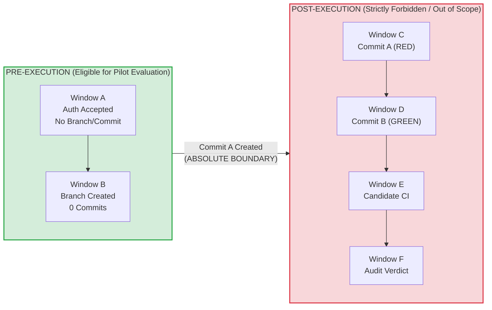
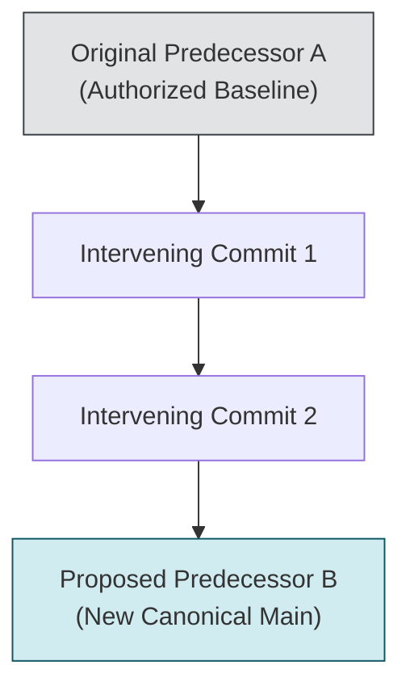
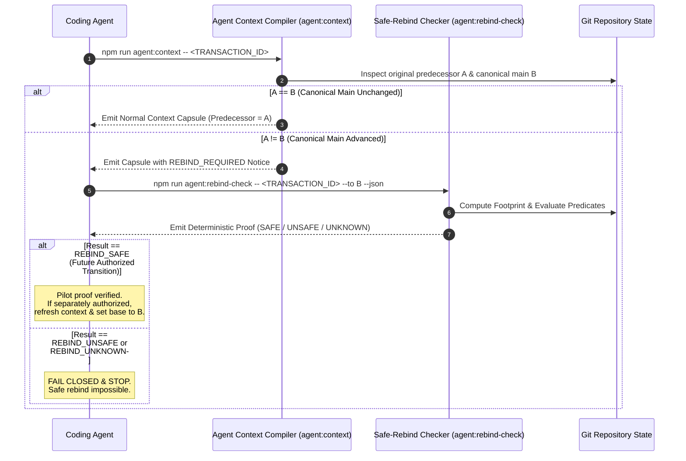
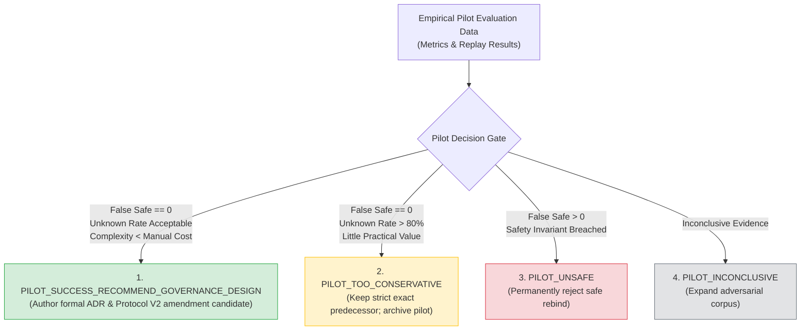

# Read-Only Pre-Execution Safe-Rebind Checker Pilot Specification V1

**Document Class**: `SPECIFICATION`  
**Status**: `PILOT_SPEC_CANDIDATE`  
**Transaction ID**: `AGENT-HARNESS-EXACT-PREDECESSOR-SAFE-REBIND-PILOT-SPEC-001`  
**Canonical Base Predecessor**: `4659fca9f3c5a9bd406280e451252d39a74f69fc`  
**Authority Effect**: `NONE`  
**Current Production Rebind Policy**: `STRICT_EXACT_PREDECESSOR_UNCHANGED`  
**Implementation Authority**: `NOT_GRANTED`  
**Safe-Rebind Execution Authority**: `NOT_GRANTED`  
**Merge Authority**: `NOT_GRANTED`  
**Stage 2 Wave W1**: `NOT_AUTHORIZED`  

---

> [!WARNING]
> ### NON-AUTHORITY & NON-ACTIVATION NOTICE
> - This document is a **TECHNICAL SPECIFICATION ONLY** for a future read-only pilot checker.
> - It does **NOT** modify repository predecessor policy, amend `AGENTS.md`, or modify `EXECUTION_PROMPT_PROTOCOL_V2.md`.
> - It does **NOT** grant authority to implement the checker, execute safe rebinds, modify Git refs, or implement Wave W1.
> - Current repository production policy remains strictly **`EXACT_PREDECESSOR`**.
> - If any future agent mistakes this document for an effective execution authorization or policy change, it must **FAIL CLOSED AND HALT**.

---

## 1. Executive Summary & Research Lineage

### 1.1 Context and Research Synthesis
Under research transaction `AGENT-HARNESS-EXACT-PREDECESSOR-SAFE-REBIND-RESEARCH-001`, the repository analyzed whether exact predecessor requirements in agent workflows could be safely refreshed to newer canonical `main` commits prior to implementation.

The research established two core conclusions:
1. **Core Verdict**: `ONLY_UNDER_RESTRICTED_CONDITIONS`
2. **Core Recommendation**: `PILOT_PRE_EXECUTION_SAFE_REBIND`

Safe rebind is **strictly impossible** once implementation commits (Commit A / RED) or candidate CI evidence exist. However, in the narrow window **prior to implementation** (Windows A and B), a deterministic, read-only compatibility checker can evaluate whether an accepted authorization's semantic assumptions remain intact on a newer canonical `main` head.

### 1.2 Purpose of This Specification
This specification formalizes the normative behavioral contract, footprint model, mathematical ancestry rules, candidate state gates, three-state classification semantics, deterministic JSON proof schema, CLI interface, adversarial test matrix, and success metrics for a future **Read-Only Pre-Execution Safe-Rebind Checker Pilot** (`PRE_EXECUTION_REBIND_V0`).

### 1.3 Role Boundaries
$$\text{RESEARCH} \neq \text{SPECIFICATION} \neq \text{AUTHORIZATION} \neq \text{IMPLEMENTATION} \neq \text{EVIDENCE} \neq \text{INDEPENDENT ACCEPTANCE} \neq \text{MERGE AUTHORITY}$$

- **Specification Author Role**: Defines bounded, deterministic contracts and proof formats based on accepted research.
- **Explicit Non-Roles**:
  - The Specification Author is **NOT** the checker implementer.
  - The Specification Author is **NOT** a Repository Governor with authority to alter production policy.
  - The Specification Author is **NOT** an Independent Auditor.
  - This document grants **ZERO** execution or merge authority.

### 1.4 Non-Goals
The pilot checker specified herein is a **`READ_ONLY_CLASSIFIER_AND_PROOF_GENERATOR`** only. The checker must **NEVER**:
- `git checkout` another branch or ref;
- `git rebase`, `git cherry-pick`, `git merge`, or `git commit`;
- Move, create, delete, or update any Git ref;
- Write, modify, or delete repository files;
- Open pull requests, post comments, or submit PR reviews;
- Modify authorization manifests or alter canonical status in `docs/IMPLEMENTATION_STATUS.md`;
- Grant execution authority or activate Wave W1;
- Create candidate Commit A or reuse historical RED/GREEN CI.

---

## 2. Rebind Lifecycle Windows & Boundary Rules

### 2.1 Formal Rebind Lifecycle Windows
The candidate lifecycle is partitioned into six mutually exclusive sequential windows:

| Lifecycle Window | Definition | Candidate State | Rebind Status | Rationale |
|---|---|---|---|---|
| **Window A** | Authorization accepted on `main`; no implementation branch or commit created. | `commit_count == 0` | **`CONDITIONALLY_SAFE`** | Pure pre-execution state. No code or evidence exists to invalidate. |
| **Window B** | Implementation branch created from base; zero candidate commits; no Commit A. | `commit_count == 0` | **`CONDITIONALLY_SAFE`** | Pure pre-execution state. Branch ref is identical to base ref. |
| **Window C** | Candidate Commit A (RED test-first) exists. | `commit_count >= 1` | **`FORBIDDEN`** | Natural product-defect RED test was authored against base $A$. Rebinding to $B$ invalidates RED provenance. |
| **Window D** | Candidate Commit B (GREEN implementation) exists. | `commit_count >= 2` | **`FORBIDDEN`** | Implementation code and diffs are bound to base $A$. |
| **Window E** | Candidate exact-head CI execution exists. | CI triggered/passed | **`FORBIDDEN`** | CI runs on exact commit SHA topology $(A \to \text{HEAD})$. Rebinding destroys CI validity. |
| **Window F** | Independent implementation audit verdict exists. | `ACCEPT` / `REJECT` / `BLOCKED` | **`FORBIDDEN`** | Verdict is cryptographically and topologically bound to candidate HEAD. |



### 2.2 Absolute Post-Commit-A Boundary
The instant Commit A is materialized, safe rebind evaluation is **PERMANENTLY OUT OF SCOPE**.

If a rebind is attempted in Windows C through F:
- The checker must immediately return **`REBIND_UNSAFE_FOR_PRE_EXECUTION_REBIND`** (reason code: `COMMIT_A_EXISTS` or `CANDIDATE_COMMIT_EXISTS`).
- Any future recovery on a new canonical base requires **clean rematerialization from scratch** with fresh RED test provenance under a separately authorized transaction.

---

## 3. Terminology: Original vs Proposed Predecessors

To eliminate ambiguity and prevent authority laundering, the following terms are frozen:

### 3.1 Definitions
1. **`original_authorized_predecessor` ($A$)**:
   - The immutable Git commit SHA against which the authorization manifest was authored, audited, and accepted.
   - Remains permanently recorded in the authorization manifest as historical provenance.
2. **`proposed_effective_execution_predecessor` ($B$)**:
   - The newer canonical `origin/main` Git commit SHA being evaluated as a candidate base for pre-execution refresh.
   - Exists only as a checker target during pilot evaluation.

### 3.2 Non-Aliasing Invariant
$$\text{original\_authorized\_predecessor} \neq \text{proposed\_effective\_execution\_predecessor}$$

These fields must **NEVER** be aliased, overwritten, or substituted in repository records.

### 3.3 Semantic Limitation of Pilot Output
Even if the checker yields `REBIND_SAFE`, the output means **ONLY**:
$$\text{"Candidate base } B \text{ satisfies all conservative pilot compatibility predicates with respect to authorization } A\text{"}$$

It does **NOT** mean:
$$\text{"Execution is now authorized against } B\text{"}$$

Execution authority against $B$ requires a separate, explicit governance transition.

---

## 4. Git Topology & Ancestry Contract

### 4.1 Mathematical Topology Predicates
Given original predecessor $A$ and proposed predecessor $B$:

$$\text{AncestryPredicate}(A, B) = (\text{merge-base}(A, B) == A) \land (A \in \text{Ancestors}(B))$$



### 4.2 Ancestry Classification Rules
1. **Identity Case ($A == B$)**:
   - Classification: **`REBIND_NOT_REQUIRED`**
   - Meaning: Canonical `main` has not advanced. Base is fresh.
2. **Strict Descendant Case ($A \neq B \land \text{merge-base}(A, B) == A$)**:
   - Action: Proceed to Pilot Assumption Footprint and Candidate State evaluation.
3. **Non-Descendant / Divergent Case ($\text{merge-base}(A, B) \neq A$)**:
   - Classification: **`REBIND_UNSAFE`**
   - Reason Code: `NON_DESCENDANT_BASE`
   - Rationale: $B$ does not contain $A$ in its direct ancestry line (e.g. force-push, history rewrite, or divergent branch). Compatibility cannot be established.
4. **Git Object Unavailable / Ambiguous Topology**:
   - Classification: **`REBIND_UNKNOWN`**
   - Reason Code: `GIT_OBJECT_UNAVAILABLE`
   - Rationale: Missing repository history fails closed.

---

## 5. Pilot Assumption Footprint Model (`PRE_EXECUTION_REBIND_V0`)

### 5.1 Footprint Mathematical Formulation
The **Rebind Assumption Footprint** is the closed set of all repository objects, paths, configurations, and contracts upon which the authorized transaction depends:

$$\begin{aligned}
\text{REBIND\_ASSUMPTION\_FOOTPRINT} = \;
& \text{AUTHORITY\_FOOTPRINT} \\
& \cup \text{WRITE\_FOOTPRINT} \\
& \cup \text{REQUIRED\_READ\_FOOTPRINT} \\
& \cup \text{TEST\_FOOTPRINT} \\
& \cup \text{RUNTIME\_DEPENDENCY\_FOOTPRINT} \\
& \cup \text{BUILD\_CI\_FOOTPRINT} \\
& \cup \text{DATA\_SCHEMA\_FOOTPRINT} \\
& \cup \text{PREDECESSOR\_CONTRACT\_FOOTPRINT} \\
& \cup \text{CONTEXT\_INTERPRETATION\_FOOTPRINT}
\end{aligned}$$

### 5.2 Footprint Categories Ledger

| Footprint Category | Definition & Scope | Resolution Method | Identity Requirement | Failure Classification |
|---|---|---|---|---|
| **1. AUTHORITY_FOOTPRINT** | Authorization manifest, accepted blob SHA, acceptance anchor commit, controlling Protocol & ADRs, canonical status facts. | Parsed from manifest header, `docs/authorizations/`, `docs/DECISIONS.md`, and `docs/IMPLEMENTATION_STATUS.md`. | Blob SHA immutable from acceptance anchor through $B$. | Modified $\to$ `REBIND_UNSAFE`<br/>Ambiguous $\to$ `REBIND_UNKNOWN` |
| **2. WRITE_FOOTPRINT** | Exact file paths authorized for modification in candidate transaction. | Closed allowlist extracted from manifest `EXACT_WRITE_ALLOWLIST`. | Path identity preserved; no adds, edits, deletes, or renames in range $(A \dots B]$. | Modified $\to$ `REBIND_UNSAFE`<br/>Rename Ambiguity $\to$ `REBIND_UNKNOWN` |
| **3. REQUIRED_READ_FOOTPRINT** | Canonical documents, domain models, and specs required to be read by the transaction. | Manifest `READ_ALLOWLIST` or controlling strategy references. | Content hash stability in range $(A \dots B]$. | Modified $\to$ `REBIND_UNSAFE`<br/>Unresolved $\to$ `REBIND_UNKNOWN` |
| **4. TEST_FOOTPRINT** | Target test suites, unit tests, browser harnesses, test helpers, and test fixtures. | Manifest `VERIFICATION` section + static imports from test files. | Zero diff across all test files, helpers, fixtures, and harnesses in $(A \dots B]$. | Modified $\to$ `REBIND_UNSAFE`<br/>Incomplete Graph $\to$ `REBIND_UNKNOWN` |
| **5. RUNTIME_DEPENDENCY_FOOTPRINT** | Transitive runtime modules, shared libraries, and static assets imported by write/test files. | Conservative static AST import traversal (ES module `import` / `export`). | Zero diff across all resolved runtime dependencies in $(A \dots B]$. | Modified $\to$ `REBIND_UNSAFE`<br/>Dynamic Import / Unresolved $\to$ `REBIND_UNKNOWN` |
| **6. BUILD_CI_FOOTPRINT** | Build configs, package manifests, lockfiles, verification scripts, CI workflows. | Fixed set: `package.json`, `package-lock.json`, `scripts/**`, `.github/workflows/ci.yml`. | Exact byte equality across build and CI files in $(A \dots B]$. | Modified $\to$ `REBIND_UNSAFE` |
| **7. DATA_SCHEMA_FOOTPRINT** | Database version constants, migration files, migration ledger, backup registry, restore schemas. | `src/*persistence*.js`, `src/*migration*.js`, `src/backup-registry.js`, tests. (Explicitly `EMPTY` for non-persistence transactions). | Exact equality of database versions, migration tables, and backup registry contracts in $(A \dots B]$. | Modified $\to$ `REBIND_UNSAFE` |
| **8. PREDECESSOR_CONTRACT_FOOTPRINT** | Public contracts or artifacts from upstream packages/waves upon which this transaction depends. | Declared upstream package dependencies from manifest; `NONE` if root package. | Upstream contracts and status remain identical in $(A \dots B]$. | Modified $\to$ `REBIND_UNSAFE`<br/>Ambiguous $\to$ `REBIND_UNKNOWN` |
| **9. CONTEXT_INTERPRETATION_FOOTPRINT** | Compiler, parsers, and governance tools used to extract context. | `scripts/agent-context.mjs`, AST parser tools. | Parser and context compiler logic unchanged in $(A \dots B]$. | Modified $\to$ `REBIND_UNSAFE` |

---

## 6. Conservative V0 Decision Rules

### 6.1 Strict Conservatism Principle
Pilot V0 is **NOT a semantic AI equivalence checker**. It does not perform heuristic reasoning to guess whether an intervening change is "harmless".

### 6.2 Decision Predicates
For any intervening commit $C \in (A \dots B]$:

1. **Footprint Change Rule**:
   $$\text{If } \exists p \in \text{REBIND\_ASSUMPTION\_FOOTPRINT} \text{ such that } \text{blob}(p, A) \neq \text{blob}(p, B) \implies \mathbf{REBIND\_UNSAFE}$$
2. **Incompleteness / Ambiguity Rule**:
   $$\text{If } \text{FootprintCompleteness}(A, B) == \text{FALSE} \lor \text{HasUnresolvedEdges} == \text{TRUE} \implies \mathbf{REBIND\_UNKNOWN}$$
3. **Safe Evaluation Rule**:
   $$\text{REBIND\_SAFE} \iff \text{All SAFE Predicates Positively Proved} \land \text{No UNSAFE} \land \text{No UNKNOWN}$$

### 6.3 Non-Sufficiency of Path Disjointness
$$\Delta(A, B) \cap \text{EXACT\_WRITE\_ALLOWLIST} = \emptyset \centernot\implies \text{REBIND\_SAFE}$$

Path disjointness alone is **NOT** a safety proof. An intervening commit modifying a test helper, a shared runtime dependency, a build script, or a schema migration may completely break the authorized transaction even if the transaction's write allowlist files were untouched.

---

## 7. Deep Footprint Specifications

### 7.1 Authority Footprint & Acceptance Anchoring
An authorization manifest may be authored at commit $A$, but integrated into `main` at a later commit $K \in [A \dots B]$ (the **Authorization Acceptance Anchor**).

- **Authority Invariant**: The checker must verify that the accepted authorization manifest blob SHA at anchor $K$ is identical to the blob SHA at $B$:
  $$\text{blob}(\text{manifest}, K) == \text{blob}(\text{manifest}, B)$$
- It is **NOT** required that the manifest existed at $A$ (since $A$ may predate manifest integration), but from anchor $K$ onward, authority must be 100% stable.

### 7.2 Write Footprint & Rename Awareness
The Write Footprint must track Git tree mutations across $(A \dots B]$:
- `add`: Path added in $(A \dots B]$ matching allowlist $\to$ `REBIND_UNSAFE` (`WRITE_FOOTPRINT_CHANGED`).
- `modify`: Path modified in $(A \dots B]$ matching allowlist $\to$ `REBIND_UNSAFE` (`WRITE_FOOTPRINT_CHANGED`).
- `delete`: Path deleted in $(A \dots B]$ matching allowlist $\to$ `REBIND_UNSAFE` (`WRITE_FOOTPRINT_CHANGED`).
- `rename`: Path renamed in $(A \dots B]$ involving allowlist $\to$ `REBIND_UNSAFE` (`WRITE_FOOTPRINT_CHANGED`).
- `ambiguous_rename`: Similarity index below 100% or ambiguous copy $\to$ `REBIND_UNKNOWN` (`FOOTPRINT_INCOMPLETE`).

### 7.3 Test Footprint & Harness Integrity
The Test Footprint includes:
- All test files declared in the manifest `VERIFICATION` section;
- All local modules imported by those test files (helpers, mocks, assertion utilities);
- All static test fixtures and JSON datasets loaded by those tests;
- Browser smoke test runners (`scripts/*smoke*.mjs`) and harness configs (`tests/browser-harness.test.mjs`).

Any modification to any of these objects in $(A \dots B]$ yields `REBIND_UNSAFE` (`TEST_FOOTPRINT_CHANGED`).

### 7.4 RED Contract Viability Preflight
A critical danger of rebasing or refreshing a base is **RED contract pre-satisfaction**: an intervening commit in $(A \dots B]$ may accidentally implement, mask, or satisfy the missing behavior that the transaction was authorized to build.

- **Preflight Requirement**: Before declaring `REBIND_SAFE`, the checker must evaluate all machine-evaluable RED predicates defined in the authorization manifest against base $B$.
- **Predicates Check**:
  $$\forall p \in \text{RED\_PREDICATES}, \quad \text{Evaluate}(p, B) == \text{UNSATISFIED}$$
- If any RED predicate evaluates to `SATISFIED` at base $B$:
  - Classification: **`REBIND_UNSAFE`**
  - Reason Code: `RED_PREDICATE_PRE_SATISFIED`
  - Rationale: The test-first contract is compromised. Natural RED-GREEN lifecycle cannot proceed.
- If any RED predicate cannot be evaluated deterministically (e.g. requires unmaterialized candidate code):
  - Classification: **`REBIND_UNKNOWN`**
  - Reason Code: `RED_PREDICATE_UNKNOWN`

### 7.5 Runtime Dependency Footprint & AST Traversal
1. **Static AST Import Extraction**:
   - The checker performs recursive static analysis on all files in the Write Footprint and Test Footprint.
   - Extracts all ES Module `import` statements, `export ... from` statements, and static `require` calls.
2. **Unresolved Edges**:
   - Dynamic path construction (e.g. `import(\`./locales/${lang}.js\`)`);
   - Non-analyzable global window properties;
   - Generated assets.
3. **Fail-Closed on Unresolved Edges**:
   - If static analysis encounters any unresolvable dynamic import or unknown dependency edge:
     $$\text{HasUnresolvedEdges} = \text{TRUE} \implies \mathbf{REBIND\_UNKNOWN} \; (\texttt{RUNTIME\_DEPENDENCY\_UNRESOLVED})$$

### 7.6 Build / CI Footprint
The Build/CI footprint binds repository integrity infrastructure:
- `package.json` (dependencies, devDependencies, scripts, engines);
- `package-lock.json` (exact resolved dependency graph);
- `scripts/build.mjs`, `scripts/check.mjs`, `scripts/phase0-gate.mjs`;
- `.github/workflows/ci.yml` (active CI workflow definition).

Any modification in $(A \dots B]$ yields `REBIND_UNSAFE` (`BUILD_CI_CHANGED`).

### 7.7 Data / Schema Footprint
For persistence-affecting transactions:
- Includes database version constants (e.g. `IELTS_DB_VERSION`, `CORE_DB_VERSION`), schema declarations, migration ledger files (`tests/migration-ledger.test.mjs`), `src/backup-registry.js`, and restore handlers.
- Non-persistence transactions: Footprint is explicitly declared `EMPTY` after validating that the transaction manifest touches zero persistence paths.
- Any modification in $(A \dots B]$ yields `REBIND_UNSAFE` (`DATA_SCHEMA_CHANGED`).

---

## 8. Candidate State Gate & Anti-Laundering

### 8.1 Machine-Verifiable Candidate State Predicates
The checker inspects raw Git state, PR commit listings, and CI logs to prove candidate state:

```
candidate_commit_count                       == 0
commit_a_exists                             == false
green_candidate_exists                      == false
candidate_ci_exists                         == false
independent_implementation_verdict_exists   == false
historical_rejected_candidate_reuse_required == false
```

If any candidate state predicate is violated:
- Classification: **`REBIND_UNSAFE`**
- Reason Code: `COMMIT_A_EXISTS`, `CANDIDATE_COMMIT_EXISTS`, `CANDIDATE_CI_EXISTS`, or `INDEPENDENT_VERDICT_EXISTS`.

### 8.2 Anti-Laundering Invariants
The checker and pilot framework strictly prohibit:
1. **No Historical Candidate Reuse**: Reusing commit SHAs, patches, or diffs from previously rejected PRs;
2. **No Ref Rebasing**: Running `git rebase` on an existing candidate branch;
3. **No Cherry-Picking**: Cherry-picking commits across branches;
4. **No Patch Equivalence Laundering**: Treating textual patch identity as proof of valid provenance;
5. **No Stale Evidence Reuse**: Reusing historical RED test runs, GREEN CI runs, or audit verdicts across different base commits.

---

## 9. Three-State Classification Semantics

### 9.1 Semantic State Definitions

| Classification | Strict Formal Definition | Action / Outcome |
|---|---|---|
| **`REBIND_SAFE`** | Every mandatory precondition, footprint completeness check, ancestry check, candidate state check, and RED viability check is **positively proved**. | Bounded pre-execution compatibility established. (Does NOT authorize execution without separate governance transition). |
| **`REBIND_UNSAFE`** | A deterministic incompatibility is **positively proved** (e.g. footprint overlap, schema change, pre-satisfied RED, non-descendant base, Commit A exists). | **STOP Execution**. Transaction cannot be safely rebound. Must rematerialize or re-authorize. |
| **`REBIND_UNKNOWN`** | Footprint completeness, dependency resolution, RED evaluation, or Git state is **incomplete, ambiguous, or unverifiable**. | **STOP Execution**. Fail-closed. Treat with same finality as UNSAFE. |
| **`REBIND_NOT_REQUIRED`** | $A == B$ (Base has not advanced). | Proceed with standard exact-predecessor execution on $A$. |

### 9.2 Invariant: `REBIND_UNKNOWN -> STOP`
- Zero probability scores or confidence intervals are permitted.
- No LLM heuristic reasoning may override `REBIND_UNKNOWN`.
- `REBIND_UNKNOWN` is a safe, fail-closed terminal classification.

---

## 10. Deterministic Versioned Proof Schema

The checker must emit a byte-reproducible, deterministic JSON audit proof conforming to this schema.

### 10.1 JSON Schema Specification (`safe-rebind-proof-v1.json`)

```json
{
  "$schema": "https://json-schema.org/draft/2020-12/schema",
  "title": "ExactPredecessorSafeRebindProofV1",
  "type": "object",
  "required": [
    "proof_schema_version",
    "compatibility_predicate_version",
    "checker_source_identity",
    "transaction_id",
    "rebind_id",
    "original_authorized_predecessor_sha",
    "authorization_acceptance_anchor_sha",
    "accepted_authorization_blob_sha",
    "canonical_main_observed_sha",
    "proposed_effective_execution_predecessor_sha",
    "merge_base_sha",
    "is_descendant",
    "intervening_commits",
    "intervening_path_changes",
    "footprint_definition",
    "footprint_digest",
    "footprint_completeness",
    "authority_blobs",
    "write_footprint",
    "required_read_footprint",
    "required_test_footprint",
    "runtime_dependency_footprint",
    "build_ci_footprint",
    "data_schema_footprint",
    "predecessor_contract_footprint",
    "context_interpretation_footprint",
    "runtime_dependency_unresolved_edges",
    "candidate_state",
    "red_predicate_results",
    "compatibility_predicates",
    "reason_codes",
    "result",
    "proof_digest"
  ],
  "properties": {
    "proof_schema_version": { "type": "string", "enum": ["1.0.0"] },
    "compatibility_predicate_version": { "type": "string", "enum": ["PRE_EXECUTION_REBIND_V0"] },
    "checker_source_identity": { "type": "string" },
    "transaction_id": { "type": "string" },
    "rebind_id": { "type": "string" },
    "original_authorized_predecessor_sha": { "type": "string", "pattern": "^[0-9a-f]{40}$" },
    "authorization_acceptance_anchor_sha": { "type": "string", "pattern": "^[0-9a-f]{40}$" },
    "accepted_authorization_blob_sha": { "type": "string", "pattern": "^[0-9a-f]{40}$" },
    "canonical_main_observed_sha": { "type": "string", "pattern": "^[0-9a-f]{40}$" },
    "proposed_effective_execution_predecessor_sha": { "type": "string", "pattern": "^[0-9a-f]{40}$" },
    "merge_base_sha": { "type": "string", "pattern": "^[0-9a-f]{40}$" },
    "is_descendant": { "type": "boolean" },
    "intervening_commits": {
      "type": "array",
      "items": {
        "type": "object",
        "required": ["sha", "parents", "summary"],
        "properties": {
          "sha": { "type": "string", "pattern": "^[0-9a-f]{40}$" },
          "parents": { "type": "array", "items": { "type": "string", "pattern": "^[0-9a-f]{40}$" } },
          "summary": { "type": "string" }
        }
      }
    },
    "intervening_path_changes": {
      "type": "array",
      "items": {
        "type": "object",
        "required": ["path", "status"],
        "properties": {
          "path": { "type": "string" },
          "status": { "type": "string", "enum": ["A", "M", "D", "R", "C", "U"] },
          "old_path": { "type": "string" }
        }
      }
    },
    "footprint_definition": { "type": "string" },
    "footprint_digest": { "type": "string", "pattern": "^[0-9a-f]{64}$" },
    "footprint_completeness": { "type": "boolean" },
    "authority_blobs": { "type": "object", "additionalProperties": { "type": "string", "pattern": "^[0-9a-f]{40}$" } },
    "write_footprint": { "type": "array", "items": { "type": "string" } },
    "required_read_footprint": { "type": "array", "items": { "type": "string" } },
    "required_test_footprint": { "type": "array", "items": { "type": "string" } },
    "runtime_dependency_footprint": { "type": "array", "items": { "type": "string" } },
    "build_ci_footprint": { "type": "array", "items": { "type": "string" } },
    "data_schema_footprint": { "type": "array", "items": { "type": "string" } },
    "predecessor_contract_footprint": { "type": "array", "items": { "type": "string" } },
    "context_interpretation_footprint": { "type": "array", "items": { "type": "string" } },
    "runtime_dependency_unresolved_edges": { "type": "array", "items": { "type": "string" } },
    "candidate_state": {
      "type": "object",
      "required": [
        "candidate_commit_count",
        "commit_a_exists",
        "green_candidate_exists",
        "candidate_ci_exists",
        "independent_implementation_verdict_exists",
        "historical_rejected_candidate_reuse_required"
      ],
      "properties": {
        "candidate_commit_count": { "type": "integer" },
        "commit_a_exists": { "type": "boolean" },
        "green_candidate_exists": { "type": "boolean" },
        "candidate_ci_exists": { "type": "boolean" },
        "independent_implementation_verdict_exists": { "type": "boolean" },
        "historical_rejected_candidate_reuse_required": { "type": "boolean" }
      }
    },
    "red_predicate_results": {
      "type": "array",
      "items": {
        "type": "object",
        "required": ["predicate_id", "status", "detail"],
        "properties": {
          "predicate_id": { "type": "string" },
          "status": { "type": "string", "enum": ["UNSATISFIED", "SATISFIED", "UNKNOWN", "NOT_EVALUATED"] },
          "detail": { "type": "string" }
        }
      }
    },
    "compatibility_predicates": {
      "type": "object",
      "additionalProperties": { "type": "boolean" }
    },
    "reason_codes": {
      "type": "array",
      "items": { "type": "string" }
    },
    "result": {
      "type": "string",
      "enum": [
        "REBIND_SAFE",
        "REBIND_UNSAFE",
        "REBIND_UNKNOWN",
        "REBIND_NOT_REQUIRED"
      ]
    },
    "proof_digest": { "type": "string", "pattern": "^[0-9a-f]{64}$" }
  },
  "additionalProperties": false
}
```

### 10.2 Field Specifications Ledger

| Field | Type | Canonicalization Rule | Required/Optional | Failure Behavior |
|---|---|---|---|---|
| `proof_schema_version` | String | Fixed `"1.0.0"` | Required | Fail closed if unsupported |
| `compatibility_predicate_version` | String | Fixed `"PRE_EXECUTION_REBIND_V0"` | Required | Fail closed if unsupported |
| `checker_source_identity` | String | Git commit SHA or version of checker script | Required | Fail closed if empty |
| `transaction_id` | String | Uppercase transaction ID string | Required | Fail closed if missing |
| `rebind_id` | String | Unique evaluation ID `REBIND-<SHA_A_8>-<SHA_B_8>` | Required | Deterministic format |
| `original_authorized_predecessor_sha` | String (40-hex) | Lowercase 40-char SHA | Required | Fail closed if invalid |
| `authorization_acceptance_anchor_sha` | String (40-hex) | Lowercase 40-char SHA | Required | Fail closed if invalid |
| `accepted_authorization_blob_sha` | String (40-hex) | Lowercase 40-char SHA | Required | Fail closed if invalid |
| `canonical_main_observed_sha` | String (40-hex) | Lowercase 40-char SHA | Required | Fail closed if invalid |
| `proposed_effective_execution_predecessor_sha` | String (40-hex) | Lowercase 40-char SHA | Required | Fail closed if invalid |
| `merge_base_sha` | String (40-hex) | Lowercase 40-char SHA | Required | Fail closed if invalid |
| `is_descendant` | Boolean | Exact boolean evaluation | Required | `false` $\to$ UNSAFE |
| `intervening_commits` | Array | Chronological order $(A \dots B]$ | Required | Empty if $A == B$ |
| `intervening_path_changes` | Array | Lexicographically sorted by `path` | Required | Empty if $A == B$ |
| `footprint_definition` | String | Normalized string formula | Required | Fail closed if altered |
| `footprint_digest` | String (64-hex) | SHA-256 over normalized footprint array | Required | Fail closed if mismatch |
| `footprint_completeness` | Boolean | True iff all 9 categories fully resolved | Required | `false` $\to$ UNKNOWN |
| `write_footprint` | Array of Strings | POSIX relative paths, sorted lexicographically | Required | Empty $\to$ invalid manifest |
| `red_predicate_results` | Array | Sorted by `predicate_id` | Required | Any SATISFIED $\to$ UNSAFE |
| `result` | Enum | Exact 4-state enum string | Required | Must match predicates |
| `proof_digest` | String (64-hex) | SHA-256 over canonical JSON excluding `proof_digest` | Required | Mismatch $\to$ invalid proof |

---

## 11. Deterministic Serialization & Canonical Digest Calculation

### 11.1 Canonical Serialization Rules
To ensure that two independent checker runs on the exact same repository state produce byte-identical JSON proofs:
1. **Key Ordering**: All JSON object keys must be serialized in strictly ascending lexicographical ASCII order at every nesting level.
2. **Array Ordering**: All arrays representing sets (paths, reason codes, dependencies) must be deduplicated and sorted in lexicographical ASCII order. Array of commits must be in strictly linear ancestry order $(A \dots B]$.
3. **Path Normalization**: All file paths must be repository-relative, POSIX-style (forward slashes `/`), without leading `./` or trailing `/`. Machine-local absolute paths are **strictly forbidden**.
4. **Encoding**: Character encoding is strictly UTF-8 without Byte Order Mark (BOM). Newlines are LF (`\n`).
5. **No Dynamic Timestamps in Digest Payload**: Evaluation timestamps, execution durations, or process IDs must **NOT** participate in the canonical digest calculation.
6. **Hex Representation**: All Git SHAs must be 40-character lowercase hex strings. All SHA-256 digests must be 64-character lowercase hex strings.

### 11.2 Proof Digest Computation
$$\text{CanonicalJSON} = \text{SerializeCanonical}(\text{ProofPayload} \setminus \{ \text{"proof\_digest"} \})$$
$$\text{proof\_digest} = \text{SHA256}(\text{CanonicalJSON})$$

---

## 12. Standardized Reason Code Taxonomy

| Reason Code | Classification Category | Trigger Condition / Description |
|---|---|---|
| **`REBIND_NOT_REQUIRED`** | NON-REBIND | $A == B$. Canonical base has not advanced. |
| **`NON_DESCENDANT_BASE`** | UNSAFE | $\text{merge-base}(A, B) \neq A$. $B$ is not a direct descendant of $A$. |
| **`AUTHORITY_CHANGED`** | UNSAFE | Authorization manifest blob SHA changed between acceptance anchor and $B$. |
| **`AUTHORITY_AMBIGUOUS`** | UNKNOWN | Authorization manifest missing, unreadable, or contains conflicting schemas. |
| **`WRITE_FOOTPRINT_CHANGED`** | UNSAFE | One or more files in `EXACT_WRITE_ALLOWLIST` were modified in $(A \dots B]$. |
| **`TEST_FOOTPRINT_CHANGED`** | UNSAFE | Target tests, test helpers, fixtures, or browser smoke harnesses were modified in $(A \dots B]$. |
| **`RUNTIME_DEPENDENCY_CHANGED`** | UNSAFE | Static imports/dependencies of write/test files were modified in $(A \dots B]$. |
| **`RUNTIME_DEPENDENCY_UNRESOLVED`** | UNKNOWN | Dynamic import, non-analyzable path, or external module dependency encountered. |
| **`BUILD_CI_CHANGED`** | UNSAFE | `package.json`, lockfile, build scripts, or `.github/workflows/ci.yml` modified in $(A \dots B]$. |
| **`DATA_SCHEMA_CHANGED`** | UNSAFE | Database version constants, migration ledgers, or backup schemas modified in $(A \dots B]$. |
| **`PREDECESSOR_CONTRACT_CHANGED`** | UNSAFE | Upstream package contract or accepted output modified in $(A \dots B]$. |
| **`CONTEXT_INTERPRETER_CHANGED`** | UNSAFE | Context compiler (`scripts/agent-context.mjs`) logic modified in $(A \dots B]$. |
| **`RED_PREDICATE_PRE_SATISFIED`** | UNSAFE | An authorized missing-behavior predicate already evaluates to SATISFIED at base $B$. |
| **`RED_PREDICATE_UNKNOWN`** | UNKNOWN | RED predicate cannot be evaluated deterministically prior to implementation. |
| **`CANDIDATE_COMMIT_EXISTS`** | UNSAFE | Candidate branch contains 1 or more commits ($>\text{Window B}$). |
| **`COMMIT_A_EXISTS`** | UNSAFE | Commit A (RED) already materialized. Pre-execution rebind permanently out of scope. |
| **`CANDIDATE_CI_EXISTS`** | UNSAFE | CI workflow has already executed on candidate branch commits. |
| **`INDEPENDENT_VERDICT_EXISTS`** | UNSAFE | Formal audit verdict already rendered on candidate branch. |
| **`HISTORICAL_CANDIDATE_REUSE_REQUIRED`** | UNSAFE | Transaction attempts to reuse, rebase, or cherry-pick historical rejected candidate commits. |
| **`FOOTPRINT_INCOMPLETE`** | UNKNOWN | Dependency graph, rename tracking, or schema analysis could not be proven 100% complete. |
| **`GIT_OBJECT_UNAVAILABLE`** | UNKNOWN | Git object, tree, or commit history missing from local repository. |

---

## 13. Proposed Future CLI Contract (Interface Specification Only)

> [!IMPORTANT]
> **INTERFACE SPECIFICATION ONLY**: This section defines the expected future CLI interface for design clarity. It does **NOT** authorize adding scripts to `package.json` or creating implementation code during this transaction.

### 13.1 Proposed Command Signatures
```bash
# Human-readable diagnostic output
npm run agent:rebind-check -- <TRANSACTION_ID> --to <PROPOSED_CANONICAL_SHA>

# Machine-readable deterministic JSON proof output
npm run agent:rebind-check -- <TRANSACTION_ID> --to <PROPOSED_CANONICAL_SHA> --json
```

### 13.2 Exit Semantics
- **Exit Code `0`**: The checker successfully completed evaluation and emitted a deterministic, schema-valid proof (regardless of whether the classification is `REBIND_SAFE`, `REBIND_UNSAFE`, `REBIND_UNKNOWN`, or `REBIND_NOT_REQUIRED`).
- **Exit Code Non-Zero (`1`, `2`, ...)`**: The checker crashed, encountered an unhandled exception, failed argument parsing, or was unable to generate a valid proof object.
- **Rule**: Shell exit code 0 does **NOT** mean SAFE. The JSON `result` field is the sole authoritative classification.

---

## 14. Proposed Agent Context Compiler Interaction



---

## 15. Historical Replay Benchmark: Wave W0 Lineage

### 15.1 Replay Scenario Description
The pilot must replay the historical predecessor reconciliation of Stage 2 Wave W0:
- **Original Authorization Predecessor ($A$)**: `ee7d1b72c46a5e3e8e1411256ac4bd62360bbc54` (PR #88 / manifest authoring).
- **Target Canonical Main ($B$)**: `2812f639a5967e0389b77fdb71be1a0f97b928d4` (PR #91 / post-render-race recovery merge).
- **Intervening Lineage ($A \dots B]$)**: Includes PR #89 (Protocol V2-001 candidate), PR #90 (Incident triage), and PR #91 (Render race recovery remediation touching `src/ielts-hub-v2.js` and `tests/ielts-browser-smoke.mjs`).

### 15.2 Conservative V0 Expected Classification
- **Expected Pilot Result**: **`REBIND_UNKNOWN`** (or `REBIND_UNSAFE`)
- **Reason Code**: `TEST_FOOTPRINT_CHANGED` or `WRITE_FOOTPRINT_CHANGED`
- **Benchmarking Purpose**: In historical reality, an exhaustive manual audit proved that W0 contracts remained compatible after PR #91. However, because PR #91 modified `src/ielts-hub-v2.js` (which was inside W0's Write Footprint), the conservative Pilot V0 checker **must refuse to guess** and must fail closed.
- **Metric Value**: This replay case measures **Conservatism and False-Unsafe Cost**, proving that the checker does not allow false-safe classifications when write files have intervening edits.

---

## 16. Test Corpus & Fixture Specifications

### 16.1 Synthetic / Controlled SAFE Fixture
To verify that the checker is not a trivial rejector (returning UNKNOWN/UNSAFE for everything), the test suite must contain at least one positive SAFE fixture:
- **Scenario**: Predecessor $A \to B$ where intervening commit $C$ modifies only an unrelated markdown file (e.g. `docs/UNRELATED_NOTE.md`) or an out-of-scope fixture.
- **Preconditions**: All 9 footprint categories fully resolved; zero overlap; RED predicates unsatisfied; candidate state clean.
- **Expected Result**: **`REBIND_SAFE`**
- **Reason Code**: `[]` (Empty)

### 16.2 Required UNSAFE Fixture Cases

| Fixture ID | Injected Mutation in $(A \dots B]$ | Target File / State | Expected Result | Expected Reason Code |
|---|---|---|---|---|
| **FIX-UNSAFE-01** | Direct edit to allowed write path | `src/example-domain.js` | `REBIND_UNSAFE` | `WRITE_FOOTPRINT_CHANGED` |
| **FIX-UNSAFE-02** | Direct edit to required test suite | `tests/example.test.mjs` | `REBIND_UNSAFE` | `TEST_FOOTPRINT_CHANGED` |
| **FIX-UNSAFE-03** | Edit to test helper utility | `tests/helpers/setup.js` | `REBIND_UNSAFE` | `TEST_FOOTPRINT_CHANGED` |
| **FIX-UNSAFE-04** | Edit to transitive runtime dependency | `src/shared-util.js` | `REBIND_UNSAFE` | `RUNTIME_DEPENDENCY_CHANGED` |
| **FIX-UNSAFE-05** | Package manifest dependency modified | `package.json` | `REBIND_UNSAFE` | `BUILD_CI_CHANGED` |
| **FIX-UNSAFE-06** | CI workflow configuration modified | `.github/workflows/ci.yml` | `REBIND_UNSAFE` | `BUILD_CI_CHANGED` |
| **FIX-UNSAFE-07** | Database version constant bumped | `IELTS_DB_VERSION` in `src/ielts-persistence.js` | `REBIND_UNSAFE` | `DATA_SCHEMA_CHANGED` |
| **FIX-UNSAFE-08** | Authorization manifest altered on main | `docs/authorizations/MANIFEST.md` | `REBIND_UNSAFE` | `AUTHORITY_CHANGED` |
| **FIX-UNSAFE-09** | Missing behavior pre-satisfied at base B | Feature flag enabled in $B$ | `REBIND_UNSAFE` | `RED_PREDICATE_PRE_SATISFIED` |
| **FIX-UNSAFE-10** | Commit A already exists on branch | Candidate `commit_count == 1` | `REBIND_UNSAFE` | `COMMIT_A_EXISTS` |
| **FIX-UNSAFE-11** | Non-descendant canonical main $B$ | `merge-base(A, B) != A` | `REBIND_UNSAFE` | `NON_DESCENDANT_BASE` |

### 16.3 Required UNKNOWN Fixture Cases

| Fixture ID | Ambiguity / Incompleteness Condition | Root Cause | Expected Result | Expected Reason Code |
|---|---|---|---|---|
| **FIX-UNK-01** | Dynamic module import in write file | `import(\`./plugins/${name}.js\`)` | `REBIND_UNKNOWN` | `RUNTIME_DEPENDENCY_UNRESOLVED` |
| **FIX-UNK-02** | Incomplete dependency graph resolution | Unresolvable external symbol | `REBIND_UNKNOWN` | `FOOTPRINT_INCOMPLETE` |
| **FIX-UNK-03** | Missing Git blob object in local store | Object un-fetched / pruned | `REBIND_UNKNOWN` | `GIT_OBJECT_UNAVAILABLE` |
| **FIX-UNK-04** | Ambiguous rename with $<100\%$ similarity | Git rename heuristic uncertain | `REBIND_UNKNOWN` | `FOOTPRINT_INCOMPLETE` |
| **FIX-UNK-05** | RED predicate evaluation inconclusive | Requires runtime DOM execution | `REBIND_UNKNOWN` | `RED_PREDICATE_UNKNOWN` |
| **FIX-UNK-06** | Authorization manifest schema malformed | Unparseable YAML/Markdown table | `REBIND_UNKNOWN` | `AUTHORITY_AMBIGUOUS` |

---

## 17. Comprehensive Adversarial Test Matrix

Mapping the research report's false-safe failure modes into a rigorous adversarial validation matrix:

| Scenario ID | Attack / Failure Scenario | Naive Classifier Failure Mode | Pilot V0 Expected Result | Detection Predicate | Primary Reason Code |
|---|---|---|---|---|---|
| **ADV-01** | Transitive import modified 3 levels deep from write file | Classifies SAFE because top-level write files were not changed | `REBIND_UNSAFE` | Transitive AST dependency graph diff | `RUNTIME_DEPENDENCY_CHANGED` |
| **ADV-02** | Dynamic runtime import with template literal string | Ignores dynamic import, classifies SAFE | `REBIND_UNKNOWN` | AST parser flags unresolvable dynamic edge | `RUNTIME_DEPENDENCY_UNRESOLVED` |
| **ADV-03** | Transitive dependency bumped in `package.json` | Path disjoint from source, classifies SAFE | `REBIND_UNSAFE` | Build/CI footprint byte diff | `BUILD_CI_CHANGED` |
| **ADV-04** | Package script `npm test` flag altered | Path disjoint from source, classifies SAFE | `REBIND_UNSAFE` | Build/CI footprint byte diff | `BUILD_CI_CHANGED` |
| **ADV-05** | CI workflow Node.js version bumped | Code untouched, classifies SAFE | `REBIND_UNSAFE` | Build/CI footprint byte diff | `BUILD_CI_CHANGED` |
| **ADV-06** | Global CSS class altered affecting UI tests | Scans only `.js` files, classifies SAFE | `REBIND_UNSAFE` | Asset footprint includes declared CSS | `RUNTIME_DEPENDENCY_CHANGED` |
| **ADV-07** | IndexedDB store schema index added in $B$ | Checks only manifest allowlist, misses schema drift | `REBIND_UNSAFE` | Data/schema footprint AST inspection | `DATA_SCHEMA_CHANGED` |
| **ADV-08** | Test helper timeout inflated from 1s to 10s | Treats helper as external, classifies SAFE | `REBIND_UNSAFE` | Test footprint AST dependency graph | `TEST_FOOTPRINT_CHANGED` |
| **ADV-09** | Upstream package acceptance status revoked | Checks Git paths only, misses status ledger | `REBIND_UNSAFE` | Predecessor contract status inspection | `PREDECESSOR_CONTRACT_CHANGED` |
| **ADV-10** | Implicit global window variable added in $B$ | Static analysis misses global coupling | `REBIND_UNKNOWN` | AST parser detects global property write | `FOOTPRINT_INCOMPLETE` |
| **ADV-11** | File renamed and replaced with same name | Textual path equality passes naively | `REBIND_UNSAFE` | Git tree blob SHA comparison | `WRITE_FOOTPRINT_CHANGED` |
| **ADV-12** | Authorization manifest modified on `main` | Assumes original authorization is immutable | `REBIND_UNSAFE` | Manifest blob SHA check vs anchor | `AUTHORITY_CHANGED` |
| **ADV-13** | Context compiler logic modified in $B$ | Misses interpreter drift | `REBIND_UNSAFE` | Context interpreter footprint diff | `CONTEXT_INTERPRETER_CHANGED` |
| **ADV-14** | Missing behavior partially pre-implemented in $B$ | Misses semantic shift, executes invalid RED | `REBIND_UNSAFE` | RED contract preflight evaluation | `RED_PREDICATE_PRE_SATISFIED` |
| **ADV-15** | Historical rejected candidate commit cherry-picked | Treats matching patch as valid provenance | `REBIND_UNSAFE` | Candidate state & provenance gate | `HISTORICAL_CANDIDATE_REUSE_REQUIRED` |

---

## 18. Pilot Success Metrics & Acceptance Criteria

### 18.1 Quantitative Metric Definitions

| Metric Identifier | Mathematical / Empirical Definition | Unit | Target / Acceptance Threshold |
|---|---|---|---|
| `false_safe_count` | Number of cases classified as SAFE that contain semantic incompatibility. | Count | **`EXACTLY 0` (Hard Safety Gate)** |
| `false_unsafe_count` | Number of cases classified as UNSAFE/UNKNOWN that are manually provable compatible. | Count | Unconstrained in V0 (Measured for cost) |
| `rebind_safe_count` | Number of test cases classified as `REBIND_SAFE`. | Count | $>0$ (Must pass controlled SAFE fixtures) |
| `rebind_unsafe_count` | Number of test cases classified as `REBIND_UNSAFE`. | Count | Evaluated against fixture matrix |
| `rebind_unknown_count` | Number of test cases classified as `REBIND_UNKNOWN`. | Count | Evaluated against fixture matrix |
| `unknown_rate` | $\frac{\text{rebind\_unknown\_count}}{\text{total\_evaluations}}$ | Ratio | Tracked for conservatism tuning |
| `checker_runtime_ms` | Execution duration to evaluate and serialize proof. | Milliseconds | $< 3000\text{ms}$ on standard worktree |
| `proof_bytes` | Byte size of emitted canonical JSON proof. | Bytes | Tracked for repository compactness |
| `footprint_resolution_failures` | Count of times static dependency analysis failed. | Count | Monitored for AST parser improvements |
| `time_to_first_RED_saved` | Engineering time saved by avoiding manual re-authorization. | Minutes | Measured in pilot trial |

### 18.2 Hard Pilot Safety Criterion
$$\mathbf{observed\_false\_safe\_count} == 0$$

If a single false-safe classification occurs during adversarial corpus validation, the pilot checker fails acceptance immediately.

---

## 19. Pilot Decision Gate & Governance Transitions

Upon completion of the future pilot implementation and benchmark evaluation, the repository governance will evaluate the empirical data against four formal decision outcomes:



### 19.1 Mandatory Governance Gate Rule
- A `PILOT_SUCCESS` outcome does **NOT** automatically activate safe rebind in production.
- Any change to repository predecessor policy requires a formal, separate **Governance Design $\to$ Authorization $\to$ Independent Audit $\to$ Acceptance** transaction.

---

## 20. Complexity Budget & Economic Justification

The pilot framework must continually evaluate whether automated rebind checking provides genuine engineering value over the current manual predecessor reconciliation process:

$$\text{Checker Value} = (\text{Manual Reconciliation Time Saved} \times \text{Safe Rebind Frequency}) - (\text{Checker Maintenance Cost} + \text{Audit Review Cost})$$

- If the conservative V0 checker returns `REBIND_UNKNOWN` for $>80\%$ of real-world cases, or if auditing the checker's proof requires as much manual effort as re-authorizing the transaction, the repository will choose:
  $$\mathbf{KEEP\_STRICT\_EXACT\_PREDECESSOR}$$
- The pilot is **not required to justify its own continuation**. Strict exact predecessor remains the robust, zero-risk default.

---

## 21. Security, Process Safety & Sandbox Requirements

Any future implementation of the checker must adhere to strict sandbox constraints:
1. **Read-Only Git Operations**: All Git interactions must use read-only subcommands (`rev-parse`, `merge-base`, `cat-file`, `diff-tree`, `hash-object`). Zero ref-modifying commands.
2. **Zero Network Calls**: Evaluation must execute 100% offline from local Git objects. No network requests.
3. **No Shell String Interpolation**: All child process invocations must use argument-array APIs (`execFileSync('git', ['...', '...'])`).
4. **Untrusted Markdown Parsing**: Repository markdown files and commit messages must be treated as untrusted text. No `eval`, no command execution extracted from markdown, no dynamic script execution.
5. **Deterministic File Access**: File reads must be bounded within the repository workspace root.

---

## 22. Specification Audit Checklist

This specification candidate is **`READY_FOR_AUDIT`** when independently verified against this checklist:

- [x] Document prominently declares `SPECIFICATION_ONLY` / `NOT_AUTHORIZATION` / `AUTHORITY_EFFECT: NONE`.
- [x] Current production predecessor policy is explicitly confirmed as `STRICT_EXACT_PREDECESSOR_UNCHANGED`.
- [x] Rebind Lifecycle Windows (A/B vs C-F) and the absolute post-Commit-A boundary are defined.
- [x] `original_authorized_predecessor` and `proposed_effective_execution_predecessor` are strictly non-aliased.
- [x] Three-state semantics (`REBIND_SAFE`, `REBIND_UNSAFE`, `REBIND_UNKNOWN`, and `REBIND_NOT_REQUIRED`) are defined without probability/heuristics.
- [x] Invariant `REBIND_UNKNOWN -> STOP` is normatively enforced.
- [x] Conservative V0 assumption footprint is fully decomposed into 9 distinct categories.
- [x] Path disjointness is explicitly rejected as a sufficient proof of safety.
- [x] RED contract viability preflight is mandatory before declaring SAFE.
- [x] Anti-laundering rules prohibit commit reuse, rebasing, cherry-picking, and stale CI reuse.
- [x] Deterministic JSON proof schema is fully specified with type bindings and canonical digest rules.
- [x] Standardized reason code taxonomy is exhaustively defined.
- [x] W0 historical replay case is specified with conservative `REBIND_UNKNOWN` expected result.
- [x] Controlled SAFE fixture and required UNSAFE/UNKNOWN fixture sets are specified.
- [x] Adversarial test matrix maps 15+ false-safe attack classes.
- [x] Pilot success metrics and decision gates are formally established.
- [x] Zero governance policy modification, zero implementation authority, and zero Wave W1 authorization.

---
