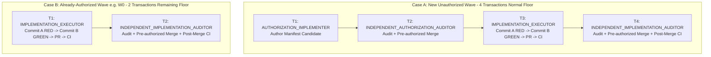

# Execution Prompt Protocol V2 (EXECUTION_PROMPT_PROTOCOL_V2)

**Candidate Status**: `CANDIDATE_UNTIL_ACTIVATION_GATES_SATISFIED`  
**Transaction Identity**: `EXECUTION-PROMPT-PROTOCOL-V2-002`  
**Base Predecessor**: `2812f639a5967e0389b77fdb71be1a0f97b928d4` (Merge PR #91 / `IELTS-HUB-RENDER-RACE-RECOVERY-002`)  
**Decision Record**: ADR-051 in `docs/DECISIONS.md`  
**Related Decision**: ADR-046 (`BOUNDED_EXECUTION_CAPSULE_PROTOCOL_V1`)

---

## 1. Executive Summary & Purpose

The **Execution Prompt Protocol V2** establishes a high-efficiency execution prompting and handoff model for repository governance and technical delivery. It minimizes user prompt count, prompt duplication, and artificial manual handoffs while preserving **100%** of the repository's mandatory quality gates, authority separation, and safety invariants.

### 1.1 Core Principle
$$\text{QUALITY\_GATE\_COUNT} \neq \text{USER\_PROMPT\_COUNT}$$

A deterministic, pre-authorized technical or administrative transition does **NOT** require a fresh user prompt merely because a process phase name changes. An owning transaction continues through authorized deterministic transitions autonomously when:
1. Controlling authority already grants them;
2. No new discretionary decision is required;
3. Evidence can be fresh-verified;
4. No stop condition has fired.

### 1.2 Lineage & Remediation
- **Historical Candidate V2-001** (`PR #89` / commit `3943efc11b57d088b58df3abe0f542d7228df76a`) exposed a pre-existing IELTS Hub async render race product defect under natural CI.
- **Incident Remediation** (`PR #91` / `IELTS-HUB-RENDER-RACE-RECOVERY-002`) independently fixed and canonicalized the render race at commit `2812f639a5967e0389b77fdb71be1a0f97b928d4`.
- **Transaction V2-002** clean-rematerializes Protocol V2 from canonical `main` without reusing invalid history or cherry-picking historical PR commits.

---

## 2. Relationship to Protocol V1 (ADR-046) & Authority Architecture

### 2.1 Relationship to ADR-046
- **ADR-046 (`BOUNDED_EXECUTION_CAPSULE_PROTOCOL_V1`)**: Serves as **BOUNDARY & CAPSULE AUTHORITY**. It governs execution capsule boundaries, authorization manifest schemas, allowlist rules, and independent acceptance mandates. ADR-046 remains canonical and is **NOT** repealed or weakened.
- **`EXECUTION_PROMPT_PROTOCOL_V2` / ADR-051**: Serves as **PROMPTING & HANDOFF PROCEDURE**. It governs transaction prompt architecture, role separation mechanics, handoff elimination, and centralized invariant management.
- Protocol V2 supersedes repetitive prompt and handoff conventions for new transactions upon formal activation.
- Historical manifests authored under Protocol V1 (including `STAGE2-W0-IELTS-ARCH-AUTH-001`) remain **100% valid, canonical, and unmodified**. Protocol V2 does not retroactively reinterpret accepted authorization semantics.

### 2.2 Canonical Document Authority Hierarchy
Repository governance preserves the exact canonical document authority hierarchy defined in `docs/MASTER_ROADMAP.md`:

| Level | Document | Canonical Scope & Ownership |
|---|---|---|
| **Level 1 — Master Product Roadmap** | `docs/MASTER_ROADMAP.md` | Top-level Stage 1–8 product sequencing, Stage missions, ordering, completion state |
| **Level 2 — Technical Package Taxonomy** | `docs/ROADMAP.md` | Phase 0–7 package IDs, technical dependency graph, architecture boundaries, cross-cutting packages |
| **Level 3 — Implementation Specification** | `docs/IMPLEMENTATION_PLAN.md` | Package acceptance criteria, test/migration/rollback/stop conditions |
| **Level 4 — Implementation Status** | `docs/IMPLEMENTATION_STATUS.md` | Actual execution status, evidence, exact commit bindings |
| **Level 5 — Decision Records** | `docs/DECISIONS.md` | Architecture/product rationale and ADRs |
| **Level 6 — Repository Rules** | `AGENTS.md` | Invariant execution rules, evidence policy, Git conventions |

### 2.3 Execution Authority Taxonomy
Execution authority operates across distinct, non-fungible roles governed by the controlling canonical documents:

$$\text{RESEARCH} \neq \text{SPECIFICATION} \neq \text{AUTHORIZATION} \neq \text{IMPLEMENTATION} \neq \text{EVIDENCE} \neq \text{INDEPENDENT ACCEPTANCE} \neq \text{MERGE AUTHORITY}$$

Accepted strategies (e.g. `docs/STAGE2_IELTS_COMPLETENESS_STRATEGY.md`), bounded authorization manifests (e.g. `docs/authorizations/STAGE2-W0-IELTS-ARCH-AUTH-001.md`), implementation evidence, and independent verdicts are **NOT** additional invented roadmap hierarchy levels. They represent discrete execution roles and artifacts that derive authority from and remain strictly subordinate to the canonical document hierarchy above.

---

## 3. Centralized Repository Invariants

Protocol V2 centralizes all mandatory repository invariants so transaction prompts reference them by canonical identity rather than pasting repetitive boilerplate:

### 3.1 Authority Invariants
- **Authority Separation**: Research $\neq$ Specification $\neq$ Authorization $\neq$ Implementation $\neq$ Evidence $\neq$ Independent Acceptance $\neq$ Merge Authority.
- **No Inferred Authority**: Authority cannot be inferred from roadmap placement, PR existence, green CI, or DOM state.
- **Fail-Closed on Gaps**: Missing, stale, or ambiguous authority halts execution immediately.

### 3.2 Git & Topology Invariants
- **Exact Predecessor Binding**: Every candidate branch must branch directly from the exact canonical base commit SHA.
- **Single-Writer Discipline**: Exactly one agent/session writes code or creates commits. Subagents and auditors are read-only.
- **Immutable History**: No `git rebase`, no `git commit --amend`, no force-pushing (`git push --force`), no destructive resets, and no history rewriting.
- **Fail-Closed on Drift**: Any unexpected commit on base or candidate head halts execution (`CANONICAL_BASE_DRIFT`).

### 3.3 Write Scope Invariants
- **Closed Exact Allowlists**: Writes are limited to the exact closed allowlist granted by the controlling accepted authorization/capsule or other explicit canonical transaction authority.
- **Zero Scope Expansion**: No unauthorized dependency modifications (`package.json`), workflow changes (`.github/**`), or unlisted file edits. No inferred write scope is permitted.

### 3.4 RED $\to$ GREEN Invariants
- **Test-First Commit A (RED)**: When required by the controlling authorization, Commit A introduces natural, deterministic test failures directly exercising the specified product defect or requirement.
- **RED Immutability**: RED test blobs are permanently immutable after valid Commit A. Tests cannot be altered, skipped, or quarantine-wrapped to make gates pass.
- **Minimal Commit B (GREEN)**: Commit B contains only the minimal necessary implementation code to satisfy the RED tests.
- **Zero Assertion Weakening**: No assertion edits, timeouts inflated to mask race conditions, or business-logic failures converted into harness skips.

### 3.5 Natural CI & Artifact Invariants
- **Natural Exact-Head CI**: All CI evidence must come from natural pull request or push events running on the exact candidate head SHA. Synthetic triggers (`workflow_dispatch`, close/reopen tricks, rerun substitutions) are forbidden.
- **Dynamic Artifact Verification**: Where the active CI workflow emits verification artifacts, the audit must fresh-resolve the required artifact set from active CI configuration, verify exact SHA bindings, download and inspect logs, and verify hashes/provenance. Hard-coding stale artifact counts is forbidden.

### 3.6 Evidence & Learning Invariants
- **Raw Evidence Authority**: Raw test logs, command outputs, and persistence verification strictly supersede agent assertions or narrative summaries.
- **Evidence Gateway Integrity**: `EvidencePolicy` is the sole gateway turning attempts into review events or schedule mutations. Policy is default-deny.
- **No False Positives**: Unverified sources, revealed answers, retries after reveal, skips, or coaching cannot produce positive independent evidence.

### 3.7 Data Safety, Backup & Migration Invariants
- **100% Store Backup Sentinel**: Every durable store (Core, IELTS, V10, drafts, outbox, settings) must be registered in the backup registry.
- **Forward-Only Schema Migrations**: IndexedDB migrations are strictly additive and forward-compatible; no destructive downgrades.
- **Journaled Restore**: Restore follows stage $\to$ validate whole payload $\to$ journal $\to$ commit/reconcile $\to$ reopen/read-back/verify.

### 3.8 Independent Audit Invariants
- **Absolute Role Separation**: The Implementer/Executor cannot independently audit or accept its own work.
- **Fresh Independent Inspection**: Independent Auditors must fresh-read all diffs, CI runs, logs, and artifacts independently. Green CI $\neq$ ACCEPT.
- **Verdict Persistence**: Formal verdict (`ACCEPT` or `REJECT`) must be persisted to the PR / discussion and read back before any subsequent action.

### 3.9 Conditional Merge Invariants
- **Pre-Authorized Merge Execution**: An Independent Auditor may execute an exact-head merge in the same transaction **ONLY IF** the controlling authorization manifest explicitly pre-authorizes merge upon `ACCEPT`.
- **Pre-Merge Conditions**: Verdict is persisted and read back, candidate head matches accepted SHA, base is unchanged, and mergeability is clean.

### 3.10 Fail-Closed Stop Conditions
Execution halts immediately when any stop condition is triggered:
- `CANONICAL_BASE_DRIFT`: Base commit differs from expected canonical SHA.
- `BRANCH_COLLISION`: Target branch name already exists.
- `AUTHORITY_EXPANSION`: Discretionary decisions attempted outside frozen scope.
- `UNAUTHORIZED_WRITE_ATTEMPT`: Changes proposed outside exact file allowlist.
- `INVALID_RED_CONTRACT`: Commit A passes prematurely or fails unnaturally.
- `NATURAL_CI_NOT_ESTABLISHED`: CI failed, timed out, or ran on incorrect head.
- `PREDECESSOR_MISMATCH`: Chain of custody or commit predecessor broken.

---

## 4. Minimum Normal Happy-Path Model

The protocol defines the **Minimum Normal Happy-Path Execution Floor**. Additional transactions occur only when legitimate non-happy-path conditions arise (e.g. `REJECT`, `BLOCKED`, CI incident, authority gap).



### 4.1 CASE A — No Accepted Wave Authorization Exists
Minimum normal floor: **4 user-level transactions**.
1. **Transaction 1: `AUTHORIZATION_IMPLEMENTER`**  
   Materializes the Wave Authorization Manifest candidate in `docs/authorizations/`, registers the ADR, creates Draft PR, and verifies natural CI.
2. **Transaction 2: `INDEPENDENT_AUTHORIZATION_AUDITOR`**  
   Fresh-audits manifest, verifies strategy alignment, emits `ACCEPT`, marks PR ready, executes pre-authorized merge, and verifies post-merge CI.
3. **Transaction 3: `IMPLEMENTATION_EXECUTOR`**  
   Executes implementation capsule: produces test-first Commit A (RED), minimal Commit B (GREEN), pushes branch, opens Draft PR, and awaits natural CI.
4. **Transaction 4: `INDEPENDENT_IMPLEMENTATION_AUDITOR`**  
   Fresh-audits implementation, verifies RED/GREEN logs and artifacts, emits `ACCEPT`, marks PR ready, executes pre-authorized merge, and verifies post-merge CI.

### 4.2 CASE B — Accepted Wave Authorization Already Exists (e.g. Wave W0)
Minimum remaining floor: **2 user-level transactions**.
1. **Transaction 1: `IMPLEMENTATION_EXECUTOR`**  
   Executes implementation capsule against existing canonical authorization: Commit A (RED) $\to$ Commit B (GREEN) $\to$ Push $\to$ PR $\to$ CI wait.
2. **Transaction 2: `INDEPENDENT_IMPLEMENTATION_AUDITOR`**  
   Conducts independent implementation audit $\to$ `ACCEPT` $\to$ Pre-authorized merge $\to$ Post-merge CI verification $\to$ Deterministic closure.

---

## 5. No Artificial Handoff Rule

The following mechanical operations MUST be executed autonomously within the active owning transaction without pausing for user prompts:
- Waiting for remote GitHub Actions CI completion / polling CI status;
- Reading CI logs and failure diagnostics;
- Downloading and inspecting CI verification artifacts;
- Verifying artifact hashes, digests, and commit bindings;
- Read-back of persisted evidence or verdicts;
- Marking Draft PR as Ready for Review after independent `ACCEPT` (when pre-authorized);
- Executing exact-head merge after independent `ACCEPT` (when pre-authorized);
- Polling and verifying natural post-merge CI on `main`;
- Updating status markers in `docs/IMPLEMENTATION_STATUS.md` upon verified merge.

---

## 6. Prompt Template Architecture

Future transaction prompts use concise, role-specific templates that supply transaction-specific parameters while referencing centralized Protocol V2 invariants.

### 6.1 Template 1: AUTHORIZATION_IMPLEMENTER
```markdown
ROLE: AUTHORIZATION_IMPLEMENTER
TRANSACTION_ID: <TRANSACTION_ID>
SUBJECT: <WAVE_OR_PACKAGE_NAME> Authorization Manifest
EXPECTED_CANONICAL_PREDECESSOR: <EXACT_GIT_SHA>
CONTROLLING_AUTHORITIES:
- docs/MASTER_ROADMAP.md
- docs/ROADMAP.md
- AGENTS.md
- <STRATEGY_DOC_OR_PRIOR_ADR>
- docs/governance/EXECUTION_PROMPT_PROTOCOL_V2.md (ADR-051)
SCOPE: Author Wave Authorization Manifest for <SUBJECT>
EXACT_WRITE_ALLOWLIST:
- docs/authorizations/<MANIFEST_FILE>.md
- docs/DECISIONS.md
- docs/IMPLEMENTATION_STATUS.md
SPECIAL_INVARIANTS: Protocol V2 Centralized Invariants apply in full. Docs-only; no src/** or test/** modifications.
FINAL_STATE: Branch pushed, Draft PR opened, natural CI verified on candidate head SHA.
```

### 6.2 Template 2: INDEPENDENT_AUTHORIZATION_AUDITOR
```markdown
ROLE: INDEPENDENT_AUTHORIZATION_AUDITOR
TRANSACTION_ID: <TRANSACTION_ID>
SUBJECT: <WAVE_OR_PACKAGE_NAME> Authorization Audit
CANDIDATE_PR: <PR_NUMBER>
EXPECTED_CANDIDATE_HEAD: <EXACT_GIT_SHA>
EXPECTED_CANONICAL_BASE: <EXACT_GIT_SHA>
CONTROLLING_AUTHORITIES:
- docs/governance/EXECUTION_PROMPT_PROTOCOL_V2.md (ADR-051)
- <RELEVANT_STRATEGY_AND_GOVERNANCE_DOCS>
AUDIT_SCOPE: Independent verification of manifest scope, allowlists, RED/GREEN contracts, migration rules, and CI evidence.
PRE_AUTHORIZED_ACTIONS_ON_ACCEPT: Persist verdict -> Read back -> Mark Ready -> Exact-head merge -> Post-merge CI verify -> Update status.
FINAL_STATE: Manifest merged into main, post-merge CI verified SUCCESS, status updated.
```

### 6.3 Template 3: IMPLEMENTATION_EXECUTOR
```markdown
ROLE: IMPLEMENTATION_EXECUTOR
TRANSACTION_ID: <TRANSACTION_ID>
SUBJECT: <WAVE_OR_PACKAGE_NAME> Implementation
EXPECTED_CANONICAL_PREDECESSOR: <EXACT_GIT_SHA>
CONTROLLING_AUTHORIZATION: docs/authorizations/<ACCEPTED_MANIFEST_FILE>.md
CONTROLLING_GOVERNANCE: docs/governance/EXECUTION_PROMPT_PROTOCOL_V2.md (ADR-051)
EXACT_WRITE_ALLOWLIST: <EXACT_ALLOWLIST_FROM_MANIFEST>
EXECUTION_SEQUENCE:
1. Materialize Commit A (RED) exercising specified contracts test-first.
2. Materialize minimal Commit B (GREEN) satisfying RED tests.
3. Verify local gates: npm test, npm run check, audit scripts, browser smoke.
4. Push branch, open Draft PR, await natural remote CI completion.
FINAL_STATE: Candidate pushed, Draft PR created, natural CI verified SUCCESS on candidate head SHA.
```

### 6.4 Template 4: INDEPENDENT_IMPLEMENTATION_AUDITOR
```markdown
ROLE: INDEPENDENT_IMPLEMENTATION_AUDITOR
TRANSACTION_ID: <TRANSACTION_ID>
SUBJECT: <WAVE_OR_PACKAGE_NAME> Implementation Audit
CANDIDATE_PR: <PR_NUMBER>
EXPECTED_CANDIDATE_HEAD: <EXACT_GIT_SHA>
EXPECTED_CANONICAL_BASE: <EXACT_GIT_SHA>
CONTROLLING_AUTHORIZATION: docs/authorizations/<ACCEPTED_MANIFEST_FILE>.md
CONTROLLING_GOVERNANCE: docs/governance/EXECUTION_PROMPT_PROTOCOL_V2.md (ADR-051)
AUDIT_SCOPE: Fresh independent audit of diffs, RED/GREEN commit pair, allowlist compliance, zero assertion weakening, CI logs, and artifact provenance.
PRE_AUTHORIZED_ACTIONS_ON_ACCEPT: Persist verdict -> Read back -> Mark Ready -> Exact-head merge -> Post-merge CI verify -> Update status.
FINAL_STATE: Implementation merged into main, post-merge CI verified SUCCESS, status updated.
```

---

## 7. Prompt Efficiency Metric

- **Design Objective / Target**: Achieve an estimated **40–60% reduction** in repeated boilerplate prompt text across execution cycles.
- **Lossless Parameter Preservation**: All transaction-specific variables (commit SHAs, exact file paths, test commands, role specifications) remain 100% explicit and uncompressed.

---

## 8. Multi-Package & Multi-Wave Bounded Execution

1. **Single vs Multi-Record Manifests**:
   - A single Wave Authorization Manifest may contain multiple executable package records (as authorized under ADR-046) **ONLY IF** each package's predecessor, dependency order, allowlist, RED/GREEN predicates, and stop conditions are completely frozen without requiring future discretionary choices.
2. **Inter-Wave Dependencies**:
   - Dependent Waves cannot be bundled into a single authorization if downstream wave architecture depends on runtime findings or empirical design of an upstream wave.
   - Stage 2 Waves ($W0 \to W1 \to W2 \to W3 \to W4 \to W5 \to W6$) execute sequentially with distinct, dedicated authorization manifests.

---

## 9. Recovery Model

1. **No Speculative Recovery Prompts**: Standard workflows contain only happy-path transaction templates. Speculative recovery prompts are not authored in advance.
2. **Evidence-Based Remediation**:
   - When an audit yields `REJECT`: A dedicated, bounded remediation transaction is created based on the auditor's specific findings.
   - When execution is `BLOCKED`: A dedicated blocker-resolution transaction is authorized.
   - When an ambiguous CI incident occurs: An independent triage transaction assesses whether the defect is candidate-introduced or pre-existing substrate.
   - When candidate history is invalid: Clean rematerialization from current canonical base is executed.

---

## 10. Wave W0 Grandfathering & Backward Compatibility

> [!IMPORTANT]
> The Wave Authorization Manifest **`STAGE2-W0-IELTS-ARCH-AUTH-001`** was authored, audited, and independently accepted under Protocol V1 (ADR-046 / PR #88 / commit `ee7d1b72c46a5e3e8e1411256ac4bd62360bbc54`).
>
> It remains **100% VALID, CANONICAL, AND UNMODIFIED**.

1. Protocol V2 does **NOT** retroactively invalidate, modify, or reopen `STAGE2-W0-IELTS-ARCH-AUTH-001`.
2. For all product, domain, schema, allowlist, RED/GREEN, and migration contracts of Wave W0, **`STAGE2-W0-IELTS-ARCH-AUTH-001` is the controlling semantic authority**.
3. Protocol V2 governs only transaction prompting efficiency (minimum-handoff model: exactly 2 transactions remaining for W0).
4. In any conflict between Protocol V2 generic guidelines and the accepted W0 manifest, **the accepted W0 manifest controls for W0**.

---

## 11. Protocol Self-Test Matrix

The protocol validates its design against the following comprehensive test matrix:

| Test ID | Scenario | Expected Protocol Behavior | Pass / Fail Rule |
|---|---|---|---|
| **TEST-A** | New unauthorized Wave (e.g. Wave W1) | Executes via 4-transaction normal floor: T1 (Auth Impl) $\to$ T2 (Auth Audit) $\to$ T3 (Impl Exec) $\to$ T4 (Impl Audit). | PASS: Exactly 4 transactions; zero self-acceptance. |
| **TEST-B** | Wave with existing canonical authorization (Wave W0) | Skips T1 and T2; executes remaining 2 transactions: T1 (Impl Exec) $\to$ T2 (Impl Audit). | PASS: Exactly 2 transactions to reach W0 COMPLETE. |
| **TEST-C** | Implementation Audit yields `REJECT` verdict | Execution halts; Auditor logs exact findings; bounded remediation transaction resolves specific defect; fresh audit follows. | PASS: Does not restart entire lifecycle from scratch. |
| **TEST-D** | Remote PR CI is still in progress | Transaction waits / polls CI autonomously within active session; does not emit artificial handoff to user. | PASS: Single transaction handles CI polling and artifact inspection. |
| **TEST-E** | Post-ACCEPT merge is explicitly pre-authorized | Auditor records `ACCEPT` verdict, reads back, marks PR ready, merges PR, and verifies post-merge CI in same transaction. | PASS: No separate merge or closure prompts needed. |
| **TEST-F** | Architecture choice or allowlist is unfrozen/ambiguous | Executor encounters `AUTHORITY_EXPANSION` or `ARCHITECTURE_GAP` and halts immediately. Discretionary choice forbidden. | PASS: Fails closed; prompts user for governance/ADR decision. |
| **TEST-G** | Future dependent Wave lacks exact predecessor | Authorization for dependent wave cannot be created without exact predecessor SHA. | PASS: Fails closed; no speculative batching. |
| **TEST-H** | Exact-head CI incident unrelated to candidate content | Independent triage assesses substrate defect before any product remediation; halts if base is broken. | PASS: Fails closed; no blind retries or skips. |
| **TEST-I** | Historical candidate has invalid provenance/history | Clean rematerialization from current canonical base is executed; no force-pushes or history re-writing. | PASS: Historical PR remains frozen; new clean PR opened. |

---

## 12. Quality Preservation Reconciliation Table

| Quality / Safety Invariant | Source Authority | Location in Protocol V2 | Reconciliation Classification |
|---|---|---|---|
| **Exact Predecessor Binding** | `AGENTS.md` / ADR-046 | Protocol V2 §3.2 (Git Invariants) | **PRESERVED** |
| **One-Writer Discipline** | `AGENTS.md` / ADR-046 | Protocol V2 §3.2 (Git Invariants) | **PRESERVED** |
| **Closed Write Allowlists** | `AGENTS.md` / ADR-046 | Protocol V2 §3.3 (Scope Invariants) | **PRESERVED** |
| **Test-First Commit A (RED)** | `AGENTS.md` / ADR-046 | Protocol V2 §3.4 (RED $\to$ GREEN Invariants) | **PRESERVED** |
| **Natural Product-Defect RED**| `AGENTS.md` / ADR-046 | Protocol V2 §3.4 (RED $\to$ GREEN Invariants) | **PRESERVED** |
| **RED Test Immutability** | `AGENTS.md` / ADR-046 | Protocol V2 §3.4 (RED $\to$ GREEN Invariants) | **PRESERVED** |
| **Minimal Commit B (GREEN)** | `AGENTS.md` / ADR-046 | Protocol V2 §3.4 (RED $\to$ GREEN Invariants) | **PRESERVED** |
| **Zero Assertion Weakening** | `AGENTS.md` / ADR-046 | Protocol V2 §3.4 (RED $\to$ GREEN Invariants) | **PRESERVED** |
| **Natural Exact-Head CI** | `AGENTS.md` / ADR-046 | Protocol V2 §3.5 (CI Invariants) | **PRESERVED** |
| **Dynamic Verification Artifacts** | ADR-046 / CI Workflow | Protocol V2 §3.5 (CI Invariants) | **PROCEDURALLY REFACTORED** (No hard-coded count) |
| **Evidence Gateway Integrity** | `AGENTS.md` / ADR-004 | Protocol V2 §3.6 (Evidence Invariants) | **PRESERVED** |
| **Backup 100% Store Sentinel**| `AGENTS.md` / ADR-031 | Protocol V2 §3.7 (Data Invariants) | **PRESERVED** |
| **Journaled Restore Safety** | `AGENTS.md` / ADR-032 | Protocol V2 §3.7 (Data Invariants) | **PRESERVED** |
| **Forward-Only IDB Migrations**| `AGENTS.md` / ADR-008 | Protocol V2 §3.7 (Data Invariants) | **PRESERVED** |
| **Independent Acceptance** | `AGENTS.md` / ADR-046 | Protocol V2 §3.8, §4 (Independence Floor) | **PRESERVED** |
| **Zero Implementer Self-Accept** | `AGENTS.md` / ADR-046 | Protocol V2 §3.8, §4 (Independence Floor) | **PRESERVED** |
| **Pre-Authorized Merge Safety**| ADR-046 | Protocol V2 §3.9 (Merge Invariants) | **PRESERVED** |
| **Fail-Closed Stop Conditions** | `AGENTS.md` / ADR-046 | Protocol V2 §3.10 (Stop Conditions) | **PRESERVED** |
| **Prompt Text Efficiency** | *New in V2* | Protocol V2 §6, §7 (Templates & Metrics) | **STRENGTHENED** (40–60% target reduction) |
| **Autonomous Mechanical Gates**| *New in V2* | Protocol V2 §1.1, §5 (No Artificial Handoffs) | **STRENGTHENED** (Latency & friction minimized) |

---

## 13. Non-Goals

To maintain strict governance boundaries, the following are explicitly declared as **NON-GOALS**:
1. **Zero Product Source Changes**: No edits to application code in `src/**`.
2. **Zero Runtime Automation Engines**: No daemons, background schedulers, DAG engines, auto-retry services, or automatic acceptance bots.
3. **Zero CI Workflow Modifications**: No modifications to `.github/workflows/**`.
4. **Zero Dependency Changes**: No additions or modifications to `package.json` dependencies.

---

## 14. Activation Gate & Rollback Contract

### 14.1 Deterministic Activation Gate
Protocol V2 candidate transitions from `CANDIDATE` to `PROTOCOL_V2_ACTIVE` when all three external canonical evidence gates are satisfied:
1. **Independent Authorization Audit**: Exact-head audit of candidate PR yields a formal `ACCEPT` verdict.
2. **Exact-Head Merge**: Candidate PR is merged into canonical `main`.
3. **Natural Post-Merge CI**: Push CI completes with `SUCCESS` on canonical `main`.

No follow-up administrative or status-only commit is required to activate the protocol once these gates are satisfied.

### 14.2 Rollback Contract
If Protocol V2 is rolled back:
1. Revert the governance commit on `main`.
2. Repository prompting and handoff conventions immediately return to Protocol V1 (`BOUNDED_EXECUTION_CAPSULE_PROTOCOL_V1`).
3. Historical manifests and accepted implementation work remain 100% valid and unaffected.
