# R3 Pipeline & Architecture Research Report
**Stage 3 Lane R3: Transcript / Learning Pipeline & Architecture Research**  
**OmniIELTS / VocabMaster Architecture Research Candidate**  
**Remediation Candidate: STAGE3-R3-PIPELINE-ARCHITECTURE-RESEARCH-REM-003**

- **Document Identifier**: `R3_PIPELINE_ARCHITECTURE_RESEARCH.md`
- **Transaction Identity**: `STAGE3-R3-PIPELINE-ARCHITECTURE-RESEARCH-REM-003`
- **Historical Subjects / Superseded Candidates**: PR #160 (`c3793931c29eaeb85ecad3b38622f19c1da2cd53`), PR #161 (`56616336f2e6dbaee5f16b2e6eb15a395371ffaf`), PR #162 (`da2b677d1a10893235b6d3c6c7e3fd4257f61928`)
- **Controlling Authorization**: `docs/authorizations/STAGE3-RESEARCH-AUTH-001.md` §2.3 (`STAGE3-RESEARCH-AUTH-001`)
- **Controlling Strategy**: `docs/STAGE3_RESEARCH_STRATEGY.md` §3.3
- **Owner Constraints & Preferences**: `docs/research/STAGE3_RESEARCH_CONSTRAINTS.md`
- **Pedagogical Evidence Baseline**: Canonical `docs/research/R1_LEARNING_PRODUCT_RESEARCH.md` & `docs/research/R1_LEARNING_PRODUCT_RESEARCH_SUPPLEMENT_001.md`
- **Capability Research Baseline**: Canonical `docs/research/R2_OSS_HOSTED_CAPABILITY_RESEARCH.md`
- **Input Research Requirements**: `docs/research/STAGE3_LEARNING_EXPERIENCE_RESEARCH_REQUIREMENTS.md`
- **Target Product Repository**: `NguyenDukKyeon/VocabMaster` (`d:\Workspace\EnlishMaster-W6`)
- **Report Date**: `2026-08-19`
- **Canonical Base SHA**: `79cb8ef9dfcbd4493c5191af5cd9845b85784a23`
- **Epistemic Standard**: Strict tripartite classification (`[VERIFIED]`, `[INFERENCE]`, `[UNKNOWN]`) with explicit empirical grounding.
- **Authority Status**: **RESEARCH CANDIDATE ARTIFACT ONLY — STRICTLY READ-ONLY — ZERO REPOSITORY MUTATION AUTHORITY — ZERO IMPLEMENTATION AUTHORITY — ZERO DEPENDENCY ADOPTION AUTHORITY — ZERO FINAL PROVIDER SELECTION AUTHORITY**.

---

## 0. Document Identity & Authority Hierarchy

### 0.1 Authority Context & Canonical Governance
This research document is executed strictly within Stage 3 (Learning / Product Deep Research) under the canonical 6-tier repository authority hierarchy defined in `AGENTS.md` §3 and `docs/MASTER_ROADMAP.md`:

```
CANONICAL AUTHORITY HIERARCHY
1. docs/MASTER_ROADMAP.md        ── Master Product Roadmap (Stage 1–8)
2. docs/ROADMAP.md               ── Technical Package Taxonomy & Phase Dependencies (Phase 0–7)
3. docs/IMPLEMENTATION_PLAN.md   ── Package Specifications, Test Plans & Acceptance Criteria
4. docs/IMPLEMENTATION_STATUS.md ── Execution Ledger & Canonical Status Source of Truth
5. docs/DECISIONS.md             ── Architecture Decision Records (ADRs)
6. AGENTS.md                     ── Repository Router & Global Invariants
```

### 0.2 Non-Authority & Scope Invariants
> [!IMPORTANT]
> **Strict Non-Authority & Non-Absorption Invariants**:
> - **RESEARCH ONLY**: This artifact contains architectural analysis, current substrate reconstructions, transcript processing investigations, gap registers, and non-binding topology proposals.
> - **ZERO IMPLEMENTATION AUTHORITY**: This report does **NOT** grant authority to modify product source code (`src/**`), alter test suites (`tests/**`), change build scripts (`scripts/**`), or install/upgrade npm dependencies (`package.json`).
> - **ZERO PROVIDER / AI MODEL SELECTION**: Concrete AI model benchmarking, empirical prompt scoring, and final hosted cloud vendor selection belong exclusively to **Stage 5 (AI / Technology Deep Research & Benchmark)**.
> - **ZERO UX / IA DESIGN**: Wireframing, screen layout design, and navigation hierarchies belong exclusively to **Stage 4 (UX / IA Remake)**.
> - **ZERO CROSS-LANE SYNTHESIS**: Comprehensive cross-lane tradeoff reconciliation and Owner Decision compilation belong exclusively to **Lane R4 (`R4_CROSS_RESEARCH_RECONCILIATION.md`)**.
> - **INDEPENDENT AUDIT MANDATE**: The authoring agent cannot self-accept this document. A fresh independent audit is required.

---

## 1. Executive Findings

This research report establishes **24 substantive architectural findings** across the transcript acquisition, processing, linguistic derivation, execution, evidence, and persistence layers. Every finding is anchored in traceable repository facts or primary standards.

| Finding ID | Epistemic Status | Category | Summary Proposition | Key Anchor Symbols |
|---|---|---|---|---|
| **R3-F001** | `[VERIFIED]` | Pipeline / Segmentation | Current `caption-normalizer.js` equates raw/merged caption cues directly to sentences; it lacks true linguistic Sentence Boundary Disambiguation (SBD), punctuation restoration, and truecasing. | `normalizeRawCues`, `suffixOverlap` (`src/caption-normalizer.js`) |
| **R3-F002** | `[VERIFIED]` | Ingestion / Timeline | `transcript-aggregate.js` enforces strict non-overlapping segment constraints (`TRANSCRIPT_TIMELINE_OVERLAP`); unaligned or overlapping cue streams from real-world ASR or live rolling captions cause hard errors unless pre-sanitized. | `canonicalSegments`, `TRANSCRIPT_TIMELINE_OVERLAP` (`src/transcript-aggregate.js`) |
| **R3-F003** | `[VERIFIED]` | Identity / Digest | Sentence and segment IDs are derived from deterministic 64-bit FNV-1a non-cryptographic digests of exact canonicalized text and timestamps (`learningContractDigest`); any algorithmic re-segmentation or timestamp shift changes the resulting segment/revision IDs, requiring explicit reconciliation mapping for transcript-specific progress stores (`sentenceProgress`, `mediaProgress`), while core card FSRS scheduling binds to `cardId` rather than segment IDs. | `learningContractDigest` (`src/learning-contracts.js`, `src/caption-normalizer.js`, `src/transcript-aggregate.js`) |
| **R3-F004** | `[VERIFIED]` | Execution / Streaming | Current transcript resolver operates via server-side polling / SSE job transitions (`queued` $\to$ `resolving` $\to$ `partial` $\to$ `complete`), but client-side learning derivation and workspace mounting parse and clone entire transcripts as batch arrays rather than streaming pipelines. | `openVideoWorkspace`, `ResolverJob` (`src/video-workspace.js`, `src/resolver-contracts.js`) |
| **R3-F005** | `[VERIFIED]` | Persistence / Storage | Persistence is partitioned across three distinct IndexedDB databases: Core (`vocab-master-personal`, v5, 11 stores), IELTS (`vocab-master-ielts`, v4, 17 stores), and V10 (`vocab-master-v10`, v8, 31 stores), coordinated across tabs via a shared Web Locks coordinator (`vocab-master-durable-storage-v1`). | `DB_NAME`, `IELTS_DB_NAME`, `V10_DB_NAME`, `withDurableWriteLock` (`src/persistence.js`, `src/ielts-persistence.js`, `src/v10-persistence.js`, `src/storage-lock.js`) |
| **R3-F006** | `[VERIFIED]` | Durability / Backup | `backup-registry.js` enforces 100% store coverage across 59 IndexedDB stores and 11 external persistence surfaces (`FULL_BACKUP_VERSION = 6`, `BACKUP_REGISTRY_VERSION = 6`); device-bound handles, API secrets (`sessionStorage`), and ephemeral RAM adapters are strictly excluded. | `BACKUP_STORE_REGISTRY`, `BACKUP_EXTERNAL_REGISTRY` (`src/backup-registry.js`) |
| **R3-F007** | `[VERIFIED]` | Evidence / Gateway | `EvidencePolicy` (`phase0-evidence-v1`) is the sole write gateway to FSRS scheduling; assisted attempts, transcript reveals, hints, and unverified evaluations are strictly default-denied from positive schedule progression. | `decideEvidence`, `normalizeAssistanceTrace` (`src/evidence-policy.js`) |
| **R3-F008** | `[VERIFIED]` | Concurrency / UI | Caption normalization, contract validation, and deep cloning (`structuredClone`) execute synchronously on the browser Main Thread; in long transcripts, processing whole collections on the Main Thread creates potential main-thread contention risk (`POTENTIAL_MAIN_THREAD_COST`). | `normalizeRawCues`, `structuredClone`, `video-workspace.js` |
| **R3-F009** | `[VERIFIED]` | Privacy / Secrets | API keys (e.g. Gemini) are confined to `sessionStorage` (`vocab-master-gemini-key`) or server-side environment variables; `backup-registry.js` strictly excludes secrets (`exclude-secret`) from backup exports. | `BACKUP_EXTERNAL_REGISTRY` (`src/backup-registry.js`) |
| **R3-F010** | `[VERIFIED]` | Privacy / ASR | Local ASR is isolated to a desktop loopback companion process (`127.0.0.1`); mobile devices never advertise local companion and rely on public captions, private file import rescue, or consented cloud fallback. | `caption-resolver-v2.mjs`, `transcript-resolver-v2.js` |
| **R3-F011** | `[VERIFIED]` | Privacy / Consent | Cloud ASR fallback (Gemini) requires an explicit, versioned, replay-safe, and revocable consent receipt (`phase5-gemini-consent-v1`) stored in durable metadata before any external transmission. | `phase5-gemini-consent-v1`, `transcript-resolver-v2.js` |
| **R3-F012** | `[VERIFIED]` | Audio / Manager | `audio-manager.js` encapsulates Web Speech API speech synthesis and Web Audio MediaRecorder with deterministic mock fallbacks for headless CI; audio recording blobs are not durably persisted in IndexedDB. | `audio-manager.js`, `tests/audio-manager.test.mjs` |
| **R3-F013** | `[VERIFIED]` | Learner Model / FSRS | Memory scheduling is implemented via `ts-fsrs` (v5.4.1 / FSRS v6) with 5 skill dimensions (`recognition`, `recall`, `listening`, `collocation`, `production`), operating independently of latent mastery or psychometric item difficulty calibration. | `fsrs.js`, `learning-contracts.js` |
| **R3-F014** | `[VERIFIED]` | Learner Model / Weakness | `weakness-profile.js` implements deterministic error projection from canonical review events and error records across 23 categories; it explicitly reports sample size, denominator, uncertainty, and insufficient-data states rather than guessing. | `weakness-profile.js`, `ielts-domain.js` |
| **R3-F015** | `[VERIFIED]` | Today / Orchestration | `today-runner.js` leases a single active run across browser tabs and requires immutable target re-validation (`ActivitySpec`) before execution, failing closed on stale or missing targets. | `today-runner.js`, `storage-lock.js` |
| **R3-F016** | `[INFERENCE]` | Pipeline Architecture | Decoupling the monolithic transcript pipeline into distinct asynchronous stages (Acquisition $\to$ Normalization $\to$ SBD/Punctuation $\to$ Timestamp Alignment $\to$ Linguistic Enrichment $\to$ Synthesis) is necessary to enable progressive processing semantics and reduce Main Thread contention. | Architectural deduction from `caption-normalizer.js` & `video-workspace.js` |
| **R3-F017** | `[INFERENCE]` | Concurrency Boundary | CPU-intensive NLP operations (tokenization, POS extraction, PMI collocation calculation, grammar parsing) should execute inside dedicated Web Workers rather than on the Main Thread to preserve UI responsiveness. | Architectural deduction from browser execution model & Web Worker standards |
| **R3-F018** | `[INFERENCE]` | Sentence Identity | Stable sentence identity requires separating *Semantic Content Identity* (linguistic text) from *Source Occurrence Identity* (specific ordinal instance), *Alignment Lineage* (media offsets), *Revision Identity* (version evolution), and *Learner Target Lineage* (evidence persistence). | Required invariant: $\text{CONTENT\_EQUALITY} \neq \text{OCCURRENCE\_EQUALITY}$ |
| **R3-F019** | `[INFERENCE]` | Progressive Processing | Processing long media requires a windowed / chunked pipeline where early sentence units become available for immediate learning while downstream media continues resolving in the background. | Architectural deduction from single-batch resolver constraints |
| **R3-F020** | `[INFERENCE]` | Storage Evolution | Future consolidation of the three physical IndexedDB databases (Core, IELTS, V10) into a single unified logical schema must follow an additive forward-migration protocol per ADR-006 / ADR-008 to ensure 100% backward compatibility and backup integrity. | Forward-only additive migration mandate |
| **R3-F021** | `[INFERENCE]` | Multi-Model Architecture | Coherent integration of FSRS (memory decay), BKT (latent skill mastery), IRT (item difficulty calibration), and CAT (adaptive routing) requires clear functional boundaries where each model owns its specific construct without scalar formula collapse. | Conceptual interoperability framework from R1 Supplement (`R1S-F008`/`R1S-F009`) |
| **R3-F022** | `[UNKNOWN]` | ASR Streaming Latency | The exact real-world latency, memory footprint, and thermal load of client-side WebAssembly ASR (e.g. Whisper WASM) vs Desktop Companion across low-end devices have not been empirically benchmarked. | Stage 5 measurement handoff (`M-S5-007`) |
| **R3-F023** | `[UNKNOWN]` | Neural SBD Memory | The exact memory consumption and initialization overhead of learned browser-side neural SBD (e.g. `wtpsplit` ONNX) in Web Workers across mobile browsers remain unmeasured. | Stage 5 measurement handoff (`M-S5-001`/`M-S5-004`) |
| **R3-F024** | `[UNKNOWN]` | Storage Quota Eviction | The exact browser-specific IndexedDB quota eviction dynamics for heavy audio recording caches under low disk space conditions require empirical cross-device measurement. | Stage 5 measurement handoff (`M-S5-005`) |

**Epistemic Breakdown**:
- `[VERIFIED]`: **15 findings** (F001–F015)
- `[INFERENCE]`: **6 findings** (F016–F021)
- `[UNKNOWN]`: **3 findings** (F022–F024)
- **Total Findings**: **24**

---

## 2. Research Method & Epistemic Framework

### 2.1 Investigation Methodology
The research was conducted through systematic inspection of repository source code, tests, schemas, configuration files, and architectural decisions:
1. **Source Substrate Inspection**: Line-by-line static and data-flow audit across source files in `src/` and test suites in `tests/`.
2. **Contract & Schema Tracing**: Formal mapping of all TypeScript/JavaScript contract schemas (`learning-contracts.js`, `v10-contracts.js`, `resolver-contracts.js`, `content-contracts-v2.js`, `source-revision-ref.js`, `question-activity-contracts.js`, `productive-text-contracts.js`).
3. **Runtime & Concurrency Analysis**: Audit of transaction boundaries, Web Locks locks, event loop execution, and structured cloning constraints.
4. **Pedagogical & Capability Reconciliation**: Mapping current technical boundaries against canonical R1 (`docs/research/R1_LEARNING_PRODUCT_RESEARCH.md`), R1 Supplement (`docs/research/R1_LEARNING_PRODUCT_RESEARCH_SUPPLEMENT_001.md`), and R2 (`docs/research/R2_OSS_HOSTED_CAPABILITY_RESEARCH.md`).

### 2.2 Epistemic Tripartite Schema
- `[VERIFIED]`: Directly proven by repository source code, passing test assertions, or official Web platform standards.
- `[INFERENCE]`: Logical deduction or architectural extrapolation derived from verified codebase facts (premises explicitly stated).
- `[UNKNOWN]`: Empirical uncertainty or missing benchmark data requiring Stage 5 spiking or Owner decision.

### 2.3 Claim-to-Evidence Reconciliation Matrix

| Finding ID | Epistemic Label | Exact Repository Paths & Symbols | Verification / Test Evidence | External Primary Source | Empirical Measurement Status | Boundary Conditions & Constraints |
|---|---|---|---|---|---|---|
| **R3-F001** | `[VERIFIED]` | `src/caption-normalizer.js`: `normalizeRawCues`, `suffixOverlap` | `NO_DIRECT_DEDICATED_TEST`; `tests/caption-resolver-contracts.test.mjs` (indirect rolling-caption integration test) + `STATIC_SOURCE_VERIFICATION` | WebVTT / SRT Standards | `STATIC_CODE_VERIFIED` | Pure string prefix/suffix matching only; no linguistic tokenization. |
| **R3-F002** | `[VERIFIED]` | `src/transcript-aggregate.js`: `canonicalSegments`, `TRANSCRIPT_TIMELINE_OVERLAP` | `tests/transcript-aggregate.test.mjs` | W3C WebVTT Spec | `TEST_ASSERTION_VERIFIED` | Throws on any negative time delta (`startMs < previous.endMs`). |
| **R3-F003** | `[VERIFIED]` | `src/learning-contracts.js`: `learningContractDigest`, `src/caption-normalizer.js`, `src/transcript-aggregate.js` | `tests/learning-contracts.test.mjs`, `tests/transcript-aggregate.test.mjs` | FNV-1a 64-bit non-cryptographic digest algorithm | `DETERMINISTIC_COMPUTATION_VERIFIED` | Deterministic identity digest ($\neq$ cryptographic integrity digest); changes on timestamp/text modification; core FSRS binds to cardId, not segment ID. |
| **R3-F004** | `[VERIFIED]` | `src/video-workspace.js`: `openVideoWorkspace`, `src/resolver-contracts.js` | `tests/phase3-video-workspace.test.mjs`, `tests/video-workspace-static.test.mjs` | W3C Fetch / SSE Specs | `STATIC_CODE_VERIFIED` | Workspace consumes full transcript array in memory at mount time. |
| **R3-F005** | `[VERIFIED]` | `src/persistence.js`: `DB_NAME`, `src/ielts-persistence.js`: `IELTS_DB_NAME`, `src/v10-contracts.js`: `V10_DB_NAME` | `tests/persistence-core.test.mjs`, `tests/ielts-persistence.test.mjs`, `tests/v10-contracts.test.mjs` | W3C IndexedDB 3.0 & Web Locks API | `REPOSITORY_INVENTORY_VERIFIED` | 3 separate DB instances; cross-DB atomicity is software-coordinated via Web Locks. |
| **R3-F006** | `[VERIFIED]` | `src/backup-registry.js`: `BACKUP_STORE_REGISTRY`, `BACKUP_EXTERNAL_REGISTRY` | `tests/backup-registry.test.mjs` | W3C IndexedDB Spec | `TEST_ASSERTION_VERIFIED` | Exactly 59 IDB stores + 11 external surfaces registered (`FULL_BACKUP_VERSION = 6`). |
| **R3-F007** | `[VERIFIED]` | `src/evidence-policy.js`: `decideEvidence`, `normalizeAssistanceTrace` | `tests/evidence-policy.test.mjs` | ADR-004 (`EvidencePolicy`) | `TEST_ASSERTION_VERIFIED` | Default-deny on any assistance exposure or unverified source/evaluator. |
| **R3-F008** | `[VERIFIED]` | `src/video-workspace.js`, `src/caption-normalizer.js`, `structuredClone` | `tests/phase3-video-workspace.test.mjs`, `tests/video-workspace-static.test.mjs` | HTML Living Standard (Event Loop) | `NOT_EMPIRICALLY_MEASURED` (`STAGE5_MEASUREMENT_REQUIRED`) | Synchronous execution on main UI thread; potential main-thread contention risk. |
| **R3-F009** | `[VERIFIED]` | `src/backup-registry.js`: line 66, `server/caption-resolver-v2.mjs` | `tests/backup-registry.test.mjs` | W3C Web Storage Spec | `STATIC_CODE_VERIFIED` | API keys excluded from backups and persistent disk storage. |
| **R3-F010** | `[VERIFIED]` | `src/transcript-resolver-v2.js`, `server/caption-resolver-v2.mjs` | `tests/caption-resolver-v2.test.mjs`, `tests/phase5-local-asr.test.mjs` | Loopback RFC 6761 | `STATIC_CODE_VERIFIED` | Desktop companion restricted to `127.0.0.1`; mobile companion disabled. |
| **R3-F011** | `[VERIFIED]` | `src/transcript-resolver-v2.js`, `src/persistence.js` | `tests/phase5-gemini.test.mjs`, `tests/phase5-resolver-fallback.test.mjs` | GDPR / Privacy Standards | `TEST_ASSERTION_VERIFIED` | Cloud fallback blocked without explicit versioned consent receipt. |
| **R3-F012** | `[VERIFIED]` | `src/audio-manager.js` | `tests/audio-manager.test.mjs` | W3C Web Audio & Speech API | `TEST_ASSERTION_VERIFIED` | Headless CI uses deterministic mock; audio recordings not durably stored in IDB. |
| **R3-F013** | `[VERIFIED]` | `src/fsrs.js`, `src/learning-contracts.js`: `LEARNING_SKILLS` | `tests/learning.test.mjs`, `tests/schedule-gateway.test.mjs`, `tests/v10-evidence.test.mjs` | FSRS v6 / `ts-fsrs` (v5.4.1) | `TEST_ASSERTION_VERIFIED` | 5 skills supported; operates independently of IRT difficulty or BKT mastery. |
| **R3-F014** | `[VERIFIED]` | `src/weakness-profile.js`, `src/ielts-domain.js` | `tests/progress.test.mjs`, `tests/stage1-5-substrate.test.mjs`, `tests/wave6-targeted-diagnostic.test.mjs` | ADR-009 (`WeaknessProfile`) | `TEST_ASSERTION_VERIFIED` | 23 error categories; explicitly yields insufficient-data state when unproven. |
| **R3-F015** | `[VERIFIED]` | `src/today-runner.js`, `src/storage-lock.js` | `tests/today-runner.test.mjs`, `tests/today-containment.test.mjs` | W3C Web Locks API | `TEST_ASSERTION_VERIFIED` | Single active tab lease; immutable target re-validation before launch. |
| **R3-F016** | `[INFERENCE]` | `src/caption-normalizer.js`, `src/video-workspace.js` | N/A (Architectural Deduction) | Reactive Streams / Pipeline Patterns | `NOT_EMPIRICALLY_MEASURED` (`STAGE5_MEASUREMENT_REQUIRED`) | Pipeline decoupling reduces Main Thread contention risk subject to overhead. |
| **R3-F017** | `[INFERENCE]` | Browser Event Loop & `Worker` Web API | N/A (Concurrency Deduction) | W3C Web Workers Spec | `NOT_EMPIRICALLY_MEASURED` (`STAGE5_MEASUREMENT_REQUIRED`) | Worker thread offloading improves UI isolation subject to clone overhead. |
| **R3-F018** | `[INFERENCE]` | `src/learning-contracts.js`, `src/caption-normalizer.js` | N/A (Identity Modeling) | Content Addressing & URN Standards | `STATIC_CODE_VERIFIED` | 5-dimensional identity model distinguishes invariant semantic content from timestamp/ordinal occurrences and revision lineages. |
| **R3-F019** | `[INFERENCE]` | `src/transcript-resolver-v2.js`, `src/video-workspace.js` | N/A (Streaming Deduction) | Stream Processing Architecture | `NOT_EMPIRICALLY_MEASURED` (`STAGE5_MEASUREMENT_REQUIRED`) | Chunked processing enables progressive learning access on long media. |
| **R3-F020** | `[INFERENCE]` | `src/migration-ledger.js`, `src/persistence.js` | N/A (Schema Evolution) | ADR-006 / ADR-008 (Forward Migration) | `STATIC_CODE_VERIFIED` | Forward-only additive schema migration preserves durability across DB merge. |
| **R3-F021** | `[INFERENCE]` | `docs/research/R1_LEARNING_PRODUCT_RESEARCH_SUPPLEMENT_001.md` | N/A (Multi-Model Synthesis) | Pelánek (2017) [`SRC-S06`] | `STATIC_CODE_VERIFIED` | Decoupled architecture preserves FSRS $\neq$ BKT $\neq$ IRT $\neq$ CAT invariants. |
| **R3-F022** | `[UNKNOWN]` | `src/transcript-resolver-v2.js`, `server/caption-resolver-v2.mjs` | N/A (Unbenchmarked) | OpenAI Whisper / Whisper.cpp | `NOT_EMPIRICALLY_MEASURED` (`STAGE5_MEASUREMENT_REQUIRED`) | Unbenchmarked latency and thermal load on low-end client hardware. |
| **R3-F023** | `[UNKNOWN]` | WTPsplit / ONNX Runtime Web | N/A (Unmeasured) | ONNX Runtime Web Standards | `NOT_EMPIRICALLY_MEASURED` (`STAGE5_MEASUREMENT_REQUIRED`) | Unmeasured memory and initialization overhead across mobile browsers. |
| **R3-F024** | `[UNKNOWN]` | W3C StorageManager Quota API | N/A (Unmeasured) | Chromium / WebKit Quota Specs | `NOT_EMPIRICALLY_MEASURED` (`STAGE5_MEASUREMENT_REQUIRED`) | Unmeasured audio cache eviction dynamics under storage pressure. |

---

## 3. Current Substrate Reconstruction (R3-REM-F001)

This section reconstructs the actual current state of the VocabMaster substrate from fresh source inspection of source constants, schemas, migration ledgers, and persistence registries.

```
CURRENT VOCABMASTER RUNTIME SUBSTRATE TOPOLOGY
┌─────────────────────────────────────────────────────────────────────────────────────────┐
│ MAIN THREAD (Browser UI & Runtime Controllers)                                          │
│ ┌──────────────────────────┐  ┌──────────────────────────┐  ┌─────────────────────────┐ │
│ │ Video Workspace (P3-00)  │  │ Today Runner (P1-08)     │  │ Capture Inbox (P0-06)   │ │
│ │ - YouTube IFrame Player  │  │ - Exact Target Leaser    │  │ - Quick Capture Form    │ │
│ │ - Virtual Transcript Rail│  │ - Session State Machine  │  │ - Candidate Ingestion   │ │
│ └────────────┬─────────────┘  └────────────┬─────────────┘  └────────────┬────────────┘ │
│              │                             │                             │              │
│ ┌────────────▼─────────────────────────────▼─────────────────────────────▼────────────┐ │
│ │ DOMAIN ENGINES & GATEWAYS                                                           │ │
│ │ ┌──────────────────────┐  ┌──────────────────────┐  ┌─────────────────────────────┐ │ │
│ │ │ Caption Normalizer   │  │ Evidence Policy      │  │ Weakness Profile (P7-00)    │ │ │
│ │ │ - Cue Deduplication  │  │ - Default-Deny Gate  │  │ - Error Reducer             │ │ │
│ │ │ - Suffix Overlap     │  │ - Assistance Tracer  │  │ - Uncertainty Tracker       │ │ │
│ │ └──────────┬───────────┘  └──────────┬───────────┘  └──────────────┬──────────────┘ │ │
│ │            │                         │                             │                │ │
│ │ ┌──────────▼───────────┐  ┌──────────▼───────────┐  ┌──────────────▼──────────────┐ │ │
│ │ │ Transcript Aggregate │  │ FSRS Scheduler (v6)  │  │ Focus Selector (P7-00)      │ │ │
│ │ │ - Immutable Revision │  │ - 5-Skill Map        │  │ - Weakness Target Selector  │ │ │
│ │ └──────────────────────┘  └──────────────────────┘  └─────────────────────────────┘ │ │
│ └──────────────────────────────────────────┬──────────────────────────────────────────┘ │
│                                            │                                            │
│ ┌──────────────────────────────────────────▼──────────────────────────────────────────┐ │
│ │ DURABLE STORAGE COORDINATOR & REPOSITORIES                                          │ │
│ │ ┌─────────────────────────────────────────────────────────────────────────────────┐ │ │
│ │ │ Web Locks Coordinator: 'vocab-master-durable-storage-v1'                        │ │ │
│ │ └───────────────────────────────────────┬─────────────────────────────────────────┘ │ │
│ │                                         │                                             │ │
│ │ ┌───────────────────────┐   ┌───────────▼───────────┐   ┌───────────────────────────┐ │ │
│ │ │ Core DB (v5)          │   │ IELTS DB (v4)         │   │ V10 DB (v8)               │ │ │
│ │ │ - 11 Stores           │   │ - 17 Stores           │   │ - 31 Stores               │ │ │
│ │ │ - 2 Migrations        │   │ - 4 Migrations        │   │ - 8 Migrations            │ │ │
│ │ └───────────────────────┘   └───────────────────────┘   └───────────────────────────┘ │ │
│ └───────────────────────────────────────────────────────────────────────────────────────┘ │
└─────────────────────────────────────────────────────────────────────────────────────────┘
```

### 3.1 Component Master Ledger

#### `COMP-01`: Transcript Resolver (`P2-00`...`P2-06`, `P5-00`...`P5-05`)
- **Actual Paths**: `src/transcript-resolver-v2.js`, `src/resolver-contracts.js`, `src/resolver-job-repository.js`, `server/caption-resolver-v2.mjs`, `server/resolver-job-repository.mjs`.
- **Current State**: `CURRENTLY_IMPLEMENTED`.
- **Responsibility**: Resolve public YouTube captions via `yt-dlp`, manage asynchronous resolution jobs, provide fallbacks to desktop local ASR companion or consented Gemini API, and handle SRT/VTT imports.
- **Input**: `ResolverRequest` `{ source: { url, canonicalUrl, videoId }, language, namespace, fallback, requestedAt }`.
- **Output**: `ResolverJob` `{ id, status, eventSequence, coverage, artifact, revisionId, error }`.
- **State Ownership**: In-memory job state, filesystem JSON backend (`jobs.json`), and IndexedDB store `V10_STORES.resolverJobs`.
- **Sync/Async**: Asynchronous (HTTP polling / SSE streams).
- **Persistence Boundary**: `V10_STORES.resolverJobs` and filesystem artifact cache.
- **Failure Behavior**: Emits typed errors (`NO_CAPTION`, `YTDLP_UNAVAILABLE`, `RATE_LIMITED`, `TIMEOUT`, `CONSENT_REQUIRED`, `RIGHTS_INELIGIBLE`).

#### `COMP-02`: Caption Normalizer & Ingestion (`P1-05`, `P2-02`)
- **Actual Paths**: `src/caption-normalizer.js`, `src/transcript-aggregate.js`, `src/transcript-normalizer.js`, `src/source-revision-ref.js`.
- **Current State**: `CURRENTLY_IMPLEMENTED`.
- **Responsibility**: Clean raw subtitle cues, deduplicate identical rolling captions, merge word suffix overlaps, generate deterministic FNV-1a 64-bit content digests, and construct immutable transcript revisions.
- **Input**: `rawCues[]` `{ id, startMs, endMs, text, speaker, language }`.
- **Output**: `TranscriptAggregate` `{ sourceId, revisionId, sentences[], segments[], coverage, rawCueCount }`.
- **State Ownership**: Stateless transformation functions; persisted into `V10_STORES.transcriptSources`, `transcriptRevisions`, and `canonicalTranscriptSegments`.
- **Sync/Async**: Synchronous execution on the Main Thread.
- **Persistence Boundary**: V10 IndexedDB.
- **Failure Behavior**: Fails closed with typed errors (`TRANSCRIPT_REVISION_EMPTY`, `TRANSCRIPT_TIMELINE_OVERLAP`, `TRANSCRIPT_SEGMENT_DUPLICATE`).

#### `COMP-03`: Video Workspace & Player Synchronization (`P3-00`...`P3-05`)
- **Actual Paths**: `src/video-workspace.js`, `src/youtube-player-bridge.js`, `src/media-workspace.js`.
- **Current State**: `CURRENTLY_IMPLEMENTED`.
- **Responsibility**: Orchestrate YouTube IFrame player synchronization, active sentence cue tracking, dual-transcript rendering, loop playback, and dictation/shadowing input events.
- **Input**: `VideoWorkspaceConfig` `{ videoId, sourceRevisionRef, playerOptions, containerElement }`.
- **Output**: Interactive DOM workspace with synchronized time updates and exercise event dispatches.
- **State Ownership**: DOM state, player state machine (`UNSTARTED`, `PLAYING`, `PAUSED`, `BUFFERING`, `CUED`), and playback position (`currentTimeMs`).
- **Sync/Async**: Asynchronous bridge events coupled with `requestAnimationFrame` time tracking.
- **Persistence Boundary**: Ephemeral UI state; user interactions dispatched to `EvidencePolicy` and `Attempt` storage.
- **Failure Behavior**: Graceful playback error handling (`PLAYER_UNAVAILABLE`, `VIDEO_RESTRICTED`, `SYNC_LOST`).

#### `COMP-04`: Learning Contracts & Activity Specification (`P1-02`, `P1-08`, `P4-00`, `P7-00`)
- **Actual Paths**: `src/learning-contracts.js`, `src/activity-spec-validator.js`, `src/question-activity-contracts.js`, `src/productive-text-contracts.js`.
- **Current State**: `CURRENTLY_IMPLEMENTED`.
- **Responsibility**: Define immutable, frozen domain contracts for learning operations: `ActivitySpec`, `Run`, `Attempt`, `Receipt`, `AssistanceTrace`, and `EvidenceDecision`.
- **Input**: Raw learning item configurations, learner response payloads, and evaluation results.
- **Output**: Deeply frozen, canonicalized, and deterministic FNV-1a 64-bit digested contract instances (`learningContractDigest`).
- **State Ownership**: Immutable object instances across execution memory and event repositories.
- **Sync/Async**: Synchronous validation and construction.
- **Persistence Boundary**: `Core` DB (`learningEvents`, `learningProjections`), `IELTS` DB (`readingAttempts`, `mediaAttempts`, `testRuns`), and `V10` DB (`todayRuns`, `activities`).
- **Failure Behavior**: Strict schema validation throwing typed errors on missing/malformed fields or frozen contract violations.

#### `COMP-05`: Evidence Policy & Decision Gateway (`P1-02`, ADR-004)
- **Actual Paths**: `src/evidence-policy.js`.
- **Current State**: `CURRENTLY_IMPLEMENTED`.
- **Responsibility**: Sole write gateway transforming learner attempts into qualified review events. Evaluates assistance exposure, source authority, and evaluation validity.
- **Input**: `{ attempt, activitySpec, receipt, assistanceTrace, context }`.
- **Output**: `EvidenceDecision` `{ eligible: boolean, rating: 'again'|'hard'|'good'|'easy'|null, reason: string, digest: string }`.
- **State Ownership**: Stateless deterministic evaluator.
- **Sync/Async**: Synchronous execution.
- **Persistence Boundary**: `Core` DB store `reviewEvents` and `learningEvents`.
- **Failure Behavior**: Default-deny (`eligible: false`) for any unverified source, revealed answer, hint usage, transcript view, or unclassified error.

#### `COMP-06`: Memory & Scheduling Engine (`P0-03`, `P1-08`)
- **Actual Paths**: `src/fsrs.js`, `src/today-runner.js`, `src/fsrs-store.js`.
- **Current State**: `CURRENTLY_IMPLEMENTED`.
- **Responsibility**: Spaced repetition interval and stability calculations via `ts-fsrs` (v5.4.1 / FSRS v6). Orchestrates daily Today queue leasing and target resolution.
- **Input**: `Card` state `{ stability, difficulty, elapsed_days, scheduled_days, reps, lapses, state, last_review }`, `rating` (`again`|`hard`|`good`|`easy`), `reviewDate`.
- **Output**: Updated `Card` record and scheduled due dates.
- **State Ownership**: `Core` DB `cards` and `V10` DB `todayRuns`.
- **Sync/Async**: Asynchronous persistence writes protected by Web Locks storage coordinator.
- **Persistence Boundary**: Core and V10 IndexedDB.
- **Failure Behavior**: Reverts memory mutations on transaction abort; fails closed if active session lease is expired or stolen.

#### `COMP-07`: Error Tracking & Weakness Profiling (`P1-06`, `P7-00`, ADR-009)
- **Actual Paths**: `src/weakness-profile.js`, `src/ielts-domain.js`, `src/focus-selector.js`.
- **Current State**: `CURRENTLY_IMPLEMENTED`.
- **Responsibility**: Deterministic projection of learner error patterns across 23 standardized error categories, computing error frequency, mistake recurrence, and focus priority without guessing.
- **Input**: Canonical stream of `reviewEvents`, `errorRecords`, and `readingAttempts`.
- **Output**: `WeaknessProfile` `{ errorCategories[], totalErrors, highPriorityTargets[], uncertainty, sampleSize }`.
- **State Ownership**: Derived projection cache and durable error stores (`IELTS_STORE_NAMES.errors`, `V10_STORES.globalErrorRecords`, `repairQueue`).
- **Sync/Async**: Synchronous projection calculation with asynchronous store reads.
- **Persistence Boundary**: IELTS and V10 IndexedDB.
- **Failure Behavior**: Emits explicitly marked insufficient-data states when evidence threshold is unmet.

#### `COMP-08`: Persistence, Locking & Backup Substrate (`P0-00`, `P1-00`, `P4-02`, ADR-006, ADR-008)
- **Actual Paths**: `src/persistence.js`, `src/ielts-persistence.js`, `src/v10-persistence.js`, `src/storage-lock.js`, `src/backup-registry.js`.
- **Current State**: `CURRENTLY_IMPLEMENTED`.
- **Responsibility**: Multi-database IndexedDB persistence, cross-tab mutual exclusion via Web Locks, forward-compatible additive schema migrations, and 100% store backup/restore sentinel verification.
- **Input**: Domain objects, backup export/import payloads, and migration definitions.
- **Output**: Durable transactional storage, JSON backup archives, and restore receipts.
- **State Ownership**: 3 IndexedDB databases, shared Web Lock `vocab-master-durable-storage-v1`, and migration ledgers.
- **Sync/Async**: Fully asynchronous Promise-based API with write queue serialization.
- **Persistence Boundary**: Complete browser storage surface (IndexedDB, CacheStorage, localStorage, sessionStorage).
- **Failure Behavior**: Rejects unverified restore payloads; enters degraded read-only mode if IndexedDB is disabled (`durableStorageUnavailable`).

---

### 3.2 Database Identity, Schema Version, Migration Ledger & Store Inventory

The following table reconstructs the exact database identities, schema versions, migration counts, and store inventories verified directly against current source code constants:

| Database Identifier | DB Constant Symbol | Current DB Version | Domain Schema Version | Backup Version Symbol | Migration History (Count & IDs) | Store Inventory (Count & Names) | Locking / Coordinator Key |
|---|---|---|---|---|---|---|---|
| **Core DB** | `DB_NAME = 'vocab-master-personal'` (`src/persistence.js`) | `DB_VERSION = 5` | `BACKUP_SCHEMA_VERSION = 4` (`src/persistence-core.js`) | N/A (Uses Full Backup v6) | **2 Migrations**:<br>1. `p1-00-core-opener-v1` (v4)<br>2. `p1-02-core-learning-events-v5` (v5) | **11 Stores**:<br>`cards`, `settings`, `reviewEvents`, `snapshots`, `meta`, `fileHandles`, `outbox`, `captureDrafts`, `learningEvents`, `learningProjections`, `learningDeadLetters` | `withDurableWriteLock` (`vocab-master-durable-storage-v1`) |
| **IELTS DB** | `IELTS_DB_NAME = 'vocab-master-ielts'` (`src/ielts-persistence.js`) | `IELTS_DB_VERSION = 4` | `IELTS_SCHEMA_VERSION = 1` (`src/ielts-domain.js`) | `IELTS_BACKUP_VERSION = 3` (`src/ielts-persistence.js`) | **4 Migrations**:<br>1. `p1-00-ielts-opener-v1` (v1)<br>2. `wave4-ielts-profile-inventory-v2` (v2)<br>3. `wave5-productive-text-artifacts-v3` (v3)<br>4. `wave0-ielts-product-contracts-v4` (v4) | **17 Stores**:<br>`errorRecords`, `lexicalSets`, `lexicalRelations`, `labItems`, `readingPassages`, `readingAttempts`, `mediaSources`, `transcriptionJobs`, `transcriptSegments`, `mediaAttempts`, `mediaProgress`, `settings`, `objectiveInventory`, `learnerArtifacts`, `frozenAssessments`, `ieltsTestBlueprints`, `ieltsTestRuns` | `withDurableWriteLock` (`vocab-master-durable-storage-v1`) |
| **V10 DB** | `V10_DB_NAME = 'vocab-master-v10'` (`src/v10-contracts.js`, `src/v10-persistence.js`) | `V10_DB_VERSION = 8` | `V10_SCHEMA_VERSION = 1` (`src/v10-contracts.js`) | N/A (Uses Full Backup v6) | **8 Migrations**:<br>1. `p1-00-v10-opener-v1` (v1)<br>2. `p1-03-v10-workflow-intents-v2` (v2)<br>3. `p1-05-v10-transcript-aggregate-v3` (v3)<br>4. `p1-06-v10-global-errors-v4` (v4)<br>5. `p1-08-v10-today-runs-v5` (v5)<br>6. `p2-01-v10-resolver-jobs-v6` (v6)<br>7. `p4-00-v10-content-platform-v7` (v7)<br>8. `wave5-private-source-library-v8` (v8) | **31 Stores**:<br>`sourceOccurrences`, `captureCandidates`, `collections`, `collectionMemberships`, `lexicalTombstones`, `workflowIntents`, `transcriptSources`, `transcriptRevisions`, `canonicalTranscriptSegments`, `globalErrorRecords`, `globalErrorOccurrences`, `repairQueue`, `todayRuns`, `activities`, `sentenceProgress`, `transcriptCache`, `resolverJobs`, `resolverEvents`, `contentManifests`, `contentAssets`, `contentProgress`, `remoteCatalogs`, `packInstallJournals`, `installedPacks`, `packActivationReceipts`, `packRevocations`, `packTombstones`, `aiJobs`, `coachingStats`, `privateSources`, `meta` | `withDurableWriteLock` (`vocab-master-durable-storage-v1`) |

### 3.3 Backup Store Registry Verification
- **Total Registered IndexedDB Stores**: Exactly **59 Stores** ($11 + 17 + 31 = 59$), verified against `BACKUP_STORE_REGISTRY` in `src/backup-registry.js`.
- **External Persistence Surfaces**: Exactly **11 Surfaces** registered in `BACKUP_EXTERNAL_REGISTRY` (`localStorage` fallbacks, `CacheStorage` packs, `sessionStorage` secrets, `PushManager` subscriptions, and ephemeral memory maps).
- **Full Backup Version**: `FULL_BACKUP_VERSION = 6`, `BACKUP_REGISTRY_VERSION = 6`.
- **Classification Invariant**: All 59 stores are classified as `durable`, `reconstructable-cache`, or `ephemeral`. Secrets (`vocab-master-gemini-key`) and non-portable device handles (`fileHandles`) are strictly excluded (`exclude-secret`, `exclude`).

---

## 4. Transcript Ingestion, Segmentation & Reconciliation Analysis

### 4.1 Current Pipeline Architecture vs Target Proposal
The current VocabMaster transcript subsystem (`caption-normalizer.js`, `transcript-aggregate.js`, `transcript-resolver-v2.js`) operates as a synchronous batch pipeline with specific operational characteristics:

```mermaid
flowchart TD
    subgraph CURRENT_PIPELINE [Current Substrate Pipeline]
        C1[Raw Caption Cues] --> C2[normalizeRawCues: Suffix Overlap Merge]
        C2 --> C3[canonicalSegments: Strict Non-Overlap Check]
        C3 --> C4[learningContractDigest: Deterministic FNV-1a Digest]
        C4 --> C5[Batch Memory Array -> IndexedDB Revision]
    end

    subgraph TARGET_PIPELINE_PROPOSAL [R3 Non-Binding Target Pipeline Proposal]
        T1[Raw Media / Caption Stream] --> T2[Stream Normalizer & Sanitizer]
        T2 --> T3[Linguistic SBD & Punctuation Restoration]
        T3 --> T4[Timestamp Alignment & Lineage Mapping]
        T4 --> T5[5-Dimensional Sentence Identity Generator]
        T5 --> T6[Windowed / Progressive Event Emitter]
    end
```



### 4.2 Detailed Segmentation Edge-Case & Quality Analysis

The following audit addresses the 9 critical transcript segmentation challenges identified in the research:

#### 1. Repeated Identical Sentence Occurrences
- **Current Substrate Behavior**: In `src/caption-normalizer.js`, sentence identity incorporates `sourceId`, `normalizerVersion`, `startMs`, `endMs`, normalized `text`, `speaker`, and `language` (`sentence:${sourceId}:${lineage}`). Because start and end timestamps are included in the digest, identical sentence text occurring at different timestamps produces distinct sentence IDs and lineage IDs (`SAME_TEXT_AT_DIFFERENT_OCCURRENCES != SAME_SENTENCE_ID`). The current substrate therefore distinguishes temporal occurrences without sentence ID collision.
- **Architectural Gap & Target Constraint (`R3_TARGET_CONSTRAINT`)**: While temporal occurrences are distinguished by timestamp-sensitive digests, the current substrate lacks a separate, independently stable *Semantic Content Identity* (invariant to timestamp shifts, audio realignment, or resegmentation) separate from *Source Occurrence Identity* (ordinal position in stream) and *Alignment Lineage* (media offsets). Consequently, comparing text semantics across different occurrences or surviving timestamp micro-adjustments requires re-parsing rather than direct semantic key matching.

#### 2. Sentence Spanning Across Multiple Cues
- **Current Pipeline**: Current `suffixOverlap` handles rolling caption fragments where words overlap at cue boundaries. However, if a natural sentence spans 3 distinct cues without word repetition, `caption-normalizer.js` emits 3 separate sentence rows rather than joining them into a grammatically coherent sentence.
- **Target Constraint (`R3_TARGET_CONSTRAINT`)**: Incorporate rule-based or worker-offloaded Sentence Boundary Disambiguation (SBD) that accumulates cues until an unambiguous sentence terminal (period, question mark, exclamation point, or prosodic pause) is detected.

#### 3. Multiple Sentences Within a Single Cue
- **Current Pipeline**: A single long subtitle cue containing 2 or 3 sentences is treated as a single monolithic sentence row, forcing the learner to shadow or dictate an overly long text unit.
- **Target Constraint (`R3_TARGET_CONSTRAINT`)**: Apply intra-cue sentence splitting with linear timestamp interpolation across word boundaries, preserving start/end bounds while yielding manageable exercise units.

#### 4. Rolling Caption Duplicates & Partial Window Updates
- **Current Pipeline**: `normalizeRawCues` checks `cue.startMs <= previous.endMs + 800` and `suffixOverlap` up to `previous.endMs + 1600`. While functional for standard YouTube automatic captions, non-standard ASR streams with out-of-order cues or varying lag cause fragmentation.
- **Target Constraint (`R3_TARGET_CONSTRAINT`)**: Implement a sliding-window text reconciler operating on normalized word tokens rather than raw string slices.

#### 5. Punctuation-Free & Uncapitalized ASR Streams
- **Current Pipeline**: Current normalizer passes raw text directly through `cleanText`. If ASR emits unpunctuated lowercase streams, sentences are never bounded, resulting in multi-minute single segments.
- **Target Constraint (`R3_TARGET_CONSTRAINT`)**: Support an optional worker-based punctuation restoration and truecasing stage prior to SBD.

#### 6. Word-Level Timestamps vs Chunk-Level Timestamps
- **Current Pipeline**: Only cue-level `startMs` and `endMs` are preserved. Word-level timings from modern ASR (e.g. Whisper word timestamps) are flattened and lost during aggregation.
- **Target Constraint (`R3_TARGET_CONSTRAINT`)**: Data contracts must optionally retain word-level alignment arrays (`words: [{ word, startMs, endMs, confidence }]`) to support precision word-by-word karaoke highlighting and acoustic error localization.

#### 7. Segmentation Algorithm Upgrades & Backward Compatibility
- **Current Pipeline**: `CAPTION_NORMALIZER_VERSION = 1` and `TRANSCRIPT_AGGREGATE_VERSION = 1` are embedded into digest inputs. Upgrading normalizer version or aggregate logic changes the resulting revision and segment IDs. Previous revisions remain stored in IndexedDB (`V10_STORES.transcriptRevisions` and `canonicalTranscriptSegments`) without data loss, but transcript-specific progress records referencing previous revision IDs require an explicit translation mapping layer to resolve historical practice state against newly activated revisions.
- **Target Constraint (`R3_TARGET_CONSTRAINT`)**: Versioned normalizers must record `parentRevisionId` and provide translation mapping tables so historical transcript-specific practice records are seamlessly reconciled across transcript reprocessing.

#### 8. Reload, Re-import & Reprocessing Idempotence
- **Current Pipeline**: `createTranscriptAggregate` produces identical `revisionId` given identical input segments. Re-importing identical text is idempotent.
- **Target Constraint (`R3_TARGET_CONSTRAINT` / `R3_NON_BINDING_PROPOSAL`)**: Future durable identity schemes requiring adversarial collision resistance or cryptographic content addressing should use an appropriate cryptographic digest (such as SHA-256) selected in the authorized implementation/technology stage, ensuring re-processing unchanged sources results in zero duplicate records without conflating deterministic identity digests with cryptographic integrity guarantees.

#### 9. Learner Evidence Linkage Across Transcript Revisions
- **Current Substrate & Proven Evidence Linkage**:
  - **Core Card FSRS Decoupling**: In `src/learning-contracts.js`, `src/evidence-policy.js`, and `src/fsrs.js`, `EvidencePolicy` evaluates attempts targeting `core-card` entities (`cardId`), emitting `reviewEvents` keyed by `cardId` and `skill`. Core FSRS memory scheduling is bound strictly to vocabulary card IDs and does **NOT** bind directly to transcript segment IDs. Resegmenting a transcript or modifying cue timestamps does **NOT** orphan or alter core card FSRS progress.
  - **Transcript-Specific Progress Stores**: Practice state tied to specific sentences is stored in `V10_STORES.sentenceProgress` (keyed by `${sourceId}::${transcriptRevisionId}::${learningMode}::${sentenceId}`) and IELTS `mediaProgress` (`weakSegmentIds`). When a transcript is edited or re-segmented, `revisionId` and segment `id`s change; previous records remain safely stored in IndexedDB (zero data loss), but without an explicit cross-revision mapping layer, lookups under the new revision/segment ID do not automatically resolve historical sentence practice history.
- **Target Constraint (`R3_TARGET_CONSTRAINT`)**: Maintain *Learner Target Lineage* and revision translation mapping records that link revised transcript segment spans to historical sentence progress, preserving durable continuity for transcript-specific practice without conflating it with core FSRS card scheduling.

---

## 5. Sentence & Segment Identity Model (R3-REM-F005)

### 5.1 The Content vs Occurrence Non-Equivalence Axiom
A foundational architectural invariant governing transcript and learning identity is:

$$\text{CONTENT\_EQUALITY} \neq \text{OCCURRENCE\_EQUALITY}$$

Identical sentences (e.g., *"Thank you very much."*, *"As shown in the graph below..."*) frequently recur multiple times within the same media source or reading passage.
- **Current Substrate State**: `src/caption-normalizer.js` distinguishes temporal occurrences by incorporating `startMs` and `endMs` into the deterministic FNV-1a sentence digest (`sentence:${sourceId}:${lineage}`). Consequently, duplicate sentences at distinct timestamps receive distinct sentence IDs (`SAME_TEXT_AT_DIFFERENT_OCCURRENCES != SAME_SENTENCE_ID`) without collision.
- **Current Architectural Gap**: By coupling occurrence identity directly to exact millisecond bounds, the current substrate lacks an independently stable *Semantic Content Identity* that survives timestamp adjustments or cue resegmentation, as well as an explicit ordinal occurrence index decoupled from temporal drift.

### 5.2 Five-Dimensional Identity & Lineage Taxonomy (Current Status vs R3 Proposal)

To establish robust identity across transcript revisions, re-segmentations, and multi-track learning, the architecture distinguishes five independent identity dimensions, labeled by current implementation status and R3 target proposals:

```
FIVE-DIMENSIONAL IDENTITY MODEL
┌─────────────────────────────────────────────────────────────────────────┐
│ 1. SEMANTIC CONTENT IDENTITY [CURRENTLY_MISSING_DIMENSION]              │
│    └── Normalized linguistic string (case/whitespace/punctuation folded) │
│    └── R3 Proposal: Lexical item linking, vocabulary frequency mapping  │
├─────────────────────────────────────────────────────────────────────────┤
│ 2. SOURCE OCCURRENCE IDENTITY [CURRENTLY_IMPLEMENTED_DIMENSION]         │
│    └── Unique instance of a sentence at an exact ordinal index in source │
│    └── R3 Proposal: Decoupled ordinal index for playback rail tracking  │
├─────────────────────────────────────────────────────────────────────────┤
│ 3. ALIGNMENT LINEAGE [CURRENTLY_IMPLEMENTED_DIMENSION]                  │
│    └── Temporal media span (startMs, endMs, audio sample slice)         │
│    └── R3 Proposal: Provenance-tagged temporal alignment (EXACT/DERIVED)│
├─────────────────────────────────────────────────────────────────────────┤
│ 4. REVISION IDENTITY [CURRENTLY_IMPLEMENTED_DIMENSION]                  │
│    └── Immutable digest of transcript content under a normalizer schema │
│    └── R3 Proposal: Content-addressed revision nodes (fnv1a64 / future) │
├─────────────────────────────────────────────────────────────────────────┤
│ 5. LEARNER TARGET LINEAGE [CURRENT: CORE CARDS / MISSING: REVISION MAP] │
│    └── Stable pointer binding past Attempts/Receipts to learning target │
│    └── R3 Proposal: Cross-revision mapping for transcript practice state│
└─────────────────────────────────────────────────────────────────────────┘
```

| Dimension | Current Substrate Implementation Status | R3 Architectural Proposal (`R3_NON_BINDING_PROPOSAL`) | Semantic Definition | Key Generating Inputs | Stability Across Resegmentation |
|---|---|---|---|---|---|
| **1. Semantic Content Identity** | `CURRENTLY_MISSING_DIMENSION` | Standalone semantic key invariant to timestamps or cue boundaries. | Linguistic equivalence of the text content across occurrences and sources. | Normalized lemma/sentence text string (`normalizeComparableText`). | **High**: Invariant to timestamp drifts and cue boundary changes. |
| **2. Source Occurrence Identity** | `CURRENTLY_IMPLEMENTED_DIMENSION` (Coupled to timestamps in `caption-normalizer.js`) | Explicit ordinal index ($k$-th occurrence in source $S$). | The specific $k$-th chronological occurrence of a sentence in source $S$. | `sourceId` + `sourceOrdinalIndex` + `semanticContentKey`. | **Medium**: Stable unless upstream sentences are added/deleted. |
| **3. Alignment Lineage** | `CURRENTLY_IMPLEMENTED_DIMENSION` (`startMs`, `endMs` in `canonicalTranscriptSegments`) | Provenance-tagged media alignment (`EXACT`, `DERIVED`, `INTERPOLATED`, `UNALIGNED`). | The physical temporal relationship to source audio/video timeline. | `sourceId` + `startMs` + `endMs` + `alignmentProvenance`. | **Low**: Changes when timestamps are corrected, re-aligned, or refined. |
| **4. Revision Identity** | `CURRENTLY_IMPLEMENTED_DIMENSION` (`transcriptRevisions` in `V10_STORES`, `contentDigest` `fnv1a64:...`) | Content-addressed revision node (current: FNV-1a 64-bit; future proposal: cryptographic digest). | Immutable version node of the transcript under a specific normalizer version. | `sourceId` + `contentDigest` (`fnv1a64:...` in `src/transcript-aggregate.js`). | **Immutable**: Any text or cue modification creates a new revision node. |
| **5. Learner Target Lineage** | `CURRENTLY_IMPLEMENTED_DIMENSION` for Core Cards (`cardId` in `learning-contracts.js`); `CURRENTLY_MISSING_DIMENSION` for transcript revision translation | Cross-revision translation mapping bridging revised segments to historical sentence practice. | Durable anchor linking learner practice records to target constructs across revisions. | `targetType` + `canonicalTargetKey` + `lineageMappingRef`. | **Permanent**: Core card FSRS survives transcript changes; sentence practice reconciled via mapping tables. |

---

## 6. Timestamp Provenance & Timeline Architecture (R3-REM-F006)

### 6.1 Timestamp Provenance Taxonomy
Media timestamps vary widely in precision and source reliability. The architecture must explicitly classify timestamp provenance:

```
TIMESTAMP PROVENANCE TAXONOMY
├── EXACT                ── Hardware/media-captured word or cue timestamps (e.g. human SRT, forced alignment).
├── DERIVED              ── Calculated deterministically from audio sample counts or VAD boundaries.
├── INTERPOLATED         ── Linearly estimated across character/word lengths within known cue bounds.
└── UNKNOWN / UNALIGNED  ── Untimed text with zero temporal media alignment (e.g. reading passages, raw text).
```

### 6.2 The Layout vs Media Non-Equivalence Axiom
A critical invariant governing UI rendering and evidence integrity:

$$\text{SYNTHETIC\_UI\_LAYOUT\_TIME} \neq \text{SOURCE\_MEDIA\_ALIGNMENT}$$

Untimed text (e.g., IELTS Reading passages, imported books, standalone grammar prompts) must remain explicitly marked as `UNALIGNED` in domain contracts.
- **UI Positioning**: When UI rendering requires layout positioning (e.g. virtual scrolling, reading progress bars), offsets must be designated as `LAYOUT_POSITION` or `SYNTHETIC_UI_OFFSET`.
- **Evidence Protection**: Synthetic layout offsets MUST NEVER be written to media alignment fields (`startMs`, `endMs`) or passed to `EvidencePolicy` as evidence of listening/shadowing media alignment.
- **Fail-Closed Gate**: Timing-dependent learning exercises (Dictation, Shadowing, Audio Slicing) must refuse execution on `UNALIGNED` segments unless media alignment is first established.

---

## 7. R2 OSS & Hosted Capability Architectural Fit (R3-REM-F007)

This section evaluates the architectural fit of candidate capabilities surveyed in canonical Lane R2 (`docs/research/R2_OSS_HOSTED_CAPABILITY_RESEARCH.md`) against VocabMaster's runtime constraints, without adopting dependencies or selecting vendors.

### 7.1 Architectural Fit Matrix Across 18 Capability Domains

| # | Capability Domain | Canonical R2 Baseline | Architectural Fit Classification | Architectural Evaluation & Runtime Considerations |
|---|---|---|---|---|
| 1 | **Sentence Boundary Disambiguation** | Rule-based (Golden Rules / Compromise) vs Neural (wtpsplit) | `ARCHITECTURALLY_COMPATIBLE` (Rule-based) / `NEEDS_STAGE5_SPIKE` (Neural) | Lightweight rule-based SBD runs synchronously or in Web Worker; neural ONNX models require Web Worker isolation and memory measurement. |
| 2 | **Punctuation Restoration** | Client regex heuristics vs Web Worker ONNX truecaser | `CONDITIONALLY_COMPATIBLE` | Heuristics run on Main Thread; neural models must be isolated to Web Workers to prevent UI frame drops. |
| 3 | **Timestamp-Preserving Chunking** | Deterministic boundary interpolation algorithms | `ARCHITECTURALLY_COMPATIBLE` | Pure mathematical transformation; zero external dependencies; executes deterministically in core logic. |
| 4 | **Semantic & Topic Segmentation** | TextTiling algorithm vs Client embedding similarity | `ARCHITECTURALLY_COMPATIBLE` (TextTiling) | TextTiling is pure client-side arithmetic; embedding approaches require vector runtime evaluation in Stage 5. |
| 5 | **Vocabulary & Collocation Extraction** | Statistical PMI n-gram extraction + POS tagging | `ARCHITECTURALLY_COMPATIBLE` | N-gram calculation is CPU-bound; highly suitable for Web Worker execution on transcript load. |
| 6 | **CEFR & Readability Analysis** | Rule-based formulas (Flesch-Kincaid, Dale-Chall, CEFR lists) | `ARCHITECTURALLY_COMPATIBLE` | Fast deterministic mathematical formulas; zero runtime overhead; fits directly into ingestion pipeline. |
| 7 | **Grammar & Syntax Tooling** | Rule engines (Vale, textlint, Harper WASM) | `CONDITIONALLY_COMPATIBLE` | WASM-based checkers (Harper) provide deep linting but require memory bounds checking in Stage 5. |
| 8 | **Question & Distractor Generation** | Deterministic cloze generation + hosted LLM API | `CONDITIONALLY_COMPATIBLE` | Deterministic cloze is fully compatible; LLM distractor generation requires privacy consent and fallback handling. |
| 9 | **ASR / VAD / Audio Alignment** | Web Audio VAD, DTW alignment, Desktop Companion | `ARCHITECTURALLY_COMPATIBLE` (Companion) / `NEEDS_STAGE5_SPIKE` (WASM ASR) | Desktop loopback preserves privacy; browser WASM ASR requires Stage 5 thermal/memory benchmarking. |
| 10 | **Multi-Format Ingestion** | SubRip (.srt), WebVTT (.vtt), PDF.js, EPUB.js | `ARCHITECTURALLY_COMPATIBLE` (SRT/VTT) / `CONDITIONALLY_COMPATIBLE` (PDF/EPUB) | Subtitle parsers are pure text utilities; heavy PDF/EPUB parsers should be dynamically imported on demand. |
| 11 | **Client Search & Reranking** | MiniSearch / FlexSearch / BM25 in IndexedDB | `ARCHITECTURALLY_COMPATIBLE` | Lightweight inverted indices fit well into client-side Web Workers; avoid blocking Main Thread during indexing. |
| 12 | **Chart & Data Visualization** | Lightweight Canvas/SVG (uPlot, Chart.js, Canvas) | `ARCHITECTURALLY_COMPATIBLE` | High performance, small bundle; render on Main Thread or OffscreenCanvas without heavy framework bloat. |
| 13 | **Heatmaps & Activity Grids** | Custom CSS Grid / Canvas contribution renderers | `ARCHITECTURALLY_COMPATIBLE` | Fully deterministic DOM/Canvas rendering; direct projection from canonical `reviewEvents`. |
| 14 | **Skill Radar & Diagnostic Charts** | SVG / Canvas multi-axis spider charts | `ARCHITECTURALLY_COMPATIBLE` | Zero-dependency mathematical SVG paths; instant rendering with negligible memory footprint. |
| 15 | **Progress & Retention Visualization** | FSRS forgetting curve renderers (Canvas) | `ARCHITECTURALLY_COMPATIBLE` | Pure mathematical decay curves evaluated against FSRS stability parameter $S$. |
| 16 | **Knowledge Graphs & Lexical Networks** | Cytoscape.js / D3 force graphs / Vis-network | `CONDITIONALLY_COMPATIBLE` | Graph layouts can cause CPU spikes for large node counts; layout computation should run in Web Worker. |
| 17 | **Timelines & Session Scrubbers** | Canvas-backed audio waveform & event scrubbers | `ARCHITECTURALLY_COMPATIBLE` | Virtualized event rails synchronized with media playback via `requestAnimationFrame`. |
| 18 | **Adaptive Learning Algorithms** | Bayesian Knowledge Tracing (BKT) / IRT 2PL estimators | `ARCHITECTURALLY_COMPATIBLE` | Deterministic parameter update loops; decoupled from FSRS memory scheduling. |

---

## 8. R3-Routed A-H Requirement Verification (R3-REM-F003)

This section audits the architectural interfaces required to support the learning-experience requirements defined in `docs/research/STAGE3_LEARNING_EXPERIENCE_RESEARCH_REQUIREMENTS.md` (Clusters A–H), maintaining strict lane separation.

```
LANE BOUNDARY ROUTING FOR A-H REQUIREMENTS
├── Cluster A (Exercise & Assessment System)  ── Pedagogical taxonomy resolved by R1; R3 evaluates contract schemas.
├── Cluster B (Instruction & Worked Examples) ── Pedagogical efficacy resolved by R1; R3 evaluates step state machines.
├── Cluster C (Learner Model & Adaptation)    ── ARCHITECTURALLY_ROUTED_R3: Multi-model persistence & state storage.
├── Cluster D (Curriculum & Session Runner)   ── ARCHITECTURALLY_ROUTED_R3: Session lifecycle, leasing & queue orchestration.
├── Cluster E (Cross-Cutting & Provenance)    ── ARCHITECTURALLY_ROUTED_R3: 9-parameter contextual attempt capture.
├── Cluster F (OSS Capability Discovery)      ── Resolved by canonical R2; R3 evaluates architectural runtime fit.
├── Cluster G (Effectiveness & Evaluation)    ── Scientific methodology resolved by R1 Supplement; R3 evaluates telemetry storage.
└── Cluster H (Lifecycle & Coverage)          ── ARCHITECTURALLY_ROUTED_R3: System resilience & edge-case handling.
```

### 8.1 Detailed Routing & Interface Verification

| Cluster | Requirement Scope | Canonical Lane Ownership | R3 Architectural Disposition & Interface Representation |
|---|---|---|---|
| **Cluster A** (Exercises & Assessments) | Micro, meso, full-task, and mock exam item structures. | **Lane R1 / R1 Supplement** (`R1_RESOLVED_R3_INTERFACE_ONLY`) | `ActivitySpec` contract must represent structured prompts, response schemas, and deterministic rubric bindings (`FROZEN_EVALUATION_FIELDS`). |
| **Cluster B** (Instruction & Scaffolding) | Explicit instruction, worked examples, and faded completion steps. | **Lane R1 / R1 Supplement** (`R1_RESOLVED_R3_INTERFACE_ONLY`) | Execution state machine must support multi-step instructional flows (`SENTENCE_STEPS` state machine) with explicit assistance tracking. |
| **Cluster C** (Learner Model & State) | Multidimensional skill mastery, retention tracking, and error decay. | **Lane R3 Architectural Subject** (`ARCHITECTURALLY_ROUTED_R3`) | Storage architecture must decouple FSRS memory parameters ($S, R, D$) from latent skill mastery ($P(L)$) and IRT item difficulty ($b$). |
| **Cluster D** (Curriculum & Orchestration) | Placement diagnostics, dynamic session queues, and re-entry logic. | **Lane R3 Architectural Subject** (`ARCHITECTURALLY_ROUTED_R3`) | `TodayRunner` must support configurable session balance policies (review vs new learning) and single-active tab leasing. |
| **Cluster E** (Contextual Provenance) | 9-parameter attempt context capture for valid downstream evaluation. | **Lane R3 Architectural Subject** (`ARCHITECTURALLY_ROUTED_R3`) | `Attempt` contract schema must capture task ID, construct, scaffolding level, prior exposures, response latency, raw response, scoring engine, uncertainty, and mode. |
| **Cluster F** (OSS Capability Discovery) | Global survey of reusable open-source tools and libraries. | **Lane R2 Baseline** (`R2_RESOLVED_R3_FIT_ONLY`) | R3 evaluates runtime compatibility (Web Worker, bundle size, offline stance) without repeating survey or adopting packages. |
| **Cluster G** (Effectiveness Evaluation) | Pre/post delayed retention evaluation designs and bias controls. | **Lane R1 Supplement** (`R1_RESOLVED_R3_INTERFACE_ONLY`) | Storage layer must support isolated probe attempt recording and unannounced delayed review item tagging without contaminating standard FSRS queues. |
| **Cluster H** (Lifecycle & Personas) | End-to-end coverage across 10 learner personas and 16 lifecycle dimensions. | **Lane R3 Architectural Subject** (`ARCHITECTURALLY_ROUTED_R3`) | Architecture must guarantee local data sovereignty, graceful network degradation, zero-data-loss restore journals, and offline execution. |

---

## 9. Pedagogical Heuristic Decoupling (R3-REM-F004 & R1 Compatibility)

### 9.1 The Policy Configuration vs Policy Freezing Invariant
A critical architectural principle established in this remediation is:

$$\text{ARCHITECTURE\_SUPPORTS\_POLICY\_CONFIGURATION} \neq \text{ARCHITECTURE\_FREEZES\_POLICY\_VALUE}$$

The system architecture must provide flexible, parameter-driven mechanisms to represent instructional policies without hardcoding unvalidated empirical heuristics into immutable system code.

### 9.2 Decoupling Summary Matrix

| Pedagogical Domain | Unvalidated Heuristic (Must NOT Freeze) | R3 Architectural Target Property (`R3_TARGET_CONSTRAINT`) |
|---|---|---|
| **Session Review Ratio** | Hardcoding fixed 60–70% review vs 30–40% new-learning allocations. | Session orchestrator (`TodayRunner`) accepts a configurable queue policy `{ reviewAllocationRatio, maxNewCards, dynamicBacklogCap }`. |
| **Habit & Streak Forgiveness** | Freezing specific streak freeze rules or grace periods as universal facts. | Habit state store supports configurable re-entry strategies (`grace_period`, `streak_freeze`, `graduated_reentry`) without hardcoding parameters. |
| **Diagnostic Stopping Rules** | Freezing arbitrary 15-item caps or uncalibrated IELTS band cutoff boundaries. | CAT engine interface supports parameter-driven stopping rules ($\text{SEM} \le \text{targetSEM}$ or $N_{\min} \le N \le N_{\max}$) with external calibration tables. |
| **Statistical Variance Modeling** | Hardcoding arbitrary 3-attempt failure thresholds for skill regression. | Error tracking reducer (`WeaknessProfile`) accepts configurable statistical control parameters (CUSUM / Shewhart bounds). |
| **Multi-Model Separation** | Collapsing FSRS, BKT, and IRT into a single composite score scalar. | Independent architectural storage modules: FSRS owns memory decay ($S, R$), BKT owns skill mastery ($P(L)$), IRT owns difficulty calibration ($b$). |

---

## 10. Architectural Gap Register

This section records the **10 substantive architectural gaps** identified in the current substrate, formatted with stable gap identifiers (`R3-G001` through `R3-G010`) and full provenance routing.

### `R3-G001`: Lack of Linguistic Sentence Boundary Disambiguation (SBD) in Caption Normalizer
- **CURRENT_STATE**: `CURRENT_GAP`
- **RAW_EVIDENCE**: `src/caption-normalizer.js` lines 8–25 (`normalizeRawCues`, `suffixOverlap`).
- **TARGET_PROPERTY**: Rule-based or worker-offloaded linguistic SBD capable of sentence splitting on unpunctuated or multi-sentence subtitle cues.
- **IMPACT**: Long or concatenated subtitle cues degrade reading comprehension and overload shadowing/dictation exercises.
- **CONFIDENCE**: `HIGH`
- **R1_RELATION**: Cognitive load management (Mayer/Sweller) requires bounded information units.
- **R2_RELATION**: Capability Domain 1 (Compromise / Golden Rules / wtpsplit).
- **R3_AUTHORITY_FIT**: Core pipeline architecture scope (`STAGE3-RESEARCH-AUTH-001` §2.3).
- **DOWNSTREAM_ROUTE**: Stage 5 SBD benchmark spike $\to$ Stage 6 implementation.

### `R3-G002`: Rigid Timeline Non-Overlap Constraint in Transcript Ingestion
- **CURRENT_STATE**: `CURRENT_GAP`
- **RAW_EVIDENCE**: `src/transcript-aggregate.js` line 30 (`throw typedError('TRANSCRIPT_TIMELINE_OVERLAP')`).
- **TARGET_PROPERTY**: Resilient stream reconciler that resolves overlapping subtitle cues or rolling ASR windows without throwing fatal exceptions.
- **IMPACT**: Ingestion crashes on real-world multi-speaker captions or live rolling transcript feeds.
- **CONFIDENCE**: `HIGH`
- **R1_RELATION**: Robust access to authentic listening materials.
- **R2_RELATION**: Capability Domain 3 (Timestamp-preserving chunking).
- **R3_AUTHORITY_FIT**: Ingestion pipeline resilience.
- **DOWNSTREAM_ROUTE**: Stage 6 pipeline enhancement.

### `R3-G003`: Monolithic Main-Thread Transcript Processing & Absence of Web Worker Isolation
- **CURRENT_STATE**: `CURRENT_GAP`
- **RAW_EVIDENCE**: `src/video-workspace.js`, `src/caption-normalizer.js`.
- **TARGET_PROPERTY**: Dedicated Web Worker pool executing CPU-heavy NLP, lexical extraction, and full-text indexing off the Main Thread.
- **IMPACT**: Long video transcripts introduce potential main-thread contention risk (`POTENTIAL_MAIN_THREAD_COST`).
- **CONFIDENCE**: `HIGH`
- **R1_RELATION**: Smooth interactive multimedia playback without UI interruption.
- **R2_RELATION**: Capability Domain 5 & 11 (Worker-based NLP and indexing).
- **R3_AUTHORITY_FIT**: Execution runtime boundaries.
- **DOWNSTREAM_ROUTE**: Stage 6 concurrency architecture.

### `R3-G004`: Fragile Timestamp-Coupled Sentence Identity Lacking Independent Semantic Identity & Cross-Revision Lineage
- **CURRENT_STATE**: `CURRENT_GAP`
- **RAW_EVIDENCE**: `src/caption-normalizer.js` lines 19–22, `src/transcript-aggregate.js` lines 41–57, `src/learning-contracts.js` lines 71–91, `src/evidence-policy.js` line 180, `src/sentence-learning-loop.js` line 22.
- **CURRENT_BEHAVIOR**: Current transcript and sentence identities are occurrence- and timestamp-sensitive (`caption-normalizer.js` digests `startMs` and `endMs` into sentence IDs). Because timestamps are part of the digest, identical sentence text appearing at different timestamps receives distinct occurrence IDs without colliding (`SAME_TEXT_AT_DIFFERENT_OCCURRENCES != SAME_SENTENCE_ID`).
- **CURRENT_LIMITATION**: The system lacks an independent *Semantic Content Identity* that remains stable across timestamp shifts or cue resegmentations. Resegmenting cues or adjusting timestamps changes `revisionId` and segment `id`s. While core FSRS card progress (bound to `cardId`) remains decoupled and unaffected, transcript-specific progress stores (`V10_STORES.sentenceProgress` keyed by `sourceId::transcriptRevisionId::learningMode::sentenceId` and `mediaProgress.weakSegmentIds`) require an explicit cross-revision reconciliation mapping to resolve historical sentence-level practice state across newly activated revisions.
- **TARGET_PROPERTY**: 5-dimensional identity model separating semantic content identity from source occurrence, alignment lineage, revision digest, and target lineage, supported by a revision translation mapping layer.
- **IMPACT**: Transcript-specific sentence practice records (`sentenceProgress`) require explicit reconciliation when transcripts are re-segmented or re-aligned; cross-source semantic frequency aggregation requires full text string matching rather than direct semantic key indexing. Core FSRS card reviews remain decoupled and unaffected.
- **CONFIDENCE**: `HIGH`
- **R1_RELATION**: Durable learner history tracking and authentic material adaptation.
- **R2_RELATION**: N/A (Internal architecture contract).
- **R3_AUTHORITY_FIT**: Domain contract and storage architecture.
- **DOWNSTREAM_ROUTE**: Architecture Decision Record (ADR) $\to$ Stage 6 contracts.

### `R3-G005`: Absence of Windowed / Progressive Transcript Processing for Long Media
- **CURRENT_STATE**: `CURRENT_GAP`
- **RAW_EVIDENCE**: `src/transcript-resolver-v2.js`, `src/video-workspace.js`.
- **TARGET_PROPERTY**: Windowed stream processing enabling early sentence exercises to launch immediately while subsequent media resolves in the background.
- **IMPACT**: Learners must wait for complete video resolution before beginning any study activity.
- **CONFIDENCE**: `MEDIUM`
- **R1_RELATION**: Micro-learning flow and immediate onboarding engagement.
- **R2_RELATION**: Capability Domain 9 & 17 (Streaming ASR and timeline scrubbers).
- **R3_AUTHORITY_FIT**: Pipeline streaming architecture.
- **DOWNSTREAM_ROUTE**: Stage 5 streaming spike $\to$ Stage 6 resolver.

### `R3-G006`: Three-Database Physical Fragmentation Overhead & Cross-Store Coordination Complexity
- **CURRENT_STATE**: `CURRENT_GAP`
- **RAW_EVIDENCE**: `src/persistence.js` (Core), `src/ielts-persistence.js` (IELTS), `src/v10-persistence.js` (V10).
- **TARGET_PROPERTY**: Unified logical schema coordination or consolidated single-database physical architecture with additive forward migrations.
- **IMPACT**: Cross-database operations require manual distributed locking via Web Locks; complex backup sentinel maintenance across 59 stores.
- **CONFIDENCE**: `HIGH`
- **R1_RELATION**: Cross-skill learning history synthesis.
- **R2_RELATION**: N/A (Internal persistence).
- **R3_AUTHORITY_FIT**: Persistence and storage architecture.
- **DOWNSTREAM_ROUTE**: Architecture Decision Record (ADR) $\to$ Stage 6 migration.

### `R3-G007`: Lack of Contextual Provenance Fields in Attempt & Evidence Contracts (9 Parameters)
- **CURRENT_STATE**: `CURRENT_GAP`
- **RAW_EVIDENCE**: `src/learning-contracts.js` lines 1-100, `src/evidence-policy.js`.
- **TARGET_PROPERTY**: Full 9-parameter contextual attempt provenance capture (Task ID, construct, scaffolding, prior exposures, response latency, raw response, scoring engine, uncertainty, test mode).
- **IMPACT**: Downstream effectiveness evaluation cannot distinguish unassisted retrieval from scaffolded practice or speed-accuracy tradeoffs.
- **CONFIDENCE**: `HIGH`
- **R1_RELATION**: `REQ-EXP-010` and `R1S-F017` contextual evidence requirements.
- **R2_RELATION**: N/A (Data contract).
- **R3_AUTHORITY_FIT**: Contract schema and persistence.
- **DOWNSTREAM_ROUTE**: Stage 6 contract revision.

### `R3-G008`: Monolithic Synchronous IndexedDB Queries During Rapid Learning Workflows
- **CURRENT_STATE**: `CURRENT_GAP`
- **RAW_EVIDENCE**: `src/persistence.js`, `src/fsrs-store.js`.
- **TARGET_PROPERTY**: Batch write queuing and memory-projection caching with asynchronous write-behind persistence under Web Locks.
- **IMPACT**: Rapid card flipping or high-speed dictation can encounter storage lock contention.
- **CONFIDENCE**: `MEDIUM`
- **R1_RELATION**: Uninterrupted retrieval practice flow.
- **R2_RELATION**: N/A (Storage optimization).
- **R3_AUTHORITY_FIT**: Storage performance.
- **DOWNSTREAM_ROUTE**: Stage 5 storage benchmark $\to$ Stage 6 persistence optimization.

### `R3-G009`: Inability to Represent Untimed / Timingless Text Without Synthetic Media Timestamps
- **CURRENT_STATE**: `CURRENT_GAP`
- **RAW_EVIDENCE**: `src/transcript-aggregate.js` (Requires `endMs > startMs`).
- **TARGET_PROPERTY**: Formal domain support for `UNALIGNED` text with `LAYOUT_POSITION` offsets that are strictly isolated from media timing fields.
- **IMPACT**: Reading passages and unaligned text are forced into awkward fake timestamps or non-standard stores.
- **CONFIDENCE**: `HIGH`
- **R1_RELATION**: IELTS Reading and intensive text study.
- **R2_RELATION**: Capability Domain 10 (Multi-format text ingestion).
- **R3_AUTHORITY_FIT**: Ingestion and contract schema.
- **DOWNSTREAM_ROUTE**: Stage 6 contract update.

### `R3-G010`: Absence of Decoupled Multi-Model Storage & Execution Architecture (FSRS / BKT / IRT)
- **CURRENT_STATE**: `CURRENT_GAP`
- **RAW_EVIDENCE**: `src/fsrs.js`, `src/learning-contracts.js`.
- **TARGET_PROPERTY**: Modular multi-model state repository supporting independent persistence for memory decay (FSRS), latent mastery (BKT), and difficulty calibration (IRT).
- **IMPACT**: System lacks architectural storage foundations to support psychometric calibration or mastery gating alongside spaced repetition.
- **CONFIDENCE**: `HIGH`
- **R1_RELATION**: `R1S-F008` and `R1S-F009` multi-model interoperability.
- **R2_RELATION**: Capability Domain 18 (Adaptive algorithms).
- **R3_AUTHORITY_FIT**: Learner model architecture.
- **DOWNSTREAM_ROUTE**: Stage 6 learner model implementation.

---

## 11. Proposed Target Topologies & Runtime Boundaries (Non-Binding)

> [!NOTE]
> The architectural models presented in this section are **NON-BINDING RESEARCH PROPOSALS** designed to guide subsequent Stage 5 benchmarks and Stage 6 implementation planning. They do not constitute implementation commitments or dependency adoptions.

### 11.1 Proposed Modular Event-Driven Pipeline Topology


### 11.2 Multi-Threaded Concurrency Boundary
- **Main Thread**: Dedicated strictly to DOM rendering, YouTube IFrame player synchronization, Web Audio playback/recording capture, and user interaction dispatch.
- **Web Worker Pool**: Offloads CPU-intensive operations:
  - Worker A (`nlp-worker`): Sentence boundary disambiguation, punctuation restoration, POS tagging, and PMI collocation extraction.
  - Worker B (`search-worker`): Lexical indexing, BM25 text search, and inverted index updates.
  - Worker C (`audit-worker`): Background data integrity checks, backup serialization, and WeaknessProfile projection caching.
- **Benefits**: Reduces Main Thread contention risk, improves UI frame rate consistency, and isolates computational spikes from audio playback.

### 11.3 Forward-Only Additive Database Evolution Strategy
To address the current three-database fragmentation (`Core` v5, `IELTS` v4, `V10` v8) without risking data loss:
1. **Phase 1 (Current)**: Maintain the 3 physical databases coordinated via the shared Web Locks lease (`vocab-master-durable-storage-v1`) and unified `backup-registry.js` (59 stores).
2. **Phase 2 (Stage 6 Proposal)**: Introduce a unified forward-only migration ledger that registers a consolidated master database (`vocab-master-canonical`), migrating stores additively while preserving 100% backward-compatible export/import transformers per ADR-006 / ADR-008.

---

## 12. Stage 5 Performance & Measurement Handoff (R3-REM-F002)

To maintain strict epistemic integrity and avoid fabricated benchmarks, all unresolved empirical performance questions are formally routed to **Stage 5 (AI / Technology Deep Research & Benchmark)** via the structured handoff ledger below:

| Measurement ID | Subject Under Test | Target Device Class | Input Size / Scaling Dimension | Target Evaluation Metric | Required Fixture & Test Environment | Acceptance Decision Informed |
|---|---|---|---|---|---|---|
| **M-S5-001** | SBD Algorithm Latency & Boundary Accuracy | Low-end Mobile & Desktop Evergreen | Short / Medium / Long transcripts | Execution time (ms), F1 boundary accuracy vs human ground truth | Synthetic ASR stream fixture with noisy sentence breaks | Rule-based regex vs WASM vs ONNX neural SBD selection. |
| **M-S5-002** | Punctuation & Truecasing Web Worker Overhead | Mobile (iOS/Android) & Desktop | Medium (15–30 min speech transcript) | Throughput (words/sec), worker message latency (ms) | Unpunctuated raw ASR text corpora | Pure heuristic vs worker neural model adoption. |
| **M-S5-003** | Web Worker Structured Clone & IPC Latency | Low-end Mobile (Chromium / WebKit) | Array payloads ($100\text{--}5000$ segment objects) | `structuredClone` time (ms), thread postMessage roundtrip | Standardized `TranscriptAggregate` JSON fixtures | In-memory clone vs SharedArrayBuffer / Transferable buffers. |
| **M-S5-004** | Client-Side ONNX / WASM Model Memory Footprint | Constrained RAM Devices ($<4\text{GB}$ RAM) | ONNX SBD / Truecaser model weights | Peak memory usage (MB), initialization time (ms), thermal drift | Headless Chromium & mobile browser test harnesses | In-browser model execution vs Desktop Companion vs Cloud API. |
| **M-S5-005** | IndexedDB Batch Write Throughput Under Web Locks | Low-tier storage (eMMC / slow SSD) | $100\text{--}1000$ rapid sequential attempt writes | Transaction commit latency (ms), lock wait time | Simulated high-speed drill session fixture | Write-behind queue vs direct transactional commit design. |
| **M-S5-006** | Long Transcript Virtual Rail UI Render Responsiveness | Low-end Mobile & Budget Laptop | Long transcript ($>60$ min video, $>3000$ cues) | Frame drop rate (fps), scroll latency (ms), DOM node count | 60-minute video transcript fixture with full bilingual text | Virtualized DOM list vs full DOM rendering threshold. |
| **M-S5-007** | Desktop Companion vs In-Browser WASM ASR Thermal/Resource Profile | Desktop (macOS / Windows / Linux) | 10-minute raw audio recording | CPU utilization (%), RAM footprint (MB), transcription real-time factor (RTF) | Standardized 10-minute speech audio WAV file | Final local ASR architecture recommendation. |

---

## 13. Internal Quality & Reconciliation Audit

Before submitting this candidate for independent audit, the following reconciliation checks were verified:

| Audit Check | Status | Verification Detail |
|---|---|---|
| `CURRENT_DUPLICATE_SENTENCE_COLLISION_CLAIMS` | **PASSED (0 Claims)** | Verified `caption-normalizer.js` sentence identity incorporates `startMs`/`endMs` (`SAME_TEXT_AT_DIFFERENT_OCCURRENCES != SAME_SENTENCE_ID`); zero collision claims remaining. |
| `UNPROVEN_FSRS_SEGMENT_BINDING_CLAIMS` | **PASSED (0 Claims)** | Fresh verification of `learning-contracts.js`, `evidence-policy.js`, and `fsrs.js` establishes core FSRS memory binds strictly to `cardId`, not segment IDs. |
| `UNPROVEN_ATTEMPT_TARGETID_SEGMENT_CLAIMS` | **PASSED (0 Claims)** | Verified `Attempt`/`Receipt` targets support `core-card`, `ielts-objective-item`, `productive-text-revision`; no direct segment ID binding. |
| `ID_CHANGE_EQUATED_WITH_DATA_LOSS` | **PASSED (0 Equated)** | Structural ID changes distinguished from data loss (`transcriptRevisions` and `sentenceProgress` records remain persisted in IndexedDB). |
| `TRANSCRIPT_VS_FSRS_PROGRESS_BOUNDARY` | **EXPLICIT** | Clear separation maintained: transcript sentence practice state (`sentenceProgress`) vs core card FSRS spaced repetition (`cards`/`reviewEvents`). |
| `FIVE_DIMENSION_IDENTITY_MODEL` | **PRESERVED** | 5 dimensions preserved with explicit `CURRENTLY_IMPLEMENTED_DIMENSION`, `CURRENTLY_MISSING_DIMENSION`, and `R3_NON_BINDING_PROPOSAL` labels. |
| `CURRENT_DB_FACTS_ACCURATE` | **PASSED** | Core DB (v5, 11 stores, 2 migrations), IELTS DB (v4, 17 stores, 4 migrations), V10 DB (v8, 31 stores, 8 migrations), Backup Registry (59 stores, 11 external surfaces) fresh-verified from source constants. |
| `CURRENT_FNV1A64_DIGEST_FACTS` | **PASSED** | Deterministic 64-bit FNV-1a non-cryptographic digest accurately identified for `learningContractDigest`; cryptographic hash claims removed from current repository behavior. |
| `TEST_EVIDENCE_PATHS_FRESH_VERIFIED` | **PASSED** | Zero nonexistent test paths; exact `.test.mjs` paths verified; `NO_DIRECT_DEDICATED_TEST` and `STATIC_SOURCE_VERIFICATION` boundaries recorded truthfully. |
| `EMPIRICAL_MEASUREMENT_TAXONOMY_RECONCILED` | **PASSED** | `CODE_INSPECTION != EMPIRICAL_MEASUREMENT` enforced; precise taxonomy applied (`STATIC_CODE_VERIFIED`, `TEST_ASSERTION_VERIFIED`, `DETERMINISTIC_COMPUTATION_VERIFIED`, `REPOSITORY_INVENTORY_VERIFIED`, `NOT_EMPIRICALLY_MEASURED`, `STAGE5_MEASUREMENT_REQUIRED`). |
| `UNSUPPORTED_PERFORMANCE_NUMBERS` | **PASSED (0 Found)** | All fabricated numerical estimates (<5ms, 15-30ms, 50-120ms, 200-500ms, IndexedDB ms) removed; unresolved metrics routed to Stage 5 handoff (`M-S5-001`...`M-S5-007`). |
| `ARBITRARY_DURATION_THRESHOLDS` | **PASSED (0 Found)** | Arbitrary minute boundaries removed; replaced with Short/Medium/Long transcript scaling and explicit empirical handoffs. |
| `R1_HEURISTIC_FROZEN_AS_ARCHITECTURE` | **PASSED (0 Found)** | Fixed review ratios, streak rules, and uncalibrated thresholds replaced with configurable policy architecture targets. |
| `A_B_F_RESEARCH_REOPENED` | **PASSED (0 Found)** | A/B learning science methodology attributed to R1; F capability discovery attributed to R2; R3 evaluates interface contracts only. |
| `CONTENT_IDENTITY_OCCURRENCE_COLLISION` | **RESOLVED** | 5-dimensional identity taxonomy established ($\text{CONTENT\_EQUALITY} \neq \text{OCCURRENCE\_EQUALITY}$); occurrence separation verified. |
| `SYNTHETIC_TIME_AS_MEDIA_TIME` | **PASSED (0 Found)** | $\text{SYNTHETIC\_UI\_LAYOUT\_TIME} \neq \text{SOURCE\_MEDIA\_ALIGNMENT}$ enforced; unaligned text strictly isolated from media timing. |
| `UNSUPPORTED_R2_PERFORMANCE_GUARANTEES` | **PASSED (0 Found)** | Claims of "sub-millisecond", "60fps", or "zero memory leaks" removed; classified into 5 architectural fit categories. |
| `CURRENT_VS_TARGET_STATE_AMBIGUITIES` | **PASSED (0 Found)** | All architectural propositions explicitly labeled (`CURRENTLY_IMPLEMENTED`, `CURRENT_GAP`, `R3_TARGET_CONSTRAINT`, `R3_NON_BINDING_PROPOSAL`, `UNKNOWN`). |
| `GAP_ID_FORMAT_ERRORS` | **PASSED (0 Found)** | Exact stable identifiers `R3-G001` through `R3-G010` used consistently across all sections. |

---

## 14. Citation & Evidence Source Registry

### 14.1 Primary Repository Sources
- `src/caption-normalizer.js` — Caption cleaning, deduplication, and suffix overlap merging.
- `src/transcript-aggregate.js` — Canonical segment construction, timeline overlap validation, and revision FNV-1a digest calculation.
- `src/transcript-resolver-v2.js` — Multi-provider caption resolution, job lifecycle, and fallback gating.
- `src/learning-contracts.js` — Immutable domain contracts (`ActivitySpec`, `Run`, `Attempt`, `Receipt`, `EvidenceDecision`).
- `src/evidence-policy.js` — Default-deny evidence gateway and assistance exposure tracer (`phase0-evidence-v1`).
- `src/fsrs.js` — FSRS memory scheduling engine (v6 / `ts-fsrs` v5.4.1).
- `src/weakness-profile.js` — Deterministic error pattern reducer across 23 categories.
- `src/today-runner.js` — Single-active Today session leaser and target validator.
- `src/persistence.js` — Core database (`vocab-master-personal`, v5, 11 stores, 2 migrations).
- `src/ielts-persistence.js` — IELTS database (`vocab-master-ielts`, v4, 17 stores, 4 migrations).
- `src/v10-persistence.js` & `src/v10-contracts.js` — V10 database (`vocab-master-v10`, v8, 31 stores, 8 migrations).
- `src/storage-lock.js` — Cross-tab mutual exclusion via Web Locks API (`vocab-master-durable-storage-v1`).
- `src/backup-registry.js` — 100% store backup sentinel registry (59 IDB stores + 11 external surfaces, `FULL_BACKUP_VERSION = 6`).

### 14.2 Canonical Governance & Stage 3 Baselines
- `docs/MASTER_ROADMAP.md` — Top-level Master Product Roadmap (Stage 1–8).
- `docs/STAGE3_RESEARCH_STRATEGY.md` — Stage 3 Research Strategy (ADR-053).
- `docs/authorizations/STAGE3-RESEARCH-AUTH-001.md` — Bounded Research Authorization Manifest.
- `docs/research/STAGE3_RESEARCH_CONSTRAINTS.md` — Owner Research Constraints & Preferences.
- `docs/research/STAGE3_LEARNING_EXPERIENCE_RESEARCH_REQUIREMENTS.md` — Input Learning Experience Requirements (REM-001).
- `docs/research/R1_LEARNING_PRODUCT_RESEARCH.md` — Canonical Lane R1 Learning & Product Research.
- `docs/research/R1_LEARNING_PRODUCT_RESEARCH_SUPPLEMENT_001.md` — Accepted Lane R1 Supplemental Evidence.
- `docs/research/R2_OSS_HOSTED_CAPABILITY_RESEARCH.md` — Canonical Lane R2 OSS & Hosted Capability Research.
- `docs/DECISIONS.md` — ADR-004 (`EvidencePolicy`), ADR-006 (`ForwardMigration`), ADR-008 (`BackupRegistry`), ADR-009 (`WeaknessProfile`), ADR-046 (`CapsuleProtocol`), ADR-051 (`PromptProtocolV2`), ADR-053 (`Stage3Strategy`).

### 14.3 Web Platform Standards & Academic Literature
- **W3C Indexed Database API 3.0**: [https://www.w3.org/TR/IndexedDB-3/](https://www.w3.org/TR/IndexedDB-3/) (IndexedDB storage and transaction model).
- **W3C Web Locks API**: [https://www.w3.org/TR/web-locks/](https://www.w3.org/TR/web-locks/) (Cross-tab mutual exclusion primitives).
- **W3C Web Workers**: [https://www.w3.org/TR/workers/](https://www.w3.org/TR/workers/) (Off-main-thread script execution).
- **W3C Web Audio API**: [https://www.w3.org/TR/webaudio/](https://www.w3.org/TR/webaudio/) (Audio synthesis, processing, and recording).
- **W3C WebVTT**: [https://www.w3.org/TR/webvtt1/](https://www.w3.org/TR/webvtt1/) (Web Video Text Tracks Format).
- **Pelánek, J. (2017)**: *Bayesian knowledge tracing, logistic models, and beyond: an overview of learner modeling techniques*. User Modeling and User-Adapted Interaction, 27(3), 313–350.
- **Haladyna, T. M., et al. (2002)**: *A review of multiple-choice item-writing guidelines for classroom assessment*. Applied Measurement in Education, 15(3), 309–333.
