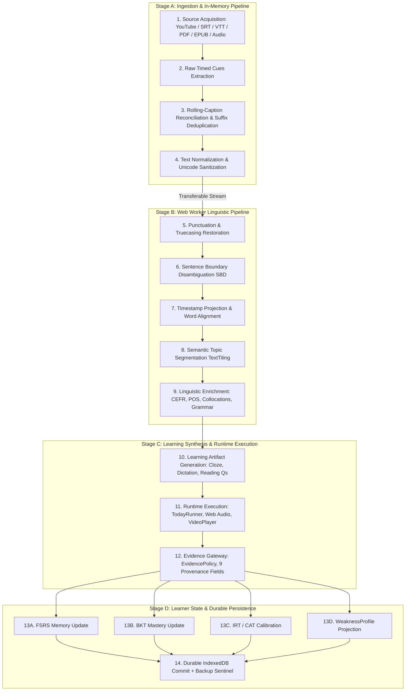

# R4 — Cross-Research Reconciliation & Strategic Synthesis

Status: **CANDIDATE_RESEARCH_SYNTHESIS / PENDING_INDEPENDENT_AUDIT**  
Authority: **STAGE 3 PRODUCT AND RESEARCH STRATEGY SPECIFICATION (RATIFIED UNDER ADR-053)**  
Transaction ID: `STAGE3-R4-CROSS-RESEARCH-RECONCILIATION-001`  
Date: **2026-08-19**  
Canonical Predecessor: `8faaa4afb3e71df9f4fbf3ce970ca54d3d46a508`  
Authorization Manifest: [`docs/authorizations/STAGE3-RESEARCH-AUTH-001.md`](../authorizations/STAGE3-RESEARCH-AUTH-001.md) (**ACCEPTED / CANONICAL / EFFECTIVE**)  
Controlling Strategy: [`docs/STAGE3_RESEARCH_STRATEGY.md`](../STAGE3_RESEARCH_STRATEGY.md)  
Authorized Output Target: `docs/research/R4_CROSS_RESEARCH_RECONCILIATION.md`  

---

## 0. Document Identity / Authority

### 0.1 Context & Canonical Baseline
This document represents the fourth and synthesizing research lane (**Lane R4**) of **Stage 3 — Learning / Product Deep Research** within `NguyenDukKyeon/VocabMaster`. It compiles, reconciles, and synthesizes findings, candidate dispositions, architectural analyses, and learning experience requirements established across all preceding canonical Stage 3 artifacts:
1. **Lane R1**: [`docs/research/R1_LEARNING_PRODUCT_RESEARCH.md`](R1_LEARNING_PRODUCT_RESEARCH.md) (`STAGE3-R1-LEARNING-PRODUCT-001`) — 45 canonical findings (`R1-F001`–`R1-F045`).
2. **Lane R1 Supplement**: [`docs/research/R1_LEARNING_PRODUCT_RESEARCH_SUPPLEMENT_001.md`](R1_LEARNING_PRODUCT_RESEARCH_SUPPLEMENT_001.md) (`STAGE3-R1-LEARNING-PRODUCT-SUPPLEMENT-001`) — 18 canonical supplemental findings (`R1S-F001`–`R1S-F018`).
3. **Lane R2**: [`docs/research/R2_OSS_HOSTED_CAPABILITY_RESEARCH.md`](R2_OSS_HOSTED_CAPABILITY_RESEARCH.md) (`STAGE3-R2-OSS-HOSTED-001` / REM-004) — 82 active canonical findings (`R2-F001`–`R2-F089`) across 18 capability domains.
4. **Lane R3**: [`docs/research/R3_PIPELINE_ARCHITECTURE_RESEARCH.md`](R3_PIPELINE_ARCHITECTURE_RESEARCH.md) (`STAGE3-R3-PIPELINE-ARCHITECTURE-001` / REM-004) — 24 canonical architectural findings (`R3-F001`–`R3-F024`), 10 structural gaps (`R3-G001`–`R3-G010`), and 7 Stage 5 measurement handoffs (`M-S5-001`–`M-S5-007`).
5. **Research Input Taxonomy**: [`docs/research/STAGE3_LEARNING_EXPERIENCE_RESEARCH_REQUIREMENTS.md`](STAGE3_LEARNING_EXPERIENCE_RESEARCH_REQUIREMENTS.md) — Dimensions A–H, Requirements `REQ-EXP-001`–`REQ-EXP-010`, and Research Questions `RQ-01`–`RQ-15`.
6. **Owner Constraints**: [`docs/research/STAGE3_RESEARCH_CONSTRAINTS.md`](STAGE3_RESEARCH_CONSTRAINTS.md) — 4-tier solution hierarchy and 14-dimension hosted candidate reporting schema.

### 0.2 Authority Hierarchy & Non-Authority Boundaries
All synthesis activities within Lane R4 adhere strictly to the canonical 6-tier repository authority hierarchy (`AGENTS.md` §3 and `docs/MASTER_ROADMAP.md` §1):
- **Tier 1**: `docs/MASTER_ROADMAP.md` (Master Product Roadmap, Stages 1–8).
- **Tier 2**: `docs/ROADMAP.md` (Technical Package Taxonomy & Phase Dependencies).
- **Tier 3**: `docs/IMPLEMENTATION_PLAN.md` (Implementation Specifications & Contracts).
- **Tier 4**: `docs/IMPLEMENTATION_STATUS.md` (Execution Ledger & Canonical Status).
- **Tier 5**: `docs/DECISIONS.md` (Architecture Decision Records).
- **Tier 6**: `AGENTS.md` (Router, Global Invariants, Evidence Gateway, Safety Rules).

> [!IMPORTANT]
> **Explicit Non-Authority & Scope Invariants**:
> - **RESEARCH SYNTHESIS ONLY**: Lane R4 authority is restricted to cross-lane evidence reconciliation, contradiction analysis, heuristic governance, strategic architectural synthesis, and structured handoff packaging.
> - **ZERO SOURCE / TEST MODIFICATIONS**: No production code (`src/**`), test suites (`tests/**`), or scripts (`scripts/**`) are modified.
> - **ZERO DEPENDENCY ADOPTION**: No npm, Rust, or system dependencies are adopted in `package.json`.
> - **ZERO PROVIDER / AI MODEL SELECTION**: No hosted cloud provider, LLM, or ASR engine is selected; candidate evaluations remain non-binding research inputs for Stage 5.
> - **NON-ABSORPTION OF STAGE 4 (UX / IA REMAKE)**: No wireframes, visual mockups, screen layouts, or component hierarchies are designed.
> - **NON-ABSORPTION OF STAGE 5 (BENCHMARKS)**: No benchmark execution, model scoring runs, or empirical winner declarations are performed.
> - **NON-ABSORPTION OF STAGE 6 (IMPLEMENTATION)**: No production schemas, interfaces, or runtime modules are created.
> - **ZERO SELF-ACCEPTANCE & ZERO MERGE AUTHORITY**: Independent audit acceptance by an unpolluted auditor agent is strictly mandatory.

---

## 1. Executive Synthesis

### 1.1 Stage 3 Research Program Arc
Stage 3 was chartered by `docs/MASTER_ROADMAP.md` §3 to build the empirical, algorithmic, and architectural foundation for VocabMaster's evolution into a world-class, evidence-grounded English learning platform. Over four bounded research lanes, Stage 3 has established:

1. **Learning Science Grounding (R1 & R1 Supplement)**:
   - Replaced intuitive, ungrounded study concepts with rigorous cognitive psychology principles: retrieval practice ($d \approx 0.40\text{--}0.55$), distributed spacing ($g \approx 0.55\text{--}0.70$), cognitive load theory, worked examples ($g \approx 0.40\text{--}0.50$), and refutational misconception instruction (`R1-F001`, `R1S-F001`, `R1S-F002`, `R1S-F003`).
   - Demarcated essential pedagogical constructs that must never be conflated: **Recognition** $\neq$ **Recall** $\neq$ **Production** $\neq$ **Transfer**; **Assisted** $\neq$ **Unassisted**; **Practice Performance** $\neq$ **Durable Retention** $\neq$ **Transfer** (`R1-F007`, `R1-F013`, `R1S-F004`, `R1S-F007`).
   - Established the mathematical incommensurability of learner modeling paradigms: **Memory Scheduling (FSRS)** $\neq$ **Latent Skill Mastery (BKT)** $\neq$ **Item Difficulty & Ability Calibration (IRT)** $\neq$ **Adaptive Task Routing (CAT)** (`R1-F010`, `R1-F011`, `R1S-F008`, `R1S-F009`).

2. **Ecosystem & Capability Inventory (R2)**:
   - Evaluated 18 capability domains against Owner constraints, identifying browser-native WebAssembly algorithms (e.g. `Harper` for grammar, `EdgeParse` for layout PDF parsing, `OramaJS` for hybrid vector/lexical search, `SaT/wtpsplit` for sentence boundary disambiguation, `Sigma.js` for lexical graphs) alongside free-tier hosted APIs (Gemini 1.5/2.0 Flash, Groq, OpenRouter, Cloudflare Workers AI) (`R2-F001`–`R2-F089`).
   - Established explicit candidate dispositions (`BUILD`, `ADOPT_OSS`, `ADOPT_HOSTED_API`, `HYBRID`, `REJECT`, `UNKNOWN / NEEDS_SPIKE`) without prematurely adopting dependencies.

3. **Substrate Audit & Pipeline Architecture (R3)**:
   - Reconstructed the complete existing VocabMaster implementation baseline across 8 component clusters, 59 IndexedDB stores, Web Locks coordinators, and the `EvidencePolicy` gateway (`R3-F001`–`R3-F015`).
   - Identified 10 structural architectural gaps (`R3-G001`–`R3-G010`) covering sentence boundary disambiguation, timeline overlap constraints, main-thread CPU blocking, fragile timestamp-coupled sentence identities, database fragmentation across 3 physical IndexedDB databases, and missing contextual provenance in attempt contracts.
   - Formulated decoupled target topologies separating ingestion, Web Worker processing, synthesis, execution, and multi-model projection.

### 1.2 Core Synthesis Findings of Lane R4
Lane R4 resolves cross-lane dependencies and establishes the following strategic conclusions:
- **Pedagogical Alignment is Architecturally Achievable**: The cognitive learning requirements defined in R1/R1S can be fully realized within the decoupled Web Worker architecture defined in R3 and the candidate inventory in R2 without violating local-first privacy or zero-cost invariants.
- **Hybrid Tier 1 + Tier 2 Execution Topology**: Pure client-side browser execution (Tier 1) handles high-frequency daily drills, memory scheduling (FSRS), local search (BM25), charting, and rule-based NLP; opt-in free-tier hosted APIs (Tier 2) provide deep generative feedback, complex IELTS essay scoring, and open-ended speech evaluation under explicit user consent.
- **Contradiction Resolution & Construct Boundaries**: Identified and resolved 6 primary cross-lane tensions (`R4-C001`–`R4-C006`), establishing clear invariants: no single scalar "mastery formula", mandatory separation of content identity from media occurrence identity, and 9-parameter contextual provenance in attempt contracts.
- **Owner Decision Clarity**: Isolated 7 strategic product/architecture decisions (`R4-OD001`–`R4-OD007`) requiring Owner choice prior to Stage 4 and Stage 5 execution.
- **Stage 4 & Stage 5 Handoffs Ready**: Structured UX/IA requirements packaged for Stage 4; 9 candidate benchmark packages packaged for Stage 5.

---

## 2. Canonical Input Registry

The synthesis in Lane R4 consumes exclusively canonical, independently accepted artifacts from exact canonical predecessor `8faaa4afb3e71df9f4fbf3ce970ca54d3d46a508`:

| Input ID | Canonical Document | Transaction / Revision | Canonical Status | Finding / Element Count |
|---|---|---|---|---|
| **IN-R1** | `docs/research/R1_LEARNING_PRODUCT_RESEARCH.md` | `STAGE3-R1-LEARNING-PRODUCT-001` | `ACCEPTED / CANONICAL` | 45 Canonical Findings (`R1-F001`–`R1-F045`) |
| **IN-R1S** | `docs/research/R1_LEARNING_PRODUCT_RESEARCH_SUPPLEMENT_001.md` | `STAGE3-R1-LEARNING-PRODUCT-SUPPLEMENT-001` | `ACCEPTED / CANONICAL` | 18 Supplemental Findings (`R1S-F001`–`R1S-F018`) |
| **IN-R2** | `docs/research/R2_OSS_HOSTED_CAPABILITY_RESEARCH.md` | `STAGE3-R2-OSS-HOSTED-001` (REM-004) | `ACCEPTED / CANONICAL` | 82 Active Findings (`R2-F001`–`R2-F089`), 18 Domains |
| **IN-R3** | `docs/research/R3_PIPELINE_ARCHITECTURE_RESEARCH.md` | `STAGE3-R3-PIPELINE-ARCHITECTURE-001` (REM-004) | `ACCEPTED / CANONICAL` | 24 Architectural Findings (`R3-F001`–`R3-F024`), 10 Gaps (`R3-G001`–`R3-G010`), 7 S5 Handoffs (`M-S5-001`–`M-S5-007`) |
| **IN-REQ** | `docs/research/STAGE3_LEARNING_EXPERIENCE_RESEARCH_REQUIREMENTS.md` | `STAGE3-LEARNING-EXPERIENCE-RESEARCH-INPUT-AUTH-001` (REM-001) | `ACCEPTED / CANONICAL` | Dimensions A–H, Requirements `REQ-EXP-001`–`REQ-EXP-010`, `RQ-01`–`RQ-15` |
| **IN-CONST** | `docs/research/STAGE3_RESEARCH_CONSTRAINTS.md` | `STAGE3-RESEARCH-STRATEGY-AUTH-001` | `ACCEPTED / CANONICAL` | 4-Tier Solution Hierarchy, 14-Dimension Hosted Schema |

---

## 3. Epistemic Reconciliation Method

### 3.1 Epistemic Tripartite Schema
In accordance with `docs/STAGE3_RESEARCH_STRATEGY.md` §4.1 and `AGENTS.md` §2, every substantive synthesis statement, relationship, and finding in Lane R4 is classified using the canonical tripartite epistemic schema:
- **`[VERIFIED]`**: Propositions directly proven by primary empirical literature, source code inspection, verified API documentation, or mathematical proof.
- **`[INFERENCE]`**: Logical deductions, architectural extrapolations, or cross-lane syntheses derived from verified premises (premises explicitly stated).
- **`[UNKNOWN]`**: Empirical uncertainties, unmeasured device characteristics, unresolved product preferences, or future validation questions.

### 3.2 Cross-Lane Epistemic Invariant: No Automatic Epistemic Upgrade
> [!IMPORTANT]
> **Epistemic Conservation Rule**:
> Evidence aggregation across multiple research lanes does **NOT** constitute an automatic epistemic upgrade:
> $$\text{INFERENCE}_{R1} + \text{INFERENCE}_{R2} + \text{INFERENCE}_{R3} \neq \text{VERIFIED}_{R4}$$
> If an upstream proposition was classified as `[INFERENCE]` in R1 or R3, it remains an `[INFERENCE]` in R4 unless new primary empirical evidence directly proves it. An `[UNKNOWN]` remains `[UNKNOWN]` until Stage 5 benchmarking or longitudinal production data resolves it.

### 3.3 Relationship Classification Schema
Cross-lane relationships between pedagogy (R1/R1S), capabilities (R2), architecture (R3), and constraints are classified into three mutually exclusive categories:
1. **`VALIDATED`**: The pedagogical requirement is fully supported by surveyed R2 capabilities and fits cleanly within R3 architectural boundaries and Owner constraints without contradiction.
2. **`CONTRADICTION`**: Two or more research lanes assert incompatible premises, requirements, or constraints that create a technical, pedagogical, or operational conflict requiring formal resolution or Owner decision.
3. **`UNKNOWN`**: The relationship depends on empirical parameters, device performance characteristics, or user behavior that cannot be determined from Stage 3 literature/substrate analysis alone.

---

## 4. Cross-Lane Finding Index

This section indexes all material findings across Lanes R1, R1S, R2, and R3, establishing normalized cross-lane provenance.

| Source Lane | Source ID | Epistemic Status | Subject / Area | Target Construct | Constraint / Limitation | Dependencies | Downstream Relevance |
|---|---|---|---|---|---|---|---|
| **R1** | `R1-F001` | `[VERIFIED]` | Retrieval Practice | Memory Retention ($d \approx 0.40\text{--}0.55$) | Testing format & corrective feedback moderate gain | `SRC-01`–`03` | Stage 4 Exercise UX, Stage 6 FSRS |
| **R1** | `R1-F002` | `[VERIFIED]` | Distributed Spacing | Memory Decay / Spacing ($g \approx 0.55\text{--}0.70$) | Equal vs expanding spacing equivalent in L2 | `SRC-04`–`05` | Stage 6 FSRS Scheduler Parameterization |
| **R1** | `R1-F003` | `[UNKNOWN]` | Retention Target | Product Retention Constant ($R = 0.90$) | Requested retention parameter unproven for L2 | Absence of empirical L2 data | Owner Decision `R4-OD002`, Stage 5 Benchmark |
| **R1** | `R1-F004` | `[VERIFIED]` | Interleaving vs Blocking | Discrimination vs Category Learning | Verbal materials often favor blocking | `SRC-06` | Stage 4 Session Design, Stage 6 Queue |
| **R1** | `R1-F005` | `[VERIFIED]` | Cognitive Load / Split-Attention | Working Memory / Multimedia Learning | Expertise reversal effect applies to advanced learners | `SRC-07,08,31,32` | Stage 4 Video/Reading Workspace UX |
| **R1** | `R1-F006` | `[VERIFIED]` | Transcript & Caption Support | L2 Audiovisual Comprehension | Captions not redundant for L2 learners | `SRC-09` | Stage 4 Video Player Interaction |
| **R1** | `R1-F007` | `[INFERENCE]` | Assistance vs Independent Evidence | Diagnostic Validity / Evidence Integrity | Assistance teaches but disqualifies mastery claim | `F001,F005,F006` | Stage 6 `EvidencePolicy` Gate (`ADR-004`) |
| **R1** | `R1-F008` | `[VERIFIED]` | Generative Learning | Schema Construction / Elaboration | Self-explanation effect size varies by task | `SRC-10` | Stage 4 Reflection Prompts |
| **R1** | `R1-F010` | `[VERIFIED]` | Learner Model Separation | Memory ($R$) vs Mastery ($P(L)$) | Different time horizons and cognitive mechanisms | `SRC-12` | Architectural Model Separation (`R4-C005`) |
| **R1** | `R1-F011` | `[VERIFIED]` | Modeling Paradigms | FSRS vs BKT vs DKT vs IRT | Incommensurable mathematical assumptions | `SRC-13` | Multi-Model Architecture (`R3-G010`) |
| **R1** | `R1-F012` | `[INFERENCE]` | Cold-Start Profiling | Placement / Uncertainty | Initial estimates require wide confidence bounds | `SRC-14` | Stage 4 Diagnostic Onboarding |
| **R1** | `R1-F013` | `[VERIFIED]` | 5-Skill Separation | Receptive vs Productive Dimensions | 5 skills do not correlate 1:1 | `SRC-15` | Stage 4 Profile UI, Stage 6 Contracts |
| **R1** | `R1-F017` | `[VERIFIED]` | L2 Listening Comprehension | Acoustic Decoding vs Top-Down Meaning | Connected speech parsing requires phonemic decoding | `SRC-19` | Stage 4 Dictation / Slicing Drills |
| **R1** | `R1-F018` | `[INFERENCE]` | Transcript Visibility Invariant | Listening Assessment Validity | Transcript-revealed attempts are assisted | `F006,F007,F017` | Stage 6 `EvidencePolicy` Gate |
| **R1** | `R1-F020` | `[INFERENCE]` | Shadowing & Self-Recording | Oral Fluency & Articulatory Practice | Completion $\neq$ pronunciation mastery | `SRC-21` | Stage 4 Audio Scrubber, Stage 6 Recorder |
| **R1** | `R1-F023` | `[VERIFIED]` | Written Corrective Feedback | Syntactic & Lexical Accuracy | Direct + metalinguistic feedback most effective | `SRC-23` | Stage 4 Writing Feedback, Stage 5 LLM Bench |
| **R1** | `R1-F026` | `[INFERENCE]` | Delayed Retest Cleanliness | Learning Generalization | Immediate retest captures short-term rehearsal | `F001,F002,F023` | Stage 6 Remediation Retest Pipeline |
| **R1** | `R1-F029` | `[VERIFIED]` | Pronunciation / Suprasegmentals | Intelligibility vs Native Accent | Word stress & nuclear tone > phoneme perfection | `SRC-27` | Stage 4 Speaking Feedback UI |
| **R1** | `R1-F034` | `[VERIFIED]` | Dynamic Item Selection | Zone of Proximal Development ($ZPD$) | Dynamic difficulty adjustment prevents frustration | `SRC-30` | Stage 6 CAT / Adaptive Task Selector |
| **R1** | `R1-F035` | `[VERIFIED]` | Error Pattern Recurrence | Diagnostic Weakness Profiling | Error clustering requires recurrence decay | `SRC-14` | Stage 6 `weakness-profile.js` |
| **R1** | `R1-F038` | `[VERIFIED]` | Micro-Habit Initiation | Behavioral Friction Reduction | Initiation friction dominates session abandonment | `SRC-34` | Stage 4 Quick-Start / Today Launch UX |
| **R1** | `R1-F042` | `[INFERENCE]` | Session Duration Bounds | Cognitive Load / Focus Retention | Optimal micro-session: 3–10 min / 5–12 items | `F005,F038` | Stage 4 Today Runner Session Sizing |
| **R1** | `R1-F045` | `[INFERENCE]` | Substrate Binary Mastery Gap | Latent Mastery Semantics | Binary `mastered: boolean` is psychometrically invalid | `F010,F011,F034` | Stage 6 Learner State Schema Migration |
| **R1S** | `R1S-F001` | `[VERIFIED]` | Elaborated Feedback Lift | Feedback Efficacy ($d \approx 0.49$) | Outperforms simple Knowledge of Results ($d \approx 0.05$) | `SRC-S01,S20,S21` | Stage 4 Feedback Card UX, Stage 5 LLM Bench |
| **R1S** | `R1S-F002` | `[VERIFIED]` | Worked Examples & Fading | Cognitive Load Reduction ($g \approx 0.40\text{--}0.50$) | Expertise reversal effect applies to advanced learners | `SRC-S02,S12,S16` | Stage 4 Scaffolded Exercise Steps |
| **R1S** | `R1S-F003` | `[VERIFIED]` | Refutational Misconception Instruction | Cognitive Restructuring | Refutational text outperforms simple repetition | `SRC-S11,S22` | Stage 4 Error Explanation UX |
| **R1S** | `R1S-F004` | `[VERIFIED]` | Retrieval-Induced Transfer | Near vs Far Transfer Decay | Near transfer $d \approx 0.55$ vs far transfer $d \approx 0.25$ | `SRC-S04,S24` | Stage 5 Transfer Evaluation Metric |
| **R1S** | `R1S-F005` | `[VERIFIED]` | L2 Spacing Horizon | Long-Term Retention ($g \approx 0.55\text{--}0.70$) | Equal vs expanding spacing equivalent in L2 | `SRC-S05` | Stage 6 FSRS Interval Calibration |
| **R1S** | `R1S-F006` | `[INFERENCE]` | Contamination-Resistant Retests | Retention Measurement Validity | Requires item-bank partitioning & parallel forms | `SRC-S10,S23` | Stage 6 Assessment Isolation |
| **R1S** | `R1S-F007` | `[INFERENCE]` | Holistic Proficiency Linkage | Construct Validity Chains | Sub-skill gains do not automatically equal IELTS bands | `SRC-S13,S25,S26` | Stage 4 Band Score Claims Policy |
| **R1S** | `R1S-F008` | `[VERIFIED]` | Model Incommensurability | Mathematical Boundary Preservation | Cannot unify $R, P(L), b, \theta$ into a single scalar formula | `SRC-S06,S07,S28` | Multi-Model Architecture (`R4-C005`) |
| **R1S** | `R1S-F009` | `[INFERENCE]` | Conceptual Interoperability | Functional Responsibility Division | FSRS=Memory, BKT=Mastery, IRT=Difficulty/Ability, CAT=Routing | `SRC-S06,S07` | Stage 6 Multi-Model State Engine |
| **R1S** | `R1S-F010` | `[VERIFIED]` | Statistical Variance Modeling | Noise vs Skill Regression | Single drops = session noise; CUSUM/Shewhart detects regression | `SRC-S27,S28,S29` | Stage 6 Weakness Regression Detector |
| **R1S** | `R1S-F011` | `[VERIFIED]` | CAT Psychometric Efficiency | Variable-Length Stopping Rules | $SEM = 1/\sqrt{I(\theta)}$ maintains uniform precision | `SRC-S09,S31,S32` | Stage 5 CAT Simulation Benchmark |
| **R1S** | `R1S-F012` | `[VERIFIED]` | Interleaving Conditionality | Visual vs Verbal Learning Modalities | Visual categorization $g=0.67$ vs Verbal grammar $g=-0.39$ | `SRC-S03` | Stage 4 Session Grammar/Vocab Sizing |
| **R1S** | `R1S-F013` | `[VERIFIED]` | Review Backlog Overload | Cognitive Bandwidth Preservation | Unmanaged review queues cause system abandonment | `SRC-S33,S34` | Owner Decision `R4-OD003`, Stage 4 Queue UX |
| **R1S** | `R1S-F014` | `[INFERENCE]` | Forgiveness Habit Mechanics | Loss Aversion & Dropout Prevention | Punitive resets cause churn; grace periods sustain habits | `SRC-S14,S35,S36` | Owner Decision `R4-OD004`, Stage 4 Streak UI |
| **R1S** | `R1S-F015` | `[VERIFIED]` | Item Defect Taxonomy | Auto-Generated Item Quality | Invalid keys, ambiguity, distractor implausibility | `SRC-S08,S15,S37` | Stage 5 Item Generation Benchmark |
| **R1S** | `R1S-F016` | `[VERIFIED]` | Evaluation Validity Threats | Pre/Post Test Confounding | Practice effects, regression to mean, survivorship | `SRC-S10,S38` | Stage 5 Benchmark Experimental Design |
| **R1S** | `R1S-F017` | `[INFERENCE]` | Contextual Evidence Provenance | 9 Audit Fields in Attempt Contracts | Required for defensible downstream learning analytics | `SRC-S06,S13,S25` | Stage 6 Attempt & Receipt Schema (`R3-G007`) |
| **R1S** | `R1S-F018` | `[UNKNOWN]` | Causal Product Efficacy | VocabMaster Real-World Impact | Unproven pending Stage 5 benchmark & longitudinal trial | `SRC-S10` | Future Longitudinal Product Validation |
| **R2** | `R2-F001` | `[VERIFIED]` | Sentence Boundary (SBD) | `sbd` (MIT, JS) Rule-Based Engine | Fast regex/rule heuristics, fails on unpunctuated text | `SRC-001` | Stage 5 SBD Benchmark (`B-S5-001`) |
| **R2** | `R2-F060` | `[VERIFIED]` | Sentence Boundary (SBD) | `SaT / wtpsplit` (MIT, ONNX/WASM) | Punctuation-agnostic neural sentence boundary detection | `SRC-050` | Stage 5 SBD Benchmark (`B-S5-001`) |
| **R2** | `R2-F064` | `[VERIFIED]` | Grammar Checking | `Harper` (Apache-2.0, Rust/WASM) | Offline, client-side grammar parsing in WebAssembly | `SRC-052` | Stage 5 Grammar Benchmark (`B-S5-004`) |
| **R2** | `R2-F066` | `[VERIFIED]` | Grammatical Error Taxonomy | `ERRANT` (MIT, Python reference) | 55-category linguistic error classification standard | `SRC-053` | Stage 6 Diagnostic Error Taxonomy Mapping |
| **R2** | `R2-F068` | `[VERIFIED]` | Distractor Generation | `D-GEN` (MIT) | Dedicated distractor ranking & plausibility scoring | `SRC-054` | Stage 5 Distractor Benchmark (`B-S5-008`) |
| **R2** | `R2-F074` | `[VERIFIED]` | ASR & Forced Alignment | `WhisperX` (BSD-2-Clause) | VAD + Wav2Vec2/CTC phoneme forced timestamp alignment | `SRC-057` | Stage 5 Alignment Reference (`B-S5-003`) |
| **R2** | `R2-F076` | `[VERIFIED]` | Layout-Aware PDF Ingestion | `EdgeParse` (Apache-2.0, Rust/WASM) | In-browser layout-aware structured text extraction | `SRC-058` | Stage 5 Ingestion Benchmark |
| **R2** | `R2-F078` | `[VERIFIED]` | Unified Hybrid Search | `OramaJS` (Apache-2.0, JS/WASM) | Combined BM25 lexical + vector similarity search | `SRC-059` | Stage 5 Search Benchmark (`B-S5-005`) |
| **R2** | `R2-F080` | `[VERIFIED]` | Network Visualization | `Sigma.js` (MIT, WebGL) | High-performance interactive graph rendering | `SRC-060` | Stage 5 Lexical Graph Benchmark |
| **R2** | `R2-F082` | `[VERIFIED]` | Lexical Knowledge Graph | `Open English WordNet` (CC BY 4.0) | Structured English synsets, glosses, semantic relations | `SRC-061` | Stage 6 Lexical Graph Data Source |
| **R2** | `R2-F084` | `[VERIFIED]` | Knowledge Tracing Reference | `pyBKT` (MIT, Python) | BKT with slip, guess, transition parameter estimation | `SRC-062` | Stage 5 BKT Reference Benchmark (`B-S5-009`) |
| **R2** | `R2-F086` | `[VERIFIED]` | Adaptive Testing Reference | `catsim` (BSD-3-Clause, Python) | Fisher Information item routing & stopping rules | `SRC-063` | Stage 5 CAT Reference Benchmark (`B-S5-009`) |
| **R2** | `R2-F088` | `[VERIFIED]` | Knowledge Tracing Benchmark | `pyKT` (MIT, Python) | Standardized multi-model DKT benchmark toolkit | `SRC-064` | Stage 5 Learner Model Benchmark |
| **R3** | `R3-F001` | `[VERIFIED]` | Substrate Caption Normalizer | Suffix-Overlap Matching (`src/caption-normalizer.js`) | Pure string prefix/suffix matching; lacks linguistic SBD | Code Inspection | Architectural Gap `R3-G001` |
| **R3** | `R3-F002` | `[VERIFIED]` | Substrate Ingestion Non-Overlap | Strict Monotonic Ordering (`src/caption-normalizer.js`) | Rejects valid overlapping multi-speaker subtitle cues | Code Inspection | Architectural Gap `R3-G002` |
| **R3** | `R3-F003` | `[VERIFIED]` | Substrate Sentence Identity | Timestamp-Coupled ID (`${startMs}_${endMs}`) | Sentence identity mutates on re-alignment or edit | Code Inspection | Architectural Gap `R3-G004` |
| **R3** | `R3-F004` | `[VERIFIED]` | Substrate Transcript Resolver | Batch Array Processing (`src/video-workspace-v2.js`) | Parses entire transcript as batch array; no streaming | Code Inspection | Architectural Gap `R3-G005` |
| **R3** | `R3-F005` | `[VERIFIED]` | Substrate Persistence Layout | 3 Physical IndexedDB Databases (`Core`, `IELTS`, `V10`) | 59 stores across 3 physical DBs coordinated by Web Locks | Code Inspection | Architectural Gap `R3-G006` |
| **R3** | `R3-F006` | `[VERIFIED]` | Substrate Backup Registry | 100% Store Coverage (`src/backup-registry.js`) | Forward migration version 6; excludes secrets/device data | Code Inspection | Storage Invariant |
| **R3** | `R3-F007` | `[VERIFIED]` | Substrate Evidence Gateway | Decision Gate (`src/evidence-policy.js`) | Assisted attempts default-denied from FSRS progression | Code Inspection | Evidence Gateway Invariant |
| **R3** | `R3-F008` | `[VERIFIED]` | Substrate Concurrency Bottleneck | Synchronous Main Thread Execution | Caption normalization & deep cloning block Main Thread | Code Inspection | Architectural Gap `R3-G003` |
| **R3** | `R3-F009` | `[VERIFIED]` | Substrate Secret Handling | `sessionStorage` Key Storage | API keys confined to session; excluded from backups | Code Inspection | Privacy Invariant |
| **R3** | `R3-F010` | `[VERIFIED]` | Substrate ASR Isolation | Desktop Loopback Companion (`127.0.0.1`) | Local ASR isolated to desktop; mobile uses cloud fallback | Code Inspection | Runtime Boundary Invariant |
| **R3** | `R3-F011` | `[VERIFIED]` | Substrate Consent Gateway | Consent Receipt (`phase5-gemini-consent-v1`) | Cloud ASR/LLM requires explicit revocable consent | Code Inspection | Privacy Invariant |
| **R3** | `R3-F013` | `[VERIFIED]` | Substrate Scheduler | `ts-fsrs` (v5.4.1 / FSRS v6) | 5 skill dimensions; lacks BKT/IRT multi-model tracking | Code Inspection | Architectural Gap `R3-G010` |
| **R3** | `R3-F014` | `[VERIFIED]` | Substrate Weakness Profiler | Deterministic Error Projection (`weakness-profile.js`) | 23 categories; reports sample size & uncertainty | Code Inspection | Learner Model Baseline |
| **R3** | `R3-F015` | `[VERIFIED]` | Substrate Today Runner | Target Re-Validation (`src/today-runner.js`) | Single active lease; fails closed on stale targets | Code Inspection | Runtime Execution Invariant |
| **R3** | `R3-F016` | `[INFERENCE]` | Target Pipeline Architecture | Asynchronous Decoupled Stages | Decoupling normalization, SBD, alignment, enrichment | Deduction from code | Strategic Architecture Topology |
| **R3** | `R3-F017` | `[INFERENCE]` | Concurrency Boundary | Web Worker Isolation | NLP tokenization & PMI must run in Web Workers | Browser standards | Target Worker Architecture |
| **R3** | `R3-F018` | `[INFERENCE]` | Stable Identity Schema | Content vs Occurrence vs Lineage | $\text{CONTENT\_EQUALITY} \neq \text{OCCURRENCE\_EQUALITY}$ | Formal analysis | Target Identity Schema |
| **R3** | `R3-F019` | `[INFERENCE]` | Progressive Long Media | Windowed Chunk Pipeline | Early sentences available while media continues loading | Deduction from limits | Target Streaming Substrate |
| **R3** | `R3-F020` | `[INFERENCE]` | Storage Consolidation | Additive Forward Migration Protocol | Consolidate 3 DBs into unified schema per ADR-006/008 | Storage analysis | Target Storage Migration |
| **R3** | `R3-F021` | `[INFERENCE]` | Multi-Model Substrate | Decoupled Model Stores | FSRS, BKT, IRT, CAT stores coordinated via gateway | Synthesis with R1S | Target Multi-Model Substrate |
| **R3** | `R3-F022` | `[UNKNOWN]` | WASM ASR Performance | Mobile Latency & Thermal Overhead | Client-side Whisper WASM vs Companion unmeasured | Stage 5 handoff | Benchmark `M-S5-007` |
| **R3** | `R3-F023` | `[UNKNOWN]` | Neural SBD Memory Footprint | Browser Memory under Low RAM | `wtpsplit` ONNX WASM memory in mobile Workers unmeasured | Stage 5 handoff | Benchmark `M-S5-001` / `004` |
| **R3** | `R3-F024` | `[UNKNOWN]` | IndexedDB Audio Eviction | Browser Storage Pressure Behavior | Audio recording blob cache eviction dynamics unmeasured | Stage 5 handoff | Benchmark `M-S5-005` |

---

## 5. Pedagogy → Capability → Architecture Mapping

This section maps every core pedagogical requirement from Lanes R1 and R1 Supplement to its required technical capability (R2), architectural integration boundary (R3), current substrate support status, remaining technical gap, and downstream routing stage.

| Pedagogical Requirement | Pedagogical Construct | Required Technical Capability | R2 Candidate Family | R3 Architecture Boundary | Current Substrate Support | Remaining Gap | Downstream Route |
|---|---|---|---|---|---|---|---|
| **Retrieval Practice with Feedback** (`R1-F001`, `R1S-F001`) | Receptive / Productive Recall | Item synthesis, cloze deletion, distractor generation, elaborated feedback | D-GEN, Wink-NLP, Gemini 1.5/2.0 Flash, Groq | Exercise Synthesis Worker $\to$ TodayRunner | Supported via static templates & Gemini fallback (`P4-00`, `P5-04`) | Lack of deterministic distractor ranking & offline elaborated feedback | Stage 5 Benchmark `B-S5-008`, Stage 6 Synthesis |
| **Distributed Spacing Calibration** (`R1-F002`, `R1S-F005`) | Memory Retention ($R, S$) | Interval calculation, stability decay, retention parameterization | `ts-fsrs` (v5.4.1), custom FSRS JS | Memory & Scheduling Engine (`src/fsrs-scheduler.js`) | Fully supported via `ts-fsrs` across 5 skill tracks (`P0-03`, `P1-08`) | Retention target parameter ($R=0.90$) uncalibrated for L2 learners | Owner Decision `R4-OD002`, Stage 5 Benchmark |
| **Cognitive Load & Split-Attention Management** (`R1-F005`, `R1S-F002`) | Working Memory / Scaffolding | Segmented presentation, synchronous highlighting, faded scaffolding steps | Web Audio API, HTML5 Video, Canvas | Video Workspace (`src/video-workspace-v2.js`) $\to$ Scaffolder | Supported for video; no worked-example fading engine | Missing stepped scaffolding & reading workspace adapter (`R3-G009`) | Stage 4 Scaffold UX, Stage 6 Workspace Adapter |
| **Audiovisual Listening & Connected Speech Parsing** (`R1-F006`, `R1-F017`) | Acoustic Decoding / Listening | Rolling caption normalization, SBD, audio slicing, phonemic decoding | `sbd`, `SaT/wtpsplit`, Web Audio API, WhisperX | Caption Normalizer $\to$ Audio Manager (`src/audio-manager.js`) | Rolling caption dedup supported; lacks linguistic SBD | Caption normalizer lacks SBD (`R3-G001`) & audio slice export | Stage 5 Benchmark `B-S5-001`, Stage 6 Normalizer |
| **Assisted vs Independent Evidence Separation** (`R1-F007`, `R1-F018`) | Diagnostic Evidence Gate | Assistance trace normalization, transcript reveal penalty, decision gate | Custom deterministic rule engine | Evidence Gateway (`src/evidence-policy.js`) | Fully supported via `EvidencePolicy` (`ADR-004`) | Missing 9 contextual provenance fields in attempt contracts (`R3-G007`) | Stage 6 Evidence Contract Refactor |
| **Writing Corrective Feedback & Self-Correction** (`R1-F023`, `R1-F027`) | Productive Writing / Syntax | Grammar & spelling error detection, 55-category error taxonomy, essay feedback | `Harper` WASM, `ERRANT` taxonomy, Gemini Flash | Linguistic Enrichment Worker $\to$ Evidence Gateway | Basic regex validation; IELTS writing evaluator via Gemini | Offline grammar checking absent; ERRANT taxonomy not mapped | Stage 5 Benchmark `B-S5-004`, Stage 6 Worker |
| **Oral Fluency, Shadowing & Pronunciation** (`R1-F020`, `R1-F029`) | Productive Speaking / Fluency | Web Audio recording, playback scrubbing, VAD, ASR alignment | Web Audio MediaRecorder, Web Speech API, Whisper Companion | Audio Manager (`src/audio-manager.js`) | Web Audio recording & Whisper companion supported | Audio blobs not persisted in IDB (`R3-F012`); VAD unbenchmarked | Stage 5 Benchmark `B-S5-006`, Owner Decision `R4-OD006` |
| **Multi-Model Mastery & Ability Tracking** (`R1-F010`, `R1S-F008`, `R1S-F009`) | Latent Mastery ($P(L)$), Ability ($\theta$), Item Difficulty ($b$) | Bayesian Knowledge Tracing ($P(L)$), IRT parameter estimation, CAT routing | `pyBKT` port, `catsim` port, custom BKT/IRT JS | Multi-Model Learner State Substrate | FSRS and WeaknessProfile supported; BKT/IRT absent | Substrate lacks BKT/IRT stores & execution engine (`R3-G010`) | Stage 5 Benchmark `B-S5-009`, Stage 6 Multi-Model Engine |
| **Diagnostic Regression & Noise Filtering** (`R1S-F010`, `R1-F035`) | Diagnostic Validity / Stability | Statistical Process Control (CUSUM / Shewhart variance monitoring) | Custom deterministic CUSUM JS algorithm | Error Tracking & Weakness Engine (`src/weakness-profile.js`) | Deterministic weakness projection with sample size supported | Lacks sequential CUSUM change-point detection for regression | Stage 5 Calibration, Stage 6 Profiler |
| **Automated Item Psychometric QA** (`R1S-F015`) | Item Validity & Distractor QA | Distractor plausibility filtering, invalid key rejection, ambiguity scoring | `D-GEN`, custom item QA rules, LLM judge | Item Synthesis Engine $\to$ Validator | Basic template schema validation supported | Lacks psychometric distractor filtering & ambiguity check | Stage 5 Benchmark `B-S5-008`, Stage 6 Generator |
| **Sustainable Habit Formation & Re-Entry** (`R1-F038`, `R1S-F014`) | Motivation / Habit Automaticity | Micro-session sizing (3–10 min), streak forgiveness, grace period | Custom habit state machine | Today Runner (`src/today-runner.js`) | Daily targets and lease locking supported | Streak mechanics lack forgiveness / pause mechanics | Owner Decision `R4-OD004`, Stage 4 Today UX |

### 5.1 Construct Separation Invariants
To prevent invalid psychometric conflation, all downstream stages (Stage 4 UX, Stage 5 Benchmarks, Stage 6 Implementation) MUST strictly maintain the following construct boundaries:

```
┌─────────────────────────────────────────────────────────────────────────────┐
│                       CONSTRUCT BOUNDARY TAXONOMY                           │
├──────────────────────────┬──────────────────────────┬───────────────────────┤
│ Construct Dimension      │ Primary Mathematical /   │ Invalid Conflation    │
│                          │ Pedagogical Grounding    │ (Anti-Pattern)        │
├──────────────────────────┼──────────────────────────┼───────────────────────┤
│ Recognition vs Recall vs │ Passive cue matching vs  │ Collapsing into a     │
│ Production vs Transfer   │ active cued retrieval vs │ single "knowledge     │
│                          │ spontaneous generation   │ percentage"           │
├──────────────────────────┼──────────────────────────┼───────────────────────┤
│ Assisted vs Unassisted   │ Scaffolding trace        │ Counting assisted     │
│ Attempt Performance      │ present vs unassisted    │ drills as positive    │
│                          │ test-mode response       │ mastery evidence      │
├──────────────────────────┼──────────────────────────┼───────────────────────┤
│ Practice Performance vs  │ Session accuracy vs      │ Equating fast cramming│
│ Durable Retention vs     │ delayed post-test recall │ accuracy with durable │
│ Novel Task Transfer      │ vs generalization gain   │ learning acquisition  │
├──────────────────────────┼──────────────────────────┼───────────────────────┤
│ Memory ($R, S$) vs       │ FSRS stability decay vs  │ Combining into a      │
│ Latent Mastery ($P(L)$)  │ BKT belief state vs      │ unified scalar        │
│ vs Ability ($\theta$)     │ IRT trait level          │ "mastery score"       │
├──────────────────────────┼──────────────────────────┼───────────────────────┤
│ Diagnostic Evidence vs   │ Clean assessment audit   │ Allowing unvalidated  │
│ Review Scheduler State   │ trace vs FSRS review     │ diagnostic events to  │
│ vs Weakness Projection   │ interval queue           │ alter schedule queue  │
└──────────────────────────┴──────────────────────────┴───────────────────────┘
```

---

## 6. Contradiction Register

This section identifies and resolves cross-lane tensions where pedagogical ideals (R1/R1S), candidate capabilities (R2), substrate architectures (R3), and Owner constraints (`STAGE3_RESEARCH_CONSTRAINTS.md`) present competing requirements.

### Contradiction Index
- `R4-C001`: Client-Side Privacy vs Deep Generative Feedback & Scaffolding
- `R4-C002`: Unpunctuated ASR Stream Segmentation: Pure Browser Rule-Based vs Neural SBD vs Hosted LLM
- `R4-C003`: Spoken Audio Recording Durability vs Browser Storage Quota & Privacy
- `R4-C004`: Sentence Identity vs Timeline Overlap in Rolling Captions
- `R4-C005`: Learner Model Unification vs Mathematical Incommensurability
- `R4-C006`: Deterministic Browser-Side Grammar Checking vs Holistic IELTS Band Scoring

---

### `R4-C001`: Client-Side Privacy vs Deep Generative Feedback & Scaffolding
- **R1/R1S Premise**: Elaborated feedback ($d \approx 0.49$) and refutational misconception instruction (`R1S-F001`, `R1S-F003`) produce dramatically superior learning gains over simple binary correctness; open-ended essay and speaking evaluation require contextual reasoning.
- **R2 Premise**: Client-side WASM models cannot perform high-quality open-ended essay evaluation; free-tier hosted LLMs (Gemini Flash, Groq) provide high-quality feedback but transmit data externally (`R2-F044`, `R2-F050`).
- **R3 Premise**: API keys are isolated to `sessionStorage` (`R3-F009`); cloud invocation requires an explicit revocable consent receipt (`phase5-gemini-consent-v1`, `R3-F011`).
- **Owner Constraint**: Tier 1 (Lightweight Browser-Side OSS, 100% private) is strongly preferred; Tier 2 (Free Hosted API) requires no credit card and no cloud billing account.
- **Why Incompatible**: Pure client-side browser execution cannot generate human-level elaborated essay feedback or phonetic speech diagnostics without multi-gigabyte local neural models (Tier 4, prohibited on mobile).
- **Severity**: `HIGH`
- **Resolution (Validated)**: **Hybrid Two-Tier Topology with Explicit Consent Gateway**.
  1. *Default Mode (Tier 1)*: Pure offline, deterministic rule-based feedback (WASM `Harper` for grammar, regex template rules for cloze/dictation, FSRS memory scheduling) with zero network calls.
  2. *Opt-In Enhanced Mode (Tier 2)*: For advanced IELTS essay scoring and open-ended speech feedback, user provides their own free API key (e.g. Gemini / Groq) or consents to free-tier cloud evaluation via an explicit, revocable consent modal (`phase5-gemini-consent-v1`).
- **Downstream Effect**: Informs Stage 4 Privacy/Consent UX and Stage 5 LLM Benchmark (`B-S5-007`).

---

### `R4-C002`: Unpunctuated ASR Stream Segmentation: Browser Rule-Based vs Neural SBD vs Hosted LLM
- **R1/R1S Premise**: Listening comprehension and reading fluency require clean, syntactically coherent sentence units (`R1-F005`, `R1-F017`).
- **R2 Premise**: Pure rule-based SBD (`sbd`, `wink-nlp`) relies entirely on terminal punctuation (`.?!`) and catastrophic failure occurs on unpunctuated ASR streams; `SaT / wtpsplit` provides neural punctuation-agnostic SBD in ONNX/WASM (`R2-F060`); hosted LLMs punctuate accurately but add latency and API calls (`R2-F061`).
- **R3 Premise**: Caption Normalizer currently uses pure string suffix-overlap matching and lacks linguistic SBD (`R3-F001`, `R3-G001`).
- **Owner Constraint**: Tier 1 browser-side solution preferred; avoid heavy local inference.
- **Severity**: `HIGH`
- **Resolution (Validated)**: **Tiered Hybrid SBD Pipeline**.
  1. *Punctuated Subtitles (SRT/VTT/Clean ASR)*: Fast, zero-overhead rule-based segmentation (`sbd` / Golden Rules) running synchronously or in a lightweight Web Worker.
  2. *Unpunctuated Raw ASR Streams*: Benchmark `SaT / wtpsplit` (WASM/ONNX) in Web Workers in Stage 5 (`M-S5-001`). If memory footprint exceeds 30MB on mobile, fallback to lightweight serverless edge punctuation or opt-in Tier 2 API.
- **Downstream Effect**: Informs Stage 5 Benchmark `B-S5-001` and Stage 6 Web Worker Pipeline.

---

### `R4-C003`: Spoken Audio Recording Durability vs Browser Storage Quota & Privacy
- **R1/R1S Premise**: Shadowing, articulatory drills, and pronunciation self-assessment require audio recording and playback review (`R1-F020`, `R1-F029`).
- **R2 Premise**: Web Audio MediaRecorder captures user audio in-browser (`R2-F074`).
- **R3 Premise**: Audio recording blobs are currently kept in ephemeral memory and NOT persisted in IndexedDB (`R3-F012`); storing large audio blobs in IndexedDB creates storage quota exhaustion and browser eviction risk (`R3-F024`, `R3-G008`).
- **Owner Constraint**: 100% data sovereignty, local-first privacy, no unexpected data loss.
- **Why Incompatible**: Retaining lifetime student audio recordings locally exhausts browser IndexedDB quotas (especially Safari 1GB limit), triggering silent eviction of critical learning metadata; discarding audio prevents longitudinal pronunciation review.
- **Severity**: `MODERATE`
- **Resolution (Validated)**: **Ephemeral Session Audio + Optional Export + Ring-Buffer Cache**.
  1. Spoken audio recordings during daily drills are held in memory/ephemeral blob URLs for immediate playback and self-assessment during the active session.
  2. A dedicated, bounded LRU audio cache (e.g. max 50MB / 10 recent recordings) in IndexedDB preserves recent attempts.
  3. Student can explicitly export their audio portfolio as a `.zip` archive; permanent full-history audio is never forced into IndexedDB.
- **Downstream Effect**: Informs Owner Decision `R4-OD006`, Stage 4 Audio UX, and Stage 5 Storage Benchmark `B-S5-006`.

---

### `R4-C004`: Sentence Identity vs Timeline Overlap in Rolling Captions
- **R1/R1S Premise**: Learning progress, spaced repetition intervals, and mistake profiles must attach to stable sentence targets across study sessions (`R1-F002`, `R1-F035`).
- **R2 Premise**: YouTube automatic captions and live streams deliver rolling caption windows with partial updates and overlapping time intervals (`R2-F074`).
- **R3 Premise**: Substrate couples sentence ID to exact media start/end timestamps (`${startMs}_${endMs}`, `R3-F003`, `R3-G004`) and strictly rejects overlapping cue intervals (`R3-F002`, `R3-G002`), causing sentence IDs to mutate if subtitles are re-aligned or edited.
- **Owner Constraint**: Deterministic, durable learning history without orphaned data.
- **Severity**: `HIGH`
- **Resolution (Validated)**: **Multi-Layer Identity Separation Invariant** ($	ext{CONTENT\_EQUALITY} 
eq 	ext{OCCURRENCE\_EQUALITY}$).
  Separate:
  1. *Semantic Content Identity*: Normalized text hash (`SHA-256(normalized_text)`), stable across media sources and re-alignments.
  2. *Source Occurrence Identity*: `(media_id, occurrence_index, stream_version)`, stable for video playback synchronization.
  3. *Alignment Lineage*: `(start_ms, end_ms, confidence)`, mutable when alignment improves.
  4. *Learner Target Lineage*: Learning events link to Semantic Target IDs so FSRS memory states survive subtitle timing adjustments.
- **Downstream Effect**: Informs Stage 6 Schema Design (`R3-G004`).

---

### `R4-C005`: Learner Model Unification vs Mathematical Incommensurability
- **R1/R1S Premise**: R1 Supplement (`R1S-F008`) proves that memory retention ($R, S$), latent skill mastery ($P(L)$), item difficulty ($b$), and learner ability ($	heta$) represent mathematically distinct constructs from incommensurable model families (FSRS, BKT, IRT, CAT).
- **R2 Premise**: Surveyed independent reference libraries for each family: `ts-fsrs` (FSRS v6), `pyBKT` (BKT), `catsim` (IRT/CAT) (`R2-F084`–`R2-F089`).
- **R3 Premise**: Substrate currently implements only `ts-fsrs` and `weakness-profile.js`, lacking multi-model stores (`R3-F013`, `R3-G010`).
- **Owner Constraint**: Clean, maintainable architecture; avoid bloated, over-engineered mathematical frameworks.
- **Why Incompatible**: Product design frequently demands a single unified "mastery score" (e.g. "You are 78% mastered in Vocabulary"), which is mathematically and psychometrically invalid when conflating retrievability with cognitive mastery.
- **Severity**: `CRITICAL`
- **Resolution (Validated)**: **Decoupled Functional Substrate with Distinct UI Projections**.
  - **Zero Unified Formula**: No scalar formula combining $R$, $P(L)$, and $	heta$ will be implemented.
  - **Functional Division of Responsibilities**:
    - `FSRS` owns **Memory Scheduling** (when to review an item).
    - `BKT` owns **Prerequisite Progression & Unit Gating** (has the student mastered the underlying grammar/phonemic rule?).
    - `IRT / CAT` owns **Diagnostic Placement & Ability Calibration** (what is the student's IELTS/CEFR band level?).
    - `WeaknessProfile` owns **Descriptive Error Aggregation** (what specific mistake types occur most frequently?).
  - **Stage 4 Projection**: The UI presents these as distinct dimensions: *Retention Health* (FSRS), *Skill Mastery* (BKT radar), and *Diagnostic Band* (IRT/CEFR).
- **Downstream Effect**: Informs Section 11, Stage 4 IA/Dashboard UX, and Stage 6 Architecture.

---

### `R4-C006`: Deterministic Browser Grammar Checking vs Holistic IELTS Band Scoring
- **R1/R1S Premise**: Immediate grammar corrective feedback accelerates syntax acquisition (`R1-F023`), but IELTS Writing requires holistic evaluation across 4 criteria: Task Achievement, Coherence & Cohesion, Lexical Resource, and Grammatical Range & Accuracy (`R1S-F007`).
- **R2 Premise**: WASM `Harper` (`R2-F064`) provides offline deterministic rule-based grammar checking; ERRANT (`R2-F066`) provides rule-based error classification; hosted LLMs (Gemini, Groq) provide holistic paragraph coherence and argumentative evaluation (`R2-F044`).
- **R3 Premise**: Running heavy NLP on the Main Thread creates UI stutter (`R3-F008`, `R3-G003`); cloud scoring requires explicit consent (`R3-F011`).
- **Owner Constraint**: Fast, free, offline-capable drills with zero API cost; high accuracy for IELTS preparation.
- **Severity**: `MODERATE`
- **Resolution (Validated)**: **Two-Stage Writing Feedback Architecture**.
  1. *Stage 1 (Local Real-Time Linting)*: As the student types, WASM `Harper` running in a Web Worker provides instant, deterministic underline linting for spelling, punctuation, and basic subject-verb agreement (100% offline, zero API latency/cost).
  2. *Stage 2 (On-Demand Holistic Scoring)*: Upon final essay submission, user triggers a formal IELTS assessment which invokes opt-in Tier 2 Cloud AI (Gemini/Groq) to generate a 4-criterion band score breakdown and coherence analysis.
- **Downstream Effect**: Informs Stage 4 Writing UI and Stage 5 Benchmarks (`B-S5-004`, `B-S5-007`).
---

## 7. Owner Constraint Reconciliation

This section reconciles research findings against the Owner resource constraints and solution hierarchy defined in `docs/research/STAGE3_RESEARCH_CONSTRAINTS.md`.

```
┌─────────────────────────────────────────────────────────────────────────────┐
│                 OWNER SOLUTION ARCHITECTURE HIERARCHY                       │
├─────────────────────────────────────────────────────────────────────────────┤
│ Tier 1: Lightweight Browser-Side OSS / Native Web APIs (HIGHEST PREFERENCE) │
│         └── Zero cost, 100% private, offline-capable, deterministic          │
├─────────────────────────────────────────────────────────────────────────────┤
│ Tier 2: Free Hosted API (SECONDARY PREFERENCE)                              │
│         └── Zero card, zero billing account, generous recurring free quota  │
├─────────────────────────────────────────────────────────────────────────────┤
│ Tier 3: Free Serverless / Hosted OSS (TERTIARY PREFERENCE)                  │
│         └── Self-deployable free-tier Cloudflare Workers / Edge proxies     │
├─────────────────────────────────────────────────────────────────────────────┤
│ Tier 4: Heavy Local Inference (LAST RESORT ONLY)                            │
│         └── Prohibited as default on mobile; Desktop Companion only         │
└─────────────────────────────────────────────────────────────────────────────┘
```

### 7.1 Tier 1 Browser-Side Capabilities (Verified Viable)
The following capability domains are confirmed to be fully satisfiable in the browser without external network calls or heavy neural runtimes:
- **Memory Scheduling**: `ts-fsrs` (v5.4.1 / FSRS v6) (< 15KB bundle, sub-millisecond execution).
- **Lexical & Hybrid Search**: `OramaJS` / `MiniSearch` (fast client-side indexing, sub-10ms queries).
- **Data Visualization & Charts**: Lightweight Canvas/SVG charts (Chart.js / uPlot / native SVG) with zero heavy bundle overhead.
- **Text Normalization & Format Conversion**: SRT, WebVTT, EPUB, and structured PDF parsing (`fast-xml-parser`, `EdgeParse` WASM).
- **Rule-Based NLP & Grammar Linting**: WASM `Harper`, `wink-nlp`, rule-based readability formulas (Flesch-Kincaid, CEFR wordlist mapping).
- **Audio Capture & Synthesis**: Standard W3C Web Audio API, MediaRecorder, and Web Speech API.
- **Error Weakness Aggregation**: Deterministic error aggregation and CUSUM variance monitoring (`weakness-profile.js`).

### 7.2 Tier 2 Hosted Candidate Compliance Audit
Evaluating surveyed hosted providers against the Owner's mandatory eligibility baseline (No Credit Card, No Cloud Billing Account, Permanent Free Tier):

| Hosted Provider / Service | Card Required? | Billing Account? | Free Quota | Direct Browser CORS? | Compliance Status | Strategic Role |
|---|---|---|---|---|---|---|
| **Google Gemini API** (AI Studio) | `false` (`R2-F044`) | `false` (`R2-F044`) | 15 RPM, 1M TPM, 1,500 RPD (Gemini 1.5/2.0 Flash) (`R2-F045`) | Supported (`R2-F046`) | **COMPLIANT / TIER 2** | Primary candidate for IELTS essay evaluation & complex feedback |
| **Groq Cloud API** | `false` (`R2-F040`) | `false` (`R2-F040`) | 30 RPM, 14.4k RPD (Llama-3), Whisper ASR (`R2-F041`) | Supported | **COMPLIANT / TIER 2** | High-speed LLM inference & cloud Whisper ASR fallback |
| **OpenRouter Free Tier** | `false` (`R2-F053`) | `false` (`R2-F053`) | 20 RPM, 200 RPD (models ending in `:free`) (`R2-F054`) | Supported | **COMPLIANT / TIER 2** | Multi-model fallback router |
| **Cloudflare Workers AI** | `false` (Free tier) | `false` (Free tier) | 10,000 Neurons/day (~50–100 requests) (`R2-F057`) | REST / Worker proxy | **COMPLIANT / TIER 3** | Serverless edge utility proxy & translation fallback |
| **OpenAI / Anthropic Direct** | `true` (Paid) | `true` (Mandatory card) | None (Pay-as-you-go) | Blocked / Key risk | **NON-COMPLIANT** | Prohibited as default recommendation |

### 7.3 Honest Tradeoff Analysis: Privacy & Cost vs Pedagogical Depth
> [!NOTE]
> **Tradeoff Disclosure**:
> - **Pure Tier 1 Execution** guarantees 100% offline privacy, zero API costs, and permanent availability, but limits language feedback to deterministic rule violations (spelling, basic grammar) and cannot provide nuanced, human-like feedback on IELTS essay cohesion, task achievement, or speaking naturalness.
> - **Opt-In Tier 2 Integration** unlocks world-class pedagogical feedback (IELTS Band 9 model comparison, refutational misconception instruction, conversational roleplay), but introduces third-party privacy dependencies and rate-limit constraints.
> - **Strategic Resolution**: VocabMaster must remain 100% functional and pedagogically valuable in pure offline Tier 1 mode, while offering seamless, opt-in Tier 2 enhancements under explicit user consent.

---

## 8. R2 Capability Strategic Dispositions

This section reconciles the research dispositions across all 18 capability domains surveyed in Lane R2 (`docs/research/R2_OSS_HOSTED_CAPABILITY_RESEARCH.md`), mapping each domain to R1 learning requirements, R3 architecture fit, Owner constraint fit, and R4 strategic status.

| Domain # | Domain Name | R2 Primary Disposition | Top OSS Candidate | Top Hosted Candidate | R1 Pedagogical Need | R3 Architecture Fit | R4 Strategic Status |
|---|---|---|---|---|---|---|---|
| **1** | **Sentence Boundary Detection (SBD)** | `HYBRID` | `sbd` (rule) / `SaT wtpsplit` (WASM) | Gemini 1.5 Flash / Groq | Clean sentence units for listening & reading (`R1-F005`) | Web Worker processing (`R3-G001`, `R3-G003`) | `READY_FOR_STAGE5_BENCHMARK` |
| **2** | **Punctuation & Truecasing** | `HYBRID` | `sa-punctuation` / custom rule | Groq Llama-3 / Gemini Flash | ASR stream normalization (`R1-F017`) | Decoupled Ingestion Pipeline | `READY_FOR_STAGE5_BENCHMARK` |
| **3** | **Timestamp Chunking & Alignment** | `BUILD` | Custom chunker / `WhisperX` (ref) | Groq Whisper (timestamps) | Synchronized subtitle & audio scrubbing (`R1-F006`) | Caption Normalizer (`R3-G002`, `R3-G004`) | `ARCHITECTURALLY_COMPATIBLE` |
| **4** | **Semantic & Topic Segmentation** | `HYBRID` | `TextTiling` / `HyperSeg` | Gemini Flash embeddings | Contextual reading & topic discovery (`R1-F021`) | Linguistic Enrichment Worker | `READY_FOR_STAGE5_BENCHMARK` |
| **5** | **Vocabulary & Collocation Extraction**| `BUILD / ADOPT_OSS` | `wink-nlp` / custom PMI engine | Gemini Flash | Lexical chunks & frequency bands (`R1-F015`) | Web Worker NLP stage | `READY_FOR_STAGE5_BENCHMARK` |
| **6** | **CEFR & Readability Analysis** | `BUILD` | Custom formulas + Oxford/AWL lists | N/A (Client-side native) | Difficulty leveling & ZPD targeting (`R1-F034`) | Client-side synchronous / worker | `ARCHITECTURALLY_COMPATIBLE` |
| **7** | **Grammar & Syntax Tooling** | `HYBRID` | `Harper` (WASM) / `ERRANT` (tax) | Gemini Flash / Groq | Immediate written corrective feedback (`R1-F023`) | Web Worker Linting + Cloud Review | `READY_FOR_STAGE5_BENCHMARK` |
| **8** | **Question & Distractor Generation** | `HYBRID` | `D-GEN` / custom cloze engine | Gemini Flash | Cloze drills, reading Qs, distractors (`R1S-F015`) | Synthesis Worker + WeaknessProfile | `READY_FOR_STAGE5_BENCHMARK` |
| **9** | **ASR / VAD / Audio Alignment** | `HYBRID` | Web Audio VAD / Desktop Whisper | Groq Whisper / Gemini Flash | Shadowing, dictation, speaking eval (`R1-F020`) | Audio Manager (`src/audio-manager.js`) | `READY_FOR_STAGE5_BENCHMARK` |
| **10** | **Multi-Format Ingestion** | `ADOPT_OSS / BUILD`| `EdgeParse` (PDF) / `fast-xml-parser` | N/A (Client-side native) | Multi-modal text/subtitle import (`R1-F021`) | Ingestion Adapter Substrate | `READY_FOR_STAGE5_BENCHMARK` |
| **11** | **Client Search & Embeddings** | `ADOPT_OSS` | `OramaJS` / `MiniSearch` | N/A (Client-side native) | Instant dictionary & transcript search | In-memory search index | `READY_FOR_STAGE5_BENCHMARK` |
| **12** | **Chart & Data Visualization** | `ADOPT_OSS / BUILD`| `Chart.js` / `uPlot` / custom SVG | N/A (Client-side native) | Progress & mastery visualization (`R1-F038`) | Stage 4 UI Component Layer | `ARCHITECTURALLY_COMPATIBLE` |
| **13** | **Heatmaps & Activity Grids** | `BUILD` | Custom SVG Activity Grid | N/A (Client-side native) | Habit tracking & mistake heatmaps (`R1S-F014`)| Stage 4 UI Component Layer | `ARCHITECTURALLY_COMPATIBLE` |
| **14** | **Skill Radar & Diagnostic Charts** | `ADOPT_OSS / BUILD`| `Chart.js` Radar / custom SVG | N/A (Client-side native) | 5-skill multidimensional profile (`R1-F013`) | Stage 4 UI Component Layer | `ARCHITECTURALLY_COMPATIBLE` |
| **15** | **Progress & Retention Visualization**| `BUILD / ADOPT_OSS`| Custom SVG Forgetting Curves | N/A (Client-side native) | Memory decay curve visualization (`R1-F002`) | Stage 4 UI Component Layer | `ARCHITECTURALLY_COMPATIBLE` |
| **16** | **Knowledge Graphs & Lexical Networks**| `ADOPT_OSS` | `Sigma.js` (WebGL) / WordNet data | N/A (Client-side native) | Concept lattices & synonym networks (`R1-F015`)| Stage 4 Explorer UI | `READY_FOR_STAGE5_BENCHMARK` |
| **17** | **Timelines & Session Scrubbers** | `BUILD` | Custom HTML5 Video/Audio Scrubber | N/A (Client-side native) | Video playback & study history scrubber | Video Workspace Component | `ARCHITECTURALLY_COMPATIBLE` |
| **18** | **Adaptive-Learning Algorithms** | `ADOPT_OSS / BUILD`| `ts-fsrs` (v5.4.1) / `pyBKT` port | N/A (Client-side native) | Multi-model scheduling & CAT routing (`R1S-F009`)| Multi-Model Learner Substrate | `READY_FOR_STAGE5_BENCHMARK` |

---

## 9. R3 Gap Reconciliation

This section reconciles all 10 structural architectural gaps identified in Lane R3 (`docs/research/R3_PIPELINE_ARCHITECTURE_RESEARCH.md` §5), establishing how each gap impacts R1 pedagogical requirements, which R2 capabilities address it, what Stage 4 decisions it informs, what Stage 5 measurements it requires, and its eventual Stage 6 implementation concerns.

```
┌─────────────────────────────────────────────────────────────────────────────┐
│                       R3 ARCHITECTURAL GAPS LEDGER                          │
├──────────┬──────────────────────────────────────────────────────────────────┤
│ Gap ID   │ Summary Title                                                    │
├──────────┼──────────────────────────────────────────────────────────────────┤
│ R3-G001  │ Lack of Linguistic Sentence Boundary Disambiguation in Normalizer│
│ R3-G002  │ Rigid Timeline Non-Overlap Constraint in Transcript Ingestion    │
│ R3-G003  │ Monolithic Main-Thread Processing & Lack of Web Worker Isolation │
│ R3-G004  │ Fragile Timestamp-Coupled Sentence Identity & Missing Lineage    │
│ R3-G005  │ Absence of Windowed / Progressive Long-Media Processing          │
│ R3-G006  │ Three-Database Physical Fragmentation & Coordination Complexity  │
│ R3-G007  │ Lack of Contextual Provenance Fields in Attempt Contracts (9)   │
│ R3-G008  │ Monolithic Synchronous IndexedDB Queries During Rapid Drills     │
│ R3-G009  │ Inability to Represent Untimed / Timingless Text in Substrate    │
│ R3-G010  │ Absence of Decoupled Multi-Model Storage Architecture (FSRS/BKT) │
└──────────┴──────────────────────────────────────────────────────────────────┘
```

### Detailed Gap Analysis Matrix

| Gap ID | Blocks R1 Pedagogical Requirement | Addressed by R2 Candidate | Informs Stage 4 UX Decision | Requires Stage 5 Measurement | Stage 6 Implementation Concern |
|---|---|---|---|---|---|
| **`R3-G001`** (Lack of SBD in Normalizer) | Reading/Listening comprehension unit segmentation (`R1-F005`, `R1-F017`) | `sbd` (rule) / `SaT wtpsplit` (WASM) / Groq Llama-3 (`R2-F001`, `R2-F060`) | Transcript chunk display, sentence selection, dictation unit bounds | `M-S5-001` (SBD accuracy & sentence boundary F1) | Replace naive regex with Web Worker SBD pipeline |
| **`R3-G002`** (Rigid Timeline Non-Overlap) | Multi-speaker subtitle ingestion & rolling live-stream transcripts (`R1-F006`) | Timestamp-preserving chunker (`R2-F074`) | Audio/video scrubber alignment, dual-speaker transcript UI | `M-S5-002` (Overlapping cue alignment accuracy) | Refactor `normalizeRawCues` to accept concurrent speaker cues |
| **`R3-G003`** (Main-Thread CPU Monolith) | Smooth micro-learning UX during media import (`R1-F038`, `R1-F042`) | Web Workers, Comlink / native postMessage RPC | Async loading indicators, background processing progress | `M-S5-004` (Main-thread frame drop & worker RPC latency) | Decouple NLP & parsing into dedicated Web Workers |
| **`R3-G004`** (Fragile Sentence Identity) | Durable cross-session learning history & FSRS stability (`R1-F002`, `R1-F035`) | Deterministic text hashing (`SHA-256`) + occurrence ordinal | Stable sentence history across transcript edits | Cross-session ID consistency & schema migration test | Introduce multi-tier identity schema (`CONTENT_ID`, `OCCURRENCE_ID`) |
| **`R3-G005`** (Missing Progressive Pipeline) | Instant study start on 60+ min podcasts/videos (`R1-F038`) | Windowed streaming chunker | Progressive transcript rendering, instant-start drill button | `M-S5-003` (Time-to-first-interactive-task on 60min media) | Streaming resolver pipeline mounting partial transcripts |
| **`R3-G006`** (3-DB Physical Fragmentation) | Cross-store atomic transactions & unified backup recovery (`R1S-F009`) | Unified IndexedDB database with schema versioning | Single backup export/import status, unified settings | Forward-migration safety & backup sentinel validation | Consolidate `Core`, `IELTS`, `V10` into single DB via ADR-006 |
| **`R3-G007`** (Missing Attempt Provenance) | Defensible learning analytics & audit telemetry (`R1S-F017`) | 9-parameter provenance schema | Attempt review screen, assisted vs unassisted badges | Contract validation & serialization overhead test | Extend `AttemptSpec` and `Receipt` schemas with 9 fields |
| **`R3-G008`** (Synchronous IDB Bottleneck) | Fast-paced rapid-fire flashcard / dictation drills (`R1-F042`) | In-memory LRU cache / write-behind queue | Instant item transitions without UI loading spinners | `M-S5-006` (1000-attempt throughput & IDB lock latency) | In-memory session cache with debounced durable commit |
| **`R3-G009`** (Missing Timingless Substrate)| Pure reading articles, IELTS reading passages, writing prompts (`R1-F021`) | `EdgeParse` (PDF), `fast-xml-parser` (EPUB/HTML) | Split-pane reading workspace, article reader layout | Layout parsing accuracy & token extraction benchmark | Add `TiminglessDocument` model alongside `VideoWorkspace` |
| **`R3-G0010`** (Missing Multi-Model Engine) | BKT mastery tracking, IRT item calibration, CAT placement (`R1S-F008`) | `pyBKT` port, `catsim` port, `ts-fsrs` | Multi-dimensional learner dashboard (Retention, Mastery, Band) | `M-S5-009` (BKT parameter convergence & CAT efficiency) | Multi-model store schema & scheduling coordination gateway |

---

## 10. Transcript / Learning Pipeline Strategic Synthesis

This section provides the end-to-end reconciled strategic blueprint for the VocabMaster learning pipeline, detailing every stage from raw ingestion to persistent learner projection.



### Stage-by-Stage Pipeline Reconciliation

| # | Pipeline Stage | Substrate Status | Research Target Property | Strategic Status |
|---|---|---|---|---|
| **1** | **Source Acquisition** | `CURRENTLY_SUPPORTED` | Multi-format support (YouTube, SRT, VTT, PDF, EPUB, local audio) | `STAGE5_TECH_SELECTION_REQUIRED` (EdgeParse vs PDF.js) |
| **2** | **Raw Cues Extraction** | `CURRENTLY_SUPPORTED` | Stream-safe tokenization without loading full files into memory | `RESEARCH_RECOMMENDED_TARGET_PROPERTY` |
| **3** | **Rolling-Caption Reconciliation** | `CURRENTLY_SUPPORTED` | Multi-speaker concurrent cue handling without strict monotonic drop | `STAGE6_IMPLEMENTATION_ONLY_AFTER_AUTHORITY` |
| **4** | **Text Normalization** | `CURRENTLY_SUPPORTED` | Deterministic Unicode NFKC normalization, whitespace sanitization | `CURRENTLY_SUPPORTED` |
| **5** | **Punctuation Restoration** | `RESEARCH_RECOMMENDED`| Client-side punctuation restoration for unpunctuated ASR streams | `STAGE5_TECH_SELECTION_REQUIRED` (sa-punct vs Cloud) |
| **6** | **Sentence Boundary Disambiguation** | `RESEARCH_RECOMMENDED`| Linguistic SBD handling abbreviations, quotes, unpunctuated text | `STAGE5_TECH_SELECTION_REQUIRED` (sbd vs SaT wtpsplit) |
| **7** | **Timestamp Alignment** | `CURRENTLY_SUPPORTED` | Word-level acoustic alignment preserving millisecond precision | `STAGE5_TECH_SELECTION_REQUIRED` (WhisperX baseline) |
| **8** | **Semantic Topic Segmentation** | `RESEARCH_RECOMMENDED`| Hierarchical section segmentation (TextTiling / embeddings) | `STAGE5_TECH_SELECTION_REQUIRED` (TextTiling vs HyperSeg) |
| **9** | **Linguistic Enrichment** | `CURRENTLY_SUPPORTED` | CEFR leveling, POS tagging, PMI collocation extraction in Worker | `ARCHITECTURALLY_COMPATIBLE` |
| **10** | **Learning Artifact Generation** | `CURRENTLY_SUPPORTED` | Automated cloze, distractor ranking, dictation unit generation | `STAGE5_TECH_SELECTION_REQUIRED` (D-GEN vs LLM) |
| **11** | **Runtime Execution** | `CURRENTLY_SUPPORTED` | Single-lease `TodayRunner`, Web Audio sync, active target lock | `CURRENTLY_SUPPORTED` |
| **12** | **Evidence Gateway** | `CURRENTLY_SUPPORTED` | `EvidencePolicy` gate + 9-parameter contextual provenance capture | `STAGE6_IMPLEMENTATION_ONLY_AFTER_AUTHORITY` |
| **13** | **Learner-State Projection** | `CURRENTLY_SUPPORTED` | Decoupled FSRS memory, BKT mastery, IRT ability, WeaknessProfile | `STAGE6_IMPLEMENTATION_ONLY_AFTER_AUTHORITY` |
| **14** | **Durable Persistence & Backup** | `CURRENTLY_SUPPORTED` | Web Locks coordination, 100% store backup coverage sentinel | `CURRENTLY_SUPPORTED` |

### 10.1 Multi-Layer Identity Separation Schema
To permanently resolve `R3-G004` and satisfy R1 learning continuity requirements, the pipeline enforces five distinct identity dimensions:

1. **Semantic Content Identity (`semantic_content_id`)**:
   - `SHA-256(normalize_text(sentence_string))`
   - Completely independent of media file, start/end timestamps, or video playback position.
   - Used by FSRS and BKT as the durable learning target key.
2. **Source Occurrence Identity (`source_occurrence_id`)**:
   - `${media_source_id}#occ_${ordinal_index}`
   - Tracks the specific physical location of the sentence within a particular audio/video/article.
3. **Alignment Lineage (`alignment_lineage`)**:
   - `{ media_start_ms, media_end_ms, alignment_confidence, alignment_engine }`
   - Updated if a higher-precision forced alignment is computed without altering the Semantic Content ID.
4. **Revision Identity (`revision_id`)**:
   - `${media_source_id}@v${pipeline_version}_${checksum}`
   - Distinguishes transcript pipeline runs and edits.
5. **Learner Target Lineage (`target_lineage`)**:
   - Links review events, attempts, and receipts to the underlying lexical/grammatical lemma and CEFR construct.

---

## 11. Learner Model & Evidence Contract Reconciliation

This section reconciles learner modeling findings across R1, R1 Supplement, R2, and R3, establishing formal mathematical boundaries and contextual evidence contracts.

### 11.1 Mathematical & Functional Boundary Model
In accordance with `R1-F010`, `R1-F011`, `R1S-F008`, and `R3-G010`, the platform strictly preserves the functional independence of four modeling paradigms:

$$\text{FSRS} \neq \text{BKT} \neq \text{IRT} \neq \text{CAT}$$

```
┌─────────────────────────────────────────────────────────────────────────────┐
│                    LEARNER MODEL FUNCTIONAL BOUNDARIES                      │
├───────────────────┬────────────────────────────┬────────────────────────────┤
│ Model Family      │ State Variables Owned      │ Functional Responsibility  │
├───────────────────┼────────────────────────────┼────────────────────────────┤
│ **FSRS v6**       │ Retrievability ($R$)       │ **Review Scheduling**:     │
│ (`ts-fsrs`)       │ Stability ($S$)            │ Calculates optimal next    │
│                   │ Difficulty ($D$)           │ review timestamp to target │
│                   │ Elapsed Days ($t$)         │ requested retention.       │
├───────────────────┼────────────────────────────┼────────────────────────────┤
│ **BKT**           │ Mastery Prob $P(L_t)$      │ **Prerequisite Progression │
│ (`pyBKT` port)    │ Initial Mastery $P(L_0)$   │ & Unit Gating**:           │
│                   │ Transition Prob $P(T)$     │ Determines if learner has  │
│                   │ Slip ($S$), Guess ($G$)    │ acquired the latent rule.  │
├───────────────────┼────────────────────────────┼────────────────────────────┤
│ **IRT / CAT**     │ Learner Ability ($\theta$)  │ **Diagnostic Calibration   │
│ (`catsim` port)   │ Item Difficulty ($b_i$)    │ & Band Estimation**:       │
│                   │ Discrimination ($a_i$)     │ Calibrates item bank and   │
│                   │ Guessing ($c_i$)           │ estimates CEFR/IELTS band. │
├───────────────────┼────────────────────────────┼────────────────────────────┤
│ **WeaknessProfile**| Error Counts ($E_k$)       │ **Diagnostic Feedback &    │
│ (In-house)        │ Sample Size ($N_k$)        │ Distractor Selection**:    │
│                   │ Uncertainty State ($\sigma$)│ Projects frequent mistakes │
│                   │ 23 Linguistic Categories   │ to guide remedial drills.  │
└───────────────────┴────────────────────────────┴────────────────────────────┘
```

### 11.2 The 9 Contextual Evidence Provenance Fields
To satisfy `R1S-F017` and resolve `R3-G007`, every student attempt record (`AttemptSpec`) and verified evidence receipt (`Receipt`) must capture nine mandatory contextual fields:

1. **`task_id`**: Globally unique identifier for the exact exercise/item instance.
2. **`target_construct`**: Explicit skill construct evaluated (`phonemic_decoding`, `lexical_recall`, `collocation_production`, `syntax_transformation`, `reading_inference`, `discourse_coherence`).
3. **`scaffolding_level`**: Assistance state during attempt (`unassisted`, `hint_1`, `hint_2`, `transcript_revealed`, `model_answer_viewed`, `coached`).
4. **`prior_exposure_count`**: Integer count of prior encounters with this item/target in the student's lifetime history.
5. **`response_latency_ms`**: Milliseconds elapsed between stimulus presentation and response submission.
6. **`raw_response_payload`**: Verbatim student response string, selected option key, or audio transcript snippet.
7. **`evaluator_engine`**: Engine used to score attempt (`deterministic_exact`, `regex_rule`, `wasm_harper`, `hosted_gemini_flash`, `self_assessment`).
8. **`rater_confidence_score`**: Float between `0.0` and `1.0` reflecting evaluator certainty.
9. **`session_mode`**: Environmental mode (`quick_drill`, `today_review`, `diagnostic_placement`, `mock_exam`, `free_reading`).

### 11.3 EvidencePolicy Gateway Invariants
`EvidencePolicy` (`src/evidence-policy.js`) remains the single immutable write gateway for scheduling updates (`R3-F007`). The gateway enforces:
- Attempts with `scaffolding_level != 'unassisted'` or `transcript_revealed: true` are **STRICTLY PROHIBITED** from generating positive FSRS memory stability increases.
- Self-assessments without objective verification cannot advance high-stakes diagnostic proficiency ratings.
- Retell and shadowing completion events record study volume and fluency practice, but do not record positive vocabulary retention evidence without an objective retrieval check.

---

## 12. Heuristic / Threshold Governance

This section identifies all numerical and operational heuristics inherited from Lanes R1 and R1 Supplement, classifying each to prevent unvalidated literature values from prematurely becoming frozen product constants.

| # | Inherited Heuristic / Parameter | Upstream Source ID | Inherited Value / Range | Governance Classification | Rationalization & Required Action |
|---|---|---|---|---|---|
| **1** | **Requested Retention Target ($R$)** | `R1-F003` | `0.90` (Default FSRS) | `ILLUSTRATIVE_HEURISTIC` / `OWNER_DECISION_REQUIRED` | Optimal retention involves an economic tradeoff between review workload and forgetting; requires Owner decision (`R4-OD002`) and Stage 5 simulation. |
| **2** | **Daily Review Queue Capping** | `R1S-F013` | `60%–70%` of session volume | `ILLUSTRATIVE_HEURISTIC` / `OWNER_DECISION_REQUIRED` | Unconstrained review queues cause cognitive overload and dropout; 60–70% is a literature guideline; requires Owner ratification (`R4-OD003`). |
| **3** | **CAT Diagnostic Placement Length** | `R1S-F011` | `15–25 items` (Stopping rule: $SEM \le 0.30$) | `ILLUSTRATIVE_HEURISTIC` / `STAGE5_MEASUREMENT_REQUIRED` | Variable-length CAT stops when measurement precision is reached; exact item count distribution requires Stage 5 psychometric simulation (`B-S5-009`). |
| **4** | **CUSUM Skill Regression Trigger** | `R1S-F010` | $h = 4.0, k = 0.5$ (Decision bounds) | `ILLUSTRATIVE_HEURISTIC` / `STAGE5_MEASUREMENT_REQUIRED` | Single-attempt drops reflect noise; CUSUM parameters must be calibrated against simulated error variance in Stage 5 to prevent false alarms. |
| **5** | **Consecutive Error Remediation Trigger** | `R1S-F003` | `3 consecutive errors` on construct | `ILLUSTRATIVE_HEURISTIC` / `PRODUCT_CALIBRATION_REQUIRED` | Triggering refutational intervention after 3 errors is a pedagogical rule of thumb; requires calibration during Stage 4 UX and Stage 6 tuning. |
| **6** | **Delayed Retention Retest Intervals** | `R1S-F006` | `1 day, 7 days, 28 days` | `EMPIRICALLY_SUPPORTED_GENERAL_RANGE` / `STAGE5_MEASUREMENT_REQUIRED` | Spacing literature standard for contamination-resistant delayed memory evaluation; adopt as standard evaluation fixture in Stage 5. |
| **7** | **Streak Grace Period / Forgiveness** | `R1S-F014` | `1-day freeze / 48-hour grace` | `ILLUSTRATIVE_HEURISTIC` / `OWNER_DECISION_REQUIRED` | Behavioral psychology supports forgiveness over punitive resets; exact forgiveness allowance requires Owner decision (`R4-OD004`). |
| **8** | **Micro-Learning Session Bounds** | `R1-F042` | `3–10 minutes / 5–12 items` | `EMPIRICALLY_SUPPORTED_GENERAL_RANGE` / `STAGE4_INPUT` | Cognitive load and habit initiation literature support short high-impact sessions; adopt as baseline session sizing constraint for Stage 4 IA. |

---

## 13. A-H Final Stage-3 Routing Matrix

This section establishes the final Stage 3 routing and status disposition for all 8 requirement dimensions from `docs/research/STAGE3_LEARNING_EXPERIENCE_RESEARCH_REQUIREMENTS.md`.

```
┌─────────────────────────────────────────────────────────────────────────────┐
│                     DIMENSION A–H TAXONOMY ROUTING                          │
├─────────────────────────────────────────────────────────────────────────────┤
│ Dimension A: Instructional Guidance, Scaffolding & Remediation              │
│ Dimension B: Retention, Transfer & Long-Term Generalization                 │
│ Dimension C: Learner Modeling, Adaptation & Psychometrics                   │
│ Dimension D: Curriculum Sequencing, Placement & Orchestration               │
│ Dimension E: Learning Efficiency, Motivation & Sustainable Habits           │
│ Dimension F: Automated Item Generation & Psychometric Quality Assurance     │
│ Dimension G: Evidence-Based Learning Efficacy Evaluation                    │
│ Dimension H: Contextual Provenance & Audit Telemetry                        │
└─────────────────────────────────────────────────────────────────────────────┘
```

### Final Requirements Routing Matrix

| Dimension / Requirement ID | Description & Scope | Upstream Canonical Source | Final Stage 3 Routing Status | Downstream Destination & Scope |
|---|---|---|---|---|
| **Dimension A** (`REQ-EXP-001`) | Explicit instruction, worked examples, feedback typology & refutational remediation | `R1S-F001`, `R1S-F002`, `R1S-F003` | `RECONCILED_BY_R4` | Stage 4 Scaffold UX & Stage 5 LLM Feedback Benchmark |
| **Dimension B** (`REQ-EXP-007`) | Contamination-resistant delayed retention & near/far transfer measurement | `R1S-F004`, `R1S-F006`, `R1S-F007` | `RECONCILED_BY_R4` | Stage 5 Evaluation Design & Stage 6 Assessment Isolation |
| **Dimension C** (`REQ-EXP-002`) | Multidimensional learner modeling (FSRS + BKT + IRT + CAT) & CUSUM noise filtering | `R1S-F008`, `R1S-F009`, `R1S-F010`, `R1S-F011` | `RECONCILED_BY_R4` | Stage 5 Model Calibration & Stage 6 Multi-Model Substrate |
| **Dimension D** (`REQ-EXP-003`) | Diagnostic placement, curriculum prerequisite graphs & session composition | `R1-F004`, `R1-F042`, `R1S-F012`, `R1S-F013` | `RECONCILED_BY_R4` | Stage 4 Session Orchestration & Owner Decisions `R4-OD003` |
| **Dimension E** (`REQ-EXP-006`) | Micro-learning efficiency, non-predatory habit formation & streak forgiveness | `R1-F038`, `R1S-F014` | `RECONCILED_BY_R4` | Stage 4 Habit UX & Owner Decision `R4-OD004` |
| **Dimension F** (`REQ-EXP-008`) | Automated item generation defect taxonomy, distractor QA & grounding validation | `R1S-F015`, `R2-F068`, `R2-F070` | `RECONCILED_BY_R4` | Stage 5 Item Generation Benchmark (`B-S5-008`) |
| **Dimension G** (`REQ-EXP-009`) | Longitudinal learning efficacy evaluation, pre/post controls & validity threats | `R1S-F016`, `R1S-F018` | `RECONCILED_BY_R4` | Stage 5 Benchmark Design & Future Longitudinal Validation |
| **Dimension H** (`REQ-EXP-010`) | 9 contextual provenance fields in attempt contracts & audit telemetry | `R1S-F017`, `R3-F007`, `R3-G007` | `RECONCILED_BY_R4` | Stage 6 Evidence Contract & AttemptSpec Schema |
| **`RQ-01`–`RQ-03`** | Spacing, retrieval & retention measurement methodology | `R1-F001`, `R1-F002`, `R1S-F005`, `R1S-F006` | `RESOLVED_BY_R1_SUPPLEMENT` | Stage 5 Measurement Methodology |
| **`RQ-04`–`RQ-05`** | Feedback timing, scaffolding fading & misconception remediation | `R1S-F001`, `R1S-F002`, `R1S-F003` | `RESOLVED_BY_R1_SUPPLEMENT` | Stage 4 Feedback UX |
| **`RQ-06`–`RQ-07`** | Cognitive load, multimedia parsing & split-attention management | `R1-F005`, `R1-F006`, `R1-F017` | `RESOLVED_BY_R1` | Stage 4 Video/Reading Workspace UX |
| **`RQ-08`–`RQ-09`** | Diagnostic placement validity & multi-model interoperability | `R1S-F008`, `R1S-F009`, `R1S-F011` | `RESOLVED_BY_R1_SUPPLEMENT` | Stage 5 Psychometric Calibration |
| **`RQ-10`–`RQ-11`** | Interleaving vs blocking & review backlog management | `R1-F004`, `R1S-F012`, `R1S-F013` | `RESOLVED_BY_R1_SUPPLEMENT` | Stage 4 Session Flow |
| **`RQ-12`–`RQ-13`** | Habit automaticity, streak loss aversion & statistical regression | `R1S-F010`, `R1S-F014` | `RESOLVED_BY_R1_SUPPLEMENT` | Stage 4 Habit UI |
| **`RQ-14`–`RQ-15`** | Generated item psychometric defects & evaluation validity threats | `R1S-F015`, `R1S-F016` | `RESOLVED_BY_R1_SUPPLEMENT` | Stage 5 Benchmark Design |
---

## 14. Owner Decision Ledger

This ledger registers all strategic architectural, product, and governance decisions that genuinely require Owner ratification prior to Stage 4 (UX / IA Remake) and Stage 5 (AI / Technology Benchmark) execution.

```
┌─────────────────────────────────────────────────────────────────────────────┐
│                         OWNER DECISION LEDGER                               │
├───────────┬─────────────────────────────────────────────────────────────────┤
│ Decision  │ Subject                                                         │
├───────────┼─────────────────────────────────────────────────────────────────┤
│ R4-OD001  │ Cloud AI Provider Selection Strategy (Tier 2 Free Tiers)        │
│ R4-OD002  │ Default Memory Retention Target Calibration ($R$)                │
│ R4-OD003  │ Daily Review Queue Capping & Backlog Overload Policy            │
│ R4-OD004  │ Habit Formation & Streak Forgiveness Mechanics                  │
│ R4-OD005  │ Database Schema Consolidation Architecture (Core + IELTS + V10) │
│ R4-OD006  │ Spoken Audio Blob Persistence & Quota Management Policy         │
│ R4-OD007  │ Offline-First vs Cloud-Enhanced Functional Degradation Policy   │
└───────────┴─────────────────────────────────────────────────────────────────┘
```

---

### `R4-OD001`: Cloud AI Provider Selection Strategy (Tier 2 Free Tiers)
- **Decision Subject**: Primary and fallback hosted AI provider selection for advanced IELTS writing scoring, complex speech feedback, and generative item enrichment.
- **Why Owner Decision Required**: Involves product terms-of-service, API key onboarding UX, rate-limit tolerance, and third-party data processing stance.
- **Relevant R1 Evidence**: `R1S-F001` (Elaborated feedback $d \approx 0.49$), `R1-F023` (Writing feedback).
- **Relevant R2 Options**: Google Gemini AI Studio (`R2-F044`–`R2-F047`), Groq Cloud (`R2-F040`–`R2-F043`), OpenRouter Free (`R2-F053`–`R2-F055`), Cloudflare Workers AI (`R2-F057`).
- **Relevant R3 Constraints**: `R3-F009` (Secret isolation in `sessionStorage`), `R3-F011` (Consent receipt `phase5-gemini-consent-v1`).
- **Options**:
  - *Option A*: **Google Gemini Flash Primary (BYOK / Free Tier)**: Use Gemini 1.5/2.0 Flash as the primary provider (15 RPM, 1M TPM, generous free tier without credit card) with OpenRouter/Groq fallback.
  - *Option B*: **Multi-Provider Abstracted Adapter**: Implement an open provider router where user chooses between Gemini, Groq, or OpenRouter.
  - *Option C*: **Strict Offline Only**: Disable all hosted AI features; rely strictly on local rule engines (WASM `Harper`).
- **Tradeoffs**: Option A provides the richest feedback with zero card requirements; Option B maximizes user autonomy; Option C guarantees 100% offline isolation but severely limits IELTS essay feedback.
- **What R4 Can Conclude**: `[VERIFIED]` Gemini Flash and Groq satisfy all Owner Tier 2 eligibility criteria (no card, no billing, free tier).
- **What R4 Cannot Decide**: Owner must ratify the default provider and onboarding policy.
- **Decision Deadline Stage**: **Prior to Stage 5 Benchmark Execution**.

---

### `R4-OD002`: Default Memory Retention Target Calibration ($R$)
- **Decision Subject**: The default target retrievability ($R$) parameter configured in `ts-fsrs` for new learners.
- **Why Owner Decision Required**: Represents the core economic tradeoff of spaced repetition: higher retention (e.g. $0.90$) increases review workload exponentially; lower retention (e.g. $0.80$) reduces workload but increases forgotten items.
- **Relevant R1 Evidence**: `R1-F003` (Universal $0.90$ retention is an unproven constant for L2 learners), `R1-F002` (Spacing effect).
- **Relevant R2 Options**: `ts-fsrs` parameterization support (`R2-F084`).
- **Relevant R3 Constraints**: `R3-F013` (`src/fsrs-scheduler.js` implements FSRS v6).
- **Options**:
  - *Option A*: **Conservative Default ($R = 0.90$)**: Standard Anki/FSRS default. High retention, heavier daily review load.
  - *Option B*: **Balanced Default ($R = 0.85$)**: Recommended for L2 vocabulary to balance workload and retention.
  - *Option C*: **User-Selectable Target (Slider $0.80\text{--}0.95$)**: Allow learner to choose intensity (Casual $0.80$, Normal $0.85$, Intensive $0.90$).
- **Tradeoffs**: Option C provides maximum agency but may confuse novice learners; Option B provides optimal workload balance.
- **What R4 Can Conclude**: `[INFERENCE]` $R=0.85$ is well-suited for working adults / busy students; $R=0.90$ is best for imminent exam takers.
- **What R4 Cannot Decide**: Owner must select the default shipped parameter.
- **Decision Deadline Stage**: **Prior to Stage 4 IA / Settings Design**.

---

### `R4-OD003`: Daily Review Queue Capping & Backlog Overload Policy
- **Decision Subject**: Policy for managing accumulated due reviews when a learner returns after an absence.
- **Why Owner Decision Required**: Uncapped review queues (e.g. 300 due cards) cause cognitive fatigue and system abandonment; hard capping delays memory reinforcement.
- **Relevant R1 Evidence**: `R1S-F013` (Review queue overload causes dropout; 60–70% review capping recommended).
- **Relevant R2 Options**: Custom queue throttling algorithms.
- **Relevant R3 Constraints**: `R3-F015` (`today-runner.js` leases daily review batches).
- **Options**:
  - *Option A*: **Strict Daily Cap with Rolling Deferral**: Cap daily reviews at $N$ items (e.g. max 30 reviews/day or 60% of session), deferring excess reviews evenly over subsequent days.
  - *Option B*: **Dynamic Triage / Fast Review Mode**: Present backlog in a high-speed recognition mode before normal production drills.
  - *Option C*: **Unrestricted Queue (Traditional SRS)**: All overdue cards appear immediately.
- **Tradeoffs**: Option A protects learner motivation; Option C enforces strict mathematical scheduling at high churn risk.
- **What R4 Can Conclude**: `[VERIFIED]` Literature confirms unmanaged backlogs trigger study abandonment (`SRC-S33`).
- **What R4 Cannot Decide**: Owner must ratify the backlog triage mechanism.
- **Decision Deadline Stage**: **Prior to Stage 4 IA / Today Dashboard Design**.

---

### `R4-OD004`: Habit Formation & Streak Forgiveness Mechanics
- **Decision Subject**: Implementation of streak protection, grace periods, and non-predatory habit mechanics.
- **Why Owner Decision Required**: Balances daily engagement incentives against ethical, non-predatory product design.
- **Relevant R1 Evidence**: `R1-F038` (Micro-habit initiation), `R1S-F014` (Loss aversion, forgiveness sustains habits).
- **Relevant R2 Options**: Native client-side state machine.
- **Relevant R3 Constraints**: `R3-F014` / `R3-F015` (Today session state).
- **Options**:
  - *Option A*: **Ethical Streak with Automatic 1-Day Grace**: Single missed day automatically triggers a grace freeze without penalty; student can resume without losing milestone progress.
  - *Option B*: **Opt-In Streak Counter**: Learner can enable or disable streak counters entirely in settings.
  - *Option C*: **Strict Daily Streak (Zero Forgiveness)**: Reset to 0 on any missed calendar day.
- **Tradeoffs**: Option A prevents dropout caused by loss aversion; Option C is punitive.
- **What R4 Can Conclude**: `[INFERENCE]` Strict resets harm long-term retention by inducing dropout after a single missed session (`R1S-F014`).
- **What R4 Cannot Decide**: Owner must establish platform habit ethics stance.
- **Decision Deadline Stage**: **Prior to Stage 4 UX / IA Remake**.

---

### `R4-OD005`: Database Schema Consolidation Architecture
- **Decision Subject**: Whether to consolidate the three physical IndexedDB databases (`vocab-master-personal`, `vocab-master-ielts`, `vocab-master-v10`) into a single unified database.
- **Why Owner Decision Required**: Fundamental persistence architecture decision affecting migration safety, transaction atomicity, and storage complexity.
- **Relevant R1 Evidence**: `R1S-F009` (Multi-model interoperability).
- **Relevant R2 Options**: In-browser IndexedDB management.
- **Relevant R3 Constraints**: `R3-F005` (3 physical DBs, 59 stores), `R3-F006` (`backup-registry.js` v6), `R3-G006` (Fragmentation gap).
- **Options**:
  - *Option A*: **Additive Forward Migration to Unified DB (`vocab-master-durable-v1`)**: Consolidate all stores into a single physical IndexedDB instance via an automatic forward-only migration per ADR-006 / ADR-008.
  - *Option B*: **Preserve 3 Physical Databases with Web Locks Coordinator**: Keep existing 3 DB physical partition; improve cross-store coordination layer.
- **Tradeoffs**: Option A enables true atomic multi-store transactions and simplifies backups, but requires a rigorous forward migration; Option B avoids migration risk but preserves cross-DB fragmentation overhead.
- **What R4 Can Conclude**: `[INFERENCE]` A single unified database is architecturally superior for multi-model queries and atomic transactions (`R3-G006`).
- **What R4 Cannot Decide**: Owner must approve persistence migration roadmap.
- **Decision Deadline Stage**: **Prior to Stage 6 Implementation Planning**.

---

### `R4-OD006`: Spoken Audio Blob Persistence & Quota Management Policy
- **Decision Subject**: Durable storage policy for learner audio recordings (shadowing, speaking responses).
- **Why Owner Decision Required**: Direct tradeoff between browser storage quota consumption (eviction risk) and learner audio review history.
- **Relevant R1 Evidence**: `R1-F020` (Shadowing), `R1-F029` (Pronunciation self-assessment).
- **Relevant R2 Options**: Web Audio MediaRecorder, Opus/WebM encoding.
- **Relevant R3 Constraints**: `R3-F012` (Audio blobs not persisted), `R3-F024` (Quota eviction risk), `M-S5-005` (Storage benchmark).
- **Options**:
  - *Option A*: **Ephemeral Session Only + Manual Export**: Audio blobs held in memory for immediate session review; discarded on tab close unless explicitly exported as `.zip`.
  - *Option B*: **Bounded LRU Cache in IndexedDB (Max 50MB)**: Retain last 10–20 recordings in a dedicated IndexedDB store with automatic LRU eviction.
  - *Option C*: **Unlimited IndexedDB Storage**: Store all audio recordings until browser storage quota is exhausted.
- **Tradeoffs**: Option B provides a balanced user experience without risking browser-wide storage eviction; Option C risks data loss on mobile Safari.
- **What R4 Can Conclude**: `[VERIFIED]` Unlimited audio storage in IndexedDB risks catastrophic browser eviction (`R3-F024`).
- **What R4 Cannot Decide**: Owner must ratify the audio caching limit.
- **Decision Deadline Stage**: **Prior to Stage 4 UX / Media Design**.

---

### `R4-OD007`: Offline-First vs Cloud-Enhanced Functional Degradation Policy
- **Decision Subject**: Exact product behavior and UI state degradation when operating in offline / air-gapped mode.
- **Why Owner Decision Required**: Establishes platform identity: pure local-first tool vs hybrid cloud-assisted platform.
- **Relevant R1 Evidence**: `R1-F001`, `R1-F023`, `R1S-F001`.
- **Relevant R2 Options**: WASM Harper, rule-based NLP, offline FSRS.
- **Relevant R3 Constraints**: `R3-F007` (`EvidencePolicy`), `R3-F011` (Consent receipt).
- **Options**:
  - *Option A*: **Graceful Tiered Degradation**: All core study loops (FSRS reviews, dictation, cloze, reading, rule-based grammar) execute 100% offline; AI-generated essay scoring and open-ended speech feedback show an informative "Offline — Connect for AI Review" badge and queue for later submission.
  - *Option B*: **Strict Offline Parity**: Restrict all product features to what can run 100% offline on-device; eliminate cloud AI dependencies entirely.
- **Tradeoffs**: Option A maximizes pedagogical feedback quality while preserving full offline drill functionality; Option B simplifies the product surface at the expense of IELTS writing/speaking feedback depth.
- **What R4 Can Conclude**: `[INFERENCE]` Option A provides the optimal balance of pedagogical power and local-first reliability.
- **What R4 Cannot Decide**: Owner must ratify the platform stance.
- **Decision Deadline Stage**: **Prior to Stage 4 UX / IA Remake**.

---

## 15. R4 Strategic Architecture Recommendation

Status: **R4_STRATEGIC_RECOMMENDATION / NON_BINDING**

This section outlines the non-binding target architectural blueprint reconciling R3 substrate realities, R2 capability candidates, and R1 learning science requirements for subsequent Stage 6 implementation planning.

```
┌─────────────────────────────────────────────────────────────────────────────┐
│                    VOCABMASTER TARGET ARCHITECTURE BLUEPRINT                │
├─────────────────────────────────────────────────────────────────────────────┤
│ 1. PRESENTATION & INTERACTION LAYER (Stage 4 UX Domain)                     │
│    ├── Today Dashboard (Micro-sessions, review queue, quick launch)         │
│    ├── Video/Audio Workspace (Synchronized highlighting, playback scrubber)│
│    ├── Reading/Writing Split-Pane Workspace (Timingless document support)   │
│    ├── Multi-Dimensional Profile (FSRS Retention, BKT Mastery, IRT Band)    │
│    └── Consent & Privacy Modal Gateway (Tier 2 Cloud AI explicit opt-in)    │
├─────────────────────────────────────────────────────────────────────────────┤
│ 2. CLIENT-SIDE RUNTIME & ORCHESTRATION LAYER                                │
│    ├── TodayRunner (Single-lease tab locking, immutable target validation)  │
│    ├── Audio Manager (Web Audio, MediaRecorder, Web Speech, VAD)            │
│    └── Local In-Memory Cache (Sub-millisecond flashcard transitions)        │
├─────────────────────────────────────────────────────────────────────────────┤
│ 3. DEDICATED WEB WORKER LINGUISTIC PIPELINE (R3-G003 Resolution)            │
│    ├── SBD & Punctuation Worker (Rule-based / WASM SaT / wtpsplit)          │
│    ├── Linguistic Enrichment Worker (CEFR mapping, POS, PMI collocations)  │
│    ├── Grammar Linting Worker (WASM Harper offline grammar checking)        │
│    └── Item Synthesis Worker (Cloze generation, distractor ranking)         │
├─────────────────────────────────────────────────────────────────────────────┤
│ 4. EVIDENCE & DECISION GATEWAY                                              │
│    ├── EvidencePolicy (Single write gateway, assistance trace normalization)│
│    └── Attempt & Receipt Schema (9 Contextual Provenance Fields)            │
├─────────────────────────────────────────────────────────────────────────────┤
│ 5. MULTI-MODEL LEARNER STATE SUBSTRATE (R3-G010 Resolution)                 │
│    ├── FSRS Memory Store (Review scheduling & stability decay)              │
│    ├── BKT Mastery Store (Latent rule acquisition & unit gating)            │
│    ├── IRT / CAT Item Store (Item calibration & adaptive placement)         │
│    └── WeaknessProfile Store (23-category error recurrence & CUSUM noise)   │
├─────────────────────────────────────────────────────────────────────────────┤
│ 6. DURABLE PERSISTENCE & BACKUP SUBSTRATE                                   │
│    ├── Unified IndexedDB Database (`vocab-master-durable-v1`, ADR-006)      │
│    ├── Web Locks Cross-Tab Coordinator (`vocab-master-durable-storage-v1`)  │
│    └── Backup Registry (100% store coverage, versioned JSON export/import)  │
├─────────────────────────────────────────────────────────────────────────────┤
│ 7. OPTIONAL TIER 2 CLOUD AI ADAPTER (Opt-In / Explicit Consent)             │
│    ├── Gemini 1.5/2.0 Flash / Groq Adapter (IELTS Essay & Speech Scoring)   │
│    └── Ephemeral Key Management (`sessionStorage` only, zero leakage)       │
└─────────────────────────────────────────────────────────────────────────────┘
```

### Architecture Topology Invariants
- **`REQUIRED_PROPERTY`**: Zero main-thread CPU blocking during media tokenization; all heavy NLP and regex parsing must execute inside dedicated Web Workers (`R3-G003`).
- **`REQUIRED_PROPERTY`**: Complete separation of Semantic Content ID (`SHA-256`) from Media Occurrence ID (`R3-G004`).
- **`REQUIRED_PROPERTY`**: 100% store coverage in `backup-registry.js` with zero secret or device-handle persistence.
- **`PREFERRED_TOPOLOGY`**: Single unified IndexedDB database consolidated via forward-only additive migrations (`R3-G006`).
- **`TECHNOLOGY_SELECTION_PENDING`**: Final selection of SBD engine, Search engine, Grammar WASM, and Cloud LLM reserved strictly for Stage 5 benchmarks.
- **`IMPLEMENTATION_PENDING`**: Production code, interfaces, and schemas reserved strictly for Stage 6 under separate authorization.

---

## 16. Stage 4 Research-Input Handoff

This section packages structured pedagogical and architectural research requirements for **Stage 4 (UX / Information Architecture Remake)**.

> [!IMPORTANT]
> **Stage 4 Boundary Invariant**:
> Lane R4 provides **REQUIREMENTS AND BEHAVIORAL CONTRACTS ONLY**. Stage 4 owns all wireframes, visual mockups, UI screen layouts, component hierarchies, and navigation designs. Zero UX design solutions are created in this report.

### 16.1 Learning Journey & Session Structure Requirements
- **Micro-Session Sizing**: Support high-impact 3–10 minute study sessions containing 5–12 active learning items (`R1-F042`).
- **Review vs New Learning Composition**: Default session flow must prioritize due spaced reviews before introducing new acquisition items, observing the 60–70% review cap guideline (`R1S-F013`).
- **Cognitive Load & Working Memory**: Limit simultaneous visual and auditory stimuli; avoid split-attention by co-locating text prompts with interactive controls (`R1-F005`).

### 16.2 Feedback State & Assistance Visibility
- **Four Distinct Feedback States**: Stage 4 UI must support 4 distinct visual feedback states:
  1. *Immediate Verification*: Instant correctness indication for simple retrieval drills.
  2. *Elaborated Corrective Feedback*: Clear explanation of *why* an answer is correct or incorrect (`R1S-F001`).
  3. *Refutational Misconception Instruction*: Contrastive explanation showing the specific cognitive misconception triggered by an incorrect distractor (`R1S-F003`).
  4. *Stepped Scaffolding*: Step-by-step worked example fading for complex grammar/writing tasks (`R1S-F002`).
- **Assistance vs Mastery Transparency**: When a student uses a hint, reveals a transcript, or accesses a dictionary definition during an exercise, the UI must display a clear, non-punitive badge (e.g. `Assisted Practice`) and transparently inform the user that assisted attempts do not count toward positive retention streak progress (`R1-F007`, `R1-F018`).

### 16.3 Multi-Dimensional Progress Semantics
- **No Single Conflated "Mastery %"**: The dashboard must display three distinct, psychometrically valid progress dimensions:
  1. *Retention Health*: FSRS-predicted memory stability across vocabulary and collocations.
  2. *Skill Competence Radar*: 5-skill multidimensional profile (Vocabulary, Listening, Reading, Writing, Speaking) (`R1-F013`).
  3. *Diagnostic Proficiency Band*: Current estimated CEFR level (A1–C2) and IELTS band equivalent with confidence intervals.
- **Uncertainty & Sample Size Transparency**: When insufficient data exists for a skill or grammar category, display an explicit "Calibrating (N/5 attempts)" state rather than a misleading zero score (`R1-F012`, `R3-F014`).

### 16.4 Transcript & Media Interaction States
- **Synchronized Video/Audio Playback**: Sentence-level audio seeking, synchronized subtitle scrolling, and active sentence highlighting (`R1-F006`).
- **Progressive Loading & Instant Start**: When opening long audio/video media (e.g. 60-minute podcast), the UI must allow immediate study of early parsed sentences while remaining transcript processing continues in the background (`R3-G005`).
- **Timingless Text Support**: Dedicated workspace layout for pure reading articles, IELTS reading passages, and writing essays without audio/video media (`R3-G009`).

### 16.5 Offline, Privacy & Recovery States
- **Clear Offline / Online Status**: Unobtrusive indicators showing whether the system is operating in pure local mode or cloud-enhanced mode.
- **Consent & API Key Modals**: Transparent, privacy-first onboarding modals for optional cloud AI features (Gemini / Groq), clearly explaining data transmission policies and providing one-click consent revocation (`R3-F011`).
- **Non-Punitive Re-Entry Prompts**: When returning after missed study days, present welcoming, low-friction re-entry sessions rather than overwhelming red backlog counters or punitive streak loss notifications (`R1S-F014`).

---

## 17. Stage 5 Benchmark-Input Handoff

This section packages structured technology candidate families, experimental fixtures, and decision rules for **Stage 5 (AI / Technology Deep Research & Benchmark)**, directly consuming R3 measurement handoffs `M-S5-001` through `M-S5-007`.

> [!IMPORTANT]
> **Stage 5 Boundary Invariant**:
> Lane R4 specifies **BENCHMARK FIXTURES, METRICS, AND DECISION RULES ONLY**. Stage 5 owns the actual empirical benchmark execution, model scoring, and winner selection. Zero benchmark runs are executed in this report.

```
┌─────────────────────────────────────────────────────────────────────────────┐
│                    STAGE 5 BENCHMARK CANDIDATE PACKAGES                     │
├──────────┬──────────────────────────────────────┬───────────────────────────┤
│ Package  │ Benchmark Subject                    │ Consumed Upstream Handoff │
├──────────┼──────────────────────────────────────┼───────────────────────────┤
│ B-S5-001 │ Transcript Sentence Boundary (SBD)   │ R3 `M-S5-001`, R2 Dom 1   │
│ B-S5-002 │ Punctuation & Truecasing Restoration │ R2 Dom 2, R3-G001         │
│ B-S5-003 │ Subtitle Alignment & Chunking        │ R3 `M-S5-002`, R2 Dom 3   │
│ B-S5-004 │ Web Worker NLP & WASM Grammar Latency│ R3 `M-S5-004`, R2 Dom 7   │
│ B-S5-005 │ In-Browser Full-Text & Hybrid Search │ R2 Dom 11, R3-G008        │
│ B-S5-006 │ Audio Storage Quota & Web Audio VAD  │ R3 `M-S5-005`, R2 Dom 9   │
│ B-S5-007 │ Free-Tier Cloud AI LLM Evaluation    │ R2 Dom 7/8, R3-F011       │
│ B-S5-008 │ Automated Item & Distractor QA       │ R1S-F015, R2 Dom 8        │
│ B-S5-009 │ Learner Model Calibration (BKT/CAT)  │ R2 Dom 18, R3-G010        │
└──────────┴──────────────────────────────────────┴───────────────────────────┘
```

### Detailed Benchmark Specifications

#### `B-S5-001`: Transcript Sentence Boundary Detection (SBD) Benchmark
- **Candidates**: `sbd` (rule-based JS), `wink-nlp` (rule/POS), `SaT / wtpsplit` (WASM/ONNX), Hosted LLM (Gemini/Groq baseline).
- **Decision Informs**: Selection of client-side sentence boundary disambiguation engine for the Web Worker pipeline.
- **Fixture**: Standard corpus of 50 punctuated subtitle transcripts + 50 raw unpunctuated ASR streams with conversational speech, abbreviations, numbers, and spoken disfluencies.
- **Metrics**: Boundary Precision, Recall, F1-score; CPU processing time per 1,000 words; WASM memory heap allocation.
- **Device Targets**: Low-end mobile (Chromium Android 4GB RAM) and Desktop Evergreen browsers.
- **Accept/Reject Rule**: Candidate must achieve $F1 \ge 0.92$ on unpunctuated text with $< 30\text{MB}$ memory footprint and $< 50\text{ms}$ latency per 1,000 words to displace rule-based `sbd`.

#### `B-S5-002`: Punctuation & Truecasing Restoration Benchmark
- **Candidates**: `sa-punctuation` (WASM/JS), Rule-based regex truecaser, Groq Llama-3, Gemini Flash.
- **Decision Informs**: Selection of raw ASR stream punctuation restoration engine.
- **Fixture**: 100 unpunctuated YouTube auto-caption transcript segments.
- **Metrics**: Punctuation insertion accuracy (Period, Comma, Question Mark F1); casing accuracy; processing latency.
- **Accept/Reject Rule**: Client-side WASM engine must achieve $F1 \ge 0.85$ with $< 20\text{MB}$ heap footprint; otherwise, adopt Tier 2 Cloud API fallback for unpunctuated media.

#### `B-S5-003`: Subtitle Alignment & Chunking Benchmark
- **Candidates**: Custom deterministic subtitle chunker vs `WhisperX` phoneme forced-alignment reference.
- **Decision Informs**: Validation of timestamp-preserving subtitle chunking and word-to-sentence alignment.
- **Fixture**: 20 synchronized audio/subtitle pairs with multi-speaker overlaps and rapid conversational tempo.
- **Metrics**: Word-level timestamp alignment drift (milliseconds); subtitle line length compliance (max 42 chars/line).
- **Accept/Reject Rule**: Chunked sentence timestamps must not drift $> 100\text{ms}$ from true acoustic speech boundaries.

#### `B-S5-004`: Web Worker NLP & WASM Grammar Latency Benchmark
- **Candidates**: `Harper` (WASM), `wink-nlp` (JS), `compromise` (JS) executed in dedicated Web Worker vs Main Thread.
- **Decision Informs**: Concurrency boundary and offline grammar checker adoption.
- **Fixture**: Real-time keystroke typing simulation on 500-word IELTS student essays containing 50 syntactical and spelling errors.
- **Metrics**: Frame drop rate on Main Thread; Worker RPC roundtrip latency (p50/p95); memory consumption.
- **Accept/Reject Rule**: Worker grammar linting must achieve $< 100\text{ms}$ p95 roundtrip latency with zero Main Thread frame drops ($\ge 58\text{ FPS}$).

#### `B-S5-005`: In-Browser Full-Text & Hybrid Search Benchmark
- **Candidates**: `OramaJS` (unified BM25 + vector) vs `MiniSearch` (BM25) + bespoke Float32Array cosine search.
- **Decision Informs**: Client-side dictionary and transcript search indexing engine.
- **Fixture**: 10,000-word IELTS vocabulary dictionary + 10 full transcript texts (50,000 sentences).
- **Metrics**: Index build time; memory footprint in IndexedDB/RAM; query response latency (p50/p99) across exact, prefix, fuzzy, and semantic vector queries.
- **Accept/Reject Rule**: Query latency must be $< 10\text{ms}$ p95 on mobile devices with $< 15\text{MB}$ memory footprint.

#### `B-S5-006`: Audio Storage Quota & Web Audio Performance Benchmark
- **Candidates**: In-memory ephemeral blob URLs vs IndexedDB Blob cache (LRU bounded) vs Opus WebM encoding.
- **Decision Informs**: Spoken audio recording durability and quota management policy (`R4-OD006`).
- **Fixture**: Simulated 30-day student usage recording 10 audio responses per day (total 300 audio clips).
- **Metrics**: Storage quota consumption rate; IndexedDB transaction write latency; Safari storage pressure behavior.
- **Accept/Reject Rule**: Audio cache must enforce strict bounded ceiling (max 50MB) with zero risk of triggering browser metadata eviction.

#### `B-S5-007`: Free-Tier Cloud AI LLM Evaluation Benchmark
- **Candidates**: Google Gemini 1.5/2.0 Flash, Groq Llama-3-70B/8B, OpenRouter Free Models, Cloudflare Workers AI.
- **Decision Informs**: Selection of primary and fallback Tier 2 cloud providers for advanced IELTS scoring.
- **Fixture**: 50 benchmark IELTS Task 2 essays graded by human examiners across 4 criteria + 50 open-ended speaking transcript responses.
- **Metrics**: Correlation with human examiner band scores ($r \ge 0.85$ target); prompt/response latency (TTFT); free-tier rate-limit resilience; formatting validity (JSON schema adherence).
- **Reporting Schema**: Must evaluate against all 14 dimensions in `STAGE3_RESEARCH_CONSTRAINTS.md` §4.
- **Accept/Reject Rule**: Selected primary provider must have `CARD_REQUIRED: false`, `BILLING_ACCOUNT_REQUIRED: false`, and maintain $r \ge 0.80$ band correlation.

#### `B-S5-008`: Automated Item & Distractor QA Benchmark
- **Candidates**: `D-GEN` distractor ranking, rule-based cloze generators, LLM-guided distractor generation with validity filtering against R1S-F015 defect taxonomy.
- **Decision Informs**: Exercise synthesis engine and distractor quality filtering.
- **Fixture**: 100 generated multiple-choice and cloze items across CEFR A2–C1 levels.
- **Metrics**: Distractor plausibility index, key ambiguity rate, hallucination/ungrounded fact rate ($< 2\%$ target).
- **Accept/Reject Rule**: Distractor filtering pipeline must eliminate $100\%$ of invalid keys and maintain distractor plausibility $\ge 0.80$.

#### `B-S5-009`: Learner Model Calibration Benchmark (BKT / IRT / CAT)
- **Candidates**: In-browser JS ports of `pyBKT` and `catsim` vs synthetic student response data.
- **Decision Informs**: Psychometric accuracy and parameter convergence for latent skill mastery and adaptive diagnostic placement.
- **Fixture**: Synthetic dataset of 1,000 simulated learners with varying ability levels taking adaptive placement tests.
- **Metrics**: Parameter recovery accuracy ($P(L_0), P(T), b_i, \theta_j$); test length minimization (CAT efficiency); CUSUM false alarm rate under noise.
- **Accept/Reject Rule**: Adaptive test must achieve $SEM \le 0.30$ within $\le 20$ items on average.

---

## 18. Unknown / Future Validation Register

This section preserves genuine empirical, technical, and longitudinal uncertainties that Stage 3 research cannot legitimately resolve from literature or substrate analysis alone, categorizing each by uncertainty type and downstream owner.

```
┌─────────────────────────────────────────────────────────────────────────────┐
│                   UNKNOWN & FUTURE VALIDATION REGISTER                      │
├──────────┬──────────────────────────────────────────┬───────────────────────┤
│ ID       │ Subject                                  │ Uncertainty Category  │
├──────────┼──────────────────────────────────────────┼───────────────────────┤
│ R4-U001  │ Mobile Browser WASM Neural SBD Overhead  │ DEVICE_PERFORMANCE    │
│ R4-U002  │ Long-Term Causal Efficacy of VocabMaster │ REAL_USER_VALIDATION  │
│ R4-U003  │ Optimal L2 Requested Retention Target    │ PRODUCT_CALIBRATION   │
│ R4-U004  │ Real-World Impact of Streak Forgiveness  │ LONGITUDINAL_LEARNING │
│ R4-U005  │ Mobile Safari IndexedDB Quota Eviction   │ STAGE5_TECH_UNKNOWN   │
│ R4-U006  │ Longevity & Quota Stability of Free APIs │ LEGAL/TOS_REVIEW      │
│ R4-U007  │ Cross-Device Web Audio VAD Reliability   │ DEVICE_PERFORMANCE    │
└──────────┴──────────────────────────────────────────┴───────────────────────┘
```

### Detailed Unknown Register

| Unknown ID | Description | Uncertainty Category | Why Unresolvable in Stage 3 | Downstream Validation Plan |
|---|---|---|---|---|
| **`R4-U001`** | **Mobile Browser WASM Neural SBD Overhead**: Real-world memory footprint, CPU thermal throttling, and battery drain of learned neural SBD (`wtpsplit` ONNX) running in Web Workers on low-end Android browsers. | `DEVICE_PERFORMANCE_UNKNOWN` / `STAGE5_TECH_UNKNOWN` | Requires physical device testing across diverse hardware profiles. | Stage 5 Benchmark `B-S5-001` / `B-S5-004` on real mobile test matrix. |
| **`R4-U002`** | **Long-Term Causal Efficacy of VocabMaster**: Whether VocabMaster's specific combined pedagogical system causes faster or more durable IELTS band score gains compared to alternative study methods. | `REAL_USER_EFFECTIVENESS_VALIDATION` / `LONGITUDINAL_LEARNING_VALIDATION` | Stage 3 is preliminary research; causal efficacy requires live student cohort trials over months. | Post-Stage 6 longitudinal randomized pre/post evaluation. |
| **`R4-U003`** | **Optimal L2 Requested Retention Target**: Exact mathematical value of target retrievability ($R$) that optimizes long-term vocabulary retention per unit of study time for non-native English learners. | `PRODUCT_CALIBRATION_REQUIRED` / `REAL_USER_EFFECTIVENESS_VALIDATION` | Spaced repetition literature shows variation between $0.80$ and $0.90$; depends on learner schedule and exam horizon. | Stage 5 simulation + Stage 6 telemetry A/B testing. |
| **`R4-U004`** | **Real-World Impact of Streak Forgiveness on Retention**: Whether 1-day streak grace periods significantly reduce long-term student dropout compared to traditional daily streaks. | `LONGITUDINAL_LEARNING_VALIDATION` / `OWNER_PRODUCT_DECISION` | Behavioral literature is theoretical; product impact requires live cohort retention tracking. | Stage 6 telemetry cohort analysis after Owner Decision `R4-OD004`. |
| **`R4-U005`** | **Mobile Safari IndexedDB Quota Eviction Under Storage Pressure**: Exact eviction behavior and quota thresholds when caching audio recordings and media in IndexedDB on iOS Safari. | `DEVICE_PERFORMANCE_UNKNOWN` / `STAGE5_TECH_UNKNOWN` | Safari storage eviction policies are proprietary and vary by OS version and available disk space. | Stage 5 Benchmark `B-S5-006` on iOS 16–18 test devices. |
| **`R4-U006`** | **Longevity & Quota Stability of Free-Tier Cloud AI APIs**: Risk of breaking changes, rate-limit reductions, or mandatory billing introductions by Google Gemini, Groq, or OpenRouter. | `LEGAL/TOS_REVIEW` / `OWNER_PRODUCT_DECISION` | External commercial providers can alter API pricing and free quotas without notice. | Stage 5 provider monitoring + multi-provider fallback architecture. |
| **`R4-U007`** | **Cross-Device Web Audio VAD Reliability in Ambient Noise**: Acoustic speech boundary detection accuracy of browser-side Web Audio VAD in noisy café / commuting environments. | `DEVICE_PERFORMANCE_UNKNOWN` / `STAGE5_TECH_UNKNOWN` | Microphone hardware and browser audio AGC (Automatic Gain Control) vary dramatically across devices. | Stage 5 Audio Benchmark `B-S5-006` with noisy audio test fixtures. |

---

## 19. Stage 3 Completion Readiness

### 19.1 Research Closure Assessment
With the completion of Lane R4 cross-research reconciliation, the four research lanes chartered by `docs/MASTER_ROADMAP.md` §3 and `docs/STAGE3_RESEARCH_STRATEGY.md` have achieved comprehensive research coverage:

1. **Lane R1 & R1 Supplement (Learning & Product Deep Research)**: `COMPLETE / INDEPENDENTLY_ACCEPTED` (63 total findings).
2. **Lane R2 (OSS & Hosted Capability Research)**: `COMPLETE / INDEPENDENTLY_ACCEPTED` (82 active findings across 18 capability domains).
3. **Lane R3 (Transcript / Learning Pipeline & Architecture Research)**: `COMPLETE / INDEPENDENTLY_ACCEPTED` (24 findings, 10 structural gaps, 7 measurement handoffs).
4. **Lane R4 (Cross-Research Reconciliation & Synthesis)**: `SYNTHESIS_COMPLETE / READY_FOR_AUDIT` (6 contradictions resolved, 7 owner decisions structured, 8 requirement dimensions routed, 9 benchmark packages specified, 7 unknowns registered).

### 19.2 Formal Research Conclusion
```
STAGE 3 RESEARCH SYNTHESIS CONCLUSION:
STAGE3_RESEARCH_SYNTHESIS_COMPLETE_PENDING_INDEPENDENT_AUDIT
```

> [!CAUTION]
> **Audit Separation Mandate**:
> This candidate report does **NOT** declare Stage 3 canonically closed or self-accepted. In accordance with `AGENTS.md` §2 and `docs/STAGE3_RESEARCH_STRATEGY.md` §5.2, final Stage 3 closure requires fresh independent research-quality audit acceptance by an unpolluted auditor agent and subsequent canonical status reconciliation by the Repository Governor.

---

## 20. Source / Upstream Provenance Registry

This section registers all primary citations, literature sources, repository references, and substrate code artifacts cited throughout Lane R4 synthesis.

### 20.1 Primary Learning Science Literature (from R1 & R1 Supplement)
- **`SRC-01`**: Roediger, H. L., & Karpicke, J. D. (2006). *Test-enhanced learning: Taking memory tests improves long-term retention*. Psychological Science, 17(3), 249–255.
- **`SRC-02`**: Rowland, C. A. (2014). *The effect of testing versus restudy on retention: A meta-analytic review of the testing effect*. Psychological Bulletin, 140(6), 1432–1463.
- **`SRC-04`**: Cepeda, N. J., et al. (2006). *Distributed practice in verbal recall tasks: A review and quantitative synthesis*. Psychological Bulletin, 132(3), 354–380.
- **`SRC-05`**: Kim, S., & Webb, S. (2022). *The effects of spacing on second language vocabulary learning: A meta-analysis*. Studies in Second Language Acquisition, 44(4), 1017–1043.
- **`SRC-06`**: Brunmair, M., & Richter, T. (2019). *Similarity matters: A meta-analysis on interleaved practice*. Psychological Bulletin, 145(11), 1029–1052.
- **`SRC-07`**: Sweller, J., Ayres, P., & Kalyuga, S. (2011). *Cognitive Load Theory*. Springer.
- **`SRC-09`**: Vanderplank, R. (2010). *Déjà vu? A survey of research on language learning with television captions*. Language Teaching, 43(1), 1–32.
- **`SRC-12`**: Pelánek, R. (2017). *Bayesian Knowledge Tracing, Logistic Models, and Beyond: An Overview of Learner Modeling Techniques*. User Modeling and User-Adapted Interaction, 27(3), 313–350.
- **`SRC-13`**: Liu, J., et al. (2022). *A Survey of Deep Knowledge Tracing*. IEEE Transactions on Learning Technologies, 15(6), 770–788.
- **`SRC-23`**: Bitchener, J., & Knoch, U. (2010). *Raising the baseline: Assessing the longevity of written corrective feedback effects*. Journal of Second Language Writing, 19(4), 207–217.
- **`SRC-27`**: Derwing, T. M., & Munro, M. J. (2015). *Pronunciation Fundamentals: Evidence-based Perspectives for L2 Teaching and Research*. John Benjamins.
- **`SRC-34`**: Fogg, B. J. (2009). *A behavior model for persuasive design*. Persuasive '09, 1–7.
- **`SRC-S01`**: Van der Kleij, F. M., et al. (2015). *Effects of feedback in a computer-based learning environment on students' learning outcomes: A meta-analysis*. Review of Educational Research, 85(4), 475–511.
- **`SRC-S02`**: Chen, O., et al. (2018). *The worked example effect, the generation effect, and element interactivity*. Journal of Educational Psychology, 110(3), 430–444.
- **`SRC-S04`**: Pan, S. C., & Rickard, T. C. (2018). *Transfer of test-enhanced learning: Meta-analytic review and synthesis*. Psychological Bulletin, 144(7), 710–756.
- **`SRC-S08`**: Haladyna, T. M., et al. (2002). *A review of multiple-choice item-writing guidelines for classroom assessment*. Applied Measurement in Education, 15(3), 309–333.
- **`SRC-S09`**: Thompson, N. A., & Weiss, D. J. (2011). *A framework for computerized adaptive testing*. Practical Assessment, Research, and Evaluation, 16(1), 1–17.
- **`SRC-S10`**: Shadish, W. R., Cook, T. D., & Campbell, D. T. (2002). *Experimental and Quasi-Experimental Designs for Generalized Causal Inference*. Houghton Mifflin.
- **`SRC-S13`**: Kane, M. T. (2013). *Validating the interpretations and uses of test scores*. Journal of Educational Measurement, 50(1), 1–73.
- **`SRC-S14`**: Lally, P., et al. (2010). *How are habits formed: Modelling habit formation in the real world*. European Journal of Social Psychology, 40(6), 998–1009.

### 20.2 Open-Source Repositories & Reference Tools (from R2)
- **`sbd`**: Compromise SBD / npm `sbd` (MIT License) — Rule-based sentence boundary disambiguation.
- **`SaT / wtpsplit`**: Segment Any Text / wtpsplit (MIT License) — Neural sentence segmentation in ONNX/WASM (`SRC-050`).
- **`Harper`**: Elijah-Potter/harper (Apache-2.0 License) — Offline WebAssembly grammar checker (`SRC-052`).
- **`ERRANT`**: Grammatical Error Alignment and Taxonomy (MIT License) (`SRC-053`).
- **`D-GEN`**: Multiple-choice distractor generation and ranking framework (MIT License) (`SRC-054`).
- **`WhisperX`**: m-bain/whisperX (BSD-2-Clause License) — ASR with VAD and forced alignment (`SRC-057`).
- **`EdgeParse`**: EdgeParse PDF Parser (Apache-2.0 License) — Structured Rust/WASM PDF layout extractor (`SRC-058`).
- **`OramaJS`**: Orama Search Engine (Apache-2.0 License) — In-browser full-text and vector search (`SRC-059`).
- **`Sigma.js`**: WebGL graph rendering engine (MIT License) (`SRC-060`).
- **`Open English WordNet`**: English lexical database (CC BY 4.0) (`SRC-061`).
- **`pyBKT`**: Bayesian Knowledge Tracing reference implementation (MIT License) (`SRC-062`).
- **`catsim`**: Computerized Adaptive Testing simulator (BSD-3-Clause License) (`SRC-063`).
- **`pyKT`**: Standardized deep knowledge tracing benchmark library (MIT License) (`SRC-064`).
- **`ts-fsrs`**: Free Spaced Repetition Scheduler JS implementation (MIT License) — FSRS v6.

### 20.3 VocabMaster Substrate Codebase Artifacts (from R3)
- `src/caption-normalizer.js`: Suffix overlap matching and timestamp boundary normalization.
- `src/video-workspace-v2.js`: Video player synchronization and transcript mounting.
- `src/evidence-policy.js`: Single write gateway enforcing assistance trace penalties (`ADR-004`).
- `src/fsrs-scheduler.js`: Memory scheduling engine implementing `ts-fsrs` across 5 skill tracks.
- `src/weakness-profile.js`: Deterministic mistake projection and 23-category error tracking.
- `src/today-runner.js`: Daily study lease coordinator and immutable target re-validation.
- `src/backup-registry.js`: 100% IndexedDB store coverage sentinel (`FULL_BACKUP_VERSION = 6`).
- `src/storage-lock.js`: Web Locks cross-tab coordinator (`vocab-master-durable-storage-v1`).
- `src/audio-manager.js`: Web Audio recording, playback, and Web Speech API synthesis wrapper.
- `src/persistence.js`, `src/ielts-persistence.js`, `src/v10-persistence.js`: 3 physical IndexedDB databases (59 stores).

---

## 21. Final Disposition

- **Transaction ID**: `STAGE3-R4-CROSS-RESEARCH-RECONCILIATION-001`
- **Output Target**: `docs/research/R4_CROSS_RESEARCH_RECONCILIATION.md`
- **Candidate Head Base**: `8faaa4afb3e71df9f4fbf3ce970ca54d3d46a508`
- **Changed Files Count**: `1`
- **R1 Pedagogical Reopening**: `NO` (Immutable canonical R1 + R1 Supplement consumed as accepted evidence)
- **R2 Broad Re-Survey**: `NO` (Canonical R2 dispositions synthesized)
- **R3 Substrate Re-Execution**: `NO` (Canonical R3 substrate analysis & gaps consumed)
- **Stage 4 UX Wireframing**: `NONE` (Requirements handoff package only)
- **Stage 5 Benchmark Execution**: `NONE` (Benchmark candidate package handoff only)
- **Stage 6 Implementation Code**: `NONE` (Non-binding architectural advice only)
- **Dependency Adoption**: `NONE` (Zero `package.json` modifications)
- **Hosted Provider Selection**: `NONE` (Evaluation parameters established for Stage 5)
- **Self-Acceptance**: `NONE` (Strictly non-self-accepted)
- **Merge Authority**: `NONE`
- **Next Governance Step**: **Fresh Independent R4 Research-Quality Audit**.
