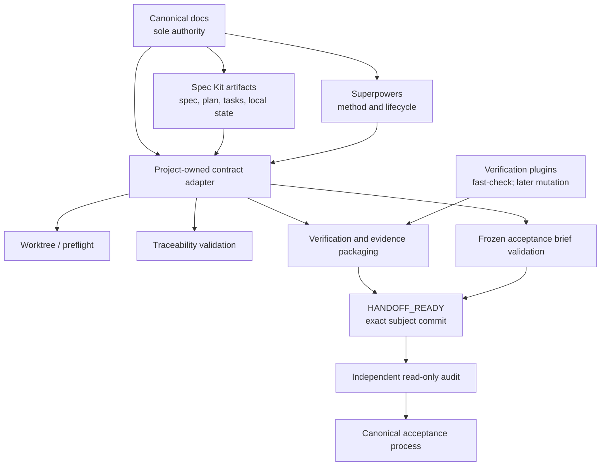

# Engineering Workflow Foundation — Revised Design

## 1. Design status

- Architecture direction: `APPROVED — Layered Contract Adapter`.
- Design text: `UNDER_REVIEW`.
- Implementation status: `GOVERNANCE_BLOCKED`.
- Đây là repository-level design artifact, chưa phải Spec Kit spec và không cần `canonical_package_id`.
- Chưa có quyền triển khai, cài dependency, chạy initializer, sửa production source hoặc sửa canonical governance.
- Chỉ sau khi bản design trong chat được duyệt mới được chuẩn bị worktree/branch để ghi design file.
- Chỉ sau khi design file được duyệt và governance bootstrap hoàn tất mới được tạo Spec Kit spec, plan và tasks cho foundation.

Commit `6e0165d63db39b8e586f3e9c981c6ae4495df66a` và parent `d654356078d2b4d44a03ba17809c7bedeb6c8f14` chỉ là inspected design baseline. Chúng không tự động trở thành predecessor của:

- design-document change set;
- governance bootstrap;
- foundation implementation;
- bất kỳ pilot nào.

Trước mỗi change set phải xác định exact predecessor được phê duyệt, kiểm tra repository refs hiện tại, tạo clean branch/worktree mới và chạy lại preflight. Không được fetch, rebase, reset hoặc thay đổi refs nếu chưa được cho phép.

## 2. Repository context

Workflow hiện tại là document-led và package/phase-oriented:

- `AGENTS.md` điều khiển cách agent làm việc, Git safety và invariants vận hành.
- `docs/ROADMAP.md` sở hữu package identity, scope và dependency.
- `docs/IMPLEMENTATION_PLAN.md` sở hữu acceptance boundary, required gates và migration expectations.
- `docs/IMPLEMENTATION_STATUS.md` sở hữu package status và implementation/acceptance evidence index.
- `docs/DECISIONS.md` lưu architectural rationale.
- Repository đã có các canonical scripts, Node tests, integration/browser/durable-state test infrastructure và quy trình independent review tương đối chặt.

Điểm mạnh hiện tại:

- Exact-commit review và durable evidence đã được coi trọng.
- Package và phase dependencies đã có canonical nguồn.
- Implementer evidence được phân biệt với independent acceptance.
- Existing canonical gates có thể được tái sử dụng.
- Git safety và one-writer discipline đã có nền tảng trong `AGENTS.md`.

Các nguyên nhân làm remediation/audit kéo dài:

- Identity của revision, boundary và evidence chưa luôn được đóng băng thành một contract máy kiểm tra được.
- Requirement, test, command và evidence thường phải đối chiếu thủ công.
- Implementer report, acceptance evidence và verdict có thể bị nhập nhằng nếu không ép tách artifact.
- Auditor có thể phát hiện vấn đề thật nhưng ngoài boundary rồi vô tình mở rộng scope.
- Exact HEAD, dirty worktree hoặc stale evidence có thể chỉ được phát hiện muộn.
- Broad verification dễ chạy lặp lại dù không liên quan diff.
- Property/model failures chưa có seed/replay artifact contract thống nhất.
- Optional tools chưa có semantics thống nhất cho `NOT_AVAILABLE`, `NOT_RUN` và `ERROR`.

## 3. Goals

Foundation phải:

- Tích hợp Superpowers như process workflow cho agent.
- Tích hợp Spec Kit project-local cho feature-level spec, plan và tasks.
- Tạo contract cho property-based testing bằng fast-check khi rủi ro phù hợp.
- Bảo toàn toàn bộ canonical governance và Git rules hiện có.
- Cung cấp workflow dùng chung cho mọi package mà không trở thành một workflow framework mới.
- Tạo ranh giới rõ giữa implementation, handoff, audit, acceptance và release safety.
- Hoạt động trong chức năng cốt lõi khi Spec Kit CLI không tồn tại.
- Giữ chi phí thao tác phù hợp với một dự án cá nhân.

Foundation chỉ cần có khả năng phục vụ, không thiết kế chi tiết, các initiative sau:

- Capability Research & Toolchain
- Full IELTS Practice Coverage — Academic + General Training
- Personal Content & AI Study Guidance
- Assessment & Readiness

## 4. Non-goals

Foundation không:

- Sở hữu package status hoặc acceptance verdict.
- Thay thế `AGENTS.md` hay canonical docs.
- Tự sửa conflict trong canonical docs.
- Tự quyết định hai boundary có thể chạy song song.
- Tự động sửa finding do auditor phát hiện.
- Tạo dashboard, daemon, workflow server hoặc orchestration runtime tổng quát.
- Sao chép canonical acceptance criteria vào Spec Kit.
- Mặc định chạy mutation, fuzz, portability hoặc E2E diện rộng cho mọi change.
- Tự cài optional tools.
- Thiết kế sản phẩm cho các downstream initiatives.
- Sửa production source trong cùng change set với selective Spec Kit adoption nếu chưa có spec riêng.

## 5. Core principles

### 5.1 Canonical authority remains singular

Mỗi loại quyết định chỉ có một canonical owner. Spec Kit và wrappers chỉ tham chiếu, không cạnh tranh hoặc suy luận trạng thái canonical.

### 5.2 Proportionality

Mức artifact và verification phải tỷ lệ thuận với rủi ro:

- Small repair đủ điều kiện không cần full spec, full trace matrix, mutation hoặc full acceptance profile.
- Feature, migration, architecture và remediation có boundary độc lập phải dùng spec-level workflow.
- Chỉ một điểm không chắc chắn trong small-repair threshold cũng buộc tạo spec hoặc dừng để làm rõ.
- Không tạo artifact chỉ để đủ hình thức. Mỗi artifact phải cung cấp một quyết định, boundary, evidence hoặc khả năng replay hữu ích.
- Optional property/mutation obligation không được biến thành required chỉ vì tooling tồn tại.
- Proportionality không cho phép bỏ reproduction, TDD, focused regression, exact-commit evidence hoặc ranh giới independent acceptance đã được canonical contract yêu cầu.

### 5.3 Fail closed on identity

Sai hoặc thiếu exact commit, parent, spec revision, trace digest, evidence digest hay predecessor phải tạo `ERROR`, `NOT_RUN` hoặc `BLOCKED_BY_INVALID_BRIEF`; không được đoán revision phù hợp.

### 5.4 No self-acceptance

Implementation verification có thể do writer thực hiện. Acceptance verdict phải đến từ một independent audit context.

## 6. Layered Contract Adapter

Các wrapper chỉ được thực hiện bốn trách nhiệm:

1. Worktree/preflight.
2. Traceability validation.
3. Verification/evidence packaging.
4. Frozen acceptance brief validation.

Chúng không được:

- quản lý package status;
- tạo acceptance verdict;
- tự chọn scope;
- tự thêm tests;
- tự sửa metadata;
- tự retry;
- tự cài tool;
- trở thành task scheduler hoặc CI framework.

Contract adapter dùng schema project-owned, versioned và có thể kiểm thử bằng fixture. Integration dựa trên artifact contract, không dựa sâu vào internal behavior của Spec Kit.

## 7. Authority model

Precedence là domain-specific:

| Domain | Canonical authority |
|---|---|
| Agent conduct, safety, Git rules, repository invariants | `AGENTS.md` |
| Package identity, scope, dependency và phase relationship | `docs/ROADMAP.md` |
| Acceptance boundary, required gates, migration/rollback obligations | `docs/IMPLEMENTATION_PLAN.md` |
| Package status và canonical evidence index | `docs/IMPLEMENTATION_STATUS.md` |
| Architectural rationale và recorded decisions | `docs/DECISIONS.md` |

Spec Kit artifacts, wrapper outputs, reports và briefs nằm dưới các nguồn trên.

Nếu hai canonical sources có vẻ mâu thuẫn:

- Không tự reconcile.
- Không chọn nguồn thuận lợi hơn cho implementation.
- Dừng tại phần bị ảnh hưởng.
- Yêu cầu sửa ở canonical source có trách nhiệm tương ứng.
- Bridge hoặc Spec Kit artifact không được dùng để thay đổi kết quả.

## 8. Constitutional bridge

`.specify/memory/constitution.md` phải là bridge tối thiểu.

Nó chỉ được:

- tuyên bố precedence theo authority model;
- dùng repository-relative links đến:
  - `AGENTS.md`;
  - `docs/ROADMAP.md`;
  - `docs/IMPLEMENTATION_PLAN.md`;
  - `docs/IMPLEMENTATION_STATUS.md`;
  - `docs/DECISIONS.md`;
- giải thích ngắn vai trò của từng nguồn.

Nó phải ghi rõ:

- Đây không phải canonical authority.
- Đây không phải acceptance evidence.
- Không được dùng để đánh dấu `IMPLEMENTED`, `READY_FOR_ACCEPTANCE` hoặc `ACCEPTED`.
- Khi có mâu thuẫn, canonical source tương ứng luôn thắng.
- Governance chỉ được sửa tại canonical source, không sửa bridge để thay đổi policy.

Nó không được sao chép:

- package status;
- acceptance criteria;
- implementation evidence;
- phase dependency;
- invariant chi tiết;
- Definition of Done;
- architectural decisions.

Initializer không được ghi đè hoặc tự merge vào bridge.

## 9. Minimum Viable Foundation

MVP đầu tiên chỉ gồm:

1. Constitutional bridge tối thiểu.
2. One-writer/worktree preflight.
3. Lightweight repair record.
4. Structured spec metadata tối thiểu.
5. Focused và PR verification profiles.
6. Implementation verification report.
7. Frozen acceptance brief.
8. Traceability validator ở mức:
   `requirement → test → command → evidence`.

MVP không xây workflow runtime. Wrapper verification có thể chạy hoặc ghi nhận từng command đã khai báo, nhưng không lập DAG, schedule jobs, retry hay điều phối pipeline phức tạp.

Các phần hoãn khỏi MVP:

- mutation tooling;
- scheduled fuzz diện rộng;
- portability matrix;
- complex CI orchestration;
- Spec Kit CLI-dependent automation;
- dashboard;
- daemon;
- workflow runtime;
- wrapper ngoài bốn trách nhiệm đã cho phép.

Những phần này chỉ được đưa vào spec mới sau khi pilot cung cấp evidence rằng thiếu chúng đang tạo defect, chi phí hoặc khoảng trống verification thực tế.

Fast-check có thể được dùng như plugin bên trong focused/PR profile nếu một spec hoặc brief khai báo property obligation là `REQUIRED`. MVP không xây riêng một property orchestration system và không bắt buộc cài fast-check cho một pilot không có invariant phù hợp.

## 10. Artifact contract

Structured metadata là nguồn máy đọc cho local workflow. Markdown giữ narrative và rationale, nhưng không được tạo bản sao status hoặc canonical acceptance authority.

Logical artifacts gồm:

- change-set declaration;
- lightweight repair record hoặc Spec Kit spec metadata;
- plan và tasks;
- trace metadata;
- verification manifest;
- implementation verification report;
- frozen acceptance brief;
- audit findings;
- acceptance verdict;
- release-safety decision.

Để tránh exact-commit self-reference:

- Subject commit là commit chứa code/test/spec/config đang được handoff.
- Verification report và frozen brief được đóng gói sau subject commit.
- Handoff identity là tuple:
  `(subject_commit, parent, spec_revision, trace_digest, evidence_digest, brief_digest)`.
- Evidence package có thể được lưu ngoài subject tree hoặc trong một evidence-only revision có identity riêng.
- Không được sửa artifact sau đó mà vẫn giữ `HANDOFF_READY`; thay đổi digest làm handoff cũ mất hiệu lực.

Không sử dụng placeholder giả để vượt validator. Missing completion fields chỉ hợp lệ ở trạng thái draft; chúng phải làm `HANDOFF_READY` thất bại.

## 11. Spec Kit contract

Một canonical package có thể có nhiều spec độc lập:

- `feature`;
- `migration`;
- `remediation`.

Mỗi spec phải khai báo tối thiểu:

- `spec_id`;
- `spec_type`;
- `canonical_package_id`;
- exact acceptance boundary;
- canonical boundary reference;
- dependencies hoặc predecessor;
- explicit exclusions;
- spec revision;
- requirement namespace;
- required verification profiles;
- authorized change subsystem hoặc file/range declarations;
- assumptions và known limitations.

Requirement IDs phải namespaced theo package/spec và không bao giờ tái sử dụng.

Các spec cùng package:

- không được có acceptance boundary chồng lấn;
- không được âm thầm mở rộng package scope;
- không được dùng nhiều writer cho cùng semantic boundary;
- phải được gộp nếu proposed work không có boundary độc lập.

Remediation spec phải chỉ rõ:

- finding/evidence nguồn;
- exact commit hoặc artifact bị sửa;
- remediation delta;
- phần feature spec không bị mở lại.

Spec Kit chỉ sở hữu trạng thái cục bộ của spec/task. Nó không được sở hữu hoặc suy ra:

- package status;
- readiness;
- acceptance;
- release safety.

## 12. Lightweight repair path

Bug chỉ được miễn full Spec Kit spec khi đồng thời đáp ứng toàn bộ:

- Có reproduction rõ ràng.
- Hoàn toàn nằm trong acceptance boundary hiện hữu.
- Không đổi public hoặc internal contract.
- Không đổi schema, migration hay durable-data semantics.
- Không ảnh hưởng security, privacy, rights hoặc cost.
- Không thêm dependency hoặc capability.
- Không liên quan concurrency, crash recovery hoặc distributed state.
- Không mở rộng product behavior.
- Có focused regression test.
- Existing verification đủ chứng minh bản sửa.

Nếu bất kỳ điều nào không chắc chắn, mặc định:

- tạo spec; hoặc
- dừng để reviewer/người dùng làm rõ.

Implementer không được tự dùng nhãn “small bug” khi có tranh chấp.

Lightweight repair record phải có:

- repair ID;
- issue/finding hoặc reproduction;
- root cause;
- canonical package và existing boundary reference;
- boundary bị ảnh hưởng;
- explicit exclusions;
- test được thêm hoặc sửa;
- required focused/PR profiles;
- exact commands hoặc canonical gate references;
- required environment;
- expected evidence;
- timeout/budget;
- PASS/FAIL/ERROR/NOT_RUN conditions;
- subject commit và parent trong completion envelope;
- known limitations.

Trace rút gọn:

`reproduction/finding → root cause → boundary → regression test → command → evidence`

Nhiều bug nhỏ trong cùng subsystem hoặc cùng chỉ ra một invariant thiếu phải được nâng thành spec-level work.

Eligible small repair không mặc định cần:

- full spec;
- full plan/task trace matrix;
- mutation;
- automated acceptance profile.

Nó vẫn phải có frozen brief và independent review boundary khi canonical workflow yêu cầu acceptance. Auditor có thể dùng focused/PR evidence mà không buộc tạo một full acceptance-profile orchestration.

## 13. Local lifecycle and Definition of Done

Spec Kit local lifecycle:

`DRAFT → CLARIFIED → PLANNED → TASKS_READY → IN_PROGRESS → LOCAL_VERIFICATION_PASSED → HANDOFF_READY`

Các trạng thái phụ:

- `BLOCKED`;
- `SUPERSEDED`;
- `CANCELLED`.

Chúng không phải package status và không được tự cập nhật canonical docs.

`HANDOFF_READY` chỉ hợp lệ cho exact handoff identity. Nó bị vô hiệu khi code, test, spec, config, trace metadata, evidence hoặc brief thay đổi.

Điều kiện `HANDOFF_READY`:

- Spec-level work có trace requirement → plan → task → test → command → evidence không còn gap.
- Lightweight repair có chuỗi rút gọn hoàn chỉnh.
- Trong MVP, validator tự động kiểm tra requirement → test → command → evidence; plan/task links được implementation report xác nhận và review thủ công.
- Không còn blocking task hoặc blocking finding trong boundary.
- Task chưa làm có disposition được phê duyệt.
- Mọi focused/PR profile được khai báo `REQUIRED` đều `PASS`.
- Không còn required `ERROR`, `NOT_RUN`, `NOT_AVAILABLE` hoặc evidence không replay được.
- Property/mutation obligation required đã hoàn thành hoặc có disposition do người có thẩm quyền phê duyệt.
- Diff và dependency changes nằm trong boundary.
- Exact commit, parent, commands, results, environment fingerprint và limitations đã được ghi.
- Implementation verification report hoàn chỉnh.
- Frozen acceptance brief hợp lệ và sẵn sàng cho auditor.

Disposition phải ghi:

- obligation cụ thể;
- lý do;
- tác động;
- approver;
- follow-up reference nếu có.

Implementer không được tự miễn required evidence của chính mình.

`HANDOFF_READY` không đồng nghĩa:

- `IMPLEMENTED`;
- `READY_FOR_ACCEPTANCE`;
- `ACCEPTED`;
- release-safe.

## 14. One-writer and worktree lifecycle

Mỗi normal change set phải khai báo:

- `designated_writer`;
- worktree path;
- branch;
- exact approved predecessor;
- `canonical_package_id`;
- spec hoặc repair IDs;
- acceptance boundary;
- authorized files/subsystem;
- explicit conflict keys như schema, migration chain hoặc generated outputs.

Trước lần ghi đầu tiên, preflight thực hiện read-only checks:

- Worktree tồn tại đúng path.
- Branch đúng.
- HEAD bằng exact predecessor.
- Working tree clean.
- Không có untracked file ngoài allowlist.
- Boundary không chồng với active change set.
- Dependencies/predecessors đã thỏa mãn.
- Current refs đã được ghi nhận mà không làm thay đổi refs.

Nếu pass, mutation đầu tiên được phép là ghi approved preflight evidence. Nếu fail, dừng fail-closed.

Không được dùng:

- stash;
- reset;
- rebase;
- clean;
- checkout đè;
- sửa dirty worktree của người khác.

Nếu predecessor lỗi thời:

- dừng change set;
- ghi `SUPERSEDED` hoặc rebase-required disposition;
- yêu cầu exact predecessor mới;
- tạo branch/worktree mới;
- chạy lại preflight.

Không âm thầm rebase change set đang được audit.

Overlap detection sử dụng:

- declarations của registered worktrees;
- file/subsystem boundary;
- durable-data/schema keys;
- migration chain;
- generated artifacts;
- declared semantic conflict keys.

Wrapper không được tự kết luận semantic independence. Trường hợp không xác định chắc chắn phải dừng để được authorization.

Writer transfer chỉ hợp lệ tại exact committed handoff và ghi:

- handoff commit;
- verification state;
- unfinished tasks;
- limitations;
- outgoing writer;
- incoming writer.

Writer cũ mất quyền ghi trước khi writer mới bắt đầu. Subagent và reviewer mặc định read-only.

Design-document publication và governance bootstrap là hai pre-package exceptions được phê duyệt rõ:

- Không dùng `N/A`, ID tạm hoặc package tự phát minh.
- Không khai báo giả `canonical_package_id`.
- Chúng tuân theo clean worktree, exact predecessor và one-writer rules bằng manual preflight.
- Chúng tuyệt đối không được triển khai foundation hoặc production behavior.

## 15. Verification profiles

Target architecture có bốn profile:

1. `focused`
2. `pr`
3. `acceptance`
4. `scheduled`

MVP chỉ operationalize `focused` và `pr`.

Mỗi spec hoặc repair record phải khai báo trước implementation:

- required profile;
- exact commands hoặc canonical gate references;
- môi trường;
- expected evidence;
- timeout/budget;
- PASS/FAIL/ERROR/NOT_RUN conditions.

Không profile nào tự đại diện cho profile cao hơn.

### Focused

Phải hẹp nhưng đủ chứng minh boundary:

- reproduction của bug;
- deterministic regression;
- relevant unit tests;
- property/model tests được khai báo;
- direct integration tests.

Việc chọn tests phải có rationale dựa trên behavior/boundary, không chỉ file name heuristic.

### PR

Gồm:

- focused profile;
- applicable static/type/lint checks;
- build;
- minimum declared cross-boundary gates;
- schema/contract compatibility checks khi liên quan.

### Acceptance

Được giữ trong target design nhưng automation không thuộc MVP:

- clean worktree tại exact commit;
- không dùng undeclared cache hoặc durable state;
- canonical package/phase gates;
- browser, durable-data, migration, rollback hoặc crash-recovery evidence khi boundary yêu cầu;
- command, exit code, environment fingerprint và artifact references.

Eligible small repair không tự động bị buộc chạy full acceptance profile. Independent auditor vẫn phải tuân theo frozen brief và canonical acceptance rules.

### Scheduled

Dành cho:

- rotating property/model fuzz;
- broader mutation;
- portability matrix;
- stress/endurance.

Scheduled infrastructure được hoãn khỏi MVP.

## 16. Test hierarchy

Thứ tự ưu tiên:

1. Deterministic reproduction và regression.
2. Unit tests cho logic cục bộ.
3. Property/model tests cho invariants và state space phù hợp.
4. Direct integration/contract tests.
5. Durable-state, browser, migration, rollback hoặc crash tests khi boundary yêu cầu.
6. Canonical package/phase gates.
7. Scheduled fuzz, mutation, portability và endurance.

Fast-check và mutation bổ sung cho deterministic tests; không thay thế focused regression, durable verification hoặc independent acceptance.

## 17. Property testing and replay

Fast-check là risk-based plugin, không phải workflow authority.

### Focused/PR property tests

- Dùng seed matrix cố định, version-controlled.
- Có `numRuns` và time budget theo property group.
- Chỉ chạy properties liên quan boundary/diff.
- Không retry đến khi xanh.
- Timeout, crash hoặc không replay được là failure.

Standard replay contract phải nhận các giá trị tương đương:

- property ID;
- seed;
- path;
- replayPath;
- numRuns;
- environment overrides.

Exact variable names và command được version trong implementation spec. Replay không được phụ thuộc machine state, test order hoặc dữ liệu còn sót lại.

Failure artifact lưu:

- exact commit;
- test/property ID;
- fast-check version;
- seed;
- path;
- replayPath;
- numRuns;
- environment overrides;
- generator/model version hoặc fingerprint;
- minimal counterexample;
- replay command.

Counterexample đã xác nhận phải:

- được shrink;
- có root-cause analysis;
- trở thành deterministic regression fixture;
- giữ property test để tiếp tục khám phá biến thể.

Seed cố định chỉ chứng minh deterministic PR coverage, không chứng minh toàn state space.

Nếu generator/model đổi làm replay cũ mất hiệu lực:

- giữ regression fixture tương đương;
- ghi lý do;
- lưu replacement evidence;
- không xóa failure evidence không có replacement.

Timing/concurrency properties phải kiểm soát scheduler/clock hoặc chuyển sang manual/scheduled gate phù hợp.

Broad scheduled fuzz được hoãn khỏi MVP.

## 18. Mutation-quality policy

Mutation tooling không thuộc MVP. Nó chỉ được đề xuất sau pilot khi có module phù hợp và evidence về test-quality gap.

Module phù hợp:

- deterministic pure logic;
- parser/validator/scoring;
- state transitions;
- critical invariants;
- module được spec/brief chỉ định.

Không mặc định dùng cho:

- UI rendering;
- thin adapters;
- generated code;
- third-party wrappers;
- browser/E2E orchestration có giá trị thấp.

Mỗi run sau này phải khai báo boundary, rationale, commit, tool/version/config, test command, time budget, module baseline/threshold và complete mutant report.

Lần chạy đầu có thể chỉ thiết lập observational baseline. Threshold chỉ được ratchet sau independent review; không được hạ threshold hoặc đổi denominator âm thầm.

Surviving mutants được phân loại:

- `TEST_GAP`;
- `EQUIVALENT_MUTANT`;
- `OUT_OF_SCOPE`;
- `TOOL_LIMITATION`.

Ba phân loại sau cần mutant-level rationale, evidence và independent review. `TEST_GAP` phải tạo finding/remediation và test hành vi có ý nghĩa.

Tool chưa chọn hoặc chưa cài phải ghi `NOT_RUN` hoặc `NOT_AVAILABLE`; không giả lập kết quả.

## 19. Verification and evidence packaging

MVP verification wrapper:

- Chỉ chạy hoặc ghi nhận exact declared commands.
- Không tự chọn tests.
- Không retry.
- Không tự mở rộng profile.
- Ghi command, exit code, duration, environment fingerprint và artifact digest.
- Phân biệt từng kết quả:
  - `PASS`: command thực sự chạy thành công;
  - `FAIL`: command chạy và phát hiện failure;
  - `ERROR`: crash, timeout hoặc hạ tầng lỗi;
  - `NOT_RUN`: chưa chạy;
  - `NOT_AVAILABLE`: required tool không tồn tại.

Implementation verification report phải có:

- writer;
- subject commit và parent;
- canonical package/spec hoặc repair references;
- exact boundary và exclusions;
- authorized diff summary;
- dependency changes;
- required profiles;
- commands và results;
- environment fingerprint;
- evidence references/digests;
- trace validation result;
- required property/mutation dispositions;
- unfinished task dispositions;
- known assumptions/limitations;
- blocking findings.

Report này là implementer evidence, không phải acceptance verdict.

## 20. Traceability contract

Requirement ID:

- namespaced theo package/spec;
- không bao giờ tái sử dụng;
- semantic/boundary change tạo ID mới;
- dùng `supersedes`/`superseded_by`;
- wording-only change mới được tăng revision của ID cũ.

MVP validator kiểm tra:

`requirement → test → command → evidence`

Spec-level plan/task references vẫn phải tồn tại, nhưng MVP kiểm tra chúng qua structured metadata và implementation review thay vì xây full graph engine.

Validator trả:

### ERROR

- duplicate ID;
- broken/missing reference;
- required evidence thiếu;
- reference vượt boundary;
- digest mismatch;
- required command không có result.

### WARNING

- optional obligation chưa chạy;
- shared test thiếu rationale;
- coverage đáng ngờ;
- non-test task có evidence/disposition chưa rõ.

Shared test hoặc gate phải được đánh dấu `SHARED` và mô tả nó chứng minh điều gì. Không coi mọi repository test ngoài spec là orphan.

Documentation/evidence-packaging tasks không cần direct test nhưng phải có verification hoặc disposition.

Property/model/mutation chỉ required khi spec hoặc brief đánh dấu `REQUIRED`. Optional `NOT_RUN` không được giả làm `PASS`.

Mỗi evidence artifact gắn với:

- exact subject commit;
- command;
- result;
- environment fingerprint;
- content digest.

Trace digest được tính từ canonicalized structured metadata. Frozen brief phải tham chiếu exact spec revision, trace digest và commit.

## 21. Frozen acceptance brief

Brief được đóng băng trước audit, gồm tối thiểu:

- exact subject commit và parent;
- `canonical_package_id`;
- spec IDs hoặc repair ID;
- exact spec revision;
- trace-matrix digest;
- acceptance boundary;
- expected changed files/ranges;
- explicit exclusions;
- required tests/evidence;
- blocking rules;
- assumptions;
- known limitations.

Validator phải fail closed khi:

- commit hoặc parent không khớp;
- spec/revision không khớp;
- trace digest không khớp;
- evidence digest/reference không khớp;
- required artifact thiếu.

Allowed files/ranges giới hạn phạm vi được thay đổi, không giới hạn phạm vi auditor được đọc.

Brief validator chỉ xác minh identity và completeness. Nó không tạo acceptance verdict.

## 22. Independent audit for a one-person project

Auditor có thể là một agent/model session riêng, nhưng phải đáp ứng toàn bộ:

- Clean worktree riêng tại exact subject commit.
- Không có write authority.
- Không dùng implementer worktree.
- Không dùng uncommitted state hoặc working context của implementer.
- Chỉ nhận frozen brief và repository/evidence artifacts đã đóng băng.
- Không tự sửa code, test, docs hoặc evidence.
- Không tự remediation finding.
- Không phải chính implementer session phát hành verdict trong cùng context.

Nếu không có independent context phù hợp, acceptance ở trạng thái pending/blocked; implementer report không được dùng thay verdict.

Auditor có thể đọc:

- dependencies;
- surrounding code;
- tests;
- canonical docs;
- repository history cần thiết.

Auditor chỉ được block acceptance khi:

- defect nằm trong acceptance boundary;
- diff gây regression;
- scope integrity bị vi phạm;
- required evidence thiếu hoặc không đáng tin;
- explicit acceptance assumption bị vô hiệu.

Auditor không được tự tạo criterion mới. Criterion thiếu hoặc sai làm audit dừng; spec/brief phải được sửa và audit lại từ đầu.

Finding có sẵn hoặc ngoài scope được ghi riêng, không kéo vào remediation.

Với vấn đề ngoài scope liên quan trực tiếp đến data loss, security, privacy, rights hoặc độ tin cậy của verification:

- tạo finding riêng;
- không mở rộng scope;
- có thể đề xuất release-safety hold;
- yêu cầu canonical authority quyết định thay đổi boundary/spec.

Release-safety hold tách biệt với package acceptance verdict.

Auditor có thể trả:

- `ACCEPT`;
- `REJECT`;
- `BLOCKED_BY_INVALID_BRIEF`.

## 23. Spec Kit staged selective adoption

Trước khi chọn upstream:

- review release/tag hoặc exact commit;
- license;
- file manifest;
- initializer behavior;
- generated governance artifacts;
- scripts/hooks/dependencies;
- Windows compatibility;
- compatibility với workflow hiện tại.

Version phải pin exact version hoặc exact commit.

Initializer:

- chỉ chạy trong disposable staging directory;
- không dùng `--force`;
- không chạy trực tiếp trên repository chính.

Staging manifest phải ghi:

- generated files;
- new/modified/deleted files;
- proposed scripts/dependencies/hooks;
- provenance;
- diff với project-local integration hiện tại.

Selective apply chỉ nhận allowlisted artifacts. Mặc định từ chối:

- governance/status/acceptance authority mới;
- thay thế `AGENTS.md` hoặc canonical docs;
- auto-modify CI;
- auto-add dependency;
- unreviewed side-effect hooks;
- absolute local paths;
- environment-specific assumptions.

Artifacts được phân loại:

- `VENDORED_UNMODIFIED`;
- `PROJECT_ADAPTED`;
- `PROJECT_OWNED`.

Adapted artifacts phải giữ upstream origin, version và custom differences.

MVP chỉ nhận templates/artifact contracts hoạt động không cần CLI. Spec Kit CLI-dependent automation bị hoãn.

Upgrade luôn theo:

`staging → manifest → diff → compatibility review → selective apply → focused/pr verification`

Không copy nguyên thư mục đè lên integration hiện có.

Rollback plan phải liệt kê exact files/dependencies/hooks được thêm hoặc sửa và chứng minh canonical workflow tiếp tục hoạt động khi CLI vắng mặt.

## 24. Optional-tool degradation

| Tình trạng | Kết quả |
|---|---|
| Tool không tồn tại | `NOT_AVAILABLE` |
| Tool tồn tại nhưng chưa chạy | `NOT_RUN` |
| Tool chạy lỗi/crash/timeout | `ERROR` |
| Command thực sự thành công | `PASS` |
| Command chạy và phát hiện defect | `FAIL` |

Tool thiếu chỉ block khi spec hoặc frozen brief đã khai báo nó là required evidence.

Không được:

- tự cài tool trong verification;
- tự retry để chuyển đỏ thành xanh;
- giả lập output;
- coi optional `NOT_RUN` là `PASS`.

Core MVP phải chạy được khi Spec Kit CLI không có.

## 25. CI and performance policy

MVP không tự sửa CI và không tạo orchestration phức tạp.

Để giữ thời gian hợp lý:

- Reuse canonical scripts bằng reference.
- Focused chỉ chạy boundary-relevant checks có rationale.
- PR thêm minimum cross-boundary gates đã khai báo.
- Property runs dùng fixed seed/`numRuns`/budget.
- Không chạy broad fuzz, mutation hoặc portability matrix trong default PR.
- Cache được phép trong focused/PR nhưng không thay required evidence.
- Không retry tự động.
- Missing/crash/timeout không được coi là pass.

Design không đặt ngưỡng thời gian tùy tiện. Foundation implementation spec phải:

1. đo baseline của commands hiện tại trên môi trường được ghi nhận;
2. đo overhead của wrapper và artifact preparation;
3. đề xuất budget dựa trên evidence;
4. được review trước implementation;
5. không hạ budget sau đó chỉ để pipeline xanh.

## 26. Foundation success criteria

Pilot chỉ được xem là thành công khi tất cả điều kiện sau đạt:

- Một small repair chạy trọn lightweight workflow.
- Một spec-level change chạy từ spec đến `HANDOFF_READY`.
- Preflight bắt được ít nhất:
  - wrong-head fixture;
  - dirty-worktree fixture;
  - overlap fixture.
- Trace validator bắt được:
  - duplicate ID;
  - broken reference;
  - missing required evidence.
- Frozen-brief validator bắt được:
  - commit mismatch;
  - spec/revision mismatch;
  - trace/evidence digest mismatch.
- Workflow hoạt động khi Spec Kit CLI không có.
- Không tạo package-status authority hoặc acceptance authority thứ hai.
- Có số đo:
  - focused duration;
  - PR duration;
  - preflight/report/brief preparation overhead;
  - tổng số thao tác thủ công;
  - friction thực tế đối với dự án một người.

Không có fixed time threshold trong design. Sau pilot, số đo được so với baseline hiện tại và dùng để quyết định:

- giữ nguyên;
- đơn giản hóa;
- tối ưu;
- hoặc không mở rộng foundation.

Pilot không tự cấp quyền triển khai mutation, broad fuzz, portability hay automation mới. Mỗi expansion cần finding hoặc measured need và spec riêng.

## 27. Governance bootstrap and unblock condition

Foundation implementation tiếp tục `GOVERNANCE_BLOCKED` cho đến khi một governance bootstrap change set riêng được review và commit.

Bootstrap tối thiểu phải:

- thêm hoặc chỉ định `canonical_package_id` cho Engineering Workflow Foundation;
- khai báo scope;
- khai báo exact acceptance boundary;
- ghi dependencies/predecessor cần thiết;
- xác định:
  - `docs/IMPLEMENTATION_STATUS.md` là canonical owner của package status/evidence record;
  - canonical independent acceptance process là owner của acceptance verdict;
  - `docs/IMPLEMENTATION_PLAN.md` là owner của acceptance criteria/gates.

Bootstrap không được:

- triển khai foundation;
- cài Spec Kit, fast-check hoặc dependency;
- sửa production source;
- reconcile status conflict không liên quan;
- mở rộng roadmap ngoài mức cần thiết;
- dùng N/A, temporary ID hoặc invented package.

Exact canonical files và diff phải được review riêng trước khi ghi.

Điều kiện unblock chính xác:

1. Design file đã được duyệt.
2. Governance bootstrap được duyệt.
3. Bootstrap được commit trên exact approved predecessor.
4. `canonical_package_id`, scope, exact boundary, dependencies và owners tồn tại trong canonical docs.
5. Không còn ambiguity về package identity hoặc acceptance owner.
6. Một foundation spec có thể tham chiếu các canonical values đó mà không tạo metadata giả.

Sau đó mới được:

`spec → clarification → plan → tasks → implementation → verification → HANDOFF_READY → independent acceptance`

## 28. Rollout

### Stage 0 — Design approval

- Duyệt bản design trong chat.
- Chọn exact predecessor cho design-document change set.
- Kiểm tra refs read-only.
- Tạo clean branch/worktree mới.
- Chạy manual preflight tương đương.
- Ghi duy nhất design document.
- Self-review placeholder, contradiction, ambiguity và scope.
- Dừng để user review file.

### Stage 1 — Governance bootstrap

- Change set riêng.
- Exact predecessor được phê duyệt riêng.
- Chỉ thay đổi canonical metadata tối thiểu.
- Không triển khai foundation.
- Không sửa unrelated status conflict.

### Stage 2 — Foundation specification

Sau khi unblock:

- Review và pin Spec Kit upstream.
- Staging initializer trong disposable directory.
- Tạo manifest và allowlist.
- Tạo foundation spec, clarification, plan và tasks.
- Đo baseline verification trước khi đặt budgets.

### Stage 3 — MVP implementation

Triển khai bằng TDD:

- bridge;
- schemas/templates;
- preflight;
- lightweight repair record;
- focused/PR evidence packaging;
- trace validator;
- implementation report;
- frozen brief validator.

Không triển khai deferred scope.

### Stage 4 — Pilot

- Một eligible small repair.
- Một bounded spec-level change.
- Negative fixtures cho preflight, trace và brief validators.
- Independent read-only audit context.
- Đo verification time và operational overhead.

### Stage 5 — Evaluation

So sánh kết quả với Foundation success criteria.

Chỉ khi có evidence mới xem xét:

- broader fast-check adoption;
- scheduled fuzz;
- mutation tooling;
- portability matrix;
- CI automation bổ sung.

## 29. Assumptions

- Canonical docs tiếp tục là nguồn authority.
- Git worktrees khả dụng.
- User hoặc canonical reviewer phê duyệt predecessor, boundary, risk classification và dispositions.
- Independent audit session có thể được tạo; nếu không, acceptance vẫn pending.
- Spec Kit version chưa được chọn.
- Mutation tool chưa được chọn.
- Fast-check chỉ được thêm sau dependency review trong approved implementation scope.
- Exact physical layout ngoài `.specify/memory/constitution.md` được quyết định sau upstream staging review.
- Không có package ID hợp lệ cho foundation tại thời điểm design này.

## 30. Trade-offs

Architecture A thêm một số metadata và wrapper maintenance, nhưng đổi lại:

- identity và evidence có thể fail closed;
- CLI absence không phá workflow;
- Spec Kit upgrade ít có khả năng ghi đè governance;
- audit scope được giới hạn rõ;
- implementer và auditor không thể vô tình dùng chung authority.

Chi phí chính:

- preflight và evidence packaging thêm thao tác;
- spec metadata cần discipline;
- exact-commit evidence tạo thêm bước handoff;
- independent context làm acceptance chậm hơn.

MVP, proportionality và pilot measurement là cơ chế kiểm soát các chi phí này.

Convention-only approach nhẹ hơn nhưng không đủ bắt mismatch và trace gaps. Central workflow runtime tự động hơn nhưng tạo governance/runtime thứ hai và vượt quá nhu cầu repository. Vì vậy Layered Contract Adapter vẫn là phương án khuyến nghị.

## 31. Separate repository finding

Tại inspected design baseline, `docs/IMPLEMENTATION_STATUS.md` có dấu hiệu không nhất quán giữa phần tổng quan Phase 4/5 và package matrix phía sau.

Finding này:

- không được reconcile trong Engineering Workflow Foundation;
- không được âm thầm diễn giải để cấp package ID;
- không được mở rộng governance bootstrap;
- phải được xử lý bằng một initiative/finding riêng với boundary và authority riêng.
